<div style="margin-top: 140px;"></div>

<div align="center">
  
</div>

## <p align="center">Universidad Peruana de Ciencias Aplicadas</p>

<p align="center">Ingeniería de Software</p>
<p align="center">Periodo 2610</p>
<p align="center">1ASI0572 | Desarrollo de Soluciones IoT</p>
<p align="center"><strong>NRC:</strong> 6770</p>
<p align="center"><strong>Docente:</strong> Javier Antonio Prudencio Vidal</p>


# <p align="center">Informe del Trabajo Final</p>
<p align="center"><strong>Startup:</strong> Dosys</p>
<p align="center"><strong>Producto:</strong> Dosys</p>

### Integrantes:

| Código | Nombres y Apellidos |
|----------------------|--------|
| U202121584<br/>U202310222<br/>U20211G671<br/>U20201b298<br/>U202310636 | Martel Zevallos, Gabriel Aristóteles<br/>Oblitas Davila, Mariano Moises<br/>Qqueso Rodriguez, Britney Delhy<br/>Ybañez Esquerre, Miguel Angel<br/>Zúñiga Murillo, Diego Sebastián |
<p align="center"><strong>Mayo 2026</strong></p>

<div style="page-break-before: always;"></div>

# Registro de versiones del informe

| Versión | Fecha | Autor | Descripción de modificación |
| :---- | :---- | :---- | :---- |
| AV1 | 27/04/2026 | Martel Zevallos, Gabriel Aristóteles | Se aportó al diseño arquitectónico inicial de la solución, especialmente en la perspectiva técnica del sistema IoT, la definición de componentes vinculados al dispositivo y la coherencia general de la propuesta técnica inicial. |
| AV1 | 27/04/2026 | Oblitas Davila, Mariano Moises | Se desarrolló el modelado de datos y el análisis técnico preliminar durante las fases de Requirements Elicitation & Analysis y Requirements Specification, aportando a la construcción de los Capítulos II y III. |
| AV1 | 27/04/2026 | Qqueso Rodriguez, Britney Delhy | Se guió el proceso de obtención y análisis de requisitos, seleccionando técnicas para organizar la información del dominio y aportando a la construcción de los artefactos de Requirements Elicitation & Analysis. |
| AV1 | 27/04/2026 | Ybañez Esquerre, Miguel Angel | Se desarrolló el diseño lógico de software, incluyendo diagramas de componentes y flujos técnicos correspondientes al Capítulo IV: Solution Software Design. |
| AV1 | 27/04/2026 | Zúñiga Murillo, Diego Sebastián | Se consolidó el informe técnico de la entrega AV1, incorporando carátula, registro de versiones, Project Report Collaboration Insights, tabla de contenidos, Student Outcome, conclusiones preliminares, bibliografía y anexos, además de la revisión de calidad previa a la entrega. |
| TB1 | 12/05/2026 | Martel Zevallos, Gabriel Aristóteles | Se actualizó el informe con aportes al Capítulo V: Solution UI/UX Design, especialmente en la organización de la experiencia de usuario, criterios visuales, accesibilidad y coherencia entre los flujos del cuidador, el adulto mayor y el dispositivo IoT. |
| TB1 | 12/05/2026 | Oblitas Davila, Mariano Moises | Se documentó la implementación técnica del Backend REST API y del Edge Service, incluyendo la arquitectura del servidor, endpoints principales, integración con el dispositivo IoT y comunicación entre Edge API, Backend y Frontend Web. |
| TB1 | 12/05/2026 | Qqueso Rodriguez, Britney Delhy | Se documentó el desarrollo, implementación y despliegue de la primera versión del Landing Page mediante GitHub Pages, así como su relación con la propuesta de valor de Dosys y la validación funcional de flujos IoT. |
| TB1 | 12/05/2026 | Ybañez Esquerre, Miguel Angel | Se documentó el desarrollo y despliegue del Frontend Web Application en Vercel, incluyendo la estructura de vistas, el consumo de endpoints del Backend REST API y el flujo principal del cuidador. |
| TB1 | 12/05/2026 | Zúñiga Murillo, Diego Sebastián | Se actualizó la versión corregida y mejorada del informe para TB1, incorporando mejoras en Project Report Collaboration Insights, Student Outcome, Capítulo VI: Product Implementation, Validation & Deployment, 6.1 Software Configuration Management, 6.2.1 Sprint 1, evidencias de Sprint Review, conclusiones, bibliografía y anexos. |
| AV2 | 17/06/2026 | Ybañez Esquerre, Miguel Angel | Se documentó el Sprint 2 del Frontend Web Application: alineación del producto con el catálogo oficial US01–US23, sustitución de datos simulados por consumo real del Backend REST API y formalización de las nuevas User Stories US24–US27 (notificaciones en app, estados de carga/error, identidad visual y gestión de medicina por compartimento). |
| AV2 | 17/06/2026 | Martel Zevallos, Gabriel Aristóteles | Se colaboró en el diseño UX/UI del Sprint 2, especialmente en la coherencia visual de las vistas reescritas y en la definición de la identidad tipográfica (Manrope/Inter) incorporada en la aplicación web. |
| AV2 | 17/06/2026 | Oblitas Davila, Mariano Moises | Se validó la integración del Frontend con los servicios ya desplegados (Backend REST API y Edge Service), confirmando el consumo estable de endpoints reales sin modificaciones en el backend durante el Sprint 2. |
| AV2 | 17/06/2026 | Qqueso Rodriguez, Britney Delhy | Se realizó la revisión funcional de las vistas del Frontend Web y la verificación de coherencia con la propuesta de valor del producto presentada en el Landing Page. |
| AV2 | 17/06/2026 | Zúñiga Murillo, Diego Sebastián | Se consolidó la entrega AV2: actualización del Registro de Versiones, Project Report Collaboration Insights y Student Outcome, incorporación de la sección 6.2.2 Sprint 2 con sus evidencias de Sprint Review, y revisión de calidad y coherencia documental del informe. |
| TB2 | 07/07/2026 | Oblitas Davila, Mariano Moises | Se documentó la vertical IoT del Sprint 3: integración del firmware ESP32 con MQTT y el Edge Service, reenvío de telemetría real (ambiente, salud de hardware, tomas por botón físico y stock) al Backend REST API, endpoints internos del dispositivo, vinculación/desvinculación, alarm settings y horarios reales, además del despliegue de Backend (Cloud Run + Supabase) y Edge (Render/Cloud Run). |
| TB2 | 07/07/2026 | Ybañez Esquerre, Miguel Angel | Se documentó el desarrollo de las aplicaciones cliente del Sprint 3: control y diagnóstico del dispositivo, editor de horarios personalizados y configuración de alarma en la Web App, y el desarrollo de la nueva App Móvil en Flutter con paridad funcional y consumo de datos reales. |
| TB2 | 07/07/2026 | Martel Zevallos, Gabriel Aristóteles | Se colaboró en el diseño UX/UI de las nuevas pantallas de control y diagnóstico del dispositivo y de la App Móvil, manteniendo la coherencia visual del producto. |
| TB2 | 07/07/2026 | Qqueso Rodriguez, Britney Delhy | Se realizaron las entrevistas de validación con usuarios del segmento adulto mayor y se apoyó la coherencia del producto integrado con la propuesta de valor del Landing Page. |
| TB2 | 07/07/2026 | Zúñiga Murillo, Diego Sebastián | Se consolidó la entrega TB2 (Release Review): incorporación de la sección 6.2.3 Sprint 3 y de 6.3 Validation Interviews, actualización del Registro de Versiones, Project Report Collaboration Insights y Student Outcome, documentación de servicios internos, evidencias de despliegue final y revisión de calidad del informe. |

# Project Report Collaboration Insights

El informe del proyecto Dosys se desarrolla colaborativamente en el repositorio público de documentación de la organización Dosys-IoT en GitHub.

**Repositorio del Project Report:**  
[https://github.com/Dosys-IoT/docs](https://github.com/Dosys-IoT/docs)

El archivo principal del informe es `README.md`, siguiendo la estructura solicitada para el curso. El equipo utiliza GitHub como medio de control de versiones, registrando los cambios relevantes mediante commits asociados a las entregas AV1 y TB1. La colaboración del equipo se organizó en función de las responsabilidades asumidas por cada integrante en las actividades de investigación, diseño, documentación técnica, implementación y revisión de calidad.

## AV1 Collaboration Insights

Durante la entrega AV1, el equipo concentró su trabajo en la construcción de los artefactos base del informe: carátula, registro de versiones, tabla de contenidos, Student Outcome, Capítulo I, Capítulo II, Capítulo III, Capítulo IV, conclusiones preliminares, bibliografía y anexos.

La colaboración se distribuyó según las fortalezas técnicas de cada integrante. Gabriel Martel lideró el diseño arquitectónico inicial de la solución, especialmente la perspectiva mobile y los componentes técnicos vinculados al sistema. Mariano Oblitas lideró el modelado de datos y el análisis técnico preliminar durante las fases de Requirements Elicitation & Analysis y Requirements Specification. Britney Qqueso guió el proceso de obtención y análisis de requisitos, seleccionando técnicas adecuadas para organizar la información del dominio. Miguel Ybañez asumió el diseño lógico de software, modelando diagramas de componentes y flujos técnicos. Diego Zúñiga actuó como Team Leader, consolidando el informe técnico y realizando revisiones de calidad antes de la entrega.

Esta dinámica permitió establecer un modelo de liderazgo distribuido. En lugar de concentrar todas las decisiones en un solo integrante, cada miembro asumió la responsabilidad de una sección crítica del informe y colaboró en la revisión cruzada de los artefactos producidos por los demás.

**Evidencia de colaboración AV1:**  
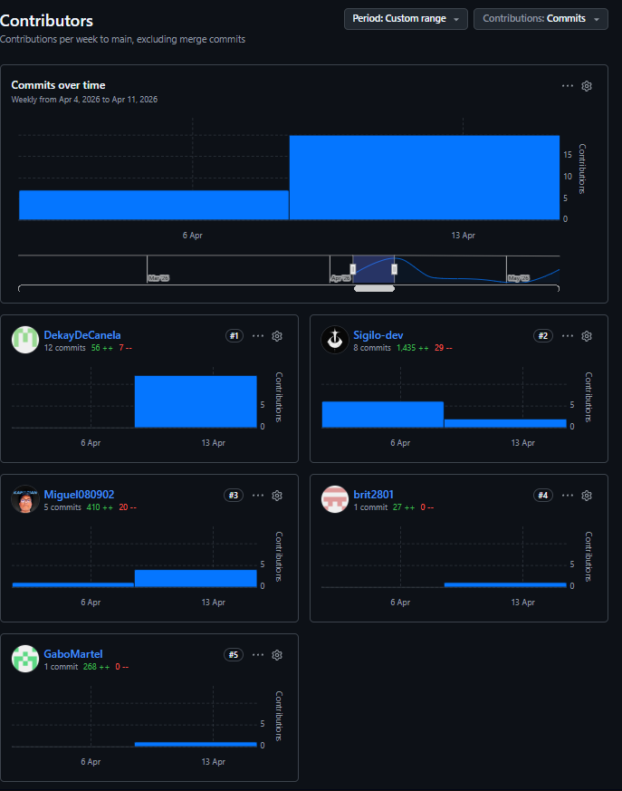

Figura: Analíticos de colaboración del repositorio `Dosys-IoT/docs` durante la preparación de la entrega AV1.

**Evidencia de commits AV1:**  
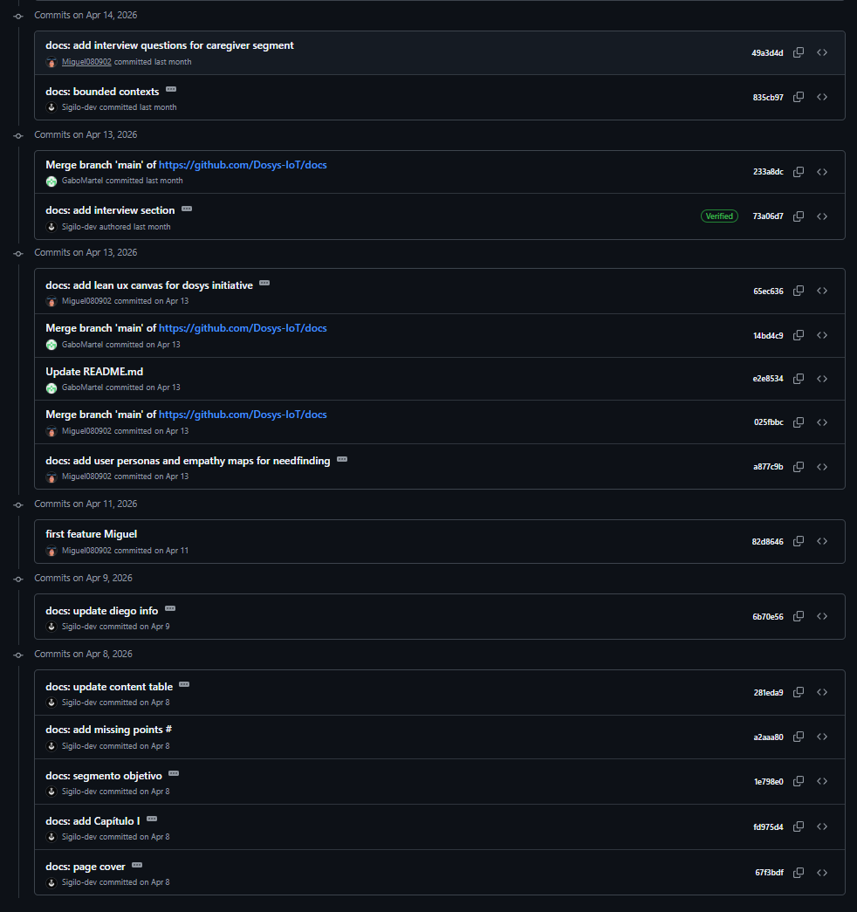

Figura: Historial de commits realizados para la construcción y consolidación del informe en la entrega AV1.

## TB1 Collaboration Insights

Durante la entrega TB1, el equipo corrigió y amplió los artefactos previamente presentados, actualizó el Registro de Versiones, el Student Outcome y el Project Report Collaboration Insights, e incorporó el Capítulo V: Solution UI/UX Design y el Capítulo VI: Product Implementation, Validation & Deployment.

La organización del trabajo se alineó con el Sprint 1. Mariano Oblitas asumió el liderazgo técnico del Backend REST API y del Edge Service, trabajando sobre los bounded contexts Access, Medication y Device, además de la integración entre el dispositivo IoT, el Edge Service y el Backend REST API. Miguel Ybañez lideró el desarrollo del Frontend Web Application, definiendo la estructura de vistas, la integración con los endpoints del Backend y el flujo principal del cuidador. Gabriel Martel,colaboró en el diseño UI/UX. Britney Qqueso lideró el desarrollo y despliegue del Landing Page, asegurando que la primera versión pública estuviera disponible mediante GitHub Pages, y colaboró en la validación funcional de los flujos IoT.. Diego Zúñiga coordinó la planificación del Sprint 1, la revisión de calidad del informe y la actualización de evidencias para el Sprint Review.

La colaboración en TB1 fortaleció el modelo de co-liderazgo iniciado en AV1. Cada integrante asumió una vertical técnica o documental, mientras que las decisiones de integración fueron revisadas en conjunto para mantener coherencia entre el informe, los repositorios de código fuente y las evidencias de despliegue.

**Evidencia de colaboración TB1:**  
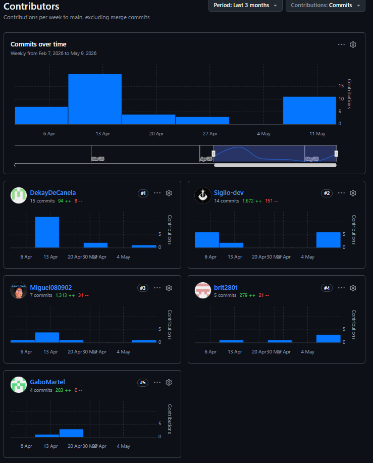

Figura: Analíticos de colaboración del repositorio `Dosys-IoT/docs` durante la preparación de la entrega TB1.

**Evidencia de commits TB1:**  
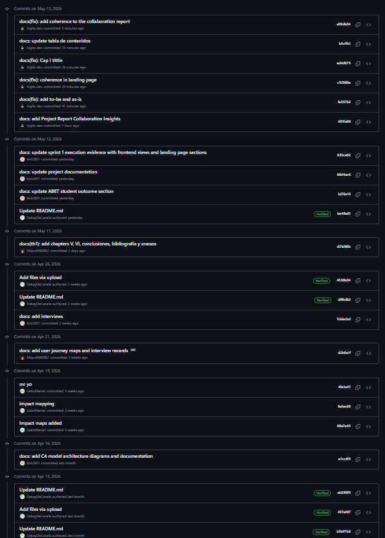

Figura: Historial de commits realizados para la actualización del informe, incorporación del Capítulo V, incorporación del Capítulo VI y consolidación de evidencias de Sprint 1.

## AV2 Collaboration Insights

Durante la entrega AV2, el equipo corrigió y mejoró los artefactos previamente presentados e incorporó la sección **6.2.2 Sprint 2** del Capítulo VI, junto con la actualización del Registro de Versiones, el Student Outcome y el Project Report Collaboration Insights.

La organización del trabajo se alineó con el Sprint 2, cuyo foco fue la consolidación del **Frontend Web Application**. Miguel Ybañez lideró el desarrollo del Sprint 2, alineando la aplicación con el catálogo oficial de User Stories US01–US23, sustituyendo los datos simulados por consumo real del Backend REST API e incorporando el trabajo transversal de calidad/UX formalizado como las nuevas User Stories US24–US27. Gabriel Martel colaboró en el diseño UX/UI y la identidad tipográfica. Mariano Oblitas validó la integración del Frontend con los servicios ya desplegados (Backend REST API y Edge Service), que no fueron modificados en este Sprint. Britney Qqueso realizó la revisión funcional de las vistas y la coherencia con la propuesta de valor del Landing Page. Diego Zúñiga coordinó la planificación del Sprint 2, la consolidación de evidencias y la revisión de calidad del informe.

La colaboración en AV2 mantuvo el modelo de co-liderazgo, esta vez concentrado en una única vertical de producto (Frontend Web), con un líder técnico claro y el resto del equipo en roles de diseño, validación de integración y aseguramiento de calidad.

**Evidencia de colaboración AV2:**  
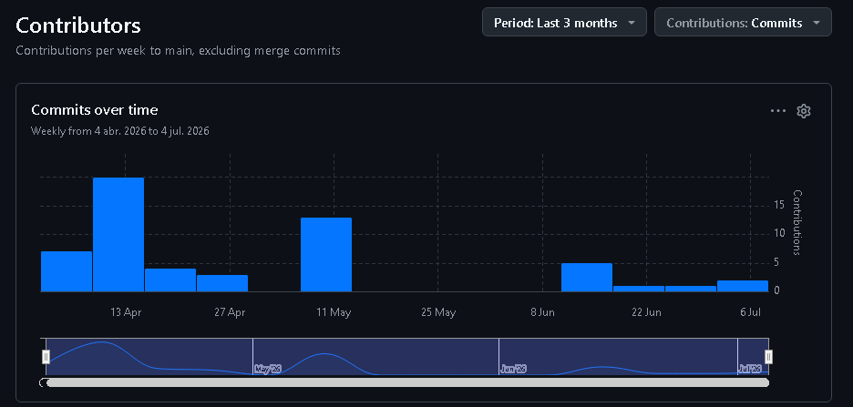

Figura: Analíticos de colaboración del repositorio `Dosys-IoT/docs` durante la preparación de la entrega AV2.

**Evidencia de commits AV2:**  
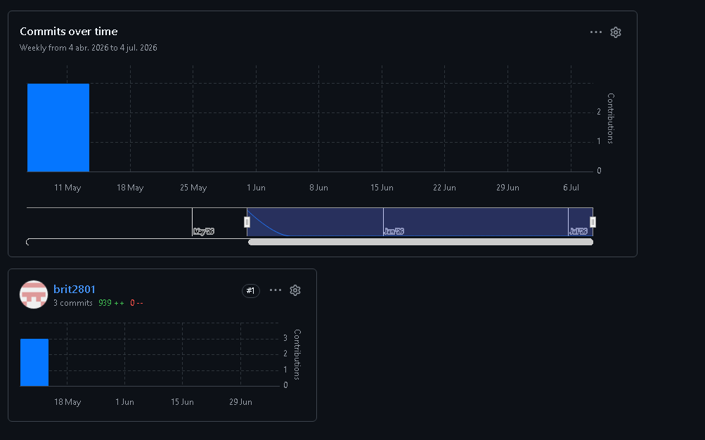

Figura: Historial de commits realizados para la actualización del informe y la incorporación de la sección 6.2.2 Sprint 2.

## TB2 Collaboration Insights

Durante la entrega TB2 (Release Review), el equipo corrigió y mejoró los artefactos previamente presentados e incorporó la sección **6.2.3 Sprint 3** del Capítulo VI y la sección **6.3 Validation Interviews**, junto con la actualización del Registro de Versiones, el Student Outcome y el Project Report Collaboration Insights.

La organización del trabajo se alineó con el Sprint 3, cuyo foco fue cerrar el ciclo de vida del producto integrando el dispositivo físico real de extremo a extremo y ampliando el alcance con la App Móvil. Mariano Oblitas lideró la vertical IoT y de servicios (firmware ESP32, MQTT, Edge Service y endpoints internos del Backend, además del despliegue de Backend y Edge). Miguel Ybañez lideró las aplicaciones cliente (control/diagnóstico del dispositivo y horarios personalizados en la Web App, y el desarrollo de la App Móvil en Flutter). Gabriel Martel colaboró en el diseño UX/UI de las nuevas pantallas. Britney Qqueso realizó las entrevistas de validación con usuarios del segmento adulto mayor y la revisión funcional del producto integrado. Diego Zúñiga coordinó el Sprint 3, la ampliación de pruebas, la documentación de servicios y la consolidación de evidencias del Release Review.

La colaboración en TB2 integró por primera vez todas las verticales del producto (hardware, servicios, Web App y App Móvil) en un flujo de extremo a extremo, con dos líderes técnicos complementarios y el resto del equipo en roles de diseño, validación con usuarios y aseguramiento de calidad.

**Evidencia de colaboración TB2:**  
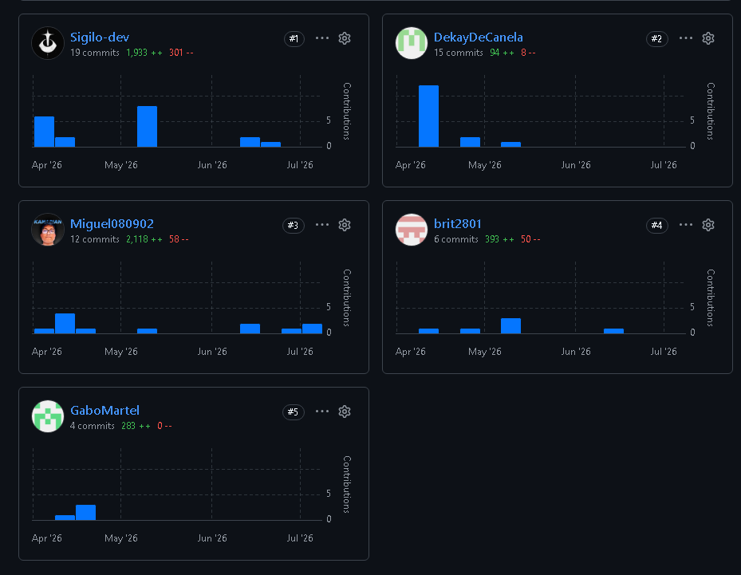

Figura: Analíticos de colaboración del repositorio `Dosys-IoT/docs` durante la preparación de la entrega TB2.

**Evidencia de commits TB2:**  
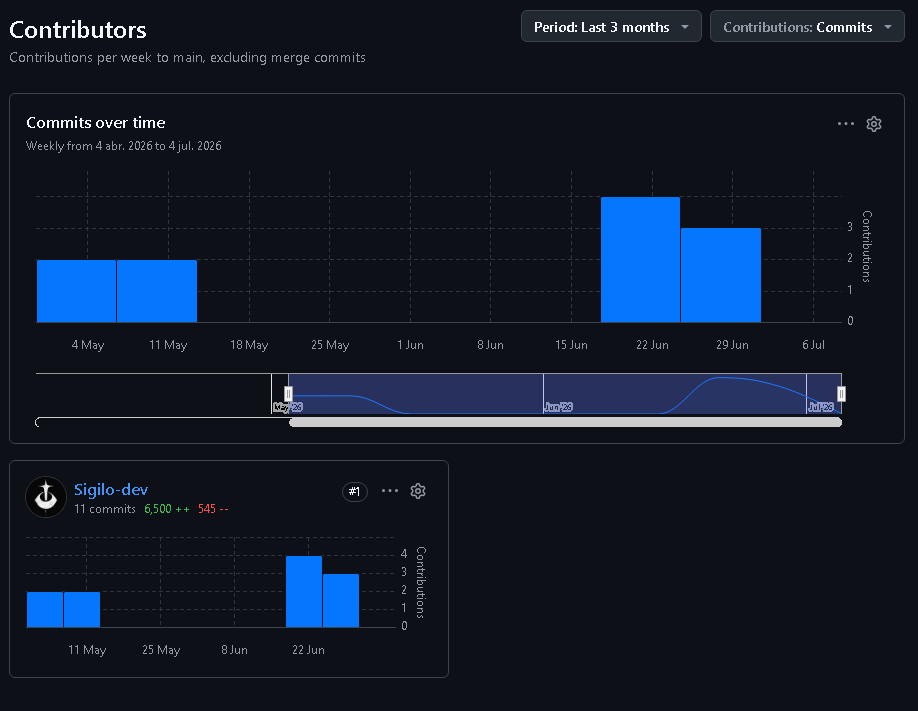

Figura: Historial de commits realizados para la actualización del informe y la incorporación de las secciones 6.2.3 Sprint 3 y 6.3 Validation Interviews.

## Interpretación de la colaboración

Los analíticos de GitHub evidencian que el informe fue construido de manera progresiva y colaborativa. La participación del equipo no se limitó a la redacción individual de secciones, sino que incluyó revisión cruzada, consolidación de artefactos, corrección de observaciones y actualización de evidencias técnicas.

La distribución de responsabilidades fue coherente con el Student Outcome del curso, ya que el equipo proporcionó liderazgo conjunto, creó un entorno colaborativo, estableció objetivos por entrega, planificó tareas en el Sprint 1 y cumplió con los objetivos principales de TB1: contar con la primera versión desplegada del Landing Page en GitHub Pages, el Frontend Web Application en Vercel, el Backend REST API y el Edge Service.

Para las siguientes entregas, el equipo reforzará la trazabilidad de colaboración mediante Pull Requests por feature, mayor granularidad en los commits individuales y capturas actualizadas de los analíticos de GitHub en cada repositorio.


# Student Outcome

El curso contribuye al cumplimiento del Student Outcome ABET:

ABET – EAC - Student Outcome 5: La capacidad de funcionar efectivamente en un equipo cuyos miembros juntos proporcionan liderazgo, crean un entorno de colaboración e inclusivo, establecen objetivos, planifican tareas y cumplen objetivos.

**Student Outcome**

| Criterio específico | Acciones realizadas | Conclusiones |
| :--- | :--- | :--- |
| **Trabaja en equipo para proporcionar liderazgo en forma conjunta** | **Martel Zevallos, Gabriel Aristóteles**<br>• **AV1:** Lideré el diseño arquitectónico inicial de la solución, aportando a la perspectiva técnica del sistema IoT y a la definición de componentes vinculados con el dispositivo.<br>• **TB1:** Asumí el liderazgo del diseño UX/UI del producto, colaborando en la definición de la experiencia de usuario, la organización visual de interfaces, los criterios de accesibilidad y la coherencia entre los flujos del cuidador, el adulto mayor y el dispositivo IoT.<br><br>**Oblitas Davila, Mariano Moises**<br>• **AV1:** Lideré el modelado de datos y el análisis técnico preliminar durante las fases de elicitación y especificación (Capítulos II y III).<br>• **TB1:** Ejercí la dirección técnica del Backend REST API y del Edge Service, definiendo la arquitectura del servidor, los endpoints principales, la integración con el dispositivo IoT y la comunicación entre Edge API, Backend y Frontend Web.<br><br>**Qqueso Rodriguez, Britney Delhy**<br>• **AV1:** Guié el proceso de Elicitación de Requerimientos (Capítulo II), seleccionando y aplicando técnicas adecuadas para el levantamiento de información del dominio.<br>• **TB1:** Lideré el desarrollo, implementación y despliegue del Landing Page, asegurando que la primera versión pública del producto estuviera disponible mediante GitHub Pages y comunicara de forma clara la propuesta de valor de Dosys.<br><br>**Ybañez Esquerre, Miguel Angel**<br>• **AV1:** Tomé la iniciativa en el diseño lógico de software, modelando los diagramas de componentes y los flujos lógicos en el Capítulo IV.<br>• **TB1:** Ejercí el rol de líder de desarrollo del Frontend Web Application, estableciendo la estructura de vistas, el consumo de endpoints del Backend y el despliegue de la aplicación web en Vercel.<br><br>**Zúñiga Murillo, Diego Sebastián**<br>• **AV1:** Actué como Team Leader del proyecto, gestionando la consolidación del informe técnico y aplicando revisiones de calidad antes de la entrega de la AV1.<br>• **TB1:** Lideré la gestión de calidad y mejora continua, encargándome del levantamiento de observaciones de la AV1, la coordinación del Sprint Review y la actualización de evidencias del documento base. | **AV1:**<br>Implementamos un modelo de liderazgo distribuido basado en nuestras especialidades técnicas. En lugar de centralizar la toma de decisiones en un único rol, cada integrante asumió la dirección de capítulos críticos de investigación y diseño de software, lo que permitió avanzar con autonomía y revisión cruzada desde las fases iniciales del proyecto.<br><br>**TB1:**<br>Consolidamos nuestra dinámica de co-liderazgo al asumir responsabilidades directas sobre cada vertical del ecosistema: Landing Page, Frontend Web, Backend REST API, Edge Service, UX/UI y QA. Esta distribución permitió resolver bloqueos técnicos, mantener coherencia entre repositorios y evidencias, y cumplir el objetivo del Sprint 1 con productos desplegados y verificables. |
| **Crea un entorno colaborativo e inclusivo, establece metas, planifica tareas y cumple objetivos.** | **Martel Zevallos, Gabriel Aristóteles**<br>• **AV1:** Colaboré activamente en la redacción de la introducción y el análisis de requisitos, asegurando que el alcance técnico contemplara las necesidades del ecosistema IoT.<br>• **TB1:** Participé en el Sprint Planning 1, planifiqué tareas vinculadas al diseño UX/UI, colaboré en la validación de flujos visuales y apoyé la consistencia entre la experiencia del usuario, la documentación del Capítulo V y la solución técnica descrita en el informe.<br><br>**Oblitas Davila, Mariano Moises**<br>• **AV1:** Participé en las sesiones grupales de lluvia de ideas para la delimitación del alcance funcional del sistema.<br>• **TB1:** Colaboré de manera inclusiva proporcionando documentación técnica, contratos de API, endpoints y servicios desplegados para que mis compañeros de Frontend Web, Landing Page y UX/UI pudieran integrar y validar sus avances a tiempo.<br><br>**Qqueso Rodriguez, Britney Delhy**<br>• **AV1:** Contribuí en la especificación de requerimientos (Capítulo III), integrando el feedback constructivo del equipo para refinar los casos de uso.<br>• **TB1:** Planifiqué mis actividades dentro del Sprint Backlog 1 asociadas al Landing Page, colaborando con el equipo para asegurar que la página comunicara correctamente el problema, la solución, los beneficios del producto y el acceso público mediante GitHub Pages.<br><br>**Ybañez Esquerre, Miguel Angel**<br>• **AV1:** Colaboré en el desarrollo de los diagramas arquitectónicos y de despliegue de la solución grupal.<br>• **TB1:** Integré colaborativamente mis avances en el repositorio común siguiendo el flujo de trabajo de Git establecido, apoyando el cumplimiento de las metas de despliegue en la nube para el Frontend Web Application.<br><br>**Zúñiga Murillo, Diego Sebastián**<br>• **AV1:** Organicé el cronograma inicial y la asignación equitativa de subtareas, promoviendo un entorno inclusivo donde se validaron las propuestas de todos.<br>• **TB1:** Coordiné la sesión de Sprint Planning 1, estructuré la sección de Collaboration Insights, revisé la coherencia del informe y monitoreé que las evidencias del Sprint 1 estuvieran alineadas con los productos desplegados. | **AV1:**<br>Establecimos los hitos iniciales del proyecto dividiendo la carga académica y de investigación de forma equitativa. Logramos un entorno inclusivo mediante sesiones de revisión cruzada, asegurando que los requerimientos de software iniciales reflejaran el consenso técnico de todo el equipo.<br><br>**TB1:**<br>Adoptamos Scrum como marco de coordinación para planificar, estimar y revisar el avance del Sprint 1. Esta disciplina permitió subsanar observaciones de la AV1 y cumplir el objetivo crítico del hito: contar con Landing Page, Frontend Web Application, Backend REST API y Edge Service desplegados, documentados y con evidencias verificables. |


# Tabla de Contenidos

* [Registro de versiones del informe](#registro-de-versiones-del-informe)
* [Project Report Collaboration Insights](#project-report-collaboration-insights)
  * [AV1 Collaboration Insights](#av1-collaboration-insights)
  * [TB1 Collaboration Insights](#tb1-collaboration-insights)
  * [Interpretación de la colaboración](#interpretación-de-la-colaboración)
* [Student Outcome](#student-outcome)

* [Capítulo I: Introducción](#capítulo-i-introducción)
  * [1.1. Startup Profile](#11-startup-profile)
    * [1.1.1. Descripción de la Startup](#111-descripción-de-la-startup)
    * [1.1.2. Perfiles de integrantes del equipo](#112-perfiles-de-integrantes-del-equipo)
  * [1.2. Solution Profile](#12-solution-profile)
    * [1.2.1. Antecedentes y problemática](#121-antecedentes-y-problemática)
    * [1.2.2. Lean UX Process](#122-lean-ux-process)
      * [1.2.2.1. Lean UX Problem Statements](#1221-lean-ux-problem-statements)
      * [1.2.2.2. Lean UX Assumptions](#1222-lean-ux-assumptions)
      * [1.2.2.3. Lean UX Hypothesis Statements](#1223-lean-ux-hypothesis-statements)
      * [1.2.2.4. Lean UX Canvas](#1224-lean-ux-canvas)
  * [1.3. Segmentos objetivo](#13-segmentos-objetivo)

* [Capítulo II: Requirements Elicitation & Analysis](#capítulo-ii-requirements-elicitation--analysis)
  * [2.1. Competidores](#21-competidores)
    * [2.1.1. Análisis competitivo](#211-análisis-competitivo)
    * [2.1.2. Estrategias y tácticas frente a competidores](#212-estrategias-y-tácticas-frente-a-competidores)
  * [2.2. Entrevistas](#22-entrevistas)
    * [2.2.1. Diseño de Entrevistas](#221-diseño-de-entrevistas)
    * [2.2.2. Registro de entrevistas](#222-registro-de-entrevistas)
    * [2.2.3. Análisis de entrevistas](#223-análisis-de-entrevistas)
  * [2.3. Needfinding](#23-needfinding)
    * [2.3.1. User Personas](#231-user-personas)
    * [2.3.2. User Task Matrix](#232-user-task-matrix)
    * [2.3.3. User Journey Mapping](#233-user-journey-mapping)
    * [2.3.4. Empathy Mapping](#234-empathy-mapping)
  * [2.4. Big Picture EventStorming](#24-big-picture-eventstorming)
  * [2.5. Ubiquitous Language](#25-ubiquitous-language)

* [Capítulo III: Requirements Specification](#capítulo-iii-requirements-specification)
  * [3.1. User Stories](#31-user-stories)
  * [3.2. Impact Mapping](#32-impact-mapping)
  * [3.3. Product Backlog](#33-product-backlog)

* [Capítulo IV: Solution Software Design](#capítulo-iv-solution-software-design)
  * [4.1. Strategic-Level Domain-Driven Design](#41-strategic-level-domain-driven-design)
    * [4.1.1. Design-Level EventStorming](#411-design-level-eventstorming)
      * [4.1.1.1. Candidate Context Discovery](#4111-candidate-context-discovery)
      * [4.1.1.2. Domain Message Flows Modeling](#4112-domain-message-flows-modeling)
      * [4.1.1.3. Bounded Context Canvases](#4113-bounded-context-canvases)
    * [4.1.2. Context Mapping](#412-context-mapping)
    * [4.1.3. Software Architecture](#413-software-architecture)
      * [4.1.3.1. Software Architecture System Landscape Diagram](#4131-software-architecture-system-landscape-diagram)
      * [4.1.3.2. Software Architecture Context Level Diagrams](#4132-software-architecture-context-level-diagrams)
      * [4.1.3.2. Software Architecture Container Level Diagrams](#4132-software-architecture-container-level-diagrams)
      * [4.1.3.3. Software Architecture Deployment Diagrams](#4133-software-architecture-deployment-diagrams)
  * [4.2. Tactical-Level Domain-Driven Design](#42-tactical-level-domain-driven-design)
    * [4.2.1. Bounded Context: Access](#421-bounded-context-access)
      * [4.2.1.1. Domain Layer](#4211-domain-layer)
      * [4.2.1.2. Interface Layer](#4212-interface-layer)
      * [4.2.1.3. Application Layer](#4213-application-layer)
      * [4.2.1.4. Infrastructure Layer](#4214-infrastructure-layer)
      * [4.2.1.5. Bounded Context Software Architecture Component Level Diagrams](#4215-bounded-context-software-architecture-component-level-diagrams)
      * [4.2.1.6. Bounded Context Software Architecture Code Level Diagrams](#4216-bounded-context-software-architecture-code-level-diagrams)
        * [4.2.1.6.1. Bounded Context Domain Layer Class Diagrams](#42161-bounded-context-domain-layer-class-diagrams)
        * [4.2.1.6.2. Bounded Context Database Design Diagram](#42162-bounded-context-database-design-diagram)
    * [4.2.2. Bounded Context: Medication](#422-bounded-context-medication)
      * [4.2.2.1. Domain Layer](#4221-domain-layer)
      * [4.2.2.2. Interface Layer](#4222-interface-layer)
      * [4.2.2.3. Application Layer](#4223-application-layer)
      * [4.2.2.4. Infrastructure Layer](#4224-infrastructure-layer)
      * [4.2.2.5. Bounded Context Software Architecture Component Level Diagrams](#4225-bounded-context-software-architecture-component-level-diagrams)
      * [4.2.2.6. Bounded Context Software Architecture Code Level Diagrams](#4226-bounded-context-software-architecture-code-level-diagrams)
        * [4.2.2.6.1. Bounded Context Domain Layer Class Diagrams](#42261-bounded-context-domain-layer-class-diagrams)
        * [4.2.2.6.2. Bounded Context Database Design Diagram](#42262-bounded-context-database-design-diagram)
    * [4.2.3. Bounded Context: Device](#423-bounded-context-device)
      * [4.2.3.1. Domain Layer](#4231-domain-layer)
      * [4.2.3.2. Interface Layer](#4232-interface-layer)
      * [4.2.3.3. Application Layer](#4233-application-layer)
      * [4.2.3.4. Infrastructure Layer](#4234-infrastructure-layer)
      * [4.2.3.5. Bounded Context Software Architecture Component Level Diagrams](#4235-bounded-context-software-architecture-component-level-diagrams)
      * [4.2.3.6. Bounded Context Software Architecture Code Level Diagrams](#4236-bounded-context-software-architecture-code-level-diagrams)
        * [4.2.3.6.1. Bounded Context Domain Layer Class Diagrams](#42361-bounded-context-domain-layer-class-diagrams)
        * [4.2.3.6.2. Bounded Context Database Design Diagram](#42362-bounded-context-database-design-diagram)

* [Capítulo V: Solution UI/UX Design](#capítulo-v-solution-uiux-design)
  * [5.1. Style Guidelines](#51-style-guidelines)
    * [5.1.1. General Style Guidelines](#511-general-style-guidelines)
    * [5.1.2. Web, Mobile and IoT Style Guidelines](#512-web-mobile-and-iot-style-guidelines)
  * [5.2. Information Architecture](#52-information-architecture)
    * [5.2.1. Organization Systems](#521-organization-systems)
    * [5.2.2. Labeling Systems](#522-labeling-systems)
    * [5.2.3. SEO Tags and Meta Tags](#523-seo-tags-and-meta-tags)
    * [5.2.4. Searching Systems](#524-searching-systems)
    * [5.2.5. Navigation Systems](#525-navigation-systems)
  * [5.3. Landing Page UI Design](#53-landing-page-ui-design)
    * [5.3.1. Landing Page Wireframe](#531-landing-page-wireframe)
    * [5.3.2. Landing Page Mock-up](#532-landing-page-mock-up)
  * [5.4. Applications UX/UI Design](#54-applications-uxui-design)
    * [5.4.1. Applications Wireframes](#541-applications-wireframes)
    * [5.4.2. Applications Wireflow Diagrams](#542-applications-wireflow-diagrams)
    * [5.4.2. Applications Mock-ups](#542-applications-mock-ups)
    * [5.4.3. Applications User Flow Diagrams](#543-applications-user-flow-diagrams)
  * [5.5. Applications Prototyping](#55-applications-prototyping)
  * [5.6. IoT Device Design](#56-iot-device-design)

* [Capítulo VI: Product Implementation, Validation & Deployment](#capítulo-vi-product-implementation-validation--deployment)
  * [6.1. Software Configuration Management](#61-software-configuration-management)
    * [6.1.1. Software Development Environment Configuration](#611-software-development-environment-configuration)
    * [6.1.2. Source Code Management](#612-source-code-management)
    * [6.1.3. Source Code Style Guide & Coding Conventions](#613-source-code-style-guide--coding-conventions)
    * [6.1.4. Software Deployment Configuration](#614-software-deployment-configuration)
  * [6.2. Landing Page, Services & Applications Implementation](#62-landing-page-services--applications-implementation)
    * [6.2.1. Sprint 1](#621-sprint-1)
      * [6.2.1.1. Sprint Planning 1](#6211-sprint-planning-1)
      * [6.2.1.2. Aspect Leaders and Collaborators](#6212-aspect-leaders-and-collaborators)
      * [6.2.1.3. Sprint Backlog 1](#6213-sprint-backlog-1)
      * [6.2.1.4. Development Evidence for Sprint Review](#6214-development-evidence-for-sprint-review)
      * [6.2.1.5. Testing Suite Evidence for Sprint Review](#6215-testing-suite-evidence-for-sprint-review)
      * [6.2.1.6. Execution Evidence for Sprint Review](#6216-execution-evidence-for-sprint-review)
      * [6.2.1.7. Services Documentation Evidence for Sprint Review](#6217-services-documentation-evidence-for-sprint-review)
      * [6.2.1.8. Software Deployment Evidence for Sprint Review](#6218-software-deployment-evidence-for-sprint-review)
      * [6.2.1.9. Team Collaboration Insights during Sprint](#6219-team-collaboration-insights-during-sprint)
    * [6.2.2. Sprint 2](#622-sprint-2)
      * [6.2.2.1. Sprint Planning 2](#6221-sprint-planning-2)
      * [6.2.2.2. Aspect Leaders and Collaborators](#6222-aspect-leaders-and-collaborators)
      * [6.2.2.3. Sprint Backlog 2](#6223-sprint-backlog-2)
      * [6.2.2.4. Development Evidence for Sprint Review](#6224-development-evidence-for-sprint-review)
      * [6.2.2.5. Testing Suite Evidence for Sprint Review](#6225-testing-suite-evidence-for-sprint-review)
      * [6.2.2.6. Execution Evidence for Sprint Review](#6226-execution-evidence-for-sprint-review)
      * [6.2.2.7. Services Documentation Evidence for Sprint Review](#6227-services-documentation-evidence-for-sprint-review)
      * [6.2.2.8. Software Deployment Evidence for Sprint Review](#6228-software-deployment-evidence-for-sprint-review)
      * [6.2.2.9. Team Collaboration Insights during Sprint](#6229-team-collaboration-insights-during-sprint)
    * [6.2.3. Sprint 3](#623-sprint-3)
      * [6.2.3.1. Sprint Planning 3](#6231-sprint-planning-3)
      * [6.2.3.2. Aspect Leaders and Collaborators](#6232-aspect-leaders-and-collaborators)
      * [6.2.3.3. Sprint Backlog 3](#6233-sprint-backlog-3)
      * [6.2.3.4. Development Evidence for Sprint Review](#6234-development-evidence-for-sprint-review)
      * [6.2.3.5. Testing Suite Evidence for Sprint Review](#6235-testing-suite-evidence-for-sprint-review)
      * [6.2.3.6. Execution Evidence for Sprint Review](#6236-execution-evidence-for-sprint-review)
      * [6.2.3.7. Services Documentation Evidence for Sprint Review](#6237-services-documentation-evidence-for-sprint-review)
      * [6.2.3.8. Software Deployment Evidence for Sprint Review](#6238-software-deployment-evidence-for-sprint-review)
      * [6.2.3.9. Team Collaboration Insights during Sprint](#6239-team-collaboration-insights-during-sprint)
  * [6.3. Validation Interviews](#63-validation-interviews)
    * [6.3.1. Diseño de Entrevistas](#631-diseño-de-entrevistas)
    * [6.3.2. Registro de Entrevistas](#632-registro-de-entrevistas)
    * [6.3.3. Evaluaciones según heurísticas](#633-evaluaciones-según-heurísticas)
  * [6.4. Video About-the-Product](#64-video-about-the-product)

* [Conclusiones](#conclusiones)
  * [Conclusiones y recomendaciones](#conclusiones-y-recomendaciones)
  * [Video About-the-Team](#video-about-the-team)

* [Bibliografía](#bibliografía)

* [Anexos](#anexos)
  * [Anexo A. Repositorios del proyecto](#anexo-a-repositorios-del-proyecto)
  * [Anexo B. Diseño en Figma](#anexo-b-diseño-en-figma)
  * [Anexo C. Documentación del API](#anexo-c-documentación-del-api)
  * [Anexo D. Videos de Exposiciones](#anexo-d-videos-de-exposiciones)


# Capítulo I: Introducción

## 1.1. Startup Profile

### 1.1.1. Descripción de la Startup

Somos Dosys, una startup conformada por estudiantes de la Universidad Peruana de Ciencias Aplicadas comprometidos con el desarrollo de soluciones tecnológicas orientadas al bienestar, la autonomía y la calidad de vida de las personas adultas mayores.

Nuestra misión es diseñar una solución IoT accesible y confiable que ayude a organizar tratamientos farmacológicos, reducir olvidos en la toma de medicamentos y mejorar el seguimiento cotidiano de rutinas de medicación en el hogar, integrando hardware, software y monitoreo de condiciones ambientales.

Nuestra visión es convertirnos en una propuesta referente en el ámbito de la asistencia tecnológica para el cuidado domiciliario de adultos mayores en el Perú, ofreciendo un producto que combine usabilidad, prevención, acompañamiento familiar y monitoreo inteligente bajo una experiencia simple, clara y segura.

Nuestro producto principal es Dosys, un pastillero inteligente premium de cinco compartimentos, diseñado para administrar hasta cinco medicamentos distintos. El sistema permite configurar tratamientos desde una aplicación, asignar medicamentos a compartimentos específicos, definir horarios, duración del tratamiento y reglas de alerta. Cuando corresponde una toma, el dispositivo reproduce un recordatorio por voz, enciende el LED del compartimento asignado y permite al usuario confirmar la toma o repetir la alerta mediante botones físicos.

Además del recordatorio programado, Dosys supervisa la temperatura y humedad del entorno donde se almacenan los medicamentos, con el fin de advertir condiciones que puedan comprometer su adecuada conservación. La solución también contempla alertas para recarga de compartimentos, aviso de compra de medicamento y notificación para vaciar o limpiar compartimentos al finalizar un tratamiento, todo ello en función de la configuración registrada previamente por el usuario o su cuidador.

Dosys no busca reemplazar la supervisión médica ni verificar la ingesta real del medicamento. Su propuesta de valor se centra en reducir errores cotidianos de organización, mejorar la adherencia al tratamiento mediante recordatorios físicos y digitales, y ofrecer un apoyo tecnológico práctico para el cuidado en casa.

### 1.1.2. Perfiles de integrantes del equipo

| Nombre: Ybañez Esquerre, Miguel Angel |  |
| :------------------------------------------------------------------------------------------------------------------------------------------------------------------------------------------- | :---------------------------- |
| **Código:** U20201B298|                               |
| **Carrera:** Ingeniería de Software    |                               |
| **Habilidades:** Miguel Ángel Ybañez Esquerre – Estudiante de 23 años de Ingeniería de Software en la UPC. Me caracterizo por mi creatividad, capacidad analítica y enfoque práctico para resolver problemas. Apasionado por el desarrollo web y los agentes de inteligencia artificial, con experiencia en desarrollo de videojuegos en Unity y realidad virtual con Meta Quest. Siempre en búsqueda de explorar nuevas tecnologías y llevar las ideas a soluciones reales. |                               |

| Nombre: Oblitas Davila, Mariano Moises |  |
| :------------------------------------------------------------------------------------------------------------------------------------------------------------------------------------------- | :---------------------------- |
| **Código:** U202310222  |                               |
| **Carrera:** Ingeniería de Software |                               |
| **Habilidades:** Estudiante de 20 años de Ingeniería de Software en la UPC. Me caracterizo por mi creatividad, eficacia y capacidad para resolver problemas de manera racional. Apasionado por la programación y el desarrollo de software, busco constantemente innovar y aprender nuevas tecnologías. |          |

| Nombre: Qqueso Rodriguez, Britney Delhy|  |
| :------------------------------------------------------------------------------------------------------------------------------------------------------------------------------------------- | :---------------------------- |
| **Código:** U20211G671      |                               |
| **Carrera:** Ingeniería de Software     |                               |
| **Habilidades:** Soy estudiante de la carrera de Ingeniería de Software en la Universidad Peruana de Ciencias Aplicadas (UPC). Me considero una persona autodidacta, creativa, organizada y responsable. Me comprometo a contribuir al equipo con mis conocimientos y habilidades, apoyar en todo lo necesario y aprender en el proceso. |        |

| Nombre: Zúñiga Murillo, Diego Sebastián    |  |
| :------------------------------------------------------------------------------------------------------------------------------------------------------------------------------------------- | :---------------------------- |
| **Código:** U202310636  |   |
| **Carrera:** Ingeniería de Software   |   |
| **Habilidades:** Mi nombre es Diego Sebastián Zúñiga Murillo, tengo 21 años y actualmente curso el séptimo ciclo de la carrera de Ingeniería de Software en la Universidad Peruana de Ciencias Aplicadas. Me considero una persona puntual, participativa y responsable, con una fuerte pasión por la tecnología y el aprendizaje constante. En mi tiempo libre disfruto de escuchar música, lo que me ayuda a relajarme y mantener el equilibrio entre mis estudios y mi vida personal. Como estudiante, me comprometo a aportar activamente en el desarrollo de este proyecto, contribuyendo con creatividad, iniciativa y habilidades de liderazgo. Confío en que, trabajando en equipo y manteniendo una comunicación constante, lograremos resultados destacados que reflejan nuestro esfuerzo y compromiso. |   |

| Nombre: Martel Zevallos, Gabriel Aristóteles  |  |
| :------------------------------------------------------------------------------------------------------------------------------------------------------------------------------------------- |-------------------- |
| **Código:** U202121584
| **Carrera:** Ingeniería de Software |       |
| **Habilidades:** Integrante del equipo Dosys. Participa en las actividades de investigación, análisis y construcción de la solución IoT, contribuyendo al trabajo colaborativo del proyecto. |      |

## 1.2. Solution Profile

### 1.2.1. Antecedentes y problemática

##### **¿Cuál es el problema?**

La gestión de medicamentos en personas adultas mayores constituye un problema relevante de salud y de uso cotidiano. En el Perú, las personas de 60 y más años representan el 14,1% de la población, y 59,7% de este grupo presenta al menos una comorbilidad; entre las más frecuentes se encuentran la hipertensión arterial y la diabetes mellitus. En paralelo, la OMS ha señalado que, en enfermedades crónicas, la adherencia a tratamientos de largo plazo promedia apenas 50% en países desarrollados, y suele ser menor en contextos con más barreras de acceso y seguimiento. En ese escenario, los adultos mayores que deben cumplir esquemas farmacológicos diarios enfrentan olvidos, confusión entre medicamentos, dificultad para seguir horarios y riesgo de almacenamiento inadecuado en el hogar. (Instituto Nacional de Estadística e Informática [INEI], 2024; World Health Organization [WHO], 2003).

##### **¿Cuándo ocurre el problema?**

El problema ocurre principalmente durante tratamientos crónicos y prolongados, especialmente cuando una persona debe tomar varios medicamentos al día, en horarios distintos, o durante semanas o meses continuos. Esta situación se vuelve más crítica cuando existen cambios cognitivos propios del envejecimiento, disminución de la memoria operativa, dificultades visuales o menor destreza manual. La literatura sobre accesibilidad para usuarios mayores muestra que el envejecimiento afecta visión, motricidad fina, audición y capacidad de concentración, factores que inciden directamente en la correcta interacción con recordatorios, envases y rutinas digitales o físicas. (W3C Web Accessibility Initiative, 2025).

##### **¿Dónde ocurre el problema?**

La problemática ocurre sobre todo en el entorno doméstico, que es donde la mayoría de adultos mayores almacena y administra su medicación. Allí aparecen dos riesgos simultáneos: por un lado, la complejidad del tratamiento; por otro, las condiciones del ambiente. MedlinePlus advierte que el calor, la humedad, el aire y la luz pueden dañar medicamentos, y recomienda almacenarlos en lugares frescos y secos; además, señala que el baño no es un lugar adecuado por la humedad y el calor. Esto justifica que una solución como Dosys no solo recuerde la toma, sino que también supervise condiciones básicas de conservación del medicamento. (U.S. National Library of Medicine, n.d.).

##### **¿A quién afecta el problema?**

El problema afecta de forma directa a adultos mayores que viven con una o varias enfermedades crónicas y que deben seguir tratamientos farmacológicos continuos. También afecta a familiares y cuidadores, quienes frecuentemente asumen la supervisión de horarios, recargas y reposición de medicamentos. De manera indirecta, impacta al sistema de salud, porque la no adherencia se asocia con peores resultados clínicos, más hospitalizaciones y mayores costos de atención. En Perú, además, parte importante de esta población presenta discapacidad o limitaciones funcionales, lo que incrementa la necesidad de soluciones accesibles y simples de usar. (INEI, 2023, 2024; Walsh et al., 2019).

##### **¿Por qué sucede el problema?**

El problema sucede por una combinación de factores: polifarmacia, complejidad de los esquemas terapéuticos, olvidos, barreras físicas o cognitivas, y herramientas insuficientes para el seguimiento cotidiano. La polifarmacia es altamente prevalente en adultos mayores y se asocia con consecuencias clínicas adversas, interacciones medicamentosas, errores y mayor complejidad de manejo. A ello se suma que muchas soluciones tradicionales, como pastilleros genéricos sin alarma ni apoyo contextual, no ofrecen trazabilidad, no diferencian bien eventos de toma y no consideran condiciones ambientales ni necesidades de accesibilidad. (Pazan & Wehling, 2021; W3C Web Accessibility Initiative, 2025).

##### **¿Cómo sucede el problema?**

En la práctica, el problema se manifiesta cuando la persona olvida una dosis, la retrasa, la duplica o confunde compartimentos y horarios. También ocurre cuando un cuidador no tiene visibilidad clara de qué medicamento correspondía tomar o cuándo debe reponerse un compartimento. La evidencia disponible muestra que los recordatorios electrónicos y los dispositivos de empaque o dispensación con soporte electrónico pueden mejorar la adherencia, especialmente cuando el problema central incluye el olvido y la organización cotidiana de la medicación. Esto respalda la lógica funcional de Dosys como dispositivo híbrido de recordatorio por voz, alerta visual, confirmación física y configuración digital. (Vervloet et al., 2012; Checchi et al., 2014).

##### **¿Cuán grande es el impacto de este problema?**

El impacto es alto en términos clínicos, familiares y operativos. Una revisión sistemática y metaanálisis en población envejecida encontró que la no adherencia a la medicación se asocia significativamente con mayor hospitalización por todas las causas, y que una buena adherencia se relaciona con una reducción del riesgo de mortalidad a largo plazo. Además, revisiones más recientes sobre consecuencias clínicas y económicas muestran que la no adherencia suele empeorar resultados de salud y elevar costos sanitarios. En el caso peruano, el crecimiento sostenido de la población adulta mayor y su alta carga de comorbilidad convierten este problema en una oportunidad clara para soluciones preventivas, domiciliarias y centradas en la usabilidad. (Walsh et al., 2019; Cutler et al., 2025; INEI, 2024).

### 1.2.2. Lean UX Process

#### 1.2.2.1. Lean UX Problem Statements

**Problem Statement 1 – Adultos mayores con tratamientos crónicos**

Nuestro entorno evidencia que los adultos mayores con tratamientos farmacológicos crónicos enfrentan dificultades significativas para cumplir sus esquemas de medicación de manera autónoma en el hogar. Los olvidos de dosis, la confusión entre medicamentos y horarios, y la falta de herramientas accesibles que consideren sus limitaciones visuales, auditivas o cognitivas generan una baja adherencia terapéutica. Hemos observado que los pastilleros convencionales no ofrecen recordatorios activos, no diferencian compartimentos de forma clara ni supervisan condiciones de conservación del medicamento. ¿Cómo podríamos ofrecer a los adultos mayores un sistema de recordatorio y organización de medicamentos que sea accesible, multimodal y fácil de usar, de modo que mejoren su adherencia al tratamiento sin depender exclusivamente de un cuidador?

**Problem Statement 2 – Familiares y cuidadores**

Nuestro entorno evidencia que los familiares y cuidadores de adultos mayores polimedicados carecen de visibilidad oportuna sobre el cumplimiento de la medicación y el estado de los compartimentos del pastillero. Esto les impide intervenir a tiempo ante una dosis omitida, un compartimento vacío o condiciones ambientales inadecuadas de almacenamiento. Hemos observado que las soluciones tradicionales no proveen trazabilidad digital ni mecanismos de notificación remota, lo que obliga al cuidador a depender de la supervisión presencial. ¿Cómo podríamos brindar a familiares y cuidadores un canal de seguimiento remoto, confiable y en tiempo real, que les permita acompañar el tratamiento del adulto mayor sin necesidad de estar físicamente presentes?

#### 1.2.2.2. Lean UX Assumptions

**Business Assumptions:**

1. Creemos que nuestros usuarios necesitan un dispositivo físico que les recuerde de forma clara y accesible cuándo tomar cada medicamento, combinando alertas de voz, luz LED y confirmación mediante botones.
2. Estas necesidades se pueden resolver con un pastillero inteligente de cinco compartimentos integrado a una aplicación de configuración y monitoreo.
3. Nuestros clientes iniciales serán familiares o cuidadores de adultos mayores polimedicados que buscan una herramienta confiable para apoyar la adherencia al tratamiento en el hogar.
4. El valor principal que un cliente quiere de nuestro producto es la tranquilidad de saber que su familiar recibe recordatorios oportunos y que el estado del tratamiento puede supervisarse de forma remota.
5. El cliente también puede obtener beneficios adicionales como alertas de condiciones ambientales inadecuadas (temperatura y humedad), avisos de recarga de compartimentos y notificaciones de fin de tratamiento.
6. Vamos a adquirir la mayoría de nuestros clientes mediante redes sociales orientadas a cuidadores, alianzas con farmacias y recomendaciones en comunidades de salud del adulto mayor.
7. Haremos dinero a través de la venta del dispositivo Dosys como producto premium y, eventualmente, mediante suscripciones para funcionalidades avanzadas de monitoreo y reportes.
8. Nuestra competencia principal serán pastilleros genéricos sin tecnología, aplicaciones móviles de recordatorio de medicamentos y dispensadores automatizados de alto costo.
9. Los venceremos gracias a la combinación de hardware accesible con recordatorio multimodal (voz, luz, botón), monitoreo ambiental integrado y una experiencia de configuración simple desde la aplicación.
10. Nuestro mayor riesgo es que los adultos mayores no adopten el dispositivo por resistencia al uso de tecnología o que los cuidadores no perciban suficiente valor diferencial frente a soluciones más simples.
11. Resolveremos esto mediante un diseño centrado en la accesibilidad, pruebas de usabilidad con usuarios reales del segmento objetivo y una experiencia de primer uso guiada y asistida.

**User Assumptions:**

1. **¿Quién es el usuario?** Adultos mayores de 60 años o más con tratamientos farmacológicos crónicos, y sus familiares o cuidadores que participan en la supervisión del tratamiento.
2. **¿Dónde encaja nuestro producto en su vida?** En la rutina diaria del hogar, específicamente en los momentos asociados a la toma de medicamentos (mañana, tarde, noche).
3. **¿Qué problemas resuelve nuestro producto?** Olvidos de dosis, confusión entre medicamentos y horarios, falta de visibilidad del cuidador sobre el cumplimiento, y almacenamiento en condiciones ambientales inadecuadas.
4. **¿Cuándo y cómo se usa nuestro producto?** El adulto mayor interactúa con el dispositivo físico cuando recibe un recordatorio (voz + LED) y confirma o repite la alerta con botones. El cuidador usa la aplicación para configurar tratamientos, revisar el estado de cumplimiento y recibir notificaciones.
5. **¿Qué características son importantes?** Recordatorio por voz con mensaje claro, iluminación LED por compartimento, botones físicos grandes y accesibles, monitoreo de temperatura y humedad, alertas de recarga y fin de tratamiento, y notificaciones remotas para el cuidador.
6. **¿Cómo debe verse y comportarse nuestro producto?** El dispositivo debe tener un diseño limpio, con compartimentos claramente diferenciados, botones de tamaño adecuado y una interfaz de voz comprensible. La aplicación debe ser visualmente simple, con tipografía legible, navegación intuitiva y flujos de configuración guiados paso a paso.

#### 1.2.2.3. Lean UX Hypothesis Statements

**Hypothesis Statement 1:**

Creemos que lograremos una mejora en la adherencia a la medicación de adultos mayores con tratamientos crónicos si los adultos mayores con polimedicación obtienen recordatorios oportunos y accesibles para cada dosis con un pastillero inteligente que combine alertas de voz, iluminación LED por compartimento y confirmación mediante botones físicos.
Sabremos que hemos tenido éxito cuando al menos el 80% de las dosis programadas sean confirmadas a tiempo por los usuarios durante el primer mes de uso del dispositivo.

**Hypothesis Statement 2:**

Creemos que reduciremos la ansiedad y la carga de supervisión de los familiares y cuidadores si los cuidadores de adultos mayores polimedicados obtienen visibilidad remota y en tiempo real del cumplimiento de la medicación con una aplicación que envíe notificaciones de dosis confirmadas, dosis omitidas y estado de los compartimentos.
Sabremos que hemos tenido éxito cuando más del 70% de los cuidadores reporte una disminución percibida en su nivel de preocupación respecto al cumplimiento de la medicación de su familiar.

**Hypothesis Statement 3:**

Creemos que prevendremos el deterioro de medicamentos almacenados en el hogar si los usuarios de Dosys obtienen alertas tempranas sobre condiciones ambientales inadecuadas con sensores de temperatura y humedad integrados en el dispositivo que notifiquen cuando los valores excedan los rangos recomendados de conservación.
Sabremos que hemos tenido éxito cuando el 100% de las alertas ambientales se emitan antes de que las condiciones del entorno superen los umbrales críticos de conservación durante al menos 30 días consecutivos de uso.

**Hypothesis Statement 4:**

Creemos que mejoraremos la continuidad del tratamiento sin interrupciones por falta de medicamento si los cuidadores y adultos mayores obtienen avisos anticipados de recarga y compra de medicamentos con un sistema que calcule, a partir de la configuración del tratamiento, cuándo un compartimento quedará vacío y cuándo debe adquirirse más medicamento.
Sabremos que hemos tenido éxito cuando menos del 10% de los usuarios reporte haber quedado sin medicamento disponible en algún compartimento durante el primer trimestre de uso.

#### 1.2.2.4. Lean UX Canvas

El Lean UX Canvas (v2) de Jeff Gothelf integra en una sola vista el problema de negocio, los resultados esperados, los usuarios, los beneficios, las soluciones propuestas, las hipótesis y el experimento de validación para la suposición más riesgosa. A continuación se presenta el canvas elaborado para Dosys, construido a partir de los Business Assumptions, User Assumptions e Hypothesis Statements definidos en las secciones previas.

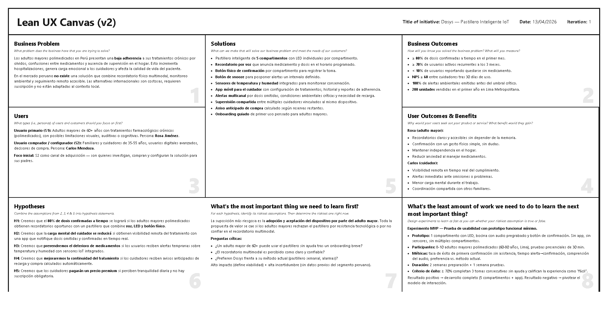

**Interpretación del canvas:**

- **Problema de negocio (Box 1):** Existe una oportunidad clara en el mercado peruano por la ausencia de soluciones integrales de gestión de medicamentos adaptadas al adulto mayor. Los competidores internacionales no están disponibles localmente o resultan costosos.
- **Resultados esperados (Box 2):** Las métricas clave combinan indicadores de adherencia (80% de dosis confirmadas), retención (70% a 3 meses) y comerciales (200 unidades en el primer año).
- **Usuarios (Box 3):** Se prioriza al cuidador familiar (S2) como canal de adquisición, ya que es el decisor de compra, mientras que el adulto mayor (S1) es el usuario final del hardware.
- **Beneficios de usuario (Box 4):** Se segmentan los beneficios por persona, reflejando que Dosys debe resolver dos experiencias distintas simultáneamente (autonomía para Rosa, tranquilidad remota para Carlos).
- **Soluciones (Box 5):** Se listan las funcionalidades clave del dispositivo y la aplicación que se vinculan directamente con cada beneficio esperado.
- **Hipótesis (Box 6):** Cinco hipótesis que integran las Business Outcomes, Users, User Outcomes y Solutions de los cuadros anteriores.
- **Aprendizaje prioritario (Box 7):** La suposición más riesgosa identificada es la adopción y aceptación del dispositivo por parte del adulto mayor, por su alto impacto en la viabilidad del producto y su alta incertidumbre.
- **Experimento de validación (Box 8):** Se propone un MVP de un solo compartimento para probar la interacción multimodal con 8-10 adultos mayores antes de invertir en el desarrollo completo del producto.

## 1.3. Segmentos objetivo
#### **Adultos mayores con tratamientos farmacológicos crónicos**

Este es el segmento objetivo principal de Dosys. Incluye a personas de *60 años o más* que requieren tomar medicamentos de manera recurrente para controlar una o varias enfermedades crónicas, y que necesitan apoyo para recordar horarios, identificar compartimentos, confirmar tomas y mantener una rutina más organizada dentro del hogar. En Perú, este grupo crece de forma sostenida y presenta una elevada carga de comorbilidad, lo que incrementa la necesidad de herramientas prácticas para apoyar la adherencia terapéutica. (INEI, 2024).

Características:

* Requieren tratamientos continuos o de larga duración.
* Pueden tomar varios medicamentos al día o en distintos horarios.
* Valoran interacciones simples, visibles y fáciles de comprender.
* Pueden presentar dificultades visuales, auditivas, motoras o de memoria que afectan el seguimiento del tratamiento.
* Se benefician de recordatorios multimodales, como voz, luz y botones físicos. (W3C Web Accessibility Initiative, 2025).

#### **Familiares y cuidadores de adultos mayores polimedicados**

Este es el segundo segmento objetivo de Dosys. Incluye a familiares, cuidadores informales y cuidadores responsables de acompañar a adultos mayores que siguen tratamientos farmacológicos crónicos o toman varios medicamentos al día. Este segmento no interactúa necesariamente con el dispositivo físico como usuario principal, pero sí cumple un rol clave en la configuración del tratamiento, supervisión del cumplimiento, revisión de alertas y toma de decisiones relacionadas con la reposición de medicamentos.

Los familiares y cuidadores suelen asumir la responsabilidad de organizar horarios, preparar pastilleros, llamar al adulto mayor, verificar si tomó sus dosis y responder ante olvidos o confusiones. Esta carga se vuelve más compleja cuando el cuidador no vive con la persona adulta mayor, trabaja durante el día o comparte la responsabilidad del cuidado con otros familiares. En ese contexto, Dosys permite reducir la incertidumbre mediante monitoreo remoto, notificaciones, historial de tomas, alertas ambientales y avisos de recarga.

Características:

* Supervisan o apoyan el tratamiento farmacológico de un adulto mayor.
* Pueden vivir con el adulto mayor o realizar seguimiento a distancia.
* Necesitan visibilidad clara sobre dosis tomadas, dosis omitidas y estado del dispositivo.
* Valoran herramientas que reduzcan la carga mental asociada al cuidado diario.
* Requieren notificaciones oportunas ante eventos críticos, como olvidos, baja cantidad de pastillas, desconexión del dispositivo o condiciones ambientales inadecuadas.
* Buscan una aplicación simple para configurar medicamentos, horarios, compartimentos y alertas sin depender de procesos técnicos complejos.
* Pueden actuar como decisores de compra, ya que buscan soluciones que les brinden tranquilidad, trazabilidad y mayor control sobre la rutina de medicación del adulto mayor.

# Capítulo II: Requirements Elicitation & Analysis

## 2.1. Competidores

Los competidores que hemos identificado para Dosys son soluciones tecnológicas orientadas a la gestión y recordatorio de medicamentos. Aunque no existe en el mercado peruano un producto que combine pastillero inteligente con monitoreo ambiental IoT y accesibilidad multimodal como lo hace Dosys, sí existen productos internacionales con funcionalidades similares que representan competencia directa e indirecta.

### 2.1.1. Análisis competitivo

<table>
  <tr>
    <th colspan="6" style="text-align:center;">Competitive Analysis Landscape</th>
  </tr>
  <tr>
    <td colspan="2">¿Por qué llevar a cabo este análisis?</td>
    <td colspan="4">Para identificar las ventajas competitivas de Dosys y definir estrategias efectivas frente a soluciones existentes en el mercado de gestión inteligente de medicamentos para adultos mayores.</td>
  </tr>
  <tr>
    <td colspan="2"></td>
    <td style="text-align:center;"><strong>Dosys</strong></td>
    <td style="text-align:center;"><strong>Hero Health</strong></td>
    <td style="text-align:center;"><strong>MedMinder</strong></td>
    <td style="text-align:center;"><strong>Pillsy</strong></td>
  </tr>
  <tr>
    <td rowspan="2"><strong>Perfil</strong></td>
    <td>Overview</td>
    <td>Dosys es un pastillero inteligente premium de cinco compartimentos con recordatorio por voz, iluminación LED, confirmación por botón físico y monitoreo de temperatura y humedad. Integra una aplicación para configurar tratamientos, gestionar horarios y recibir notificaciones remotas. Diseñado específicamente para adultos mayores en el contexto peruano.</td>
    <td>Hero Health es un dispensador automático de medicamentos con capacidad para múltiples pastillas. Dispensa la dosis correcta en el momento programado, envía alertas al cuidador y ofrece una app de seguimiento. Enfocado en el mercado estadounidense con un modelo de suscripción mensual.</td>
    <td>MedMinder es un pastillero inteligente con compartimentos que se iluminan y emiten sonido cuando corresponde una toma. Si la dosis no se toma, envía alertas automáticas a familiares o cuidadores por llamada, texto o email. Ofrece modelos con bloqueo de compartimentos para mayor seguridad.</td>
    <td>Pillsy es una tapa inteligente que se coloca sobre frascos de medicamentos estándar. Detecta cuándo se abre el frasco, registra la toma y envía recordatorios al usuario mediante una aplicación móvil. Su enfoque es simple y no invasivo, orientado a usuarios con tratamientos de un solo medicamento.</td>
  </tr>
  <tr>
    <td>Ventaja competitiva ¿Qué valor ofrece a los clientes?</td>
    <td>Ofrece una solución integral que combina recordatorio multimodal (voz, luz LED, botón físico), monitoreo ambiental IoT para conservación de medicamentos, alertas de recarga y fin de tratamiento, y una aplicación accesible para configuración y seguimiento remoto. Diseñado con enfoque en accesibilidad para adultos mayores.</td>
    <td>Ofrece dispensación automática precisa que elimina errores de selección del medicamento. El dispositivo prepara la dosis exacta, lo que reduce la intervención del usuario. Incluye seguimiento detallado y alertas para cuidadores remotos.</td>
    <td>Ofrece un sistema de alertas escalonadas que contacta al cuidador si la dosis no se toma, incluyendo llamadas telefónicas. Los modelos con bloqueo de compartimentos previenen la toma accidental de dosis incorrectas, lo que añade una capa de seguridad.</td>
    <td>Ofrece una solución no invasiva y económica que se adapta a los frascos de medicamento existentes. No requiere reorganizar los medicamentos en un dispositivo nuevo, lo que facilita la adopción por parte de usuarios que prefieren cambios mínimos en su rutina.</td>
  </tr>
  <tr>
    <td rowspan="2"><strong>Perfil de Marketing</strong></td>
    <td>Mercado Objetivo</td>
    <td>Adultos mayores de 60 años o más con tratamientos crónicos en el Perú, y sus familiares o cuidadores que buscan una herramienta accesible para apoyar la adherencia al tratamiento en el hogar. Enfoque en el contexto latinoamericano con soporte en español.</td>
    <td>Adultos mayores y personas con polifarmacia en Estados Unidos, junto con sus cuidadores y familiares. Se orienta a usuarios que requieren dispensación automatizada y están dispuestos a pagar una suscripción mensual por el servicio.</td>
    <td>Adultos mayores con deterioro cognitivo o condiciones crónicas en Estados Unidos y Canadá. También se dirige a residencias de cuidado y profesionales de salud que buscan herramientas de monitoreo remoto de adherencia.</td>
    <td>Usuarios adultos de todas las edades con tratamientos de uno o pocos medicamentos en Estados Unidos. Enfocado en personas con estilo de vida activo que buscan un recordatorio simple sin necesidad de un dispositivo especializado complejo.</td>
  </tr>
  <tr>
    <td>Estrategias de marketing</td>
    <td>●Alianzas con farmacias y cadenas de salud locales para promocionar el dispositivo entre adultos mayores y cuidadores.<br/><br/>●Marketing en redes sociales dirigido a familiares de adultos mayores, mostrando casos de uso y testimonios.<br/><br/>●Presencia en ferias de salud, envejecimiento activo y tecnología IoT en Perú y Latinoamérica.<br/><br/>●Campañas educativas sobre adherencia terapéutica y conservación de medicamentos en el hogar.</td>
    <td>●Publicidad digital en Estados Unidos con campañas en Google Ads y redes sociales orientadas a cuidadores.<br/><br/>●Alianzas con profesionales de salud y farmacias que recomiendan el dispositivo.<br/><br/>●Contenido educativo sobre gestión de medicamentos en su blog y redes sociales.<br/><br/>●Programa de referidos para usuarios existentes.</td>
    <td>●Marketing directo a residencias de cuidado y profesionales de salud.<br/><br/>●Publicidad en medios especializados en salud y envejecimiento.<br/><br/>●Presencia en conferencias y ferias de tecnología para el cuidado de adultos mayores.<br/><br/>●Email marketing personalizado dirigido a cuidadores familiares.</td>
    <td>●Marketing digital enfocado en simplicidad y estilo de vida saludable.<br/><br/>●Presencia en redes sociales con enfoque en bienestar y autocuidado.<br/><br/>●Colaboraciones con influencers de salud y bienestar.<br/><br/>●Distribución a través de Amazon y farmacias online.</td>
  </tr>
  <tr>
    <td rowspan="3"><strong>Perfil de productos</strong></td>
    <td>Productos &amp; Servicios</td>
    <td>●Pastillero inteligente de cinco compartimentos con LED, altavoz de voz y botones físicos.<br/><br/>●Sensor de temperatura y humedad integrado para monitoreo de condiciones de conservación.<br/><br/>●Aplicación para configurar tratamientos, horarios, alertas de recarga y notificaciones remotas al cuidador.<br/><br/>●Alertas de fin de tratamiento y recordatorio de compra de medicamento.</td>
    <td>●Dispensador automático de medicamentos con capacidad para múltiples pastillas.<br/><br/>●Aplicación de seguimiento con historial de tomas y alertas para cuidadores.<br/><br/>●Servicio de suscripción mensual que incluye soporte técnico y reposición de piezas.<br/><br/>●Integración con sistemas de salud para reportes de adherencia.</td>
    <td>●Pastillero inteligente con compartimentos iluminados y alertas sonoras.<br/><br/>●Modelos con bloqueo automático de compartimentos para prevenir errores.<br/><br/>●Sistema de alertas escalonadas: notificación, llamada y mensaje al cuidador.<br/><br/>●Portal web para monitoreo remoto por parte de familiares y profesionales de salud.</td>
    <td>●Tapa inteligente con sensor de apertura para frascos de medicamentos.<br/><br/>●Aplicación móvil con recordatorios, historial de tomas y reportes.<br/><br/>●Sincronización con Apple Health y Google Fit.<br/><br/>●Diseño compacto y portátil que no requiere reorganizar medicamentos.</td>
  </tr>
  <tr>
    <td>Precios &amp; Costos</td>
    <td>●Venta del dispositivo como producto premium a precio accesible para el mercado peruano.<br/><br/>●Sin suscripción obligatoria para funcionalidades básicas.<br/><br/>●Posibilidad de plan de suscripción opcional para reportes avanzados y funcionalidades adicionales de monitoreo.</td>
    <td>●Dispositivo proporcionado sin costo inicial.<br/><br/>●Suscripción mensual de aproximadamente $29.99 USD que incluye el servicio completo.<br/><br/>●Modelo de ingreso recurrente basado en suscripción.</td>
    <td>●Dispositivo con precio de compra entre $39.99 y $69.99 USD según el modelo.<br/><br/>●Suscripción mensual de $19.99 a $39.99 USD para el servicio de alertas y monitoreo remoto.<br/><br/>●Planes diferenciados según nivel de funcionalidades.</td>
    <td>●Tapa inteligente con precio de compra de aproximadamente $9.99 a $14.99 USD por unidad.<br/><br/>●Aplicación gratuita con funcionalidades básicas.<br/><br/>●Sin modelo de suscripción, costo único por dispositivo.</td>
  </tr>
  <tr>
    <td>Canales de distribución (Web y/o Móvil)</td>
    <td>●<strong>Aplicación móvil</strong> para Android e iOS para configuración y monitoreo.<br/><br/>●Venta del dispositivo a través de tienda online propia y alianzas con farmacias.<br/><br/>●<strong>Landing page</strong> informativa con opción de compra directa.</td>
    <td>●<strong>Plataforma web</strong> para registro y gestión de suscripción.<br/><br/>●<strong>Aplicación móvil</strong> para Android e iOS con todas las funcionalidades de seguimiento.<br/><br/>●Distribución directa al consumidor a través de su sitio web.</td>
    <td>●<strong>Plataforma web</strong> con portal de monitoreo para cuidadores.<br/><br/>●<strong>Aplicación móvil</strong> para Android e iOS.<br/><br/>●Distribución a través de su sitio web, farmacias y proveedores de salud.</td>
    <td>●<strong>Aplicación móvil</strong> para Android e iOS.<br/><br/>●Venta a través de Amazon, farmacias online y su sitio web.<br/><br/>●Distribución directa al consumidor.</td>
  </tr>
  <tr>
    <td rowspan="4"><strong>Análisis SWOT</strong></td>
    <td>Fortalezas</td>
    <td>●Combinación única de recordatorio multimodal (voz, LED, botón) con monitoreo ambiental IoT.<br/><br/>●Diseño centrado en accesibilidad para adultos mayores con limitaciones visuales, auditivas o motoras.<br/><br/>●Enfoque en el mercado peruano y latinoamericano con soporte nativo en español.<br/><br/>●Sin dependencia de suscripción obligatoria, lo que reduce la barrera de entrada.</td>
    <td>●Dispensación automática que elimina errores humanos en la selección del medicamento.<br/><br/>●Modelo de suscripción sin costo inicial del dispositivo, lo que facilita la adopción.<br/><br/>●Amplia capacidad de almacenamiento de múltiples medicamentos.<br/><br/>●Marca consolidada en el mercado estadounidense.</td>
    <td>●Sistema de alertas escalonadas con múltiples canales de contacto al cuidador.<br/><br/>●Modelos con bloqueo de compartimentos para mayor seguridad en pacientes con deterioro cognitivo.<br/><br/>●Presencia establecida en el sector de salud y residencias de cuidado.<br/><br/>●Portal web robusto para monitoreo profesional.</td>
    <td>●Solución económica y no invasiva que se adapta a frascos existentes.<br/><br/>●Diseño compacto y portátil, ideal para usuarios activos.<br/><br/>●Bajo costo de adquisición sin suscripción.<br/><br/>●Integración con plataformas de salud como Apple Health y Google Fit.</td>
  </tr>
  <tr>
    <td>Debilidades</td>
    <td>●Producto en etapa de desarrollo, sin base de usuarios consolidada ni reconocimiento de marca.<br/><br/>●Limitado a cinco compartimentos, lo que puede ser insuficiente para pacientes con alta polifarmacia.<br/><br/>●Recursos limitados como startup universitaria frente a competidores internacionales con mayor financiamiento.<br/><br/>●Dependencia de conectividad para funcionalidades de monitoreo remoto.</td>
    <td>●Costo mensual de suscripción que puede resultar elevado a largo plazo.<br/><br/>●Dispositivo de gran tamaño que ocupa espacio considerable.<br/><br/>●Disponibilidad limitada al mercado estadounidense.<br/><br/>●Dependencia total del modelo de suscripción: sin pago, sin servicio.</td>
    <td>●Costo combinado de dispositivo más suscripción que puede ser prohibitivo para muchos usuarios.<br/><br/>●Interfaz y experiencia de usuario percibida como anticuada frente a competidores más modernos.<br/><br/>●Disponibilidad limitada a Estados Unidos y Canadá.<br/><br/>●Requiere reorganizar todos los medicamentos en el dispositivo.</td>
    <td>●Solo monitorea apertura del frasco, no confirma la ingesta real del medicamento.<br/><br/>●Limitado a un medicamento por tapa, lo que es impráctico para polifarmacia.<br/><br/>●Sin alertas multimodales (solo notificación en app).<br/><br/>●No ofrece monitoreo ambiental ni funcionalidades de conservación.</td>
  </tr>
  <tr>
    <td>Oportunidades</td>
    <td>●Crecimiento sostenido de la población adulta mayor en Perú con alta carga de comorbilidad.<br/><br/>●Ausencia de soluciones IoT accesibles para gestión de medicamentos en el mercado peruano y latinoamericano.<br/><br/>●Posibilidad de alianzas con el sector salud, farmacias y programas gubernamentales de atención al adulto mayor.<br/><br/>●Expansión a otros mercados de Latinoamérica con necesidades similares.</td>
    <td>●Expansión a mercados internacionales fuera de Estados Unidos.<br/><br/>●Incorporación de inteligencia artificial para predicción de patrones de adherencia.<br/><br/>●Alianzas con aseguradoras que subsidien el costo de suscripción.<br/><br/>●Integración con telemedicina y sistemas de salud digital.</td>
    <td>●Modernización de la interfaz y experiencia de usuario.<br/><br/>●Expansión a mercados latinoamericanos y europeos.<br/><br/>●Incorporación de sensores adicionales para monitoreo de salud.<br/><br/>●Alianzas con sistemas de salud pública para programas de adherencia.</td>
    <td>●Desarrollo de tapas con sensores más avanzados que detecten cantidad de pastillas.<br/><br/>●Expansión del producto a paquetes multi-tapa para polifarmacia.<br/><br/>●Integración con plataformas de telemedicina.<br/><br/>●Entrada a mercados emergentes con precio competitivo.</td>
  </tr>
  <tr>
    <td>Amenazas</td>
    <td>●Competencia directa e indirecta con soluciones internacionales consolidadas que podrían ingresar al mercado peruano.<br/><br/>●Riesgo de desconfianza inicial por parte de adultos mayores hacia dispositivos tecnológicos.<br/><br/>●Posibles barreras económicas del segmento objetivo para adquirir un producto premium.<br/><br/>●Dificultad para retener usuarios si no se genera valor continuo más allá del recordatorio básico.</td>
    <td>●Saturación del mercado de dispensadores automáticos en Estados Unidos.<br/><br/>●Riesgo de cancelación de suscripciones por usuarios que perciben el costo como elevado.<br/><br/>●Competencia de aplicaciones gratuitas de recordatorio de medicamentos.<br/><br/>●Regulaciones sanitarias que podrían limitar funcionalidades.</td>
    <td>●Competencia de soluciones más modernas y económicas.<br/><br/>●Disminución de la demanda por parte de residencias que adopten soluciones automatizadas más avanzadas.<br/><br/>●Incremento de costos de suscripción que aleje a usuarios individuales.<br/><br/>●Plataformas emergentes con mejor experiencia de usuario.</td>
    <td>●Competencia de smartwatches y wearables con funciones de recordatorio de medicamentos.<br/><br/>●Limitación del modelo de producto único sin ingresos recurrentes.<br/><br/>●Riesgo de obsolescencia frente a soluciones más integrales.<br/><br/>●Dificultad para competir en precio con aplicaciones gratuitas.</td>
  </tr>
</table>

### 2.1.2. Estrategias y tácticas frente a competidores

Dosys aplicará una estrategia de diferenciación enfocada en la accesibilidad, la integración IoT y la cercanía cultural con el mercado peruano y latinoamericano. Frente a los competidores internacionales del mercado de gestión inteligente de medicamentos, Dosys se posiciona como una solución accesible, integral y adaptada al contexto local, conectando a adultos mayores con una experiencia de uso simple y multimodal que las soluciones importadas no ofrecen.

Su valor diferencial se sustenta en tres pilares: (1) recordatorio multimodal mediante voz, LED y botones físicos diseñados para usuarios con limitaciones sensoriales o cognitivas; (2) monitoreo ambiental IoT con sensores de temperatura y humedad que supervisan la conservación de los medicamentos; y (3) un modelo de negocio sin suscripción obligatoria que reduce la barrera de entrada frente a competidores como Hero Health o MedMinder.

**Estrategias clave:**

- **Diferenciación por accesibilidad:** Mientras que competidores como Pillsy dependen exclusivamente de notificaciones en app, Dosys combina alertas físicas (voz, luz, botón) que no requieren uso de smartphone por parte del adulto mayor, reduciendo la brecha tecnológica.
- **Liderazgo en costos accesibles:** Frente al modelo de suscripción de Hero Health (~$29.99/mes) y los costos combinados de MedMinder (dispositivo + suscripción), Dosys ofrece un producto premium de compra única con funcionalidades completas sin pagos recurrentes obligatorios.
- **Enfoque regional:** Aprovechar la ausencia de soluciones especializadas en Perú y Latinoamérica, ofreciendo soporte nativo en español, alianzas con farmacias locales y adaptación a las condiciones y necesidades del adulto mayor peruano.
- **Valor agregado IoT:** Ninguno de los competidores analizados integra monitoreo de condiciones ambientales de conservación del medicamento. Esta funcionalidad diferencial permite a Dosys posicionarse como la única solución que no solo recuerda la toma, sino que también protege la calidad del medicamento.
- **Mitigación de amenazas:** Para contrarrestar la resistencia tecnológica del adulto mayor, Dosys implementará una experiencia de primer uso guiada, un diseño físico intuitivo con compartimentos claramente diferenciados y pruebas de usabilidad directas con usuarios del segmento objetivo.

## 2.2. Entrevistas

### 2.2.1. Diseño de Entrevistas

**Segmento objetivo 1: Adultos mayores con tratamientos farmacológicos crónicos**

¿Cual es tu nombre completo?

¿Cual es tu edad?

¿En donde vives?

¿Vives solo, con familiares o con un cuidador?

¿Cuántos medicamentos sueles tomar al día?

¿Cómo organizas actualmente tus medicamentos en casa?

¿Qué tan difícil te resulta recordar la hora correcta para tomar cada medicamento?

¿Te ha pasado que olvidas una dosis o confundes un medicamento con otro?

¿Qué tipo de ayuda usas actualmente para recordar tus medicamentos, si es que usas alguna?

¿Te ayudaría que un dispositivo te avise con voz y luz qué compartimento debes abrir?

¿Te sería cómodo confirmar con un botón físico que ya tomaste la pastilla?

¿Te parecería útil que el dispositivo avise si la temperatura o la humedad podrían afectar tus medicamentos?

**Segmento objetivo 2: Familiares y cuidadores de adultos mayores polimedicados**

¿Cuál es tu nombre completo?

¿Cuál es tu edad?

¿En dónde vives y a qué te dedicas actualmente?

¿Qué relación tienes con la persona adulta mayor a la que apoyas (hijo/a, pareja, cuidador profesional, otro)?

¿Vives con ella o la acompañas a distancia? ¿Con qué frecuencia la visitas o te comunicas?

¿Cuántos medicamentos distintos toma al día la persona bajo tu cuidado?

¿Quién organiza y prepara habitualmente sus medicamentos: tú, ella misma u otra persona?

¿Cómo haces actualmente para asegurarte de que tome sus medicamentos a la hora correcta?

¿Te ha tocado enterarte de que olvidó una dosis o tomó un medicamento equivocado? ¿Cómo lo supiste?

¿Qué tan preocupado/a te sientes respecto al cumplimiento del tratamiento cuando no estás presente?

¿Usas actualmente alguna aplicación, alarma o herramienta para hacer seguimiento a sus medicamentos?

¿Te resultaría útil recibir notificaciones en tu celular cuando la persona tome (o no tome) su medicamento?

¿Te gustaría poder configurar los horarios y dosis del tratamiento desde una aplicación móvil, aunque estés lejos?

¿Qué tan valioso sería para ti acceder a un historial de tomas y reportes que puedas compartir con el médico?

¿Estarías dispuesto/a a pagar por un dispositivo que te permita supervisar remotamente el cumplimiento del tratamiento? ¿En qué rango de precio?

¿Qué es lo más importante para ti al momento de elegir una solución de este tipo: precio, facilidad de uso, confiabilidad de las alertas u otra cosa?

### 2.2.2. Registro de entrevistas

A continuación se documentan las entrevistas realizadas a miembros de los segmentos objetivo definidos en la sección 1.3. Cada registro incluye los datos del entrevistado, el enlace al video de la entrevista y un resumen estructurado de las respuestas obtenidas.

**Segmento objetivo 1: Adultos mayores con tratamientos farmacológicos crónicos**

**Entrevista 1 — Elizabeth Graciela Ramírez Carrión**

| Campo | Detalle |
| :---- | :---- |
| **Nombre completo** | Elizabeth Graciela Ramírez Carrión |
| **Edad** | 80 años |
| **Distrito de residencia** | La Molina, Lima (Perú) |
| **Composición del hogar** | Vive con su hija |
| **Modalidad** | Virtual |
| **Fecha de entrevista** | 18 de abril de 2026 |
| **Duración** | 3 minutos |
| **Entrevistador** | Oblitas Davila, Mariano Moises |
| **Enlace al video** | [https://youtu.be/FBfL63a0AjA](https://youtu.be/FBfL63a0AjA) |

<a href="https://youtu.be/FBfL63a0AjA" target="_blank">
  
</a>

*(Haz clic en la imagen para reproducir el video completo en YouTube.)*

**Resumen de respuestas:**

| Pregunta | Respuesta |
| :---- | :---- |
| ¿Vive sola, con familiares o con un cuidador? | Vive con su hija. |
| ¿Cuántos medicamentos toma al día? | Menciona explícitamente el Eutirox (en ayunas, una hora antes de comer) como medicamento de por vida, e implica que toma varios más cuando aclara que elabora cronogramas "cuando son muchos medicamentos". |
| ¿Cómo organiza actualmente sus medicamentos? | Método manual: escribe un cronograma en papel con las horas que le corresponden a cada toma. |
| ¿Qué tan difícil le resulta recordar el horario correcto? | Reconoce que "la mente es frágil" y que sin su papel se olvidaría. Con su método, el margen de error es de aproximadamente 10 minutos. |
| ¿Le ha pasado olvidar una dosis o confundir un medicamento? | Generalmente no, aunque admite retrasos de 10 minutos. Cuando sale de casa, lleva sus pastillas consigo para evitar confusiones. |
| ¿Qué ayuda usa actualmente para recordar sus medicamentos? | Únicamente el cronograma de papel hecho por ella misma. |
| ¿Le ayudaría un dispositivo que avise con voz y luz qué compartimento abrir? | Le parece una idea nueva que no conocía (la compara con Alexa), pero admite que "podría ser". |
| ¿Le sería cómodo confirmar con un botón físico que ya tomó la pastilla? | Sí, le parece "excelente, lógico y más práctico" que usar una aplicación compleja. |
| ¿Le parecería útil que el dispositivo avise si la temperatura o humedad podrían afectar sus medicamentos? | Sí, le parece "maravilloso", ya que menciona que medicamentos como el paracetamol se guardan mucho tiempo y podrían malograrse por el clima. |

**Segmento objetivo 2: Familiares y cuidadores de adultos mayores polimedicados**

**Entrevista 1 — Sara Alejandra Dávila Salinas**

| Campo | Detalle |
| :---- | :---- |
| **Nombre completo** | Sara Alejandra Dávila Salinas |
| **Edad** | 49 años |
| **Distrito de residencia** | Surco, Lima (Perú) |
| **Ocupación** | Docente de educación inicial |
| **Relación con el adulto mayor** | Hija |
| **Modalidad** | Virtual |
| **Fecha de entrevista** | 18 de abril de 2026 |
| **Duración** | 5 minutos |
| **Entrevistador** | Oblitas Davila, Mariano Moises |
| **Enlace al video** | [https://youtu.be/mujsh8VxP3k](https://youtu.be/mujsh8VxP3k) |

<a href="https://youtu.be/mujsh8VxP3k" target="_blank">
  
</a>

*(Haz clic en la imagen para reproducir el video completo en YouTube.)*

**Resumen de respuestas:**

| Pregunta | Respuesta |
| :---- | :---- |
| ¿Vives con la persona adulta mayor? ¿Con qué frecuencia la visitas? | No vive con ella. La acompaña presencialmente los domingos y a distancia durante la semana por momentos. |
| ¿Cuántos medicamentos distintos toma al día? | Aproximadamente cuatro medicamentos. |
| ¿Quién organiza y prepara habitualmente sus medicamentos? | Sara los organiza cuando hay recetas nuevas (elabora carteles visuales). Durante la semana los administran una enfermera o su nieta; los domingos lo hace Sara personalmente. |
| ¿Cómo se asegura actualmente de que tome sus medicamentos a la hora correcta? | Utiliza un cartel visual con los horarios y un dispositivo Alexa programado con recordatorios para todos los medicamentos. |
| ¿Se ha enterado alguna vez de un olvido o error en la toma? | Sí, especialmente cuando se renueva la receta o cambian las dosis. Alexa avisa la hora pero no la dosis específica, lo que genera confusión si el cambio no quedó claro. |
| ¿Qué tan preocupada se siente cuando no está presente? | Muy preocupada, especialmente con medicamentos críticos como los de la presión arterial. |
| ¿Utiliza alguna aplicación, alarma o herramienta de seguimiento? | Solo Alexa. |
| ¿Le resultaría útil recibir notificaciones en su celular al confirmarse o fallar una toma? | Sí, afirma que sería "genial". |
| ¿Le gustaría configurar horarios y dosis desde una app móvil aunque esté lejos? | Sí, definitivamente. |
| ¿Qué tan valioso sería acceder a un historial compartible con el médico? | Muy valioso. |
| ¿Estaría dispuesta a pagar por el dispositivo? ¿Rango de precio? | Sí, al ser la única hija responsable. Sugiere entre S/ 80 y S/ 100 por el dispositivo físico (comparándolo con los S/ 180 que cuesta una Alexa) y una suscripción mensual de S/ 30 a S/ 50. |
| ¿Qué es lo más importante al momento de elegir una solución de este tipo? | La confiabilidad de las alertas. |


**Entrevista 2 — Edward Rodriguez Alarcon**

| Campo | Detalle |
| :---- | :---- |
| **Nombre completo** | Edward Rodriguez Alarcon |
| **Edad** | 28 años |
| **Distrito de residencia** | Arequipa (Perú) |
| **Ocupación** | Ingeniero mecatrónico|
| **Relación con el adulto mayor** | Nieto |
| **Modalidad** | Virtual |
| **Fecha de entrevista** | 26 de abril de 2026 |
| **Duración** | 4 minutos 50 segundos |
| **Entrevistador** | Qqueso Rodriguez, Britney Delhy|
| **Enlace al video** | [ver video](https://upcedupe-my.sharepoint.com/:v:/g/personal/u20211g671_upc_edu_pe/IQA6obkzxKFPRp8NrNu_ox3-AWJh8mJzud2CGakWkuu-oP0?e=8q4dBX&nav=eyJyZWZlcnJhbEluZm8iOnsicmVmZXJyYWxBcHAiOiJTdHJlYW1XZWJBcHAiLCJyZWZlcnJhbFZpZXciOiJTaGFyZURpYWxvZy1MaW5rIiwicmVmZXJyYWxBcHBQbGF0Zm9ybSI6IldlYiIsInJlZmVycmFsTW9kZSI6InZpZXcifX0%3D) |

<a href="https://upcedupe-my.sharepoint.com/:v:/g/personal/u20211g671_upc_edu_pe/IQA6obkzxKFPRp8NrNu_ox3-AWJh8mJzud2CGakWkuu-oP0?e=pLNTcC&nav=eyJyZWZlcnJhbEluZm8iOnsicmVmZXJyYWxBcHAiOiJTdHJlYW1XZWJBcHAiLCJyZWZlcnJhbFZpZXciOiJTaGFyZURpYWxvZy1MaW5rIiwicmVmZXJyYWxBcHBQbGF0Zm9ybSI6IldlYiIsInJlZmVycmFsTW9kZSI6InZpZXcifX0%3D" target="_blank">
  
</a>

*(Haz clic en la imagen para reproducir el video completo en YouTube.)*

**Resumen de respuestas:**

| Pregunta | Respuesta |
| :--- | :--- |
| **¿Vives con la persona adulta mayor? ¿Con qué frecuencia la visitas?** | No vive con ella. La visita 2 veces por semana y mantienen contacto telefónico interdiario. |
| **¿Cuántos medicamentos distintos toma al día?** | Toma 7 medicamentos (presión, diabetes y suplementos). |
| **¿Quién organiza y prepara habitualmente sus medicamentos?** | Edward organiza personalmente todas las pastillas para la semana cada vez que va de visita. |
| **¿Cómo se asegura actualmente de que tome sus medicamentos a la hora correcta?** | Confía en la autonomía de su abuela y en alarmas que él mismo programó en el celular de ella. |
| **¿Se ha enterado alguna vez de un olvido o error en la toma?** | Sí, varias veces. Se da cuenta al visitarla porque encuentra pastillas sobrantes de uno o hasta dos días anteriores. |
| **¿Qué tan preocupado se siente cuando no está presente?** | Bastante preocupado; siempre tiene dudas sobre si ella escuchó la alarma o si olvidó la toma. |
| **¿Utiliza alguna aplicación, alarma o herramienta de seguimiento?** | Solo las alarmas del teléfono celular de la abuela. |
| **¿Le resultaría útil recibir notificaciones en su celular al confirmarse o fallar una toma?** | Sí, sería bastante útil para su tranquilidad. |
| **¿Le gustaría configurar horarios y dosis desde una app móvil aunque estés lejos?** | Sí, especialmente para ajustar dosis cuando el médico realiza cambios en el tratamiento. |
| **¿Qué tan valioso sería acceder a un historial compartible con el médico?** | Muy valioso, ya que actualmente no sabe cómo responder cuando el médico pregunta por el cumplimiento del tratamiento. |
| **¿Estaría dispuesto a pagar por el dispositivo? ¿Rango de precio?** | Sí. Sugiere un pago único de entre S/ 500 y S/ 1000. |
| **¿Qué es lo más importante al elegir una solución de este tipo?** | La confiabilidad de las alertas y la facilidad de uso. |


**Entrevista 3 — Juan Alarcon Ramirez**

| Campo | Detalle |
| :---- | :---- |
| **Nombre completo** | Juan Alarcon Ramirez |
| **Edad** | 25 años |
| **Distrito de residencia** | Cusco (Perú) |
| **Ocupación** | Estudiante|
| **Relación con el adulto mayor** | Nieto |
| **Modalidad** | Virtual |
| **Fecha de entrevista** | 26 de abril de 2026 |
| **Duración** | 5 minutos 03 segundos |
| **Entrevistador** | Qqueso Rodriguez, Britney Delhy|
| **Enlace al video** | [ver video](https://upcedupe-my.sharepoint.com/:v:/g/personal/u20211g671_upc_edu_pe/IQCnS56GDZZtS5PvB91dgc8QAQ92MHDmWUMo7j8YLEFMW8I?e=wgA61j&nav=eyJyZWZlcnJhbEluZm8iOnsicmVmZXJyYWxBcHAiOiJTdHJlYW1XZWJBcHAiLCJyZWZlcnJhbFZpZXciOiJTaGFyZURpYWxvZy1MaW5rIiwicmVmZXJyYWxBcHBQbGF0Zm9ybSI6IldlYiIsInJlZmVycmFsTW9kZSI6InZpZXcifX0%3D) |

<a href="https://upcedupe-my.sharepoint.com/:v:/g/personal/u20211g671_upc_edu_pe/IQCnS56GDZZtS5PvB91dgc8QAQ92MHDmWUMo7j8YLEFMW8I?e=wgA61j&nav=eyJyZWZlcnJhbEluZm8iOnsicmVmZXJyYWxBcHAiOiJTdHJlYW1XZWJBcHAiLCJyZWZlcnJhbFZpZXciOiJTaGFyZURpYWxvZy1MaW5rIiwicmVmZXJyYWxBcHBQbGF0Zm9ybSI6IldlYiIsInJlZmVycmFsTW9kZSI6InZpZXcifX0%3D" target="_blank">
  
</a>

*(Haz clic en la imagen para reproducir el video completo en YouTube.)*

**Resumen de respuestas:**

| Pregunta | Respuesta |
| :---- | :---- |
| **¿Vives con la persona adulta mayor? ¿Con qué frecuencia la visitas?** | Vive solo. La visita entre 3 a 4 veces por semana y mantiene comunicación telefónica constante. |
| **¿Cuántos medicamentos distintos toma al día?** | Aproximadamente 6 medicamentos al día. |
| **¿Quién organiza y prepara habitualmente sus medicamentos?** | Él es el principal encargado de la organización y cuidado, aunque menciona que lo hacen en conjunto. |
| **¿Cómo se asegura actualmente de que tome sus medicamentos a la hora correcta?** | Utiliza métodos manuales: deja notas adhesivas (stickers) en la cocina y realiza llamadas telefónicas en el horario exacto de la toma. |
| **¿Se ha enterado alguna vez de un olvido o error en la toma?** | Sí. Se percató durante una visita al observar que las pastillas del día anterior aún permanecían en el pastillero. |
| **¿Qué tan preocupado se siente respecto al cumplimiento del tratamiento cuando no está presente?** | Se siente preocupado porque a su abuela ya se le olvidan las cosas y siempre tiene la duda de si tomó la dosis correcta o si se confundió de medicamento. |
| **¿Utiliza alguna aplicación, alarma o herramienta de seguimiento?** | Solo utiliza las **alarmas de su propio teléfono celular** para recordarse a sí mismo que debe llamarla. |
| **¿Le resultaría útil recibir notificaciones en su celular al confirmarse o fallar una toma?** | Sí, considera que sería muy útil tener esa información al instante. |
| **¿Le gustaría configurar horarios y dosis desde una app móvil aunque esté lejos?** | Sí, afirma que sería una opción muy cómoda para su gestión como cuidador. |
| **¿Qué tan valioso sería acceder a un historial de tomas compartible con el médico?** | Muy valioso, ya que facilita la comunicación con el doctor sobre el tratamiento que sigue la paciente. |
| **¿Estaría dispuesto a pagar por el dispositivo? ¿Rango de precio?** | Sí, aunque preferiría una prueba inicial. Sugiere un rango de precio entre S/ 20 y S/ 70 soles. |
| **¿Qué es lo más importante al momento de elegir una solución de este tipo?** | La confiabilidad de las alertas y la seguridad de que se están administrando las pastillas correspondientes. |

**Entrevista 4 — Jonatan Escobar Laura**

| Campo | Detalle |
| :---- | :---- |
| **Nombre completo** |  Jonatan David Escobar Laura |
| **Edad** | 20 años |
| **Distrito de residencia** | Lima |
| **Ocupación** | Estudiante|
| **Relación con el adulto mayor** | Nieto |
| **Modalidad** | Virtual |
| **Fecha de entrevista** | 26 de abril de 2026 |
| **Duración** | 5 minutos 39 segundos |
| **Entrevistador** | Zúñiga Murillo Diego Sebastián |
| **Enlace al video** | [ver video](https://youtu.be/F3AoIXrbXWc) |

<a href="https://youtu.be/F3AoIXrbXWc" target="_blank">
  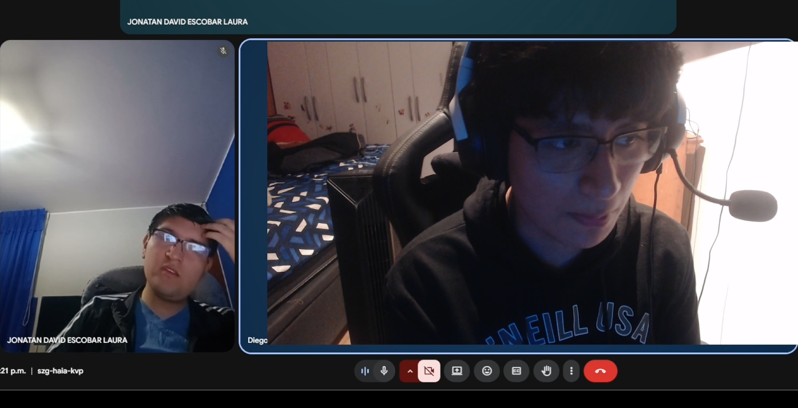
</a>

*(Haz clic en la imagen para reproducir el video completo en YouTube.)*

**Resumen de respuestas:**

| Pregunta | Respuesta |
| :--- | :--- |
| **¿Vives con la persona adulta mayor? ¿Con qué frecuencia la visitas?** | Vive con su familiar, por lo que el acompañamiento es diario y permanente. También realiza voluntariado con visitas presenciales varias veces por semana. |
| **¿Cuántos medicamentos distintos toma al día?** | Toma aproximadamente 5 medicamentos distintos al día. |
| **¿Quién organiza y prepara habitualmente sus medicamentos?** | Jonatan se encarga personalmente de la organización y preparación utilizando pastilleros semanales para evitar confusiones. |
| **¿Cómo se asegura actualmente de que tome sus medicamentos a la hora correcta?** | Utiliza un sistema mixto de alarmas en su propio celular y un calendario físico visible en casa para control de ambos. |
| **¿Se ha enterado alguna vez de un olvido o error en la toma?** | Sí; se dio cuenta al realizar la revisión visual del pastillero y notar que la dosis correspondiente aún estaba ahí. |
| **¿Qué tan preocupado se siente cuando no está presente?** | Siente una preocupación latente debido a su alta responsabilidad, especialmente cuando debe ir a la universidad o al voluntariado. |
| **¿Utiliza alguna aplicación, alarma o herramienta de seguimiento?** | Utiliza principalmente alarmas digitales y listas de verificación (checklists) en su celular. |
| **¿Le resultaría útil recibir notificaciones en su celular al confirmarse o fallar una toma?** | Definitivamente; le daría mucha tranquilidad poder confirmar el cumplimiento en tiempo real cuando no está en casa. |
| **¿Le gustaría configurar horarios y dosis desde una app móvil aunque estés lejos?** | Sí, sería la herramienta ideal para gestionar cambios en la receta médica de forma inmediata y remota. |
| **¿Qué tan valioso sería acceder a un historial compartible con el médico?** | Sumamente valioso, ya que permitiría al médico tomar decisiones basadas en datos reales y precisos sobre la adherencia. |
| **¿Estaría dispuesto a pagar por el dispositivo? ¿Rango de precio?** | Sí; sugiere un rango de entre S/ 100 y S/ 200, siempre que garantice la seguridad del paciente. |
| **¿Qué es lo más importante al elegir una solución de este tipo?** | Lo principal es la confiabilidad de las alertas, seguido por la facilidad de uso del sistema. |

### 2.2.3. Análisis de entrevistas

Esta sección sintetiza los hallazgos (insights) derivados de las entrevistas registradas en la sección 2.2.2, organizados por segmento objetivo. El análisis alimenta directamente las decisiones de diseño de Dosys y la validación de los Hypothesis Statements definidos en la sección 1.2.2.3.

**Análisis del Segmento 2 — Familiares y cuidadores**

*Basado en la entrevista a Sara Dávila (hija cuidadora, 49 años, Surco).*

**1. Dolor principal del usuario (pain points)**

El problema central detectado no es únicamente el olvido del horario, sino la **confusión con la dosis**. Las herramientas genéricas como Alexa cumplen la función de alertar que "es hora de la pastilla", pero no indican cuántas unidades ni cuáles medicamentos específicamente, lo que genera errores cada vez que el médico cambia la receta. A este problema operativo se suma una **carga emocional alta** (estrés y preocupación constante) vinculada a la importancia de medicamentos críticos como los antihipertensivos, en los que un error de toma tiene consecuencias directas sobre la salud del adulto mayor.

**2. Comportamiento y soluciones actuales**

La entrevistada es una usuaria **tecnológica** (usa Alexa) y **organizada** (elabora carteles visuales con horarios), lo que la perfila como *early adopter* ideal para una solución IoT. Sin embargo, su sistema actual es **desconectado**: no sabe en tiempo real si la enfermera o la nieta cumplieron efectivamente con la dosis mientras ella trabaja. Esta brecha de información representa la oportunidad clave para Dosys, ya que un dispositivo conectado puede cerrar el bucle entre la toma física del medicamento y la visibilidad remota del cuidador.

**3. Propuesta de valor validada para Dosys**

Para este perfil de cuidador (hijo/a que no vive con el adulto mayor), los puntos más atractivos identificados son:

- **Supervisión remota:** saber desde otro distrito o ciudad si el medicamento se tomó efectivamente.
- **Especificidad de la dosis:** que el sistema no solo emita una alerta genérica, sino que indique con claridad la cantidad y el compartimento exacto, eliminando errores humanos tras cambios de receta.
- **Historial médico compartible:** capacidad de llevar datos reales de adherencia a la siguiente consulta con el médico tratante.

Estos tres puntos validan directamente los Hypothesis Statements 2 y 3 (visibilidad remota del cumplimiento y especificidad del recordatorio multimodal) definidos en la sección 1.2.2.3.

**4. Viabilidad económica e insights de mercado**

- **Precio del dispositivo:** la usuaria espera que un producto especializado sea **más económico que un asistente generalista**, dado que una Alexa cuesta aproximadamente S/ 180. Ubica el precio de entrada de Dosys cerca de S/ 80 a S/ 100.
- **Modelo de suscripción:** validó un modelo SaaS con cobro mensual de S/ 30 a S/ 50, comparándolo con servicios básicos como agua o cable. Esto respalda la estrategia de ingresos recurrentes planteada en el modelo de negocio de Dosys.
- **Factor decisivo de compra:** por encima del diseño industrial o del precio, la **confiabilidad de las alertas** es el criterio más importante para elegir una solución. Si el sistema falla al alertar, pierde todo su valor percibido.

**Análisis del Segmento 1 — Adultos mayores polimedicados**

*Basado en la entrevista a Elizabeth Ramírez (adulta mayor polimedicada, 80 años, La Molina).*

**1. Perfil tecnológico y adaptabilidad de la interfaz**

A diferencia del cuidador, el adulto mayor de 80 años prefiere lo **tangible**: Elizabeth organiza sus medicamentos con papel y lápiz y no utiliza ninguna herramienta digital. Este hallazgo refuerza una decisión clave del diseño de Dosys: la interfaz destinada al usuario final (el adulto mayor) debe ser **física** —luces LED, mensajes por voz y botones de confirmación— y no depender de que el paciente maneje una aplicación móvil. La app móvil queda reservada para el cuidador, tal como se había planteado en los User Personas de la sección 2.3.1.

**2. Insight de producto: conservación ambiental de los fármacos**

Un hallazgo especialmente valioso es la **preocupación explícita por la conservación de los medicamentos** frente a factores ambientales. Elizabeth describe este problema de manera espontánea (sin que el entrevistador la guiara) y califica de "maravillosa" la idea de un dispositivo que monitoree temperatura y humedad. En distritos de Lima con alta humedad relativa, los fármacos guardados por tiempo prolongado (como el paracetamol que ella menciona) pueden degradarse silenciosamente. Este insight valida directamente el Hypothesis Statement relacionado con el **monitoreo ambiental** y respalda la inclusión de sensores de temperatura y humedad como una funcionalidad diferenciadora del producto, más allá del recordatorio básico.

**3. El factor "independencia vs. fragilidad"**

Elizabeth vive con su hija pero se encarga personalmente de su propia organización farmacológica. Al mismo tiempo, admite con claridad que "la mente es frágil" y que sin su papel se olvidaría. Esta tensión entre **deseo de autonomía** y **reconocimiento de su propia vulnerabilidad** representa la oportunidad emocional central de Dosys para el Segmento 1: el dispositivo le ofrece autonomía (no depender de que su hija le prepare el cronograma ni le recuerde cada dosis) y al mismo tiempo le retira la ansiedad de estar revisando el reloj constantemente. Dosys no compite contra su método actual; lo **dignifica y lo libera de la carga cognitiva**.

**4. Preferencia explícita por la confirmación física**

Elizabeth calificó como "excelente, lógico y más práctico" el botón físico de confirmación frente a una aplicación móvil compleja. Esta preferencia, expresada con convicción, valida de manera directa la decisión arquitectónica de Dosys de ubicar la **confirmación de dosis en el hardware del dispositivo** y no exclusivamente en la app del cuidador.

**Análisis comparativo entre segmentos — Sara vs. Elizabeth**

La combinación de ambas entrevistas permite contrastar las expectativas del cuidador y del adulto mayor sobre el mismo producto:

| Dimensión | Sara (Cuidadora, S2) | Elizabeth (Adulta Mayor, S1) |
| :---- | :---- | :---- |
| **Qué busca** | Control y datos | Simplicidad y seguridad |
| **Interfaz preferida** | App móvil con notificaciones e historial | Hardware físico con luces, voz y botones |
| **Preocupación principal** | Cumplimiento correcto de dosis y cambios de receta | Fragilidad de la memoria y conservación del medicamento |
| **Valor emocional** | Tranquilidad de saber remotamente | Autonomía sin ansiedad constante |
| **Feature más valorada** | Supervisión remota e historial compartible con el médico | Botón de confirmación físico + monitoreo ambiental |

**Conclusión del análisis para Dosys**

La validación cruzada es positiva: ambos segmentos confirman necesidades reales y no suposiciones del equipo. El producto es viable porque resuelve simultáneamente dos dolores distintos —el miedo al olvido del adulto mayor y la falta de visibilidad del cuidador— y añade un valor inesperado pero bien recibido: el **monitoreo ambiental** de los medicamentos. Desde la perspectiva de la arquitectura de software, este resultado justifica una **arquitectura de dos capas complementarias**: (i) una interfaz física robusta embebida en el hardware del dispositivo para el paciente y (ii) una plataforma de monitoreo remoto en la nube, accedida por aplicación móvil, para el cuidador. Ambas capas son necesarias —ninguna es suficiente por sí sola— y esta conclusión guía directamente los Bounded Contexts definidos en el Capítulo IV.

## 2.3. Needfinding
### 2.3.1. User Personas

A partir del análisis de los segmentos objetivo definidos en la sección 1.3, se elaboraron dos User Personas que representan los perfiles principales de usuario de Dosys: el adulto mayor polimedicado (usuario final del dispositivo) y el cuidador familiar (usuario principal de la aplicación y habitualmente el decisor de compra). Ambas personas fueron construidas con la herramienta UXPressia.

**User Persona 1 — Rosa Jiménez Vargas (Adulto Mayor Polimedicado)**

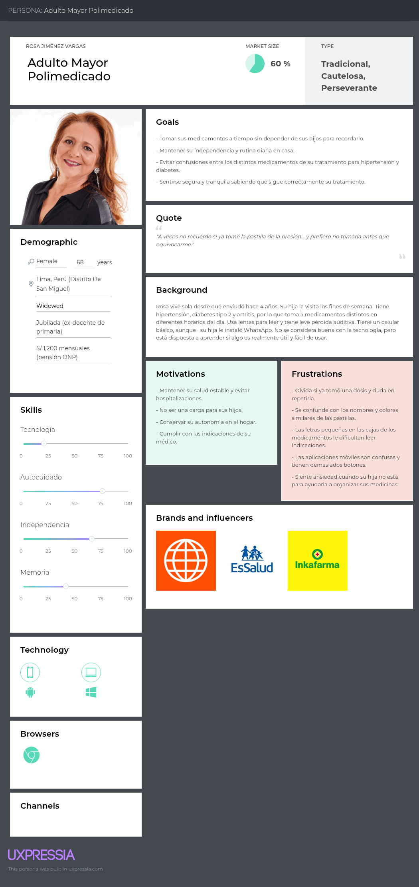

Rosa representa al segmento S1: adultos mayores de 60 años o más con tratamientos farmacológicos crónicos que interactúan directamente con el hardware del pastillero Dosys. Sus objetivos, motivaciones y frustraciones guían las decisiones de accesibilidad física del dispositivo (recordatorio multimodal por voz, LED y botones).

**User Persona 2 — Carlos Mendoza Ríos (Cuidador Familiar)**

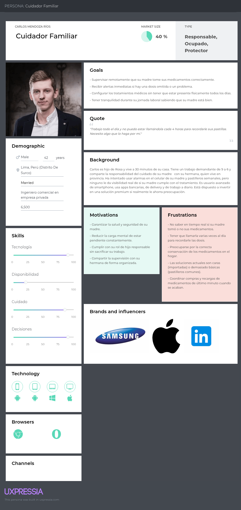

Carlos representa al segmento S2: familiares y cuidadores de adultos mayores polimedicados que configuran los tratamientos, supervisan el cumplimiento remoto y reciben alertas a través de la aplicación móvil. Sus necesidades orientan el diseño de la experiencia digital, las notificaciones y el monitoreo remoto.

### 2.3.2. User Task Matrix

La siguiente matriz identifica las tareas que los segmentos objetivo de Dosys realizan actualmente en relación con la gestión de medicamentos, independientemente de la existencia del producto. Se evalúa la frecuencia (Alta, Media, Baja) y la importancia (Alta, Media, Baja) de cada tarea para cada segmento.

Los segmentos considerados son:
- **Segmento 1 (S1):** Adultos mayores con tratamientos farmacológicos crónicos.
- **Segmento 2 (S2):** Familiares y cuidadores de adultos mayores polimedicados.

<table>
  <tr>
    <th rowspan="2">Tarea</th>
    <th colspan="2" style="text-align:center;">Adulto Mayor (S1)</th>
    <th colspan="2" style="text-align:center;">Cuidador / Familiar (S2)</th>
  </tr>
  <tr>
    <th>Frecuencia</th>
    <th>Importancia</th>
    <th>Frecuencia</th>
    <th>Importancia</th>
  </tr>
  <tr>
    <td>Recordar qué medicamento tomar en cada horario</td>
    <td>Alta</td>
    <td>Alta</td>
    <td>Alta</td>
    <td>Alta</td>
  </tr>
  <tr>
    <td>Identificar el medicamento correcto entre varios disponibles</td>
    <td>Alta</td>
    <td>Alta</td>
    <td>Media</td>
    <td>Alta</td>
  </tr>
  <tr>
    <td>Tomar la dosis en el horario indicado</td>
    <td>Alta</td>
    <td>Alta</td>
    <td>Media</td>
    <td>Alta</td>
  </tr>
  <tr>
    <td>Organizar los medicamentos en un pastillero o contenedor</td>
    <td>Media</td>
    <td>Alta</td>
    <td>Alta</td>
    <td>Alta</td>
  </tr>
  <tr>
    <td>Verificar que se tomó la dosis correspondiente</td>
    <td>Alta</td>
    <td>Media</td>
    <td>Alta</td>
    <td>Alta</td>
  </tr>
  <tr>
    <td>Supervisar el cumplimiento del tratamiento del familiar</td>
    <td>Baja</td>
    <td>Baja</td>
    <td>Alta</td>
    <td>Alta</td>
  </tr>
  <tr>
    <td>Revisar si hay medicamento suficiente para los próximos días</td>
    <td>Media</td>
    <td>Media</td>
    <td>Media</td>
    <td>Alta</td>
  </tr>
  <tr>
    <td>Comprar o reponer medicamentos antes de que se agoten</td>
    <td>Baja</td>
    <td>Alta</td>
    <td>Media</td>
    <td>Alta</td>
  </tr>
  <tr>
    <td>Almacenar los medicamentos en condiciones adecuadas (temperatura, humedad)</td>
    <td>Baja</td>
    <td>Media</td>
    <td>Baja</td>
    <td>Media</td>
  </tr>
  <tr>
    <td>Consultar el horario o esquema del tratamiento</td>
    <td>Media</td>
    <td>Media</td>
    <td>Media</td>
    <td>Media</td>
  </tr>
  <tr>
    <td>Comunicar al cuidador si olvidó o retrasó una dosis</td>
    <td>Media</td>
    <td>Alta</td>
    <td>Media</td>
    <td>Alta</td>
  </tr>
  <tr>
    <td>Registrar o actualizar los medicamentos y horarios tras una consulta médica</td>
    <td>Baja</td>
    <td>Alta</td>
    <td>Baja</td>
    <td>Alta</td>
  </tr>
  <tr>
    <td>Limpiar o vaciar compartimentos al finalizar un tratamiento</td>
    <td>Baja</td>
    <td>Media</td>
    <td>Baja</td>
    <td>Media</td>
  </tr>
</table>

**Tareas con mayor relevancia para ambos segmentos:**

Las tareas que presentan alta frecuencia y alta importancia en ambos segmentos son las que Dosys prioriza en su propuesta de valor:

- **Recordar qué medicamento tomar en cada horario:** Es la tarea más crítica y frecuente. Dosys la aborda mediante el recordatorio multimodal (voz + LED + botón).
- **Tomar la dosis en el horario indicado:** Directamente vinculada a la adherencia terapéutica. Dosys facilita esta tarea con alertas programadas y confirmación física.
- **Verificar que se tomó la dosis correspondiente:** Es de alta importancia para el cuidador. Dosys la resuelve con el registro de confirmaciones y notificaciones remotas de dosis omitidas.
- **Organizar los medicamentos en un pastillero:** Tarea que recae principalmente en el cuidador. Dosys la simplifica con cinco compartimentos diferenciados y configuración guiada desde la aplicación.


### 2.3.3. User Journey Mapping

A partir de las User Personas definidas en la sección 2.3.1, se elaboraron User Journey Maps con la herramienta UXPressia para describir el recorrido de cada segmento objetivo frente a la gestión de medicamentos. Esta sección incorpora tres niveles de análisis para cada persona: primero, el **Journey Map general** ya elaborado en UXPressia; segundo, el **AS-IS Journey Map**, que representa la situación actual antes de adoptar Dosys; y tercero, el **TO-BE Journey Map**, que representa la experiencia esperada al interactuar con la solución.

El uso de mapas AS-IS permite identificar las fricciones reales que viven los usuarios antes de contar con el producto, como olvidos, inseguridad, falta de trazabilidad y dependencia de recordatorios manuales. Por otro lado, los mapas TO-BE permiten visualizar cómo Dosys transforma esa experiencia mediante alertas multimodales, confirmación física de tomas, monitoreo remoto, control de stock y coordinación entre el adulto mayor y su cuidador.

**User Journey Map 1 — Rosa Jiménez Vargas (Adulto Mayor Polimedicado)**

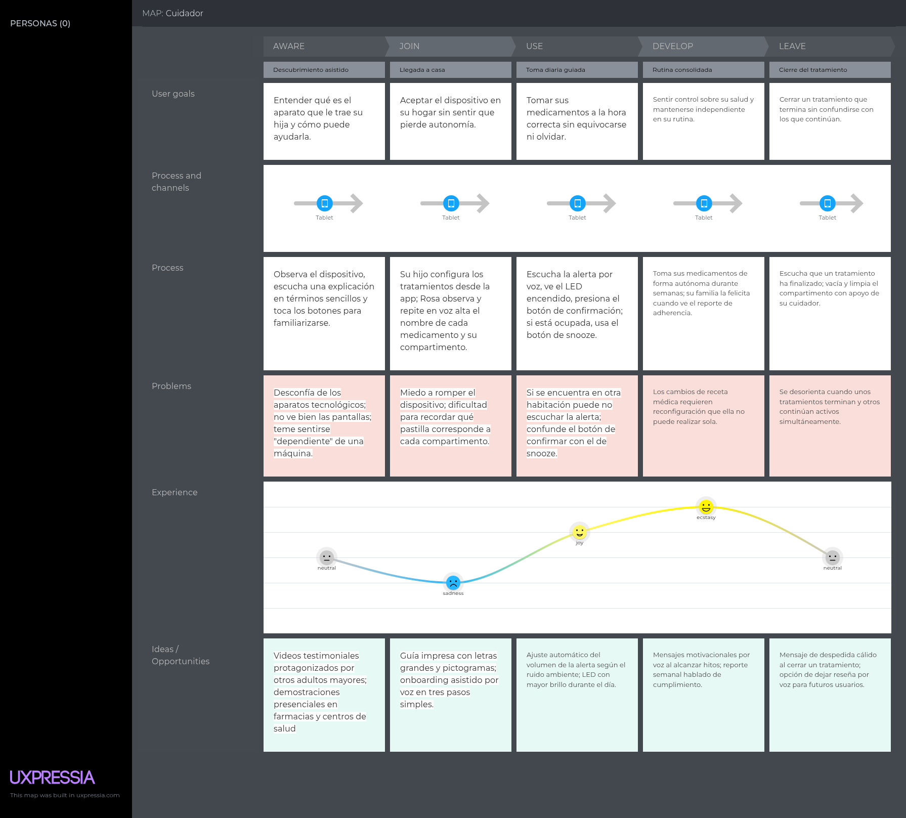

El journey map general de Rosa Jiménez Vargas representa la experiencia completa que Dosys busca entregar a una adulta mayor polimedicada a lo largo de cinco etapas del ciclo de vida: **Aware** (descubrimiento), **Join** (incorporación), **Use** (uso cotidiano), **Develop** (consolidación del uso) y **Leave** (cierre o renovación). En este recorrido se identifican los objetivos, canales, procesos, problemas, emociones y oportunidades asociadas a la adopción del dispositivo.

La curva emocional de Rosa parte de la **curiosidad cauta** en AWARE, desciende al punto más bajo de **ansiedad y abrumamiento** en JOIN —cuando debe aceptar un dispositivo tecnológico dentro de su rutina diaria— y asciende progresivamente hasta alcanzar su pico de **orgullo y empoderamiento** en DEVELOP, cuando ha consolidado una rutina autónoma de adherencia. Este patrón evidencia que el momento crítico del diseño es la etapa JOIN: el onboarding del adulto mayor debe ser multimodal, guiado por voz y acompañado por el cuidador.

**AS-IS User Journey Map 1 — Rosa Jiménez Vargas (Adulto Mayor Polimedicado)**

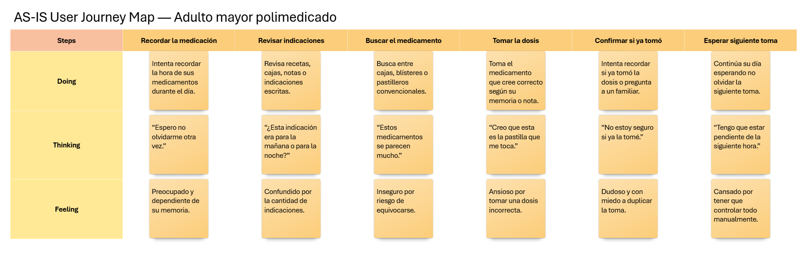

El AS-IS Journey Map de Rosa representa la situación actual de una adulta mayor que gestiona su medicación sin una solución IoT de apoyo. Su recorrido depende de la memoria, recetas físicas, cajas de medicamentos, notas, alarmas genéricas y ayuda ocasional de familiares. Esta experiencia genera inseguridad porque no existe una confirmación objetiva de la toma ni una guía clara que indique qué medicamento corresponde en cada horario.

El mayor problema se presenta al identificar el medicamento correcto y recordar si la dosis ya fue tomada. Esta situación incrementa el riesgo de omisión, duplicación o confusión entre medicamentos similares. Por ello, el principal hallazgo para el segmento S1 es que la solución no debe limitarse a emitir recordatorios, sino que debe guiar físicamente la acción mediante señales claras, como luz LED, voz y botón de confirmación.

**TO-BE User Journey Map 1 — Rosa Jiménez Vargas (Adulto Mayor Polimedicado)**

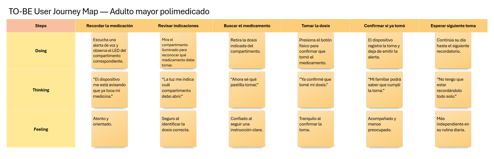

El TO-BE Journey Map de Rosa representa la experiencia esperada cuando la adulta mayor incorpora Dosys en su rutina diaria. En este escenario, el dispositivo actúa como una guía física de adherencia terapéutica: emite alertas de voz, ilumina el compartimento correcto, permite confirmar la toma con un botón y reduce la incertidumbre sobre si una dosis fue tomada o no.

Este recorrido evidencia que Dosys debe permitir que Rosa mantenga autonomía sin exigirle el uso constante de una aplicación móvil. La interacción principal debe ocurrir desde el dispositivo físico, con instrucciones simples, señales visibles y retroalimentación inmediata. El objetivo del producto para este segmento no es solo técnico, sino también emocional: reducir la ansiedad asociada a la polifarmacia y restaurar la sensación de control sobre su propio tratamiento.

**User Journey Map 2 — Carlos Mendoza Ríos (Cuidador Familiar)**

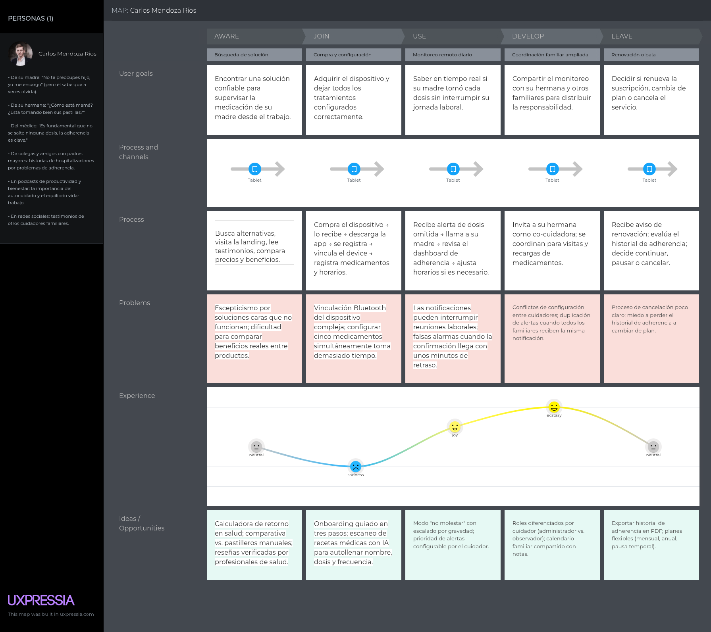

El journey map general de Carlos Mendoza Ríos representa la experiencia completa del cuidador familiar al adoptar Dosys como herramienta de supervisión remota. A diferencia de Rosa, Carlos no se relaciona principalmente con el dispositivo físico, sino con la aplicación y con los datos que esta le permite consultar para validar adherencia, stock y alertas relevantes.

La curva emocional de Carlos tiene su punto más bajo en JOIN, cuando enfrenta la complejidad técnica del setup inicial. El pico se alcanza en DEVELOP, cuando puede compartir la responsabilidad del cuidado con otros familiares y dejar de sentirse solo en la gestión de la salud de su madre. Esto revela que para el segmento S2 la promesa de valor no se completa únicamente con el monitoreo remoto en USE, sino con la **coordinación familiar distribuida** en DEVELOP.

**AS-IS User Journey Map 2 — Carlos Mendoza Ríos (Cuidador Familiar)**

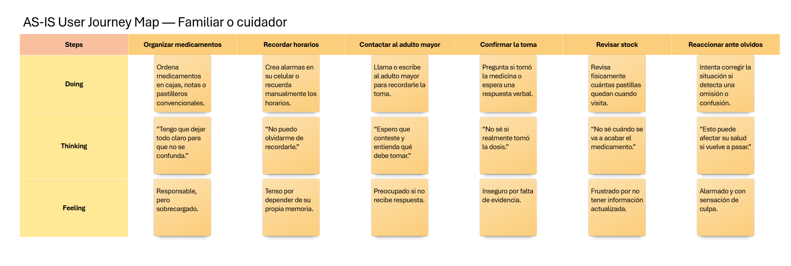

El AS-IS Journey Map de Carlos representa la experiencia actual de un familiar o cuidador que supervisa la medicación de un adulto mayor sin visibilidad remota ni trazabilidad digital. En este escenario, Carlos debe organizar medicamentos, recordar horarios, llamar o escribir al adulto mayor, verificar verbalmente si tomó la dosis y revisar físicamente el stock cuando realiza una visita.

Este recorrido evidencia una carga operativa y emocional constante. Carlos no solo debe recordar la rutina de otra persona, sino también comprobar manualmente si se cumplió. La falta de datos en tiempo real genera incertidumbre, especialmente cuando el adulto mayor no responde llamadas, olvida informar una toma o no puede explicar con claridad qué medicamento consumió.

El principal hallazgo para el segmento S2 es que el problema no se limita a organizar el tratamiento, sino a la ausencia de evidencia confiable. El cuidador necesita saber si la toma ocurrió, si hubo omisiones, si queda stock suficiente y si el entorno de almacenamiento es adecuado. Esta necesidad justifica el diseño de una aplicación con dashboard, alertas, historial de adherencia y monitoreo del dispositivo.

**TO-BE User Journey Map 2 — Carlos Mendoza Ríos (Cuidador Familiar)**

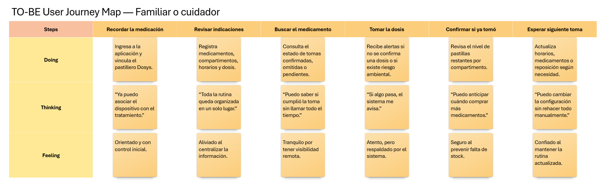

El TO-BE Journey Map de Carlos representa la experiencia esperada cuando el cuidador utiliza Dosys para configurar tratamientos, monitorear adherencia y recibir información remota sobre el estado del adulto mayor. En este escenario, Carlos deja de depender exclusivamente de llamadas, mensajes o visitas presenciales, y pasa a contar con una plataforma digital que centraliza la gestión del tratamiento.

Este recorrido evidencia que Dosys reduce tanto la carga operativa como la carga emocional del cuidador. La aplicación permite registrar medicamentos, asociarlos a compartimentos, configurar horarios, consultar tomas confirmadas, revisar omisiones, monitorear stock y recibir alertas relevantes. La etapa JOIN sigue siendo crítica, pero por una razón distinta a la de Rosa: aquí el riesgo no es la ansiedad emocional ante el dispositivo, sino el abandono por fricción técnica durante la configuración inicial. Por ello, el onboarding del cuidador debe ser claro, guiado y orientado a completar rápidamente la primera configuración funcional del dispositivo.

**Hallazgos clave del contraste entre AS-IS y TO-BE**

El contraste entre los mapas AS-IS y TO-BE evidencia que Dosys debe resolver dos tipos de fricción: la fricción cognitiva del adulto mayor y la fricción operativa del cuidador. En el caso de Rosa, el problema actual se concentra en recordar, identificar y confirmar correctamente cada dosis. En el caso de Carlos, el problema se concentra en supervisar a distancia, verificar el cumplimiento y coordinar responsabilidades sin depender de llamadas constantes o visitas presenciales.

En ambos segmentos, la etapa de incorporación es el mayor punto de riesgo. Para Rosa, JOIN representa ansiedad ante la adopción de un dispositivo nuevo; para Carlos, JOIN representa fricción técnica al configurar medicamentos, horarios y compartimentos. Por ello, el onboarding debe diseñarse como una experiencia dual: simple, física y guiada por voz para el adulto mayor; clara, estructurada y asistida desde la aplicación para el cuidador.

El pico de valor en ambos recorridos no aparece durante el primer uso, sino cuando Dosys se integra a una rutina sostenible. Para Rosa, esto se traduce en mayor autonomía y tranquilidad. Para Carlos, se traduce en menor carga mental, mayor visibilidad remota y posibilidad de compartir la responsabilidad con otros familiares. Esto confirma que la solución no debe limitarse a emitir recordatorios, sino también registrar eventos, generar confianza y sostener una rutina familiar de cuidado.

Finalmente, los mapas confirman que Dosys requiere una experiencia conectada entre hardware, aplicación y servicios backend. El dispositivo físico debe ser comprensible para el adulto mayor; la aplicación debe ser útil para el cuidador; y la arquitectura técnica debe garantizar sincronización, trazabilidad y disponibilidad de la información necesaria para ambos segmentos.


### 2.3.4. Empathy Mapping

A partir de las User Personas definidas en la sección 2.3.1, se elaboraron dos Empathy Maps con la herramienta UXPressia para profundizar en las experiencias, pensamientos, emociones y comportamientos de cada segmento objetivo en su estado actual (AS-IS), es decir, antes de adoptar una solución como Dosys. Estos mapas permiten identificar los dolores reales que justifican la propuesta de valor y las ganancias esperadas que Dosys debe entregar.

**Empathy Map 1 — Rosa Jiménez Vargas (Adulto Mayor Polimedicado)**

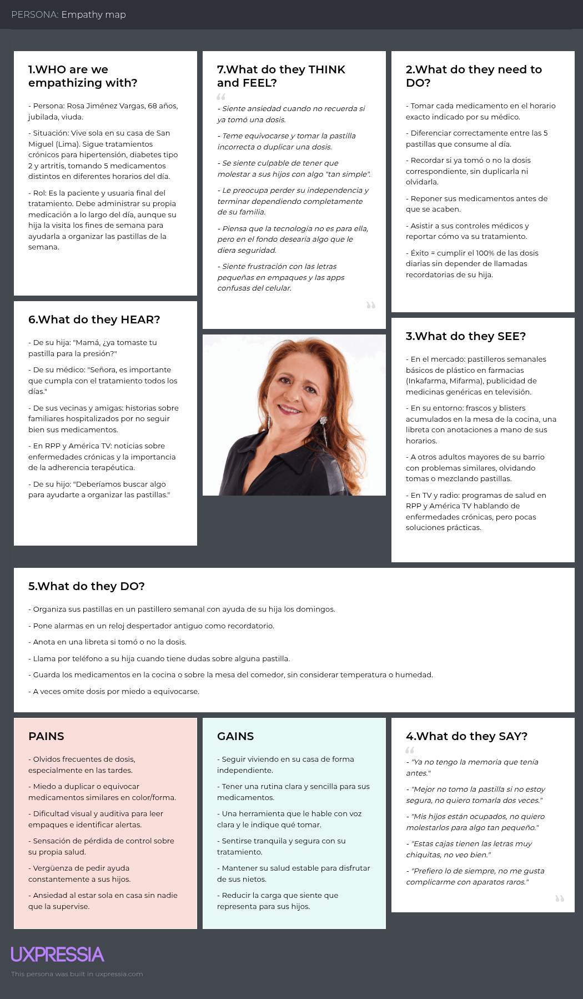

El empathy map de Rosa revela una experiencia marcada por la ansiedad ante los olvidos, el miedo a equivocarse con medicamentos similares y la tensión entre su deseo de mantenerse independiente y la necesidad creciente de apoyo familiar. Sus dolores principales —olvidos frecuentes, dificultades visuales y auditivas, pérdida de control sobre su salud— validan directamente la necesidad del recordatorio multimodal (voz, LED, botón físico) planteado en el Hypothesis Statement 1.

**Empathy Map 2 — Carlos Mendoza Ríos (Cuidador Familiar)**

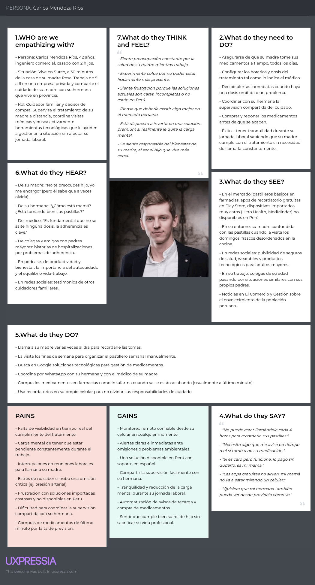

El empathy map de Carlos expone la carga mental del cuidador remoto: preocupación constante durante su jornada laboral, culpa por no estar físicamente presente y frustración con las soluciones actuales del mercado. Sus ganancias esperadas —monitoreo remoto en tiempo real, alertas inmediatas, coordinación familiar compartida— sustentan las funcionalidades de la aplicación móvil de Dosys y validan los Hypothesis Statements 2, 3 y 4 relacionados con visibilidad remota, monitoreo ambiental y avisos de recarga.

**Hallazgos clave del contraste entre ambos empathy maps:**

- Rosa experimenta *soledad y pérdida de autonomía*, mientras Carlos siente *carga mental y culpa por la distancia*. Dosys debe resolver ambos dolores simultáneamente mediante la combinación hardware + aplicación.
- Los canales por los que escuchan información son distintos: Rosa consume medios tradicionales (radio, TV, vecinas), mientras Carlos utiliza canales digitales (redes sociales, podcasts, colegas). Esto valida la estrategia de marketing dual definida en el análisis competitivo.
- Los dolores identificados en ambos empathy maps se alinean directamente con los cuatro Hypothesis Statements del Lean UX, confirmando que las hipótesis del producto apuntan a necesidades reales y no a suposiciones del equipo.

## 2.4. Big Picture EventStorming


## 2.5. Ubiquitous Language

El siguiente glosario define los términos clave utilizados de manera consistente por todo el equipo de desarrollo de Dosys, tanto en la comunicación interna como en el código fuente, la documentación y la interfaz del producto. Su propósito es eliminar ambigüedades entre los dominios de salud, IoT y cuidado del adulto mayor.

| Término (EN) | Término (ES) | Definición |
| :---- | :---- | :---- |
| **Medication** | Medicamento | Fármaco recetado o de uso regular que el adulto mayor debe tomar según un esquema terapéutico definido. Cada medicamento se registra en el sistema con nombre, dosis, frecuencia y duración del tratamiento. |
| **Compartment** | Compartimento | Cada una de las cinco divisiones físicas del pastillero Dosys donde se almacena un medicamento específico. Un compartimento se asocia a un único medicamento dentro de un tratamiento activo. |
| **Treatment** | Tratamiento | Conjunto de reglas que define qué medicamento tomar, en qué compartimento se encuentra, a qué hora corresponde cada dosis, durante cuántos días y con qué frecuencia. Es configurado por el cuidador o el propio usuario desde la aplicación. |
| **Dose** | Dosis | Unidad mínima de toma de un medicamento en un momento específico del día. Cada dosis tiene un horario programado y está vinculada a un compartimento del dispositivo. |
| **Reminder** | Recordatorio | Evento que se activa cuando llega el horario programado de una dosis. Se manifiesta de forma multimodal: reproducción de un mensaje de voz, encendido del LED del compartimento correspondiente y habilitación del botón de confirmación. |
| **Confirmation** | Confirmación | Acción realizada por el adulto mayor al presionar el botón físico del compartimento correspondiente tras recibir un recordatorio, indicando que ha tomado la dosis. |
| **Snooze** | Repetición de alerta | Acción realizada por el adulto mayor al presionar el botón de repetir, lo que pospone el recordatorio por un intervalo de tiempo definido antes de volver a emitir la alerta. |
| **Missed Dose** | Dosis omitida | Dosis que no fue confirmada dentro del período de tiempo permitido después del recordatorio. Genera una notificación al cuidador a través de la aplicación. |
| **Caregiver** | Cuidador | Persona responsable de supervisar y apoyar el tratamiento del adulto mayor. Puede ser un familiar, un cuidador profesional o cualquier persona designada. Utiliza la aplicación para configurar tratamientos, recibir notificaciones y monitorear el cumplimiento. |
| **Patient** | Paciente | Adulto mayor que utiliza el dispositivo Dosys para recibir recordatorios y confirmar la toma de sus medicamentos. Interactúa principalmente con el hardware del pastillero. |
| **Device** | Dispositivo | El pastillero inteligente Dosys como unidad de hardware. Incluye los cinco compartimentos, LEDs, altavoz, botones físicos y los sensores de temperatura y humedad. Cada dispositivo se vincula a una cuenta de usuario en la aplicación. |
| **Environmental Monitoring** | Monitoreo ambiental | Funcionalidad del dispositivo que mide continuamente la temperatura y humedad del entorno donde se almacenan los medicamentos mediante sensores integrados, con el fin de detectar condiciones que puedan comprometer su conservación. |
| **Environmental Alert** | Alerta ambiental | Notificación generada cuando los sensores del dispositivo detectan que la temperatura o humedad del entorno excede los umbrales recomendados para la conservación segura de medicamentos. |
| **Refill Alert** | Alerta de recarga | Notificación que indica que un compartimento está próximo a quedarse sin medicamento, calculada a partir de la cantidad registrada y la frecuencia de toma configurada en el tratamiento. |
| **Purchase Reminder** | Aviso de compra | Notificación anticipada que sugiere al cuidador o usuario adquirir más unidades de un medicamento antes de que se agote la reserva en el compartimento. |
| **End-of-Treatment Alert** | Alerta de fin de tratamiento | Notificación que indica que un tratamiento ha llegado a su fecha de finalización programada y que el compartimento correspondiente debe ser vaciado o limpiado. |
| **Adherence** | Adherencia | Grado en que el paciente cumple con el esquema de medicación programado. Se mide a través del porcentaje de dosis confirmadas respecto al total de dosis programadas en un período determinado. |
| **Polypharmacy** | Polifarmacia | Condición en la que el paciente debe tomar múltiples medicamentos de manera simultánea o en distintos horarios del día, lo que incrementa la complejidad del tratamiento y el riesgo de errores. |
| **Multimodal Reminder** | Recordatorio multimodal | Estrategia de alerta que combina múltiples canales sensoriales (voz, luz LED, vibración o botón físico) para maximizar la probabilidad de que el adulto mayor perciba y responda al recordatorio. |
| **Bounded Context** | Contexto delimitado | División lógica del sistema en dominios independientes con responsabilidades bien definidas. En Dosys se identifican tres contextos: Access (gestión de usuarios y autenticación), Medication (gestión de tratamientos y dosis) y Device (gestión del hardware y sensores IoT). |
| **LED Indicator** | Indicador LED | Luz individual asociada a cada compartimento del dispositivo que se enciende cuando corresponde tomar el medicamento almacenado en ese compartimento, facilitando la identificación visual. |
| **Voice Alert** | Alerta por voz | Mensaje de audio reproducido por el altavoz del dispositivo que indica al paciente qué medicamento tomar en el momento del recordatorio programado. |

# Capítulo III: Requirements Specification

## 3.1. User Stories

<table border="1">
  <thead>
    <tr>
      <th>Epic/Story ID</th>
      <th>Título</th>
      <th>Descripción</th>
      <th>Criterios de aceptación</th>
      <th>Relacionado con (Epic ID)</th>
    </tr>
  </thead>
  <tbody>
    <tr>
      <td>EP01</td>
      <td>Presencia Digital y Captación</td>
      <td colspan="3">El sistema debe proporcionar una plataforma web informativa para dar a conocer la solución Dosys.</td>
    </tr>
    <tr>
      <td>US01</td>
      <td>Información del Producto</td>
      <td>Como visitante de la Landing Page, quiero visualizar las características principales de Dosys, para entender los beneficios del pastillero inteligente.</td>
      <td>Given que el visitante se encuentra en la página de inicio, When navega por la sección de características, Then visualiza información sobre recordatorios de voz, LEDs y monitoreo ambiental.</td>
      <td>EP01</td>
    </tr>
    <tr>
      <td>US02</td>
      <td>Formulario de Contacto</td>
      <td>Como visitante interesado, quiero enviar mis datos a través de un formulario, para recibir asesoría personalizada sobre el producto.</td>
      <td>Given que el visitante completa los campos obligatorios, When solicita el envío de la información, Then el sistema confirma la recepción exitosa del mensaje.</td>
      <td>EP01</td>
    </tr>
    <tr>
      <td>EP02</td>
      <td>Gestión de Accesos (Contexto Access)</td>
      <td colspan="3">El sistema debe permitir la administración segura de cuentas de usuario y la vinculación de dispositivos.</td>
    </tr>
    <tr>
      <td>US03</td>
      <td>Registro de Cuidador</td>
      <td>Como cuidador, quiero crear una cuenta en la aplicación, para empezar a gestionar el tratamiento de mi familiar.</td>
      <td>Given que el usuario no tiene una cuenta, When ingresa un correo electrónico válido y una contraseña segura, Then el sistema crea el perfil y envía un correo de verificación.</td>
      <td>EP02</td>
    </tr>
    <tr>
      <td>TS01</td>
      <td>API de Autenticación</td>
      <td>Como Developer, quiero implementar un endpoint de login, para validar las credenciales de los usuarios mediante JWT.</td>
      <td>Given un request POST con credenciales válidas, When el servicio procesa la solicitud, Then el servidor responde con un status 200 y un token de acceso.</td>
      <td>EP02</td>
    </tr>
    <tr>
      <td>US04</td>
      <td>Vinculación IoT</td>
      <td>Como cuidador, quiero vincular el pastillero físico mediante un código identificador, para que la app pueda enviar configuraciones al hardware.</td>
      <td>Given que el dispositivo está encendido, When el usuario registra el ID único en la app, Then el sistema establece una conexión lógica entre la cuenta y el hardware.</td>
      <td>EP02</td>
    </tr>
    <tr>
      <td>EP03</td>
      <td>Gestión de Tratamientos (Contexto Medication)</td>
      <td colspan="3">El sistema debe administrar los horarios, dosis y asignación de compartimentos de medicamentos.</td>
    </tr>
    <tr>
      <td>US05</td>
      <td>Registro de Medicina</td>
      <td>Como cuidador, quiero registrar un nuevo medicamento en el sistema, para tenerlo disponible en la configuración del tratamiento.</td>
      <td>Given que el cuidador conoce el nombre del fármaco, When ingresa el nombre y la presentación, Then el sistema guarda la medicina en el catálogo personal.</td>
      <td>EP03</td>
    </tr>
    <tr>
      <td>US06</td>
      <td>Programación de Dosis</td>
      <td>Como cuidador, quiero definir la hora y frecuencia de una toma, para que el paciente reciba los recordatorios oportunamente.</td>
      <td>Given un medicamento seleccionado, When el usuario asigna un horario (ej. 08:00 AM) y una frecuencia, Then el sistema genera el calendario de tomas correspondiente.</td>
      <td>EP03</td>
    </tr>
    <tr>
      <td>US07</td>
      <td>Asignación de Compartimento</td>
      <td>Como cuidador, quiero asignar un medicamento a uno de los 5 compartimentos físicos, para que el LED correcto se encienda durante la toma.</td>
      <td>Given un tratamiento activo, When el usuario selecciona un número de compartimento (1 al 5), Then el sistema vincula físicamente la medicina con esa sección del pastillero.</td>
      <td>EP03</td>
    </tr>
    <tr>
      <td>TS02</td>
      <td>API de Sincronización de Calendario</td>
      <td>Como Developer, quiero un endpoint que entregue el calendario de tomas al dispositivo, para que el hardware funcione de forma offline.</td>
      <td>Given una solicitud GET desde el dispositivo identificado, When existen cambios en el tratamiento, Then el servicio retorna un JSON con el cronograma actualizado de 24 horas.</td>
      <td>EP03</td>
    </tr>
    <tr>
      <td>US08</td>
      <td>Consulta de Adherencia</td>
      <td>Como cuidador, quiero ver un historial de dosis tomadas y omitidas, para monitorear el cumplimiento del tratamiento.</td>
      <td>Given que existen registros de tomas previas, When el usuario consulta el reporte semanal, Then el sistema muestra el porcentaje de cumplimiento sobre el total programado.</td>
      <td>EP03</td>
    </tr>
    <tr>
      <td>EP04</td>
      <td>Interacción con Hardware (Contexto Device)</td>
      <td colspan="3">El sistema debe gestionar las alertas físicas y los datos recolectados por los sensores IoT.</td>
    </tr>
    <tr>
      <td>US09</td>
      <td>Alerta Multimodal</td>
      <td>Como paciente, quiero escuchar un mensaje de voz y ver una luz LED cuando sea hora de mi medicina, para identificar qué debo tomar sin confusión.</td>
      <td>Given que se alcanza la hora programada para una dosis, When el reloj interno coincide con el horario, Then el dispositivo reproduce el audio y enciende el LED del compartimento asignado.</td>
      <td>EP04</td>
    </tr>
    <tr>
      <td>US10</td>
      <td>Confirmación de Toma</td>
      <td>Como paciente, quiero presionar un botón físico tras ingerir la pastilla, para que el sistema registre mi cumplimiento.</td>
      <td>Given que una alerta está activa, When el paciente presiona el botón del compartimento, Then el LED se apaga y el dispositivo registra la confirmación de la dosis.</td>
      <td>EP04</td>
    </tr>
    <tr>
      <td>US11</td>
      <td>Monitoreo de Humedad</td>
      <td>Como cuidador, quiero recibir una alerta si la humedad del ambiente sube, para evitar que las pastillas se degraden.</td>
      <td>Given que el sensor de humedad detecta un valor superior al 65%, When el sistema procesa el dato, Then se envía una notificación push de advertencia al smartphone del cuidador.</td>
      <td>EP04</td>
    </tr>
    <tr>
      <td>US12</td>
      <td>Alerta de Temperatura</td>
      <td>Como cuidador, quiero ser notificado si el pastillero está expuesto a calor excesivo, para cambiarlo de lugar y proteger los fármacos.</td>
      <td>Given que la temperatura registrada supera los 30°C, When el dispositivo reporta el dato, Then el sistema genera una alerta ambiental crítica.</td>
      <td>EP04</td>
    </tr>
    <tr>
      <td>TS03</td>
      <td>Ingesta de Datos de Sensores</td>
      <td>Como Developer, quiero un endpoint que reciba datos de telemetría (temp/hum), para almacenar el histórico ambiental del dispositivo.</td>
      <td>Given un request POST con datos de sensores y timestamp, When la firma del dispositivo es válida, Then el servicio persiste la información y retorna un status 201.</td>
      <td>EP04</td>
    </tr>
    <tr>
      <td>US13</td>
      <td>Alerta de Recarga</td>
      <td>Como cuidador, quiero un aviso cuando queden pocas pastillas en un compartimento, para reponer el stock a tiempo.</td>
      <td>Given que el número de dosis confirmadas reduce el stock a 3 unidades, When se procesa la última confirmación, Then el sistema notifica la necesidad de recarga.</td>
      <td>EP03</td>
    </tr>
    <tr>
      <td>US14</td>
      <td>Posponer Alerta (Snooze)</td>
      <td>Como paciente, quiero silenciar la alarma por 5 minutos, para tomar la medicina después si estoy ocupado en ese instante.</td>
      <td>Given que la alerta está sonando, When el paciente presiona el botón de repetición, Then el audio se detiene y se reactiva automáticamente tras 5 minutos.</td>
      <td>EP04</td>
    </tr>
    <tr>
      <td>US15</td>
      <td>Ajuste de Volumen</td>
      <td>Como cuidador, quiero regular el volumen del pastillero desde la app, para adaptarlo a la capacidad auditiva del paciente.</td>
      <td>Given que el dispositivo está online, When el usuario modifica el nivel de volumen en la aplicación, Then el hardware actualiza su configuración de salida de audio inmediatamente.</td>
      <td>EP04</td>
    </tr>
    <tr>
      <td>US16</td>
      <td>Sección de Beneficios (Landing)</td>
      <td>Como visitante del segmento "Cuidadores", quiero leer testimonios y casos de éxito, para confiar en la eficacia de Dosys.</td>
      <td>Given que el visitante navega hacia la sección de testimonios, When interactúa con los elementos de la página, Then visualiza experiencias reales de otros usuarios.</td>
      <td>EP01</td>
    </tr>
    <tr>
      <td>US17</td>
      <td>Registro de Alergias</td>
      <td>Como cuidador, quiero documentar alergias en el perfil del paciente, para tener una referencia rápida en caso de emergencia médica.</td>
      <td>Given que el perfil del paciente está activo, When el usuario añade una sustancia a la lista de alergias, Then el sistema actualiza la ficha médica digital.</td>
      <td>EP02</td>
    </tr>
    <tr>
      <td>TS04</td>
      <td>Health Check del Dispositivo</td>
      <td>Como Developer, quiero implementar un "Heartbeat", para saber si el dispositivo ha perdido conexión a internet.</td>
      <td>Given que el dispositivo no envía señales por más de 10 minutos, When el servicio de monitoreo detecta la inactividad, Then marca el estado del hardware como "Offline" en la base de datos.</td>
      <td>EP04</td>
    </tr>
    <tr>
      <td>US18</td>
      <td>Notificación Offline</td>
      <td>Como cuidador, quiero saber si el pastillero pierde conexión, para verificar si mi familiar está recibiendo las alertas adecuadamente.</td>
      <td>Given que el estado del dispositivo cambia a "Offline", When se detecta la pérdida de señal, Then el sistema envía una alerta de "Desconexión" al cuidador.</td>
      <td>EP04</td>
    </tr>
    <tr>
      <td>US19</td>
      <td>Fin de Tratamiento</td>
      <td>Como cuidador, quiero una alerta cuando un tratamiento finaliza, para limpiar el compartimento y dejarlo disponible.</td>
      <td>Given que se ha alcanzado la fecha final programada, When se cumple el último horario de toma, Then el sistema notifica que el compartimento debe ser vaciado.</td>
      <td>EP03</td>
    </tr>
    <tr>
      <td>US20</td>
      <td>Visualización de Precio (Landing)</td>
      <td>Como visitante, quiero conocer los planes de adquisición del producto, para evaluar la compra según mi presupuesto.</td>
      <td>Given que el visitante accede a la sección de precios, When selecciona un modelo de dispositivo, Then visualiza el costo único y los servicios incluidos.</td>
      <td>EP01</td>
    </tr>
    <tr>
      <td>TS05</td>
      <td>API de Notificaciones Push</td>
      <td>Como Developer, quiero integrar un servicio de mensajería (Firebase), para despachar alertas en tiempo real a los dispositivos móviles.</td>
      <td>Given un evento crítico (dosis omitida o alerta ambiental), When el bus de eventos detecta el mensaje, Then el servicio envía el payload al token del dispositivo móvil correspondiente.</td>
      <td>EP02</td>
    </tr>
    <tr>
      <td>US21</td>
      <td>Recuperación de Contraseña</td>
      <td>Como cuidador, quiero solicitar un enlace de cambio de clave, para recuperar el acceso si olvido mis credenciales.</td>
      <td>Given que el usuario ingresa su correo en la sección de olvido de clave, When solicita el restablecimiento, Then el sistema envía un token temporal de un solo uso por email.</td>
      <td>EP02</td>
    </tr>
    <tr>
      <td>US22</td>
      <td>Reporte de Temperatura (App)</td>
      <td>Como cuidador, quiero ver un gráfico de la temperatura del pastillero de las últimas 24 horas, para asegurar que el ambiente es estable.</td>
      <td>Given que existen datos de telemetría, When el usuario abre la pestaña de "Ambiente", Then el sistema genera una gráfica con las fluctuaciones térmicas registradas.</td>
      <td>EP04</td>
    </tr>
    <tr>
      <td>US23</td>
      <td>Soporte Técnico (Landing)</td>
      <td>Como visitante con dudas técnicas, quiero acceder a una sección de Preguntas Frecuentes (FAQ), para resolver problemas comunes de instalación.</td>
      <td>Given que el visitante ingresa al pie de página, When selecciona el enlace de Soporte, Then visualiza una lista de soluciones a problemas técnicos frecuentes.</td>
      <td>EP01</td>
    </tr>
  </tbody>
</table>

## 3.2. Impact Mapping
El Impact Mapping es una técnica de planificación estratégica que permite al equipo visualizar la relación entre los objetivos de negocio, los actores involucrados, los cambios de comportamiento esperados y los entregables que el producto debe desarrollar para provocar dichos cambios. Para Dosys, esta herramienta resulta especialmente útil porque conecta la propuesta de valor del pastillero inteligente con metas concretas y medibles, evitando el desarrollo de funcionalidades que no contribuyan directamente a los resultados esperados.

La elaboración del Impact Mapping se realizó en la plataforma UXPressia, utilizando como punto de partida las fichas de User Persona definidas en la sección 2.3.1: Rosa Jiménez Vargas (Segmento 1: adulto mayor polimedicada) y Carlos Mendoza Ríos (Segmento 2: cuidador familiar). Se identificaron cuatro Business Goals con criterios SMART, cada uno orientado a una dimensión distinta del modelo de negocio digital de Dosys: ventas, adopción, adherencia y retención.

**Business Goal 1 — Ventas:** Vender 200 unidades del dispositivo Dosys en Lima Metropolitana durante los primeros 6 meses de lanzamiento comercial, con un ticket promedio de S/. 350. Este objetivo se vincula al segmento de cuidadores familiares en su rol de decisores de compra. Para alcanzarlo, se espera que los visitantes conozcan la propuesta de valor del producto a través de la landing page, consulten precios y testimonios, y soliciten información de compra. Los deliverables asociados comprenden la landing page informativa con sus secciones de características, beneficios, precios y formulario de contacto.


**Business Goal 2 — Adopción:** Alcanzar 150 cuidadores activos registrados en la aplicación con al menos un tratamiento configurado y un dispositivo vinculado, dentro de los primeros 8 meses. Este objetivo requiere que los cuidadores completen el proceso de onboarding de forma autónoma: crear su cuenta, emparejar el pastillero físico y programar el primer tratamiento. Los deliverables que habilitan estos impactos son el módulo de registro y vinculación IoT, y el módulo de gestión de tratamientos con programación de dosis y asignación de compartimentos.


**Business Goal 3 — Adherencia:** Lograr que el 80% de los usuarios activos confirmen al menos el 80% de sus dosis programadas durante su primer mes de uso del dispositivo Dosys. Este es el objetivo central del producto y se vincula directamente con el segmento de adultos mayores. Para alcanzarlo, se espera que Rosa confirme cada toma presionando el botón físico al recibir la alerta multimodal, pueda posponer la alerta en caso de estar ocupada, y escuche el recordatorio con claridad según su nivel auditivo. Los deliverables son el pastillero inteligente con alertas de voz, LED y botón físico, la función snooze y el control de volumen remoto desde la app.


**Business Goal 4 — Retención:** Retener al 70% de los cuidadores activos a los 3 meses de uso, medido por acceso semanal a la aplicación y continuidad del tratamiento configurado. Para sostener el uso continuo de la plataforma, se espera que Carlos consulte el historial de adherencia semanalmente, reaccione ante alertas ambientales y de conectividad, y gestione el ciclo de vida de cada tratamiento sin interrupciones. Los deliverables asociados incluyen el dashboard de adherencia y reportes, el sistema de monitoreo ambiental IoT con notificaciones push, y el sistema de alertas de inventario y fin de tratamiento.

## 3.3. Product Backlog

<table border="1">
  <thead>
    <tr>
      <th># Orden</th>
      <th>User Story Id</th>
      <th>Título</th>
      <th>Descripción</th>
      <th>Story Points</th>
    </tr>
  </thead>
  <tbody>
    <tr><td>1</td><td>US01</td><td>Información del Producto</td><td>Como visitante de la Landing Page, quiero visualizar las características de Dosys, para entender los beneficios del producto.</td><td>2</td></tr>
    <tr><td>2</td><td>US16</td><td>Sección de Beneficios</td><td>Como cuidador visitante, quiero leer testimonios y casos de éxito, para confiar en la eficacia de la solución.</td><td>3</td></tr>
    <tr><td>3</td><td>US20</td><td>Visualización de Precio</td><td>Como visitante, quiero conocer los planes de adquisición, para evaluar la compra según mi presupuesto.</td><td>1</td></tr>
    <tr><td>4</td><td>US02</td><td>Formulario de Contacto</td><td>Como visitante interesado, quiero enviar mis datos, para recibir asesoría personalizada.</td><td>2</td></tr>
    <tr><td>5</td><td>US09</td><td>Alerta Multimodal</td><td>Como paciente, quiero escuchar un mensaje de voz y ver un LED, para identificar mi medicina sin confusión.</td><td>8</td></tr>
    <tr><td>6</td><td>US10</td><td>Confirmación de Toma</td><td>Como paciente, quiero presionar un botón físico tras ingerir la pastilla, para registrar mi cumplimiento.</td><td>5</td></tr>
    <tr><td>7</td><td>US05</td><td>Registro de Medicina</td><td>Como cuidador, quiero registrar un fármaco en el sistema, para tenerlo disponible en la configuración.</td><td>3</td></tr>
    <tr><td>8</td><td>US06</td><td>Programación de Dosis</td><td>Como cuidador, quiero definir la hora y frecuencia de una toma, para que el paciente reciba recordatorios.</td><td>5</td></tr>
    <tr><td>9</td><td>US07</td><td>Asignación de Compartimento</td><td>Como cuidador, quiero asignar una medicina a un compartimento físico (1-5), para vincular el hardware.</td><td>3</td></tr>
    <tr><td>10</td><td>US11</td><td>Monitoreo de Humedad</td><td>Como cuidador, quiero alertas si la humedad sube, para evitar que las pastillas se degraden.</td><td>5</td></tr>
    <tr><td>11</td><td>US12</td><td>Alerta de Temperatura</td><td>Como cuidador, quiero avisos si hay calor excesivo, para proteger la integridad química de los fármacos.</td><td>5</td></tr>
    <tr><td>12</td><td>US13</td><td>Alerta de Recarga</td><td>Como cuidador, quiero un aviso cuando queden pocas pastillas, para reponer el stock a tiempo.</td><td>3</td></tr>
    <tr><td>13</td><td>US14</td><td>Posponer Alerta (Snooze)</td><td>Como paciente, quiero silenciar la alarma por 5 minutos, para tomar la medicina después si estoy ocupado.</td><td>3</td></tr>
    <tr><td>14</td><td>US08</td><td>Consulta de Adherencia</td><td>Como cuidador, quiero ver un historial de dosis, para monitorear el cumplimiento del familiar.</td><td>5</td></tr>
    <tr><td>15</td><td>US22</td><td>Reporte de Temperatura</td><td>Como cuidador, quiero ver un gráfico térmico de las últimas 24h, para asegurar que el ambiente es estable.</td><td>5</td></tr>
    <tr><td>16</td><td>US15</td><td>Ajuste de Volumen</td><td>Como cuidador, quiero regular el volumen del pastillero desde la app, para adaptarlo a la audición del paciente.</td><td>2</td></tr>
    <tr><td>17</td><td>US19</td><td>Fin de Tratamiento</td><td>Como cuidador, quiero una alerta cuando el tratamiento termina, para limpiar el compartimento.</td><td>2</td></tr>
    <tr><td>18</td><td>US03</td><td>Registro de Cuidador</td><td>Como cuidador, quiero crear una cuenta, para empezar a gestionar el dispositivo.</td><td>3</td></tr>
    <tr><td>19</td><td>US04</td><td>Vinculación IoT</td><td>Como cuidador, quiero vincular el hardware mediante ID único, para que la app controle el pastillero.</td><td>5</td></tr>
    <tr><td>20</td><td>US21</td><td>Recuperación de Contraseña</td><td>Como cuidador, quiero solicitar un enlace de cambio de clave, para recuperar mi acceso.</td><td>2</td></tr>
    <tr><td>21</td><td>US17</td><td>Registro de Alergias</td><td>Como cuidador, quiero documentar alergias en el perfil, para tener una referencia en emergencias.</td><td>1</td></tr>
    <tr><td>22</td><td>US18</td><td>Notificación Offline</td><td>Como cuidador, quiero saber si el pastillero pierde conexión, para verificar el estado del sistema.</td><td>3</td></tr>
    <tr><td>23</td><td>US23</td><td>Soporte Técnico (FAQ)</td><td>Como visitante con dudas, quiero acceder a preguntas frecuentes, para resolver problemas de instalación.</td><td>2</td></tr>
  </tbody>
</table>

# Capítulo IV: Solution Software Design

## 4.1. Strategic-Level Domain-Driven Design

### 4.1.1. Design-Level EventStorming

A continuación se presentan los resultados del proceso de EventStorming realizado para el diseño de la arquitectura de Dosys. Este proceso se llevó a cabo con el objetivo de identificar los distintos Bounded Contexts del sistema, los eventos de dominio que ocurren a lo largo del ciclo de vida del tratamiento y los flujos de mensajes que atraviesan las fronteras de cada contexto. El modelado nos permitió alinear la visión de negocio, garantizar la adherencia a la medicación del adulto mayor, con las decisiones técnicas de la solución IoT.

#### 4.1.1.1. Candidate Context Discovery

Tomando como base el Domain-Driven Design, realizamos todo el proceso de EventStorming en una pizarra colaborativa de Miro. De este modo, partiendo de la exploración libre de eventos, fuimos refinando el modelo hasta llegar a identificar los Bounded Contexts que componen Dosys: Access, Medication y Device.

Para ello llevamos a cabo una sesión grupal, con una duración aproximada de 2 horas, en la que todo el equipo identificó de forma consensuada los eventos, comandos, políticas, agregados y sistemas externos del dominio. El proceso siguió los diez pasos clásicos de la técnica, que se documentan a continuación.

**Paso 1: Unstructured Exploration**

Comenzamos con una lluvia de ideas desestructurada en la que cada integrante escribió, en notas naranjas y redactados en pasado, todos los eventos de dominio que se le ocurrían sin preocuparse por el orden. Aquí surgieron hechos como Cuidador registrado, Dispositivo vinculado, Tratamiento activado, Recordatorio generado, Dosis confirmada, Dosis omitida, Condición ambiental anómala detectada, Stock bajo detectado y Tratamiento finalizado. El objetivo de este paso fue capturar la mayor cantidad posible de eventos relevantes del negocio antes de imponer cualquier estructura.

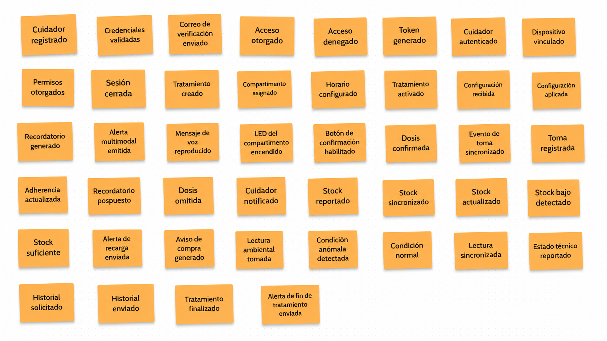

**Paso 2: Timelines**

Una vez recolectados los eventos, los ordenamos cronológicamente de izquierda a derecha para construir la línea de tiempo del sistema. De esta organización emergieron de forma natural los grandes flujos de Dosys: la configuración inicial del tratamiento por parte del cuidador, el ciclo de vida de la dosis (recordatorio, confirmación, posposición y omisión), el monitoreo ambiental y de stock, y el fin del tratamiento. Este paso permitió visualizar la secuencia real con la que ocurren los hechos en el dominio.

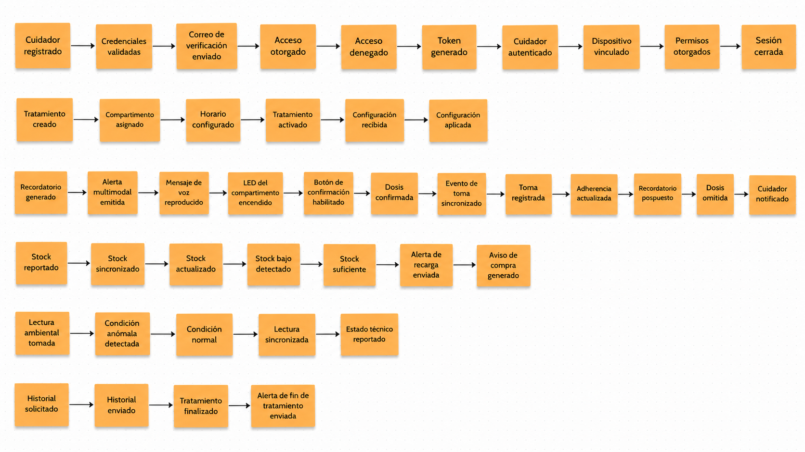

**Paso 3: Pain Points**

Sobre la línea de tiempo marcamos, con notas rojas rotadas, los puntos de dolor, dudas y conflictos detectados. Entre los principales identificamos: cómo distinguir una dosis omitida de una simple desconexión del dispositivo, cuál debe ser la duración de la ventana de confirmación antes de marcar una omisión, qué umbrales de temperatura y humedad disparan una alerta ambiental, y cómo manejar la sincronización entre la Edge API y la REST API ante una pérdida de conexión. Estos puntos calientes orientaron las decisiones de diseño posteriores.

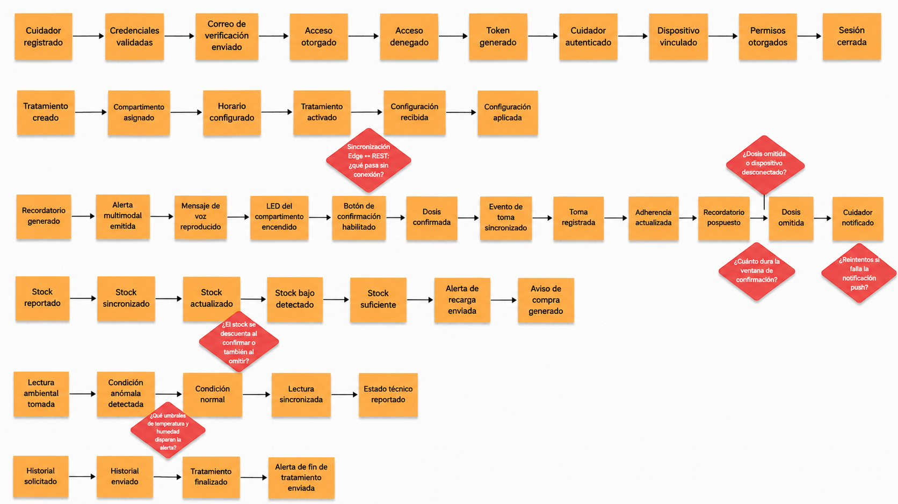

**Paso 4: Pivotal Points**

A continuación señalamos los eventos pivote, es decir, aquellos que dividen el flujo en fases claramente diferenciadas y que suelen marcar transiciones de responsabilidad entre contextos. Para Dosys identificamos como pivotes: Tratamiento activado (cierra la configuración e inicia la operación), Alerta multimodal emitida (abre la ventana de interacción con el paciente), Dosis omitida (dispara el protocolo de notificación al cuidador) y Condición ambiental anómala detectada (activa el flujo de alertas preventivas). Estos eventos se delimitaron con barras verticales sobre la línea de tiempo.

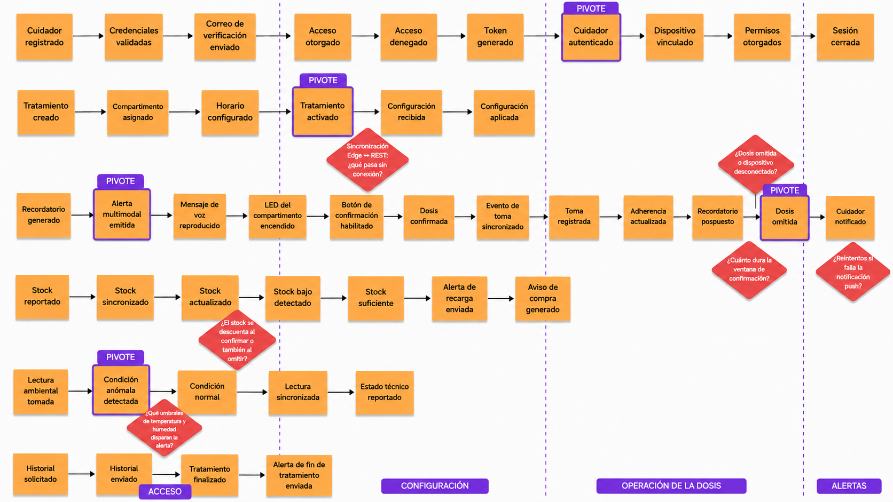

**Paso 5: Commands**

En este paso incorporamos los comandos (notas azules) que originan cada evento, junto con los actores (notas amarillas) que los ejecutan. Identificamos al Cuidador como actor principal de la configuración (Registrar cuidador, Crear tratamiento, Configurar horario, Activar tratamiento) y al Paciente como actor del ciclo de toma a través del hardware (Confirmar dosis, Posponer recordatorio). De esta forma, cada evento quedó vinculado a la acción imperativa que lo provoca.

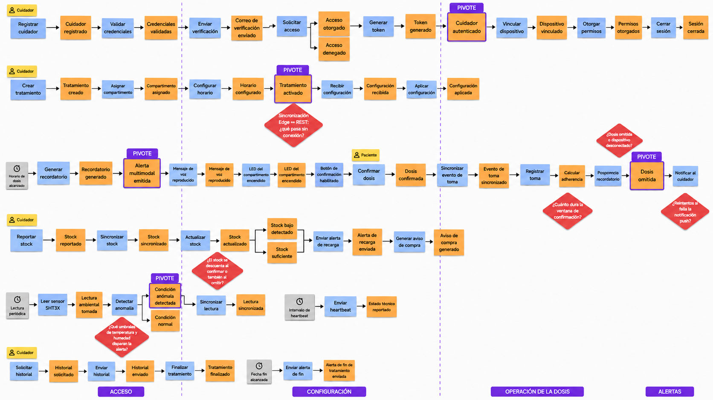

**Paso 6: Policies**

Posteriormente añadimos las políticas (notas lilas), que representan la lógica reactiva del sistema bajo la forma "cuando ocurre un evento, entonces se dispara un comando". Las políticas más relevantes de Dosys son: cuando llega el horario de una dosis → generar recordatorio, cuando se genera un recordatorio → emitir alerta multimodal, cuando vence la ventana sin confirmación → marcar la dosis como omitida, cuando una dosis es omitida → notificar al cuidador, cuando se detecta una condición ambiental anómala → enviar alerta ambiental y cuando hay stock bajo → enviar alerta de recarga y generar aviso de compra.

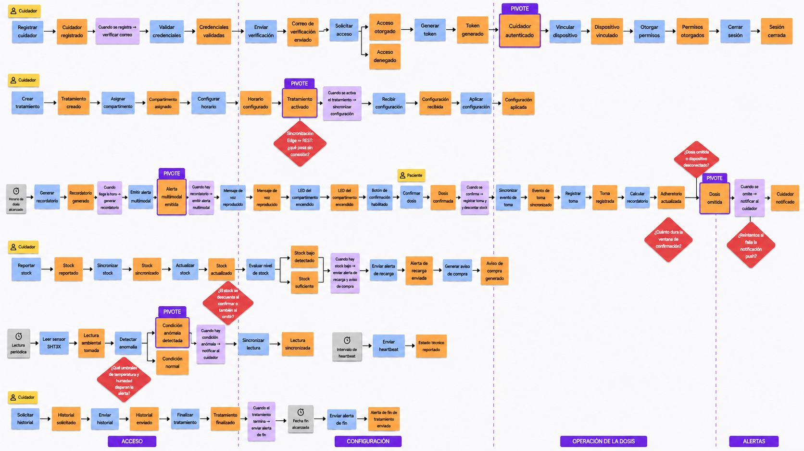

**Paso 7: Read Models**

Luego identificamos los modelos de lectura (notas verdes), que corresponden a la información que los actores consultan para tomar decisiones. En Dosys los principales read models son el Panel de adherencia (porcentaje de cumplimiento del tratamiento), el Historial de tomas, el Estado del dispositivo (conexión y batería), la Lectura ambiental actual y su historial, el Nivel de stock por compartimento y el Centro de alertas. Estos modelos alimentan tanto la aplicación del cuidador como la retroalimentación del propio dispositivo.

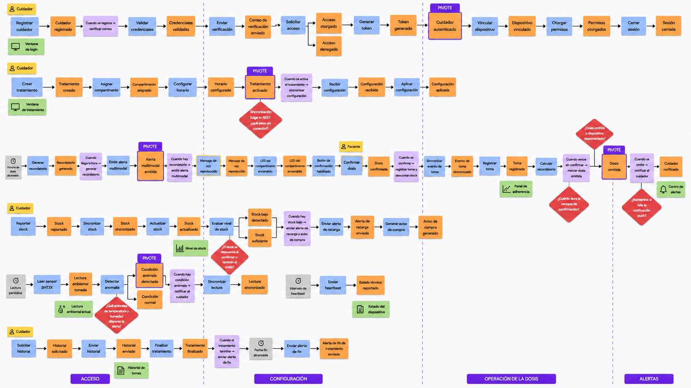

**Paso 8: External Systems**

En este paso incorporamos los sistemas externos (notas rosas) con los que interactúa Dosys en sus fronteras. Identificamos el Servicio de correo, utilizado para la verificación de cuentas durante el registro del cuidador, y el Servicio de notificaciones push (FCM), encargado de entregar al dispositivo móvil del cuidador las alertas de dosis omitida, condiciones ambientales anómalas, recarga y fin de tratamiento.

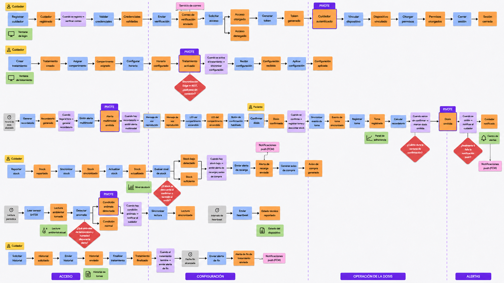

**Paso 9: Aggregates**

A continuación agrupamos comandos y eventos alrededor de sus agregados (notas amarillas grandes), que constituyen las fronteras de consistencia del modelo. Los agregados identificados, alineados con el modelo táctico, fueron: User, RefreshToken y DeviceAccess para el manejo de identidad; Treatment, MedicationContainer, MedicationSchedule e IntakeRecord para la lógica de tratamientos y dosis; y DeviceProfile, DeviceConfigurationSnapshot, EnvironmentReading, DeviceIntakeEvent, StockEvent y DeviceHeartbeat para la operación del hardware.

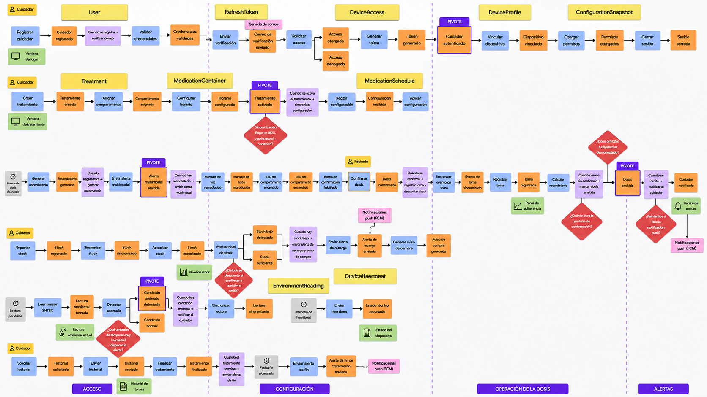

**Paso 10: Bounded Contexts**

Finalmente, sintetizamos los flujos y agregados anteriores para delimitar los Bounded Contexts del sistema. Se definieron tres contextos principales: Access, responsable de la autenticación de cuidadores, la gestión de sesiones y la vinculación de dispositivos; Medication, núcleo del negocio que orquesta los tratamientos, el ciclo de vida de la dosis, la adherencia y el control de stock; y Device, encargado del control del hardware IoT, la telemetría ambiental y la sincronización Edge ↔ REST.

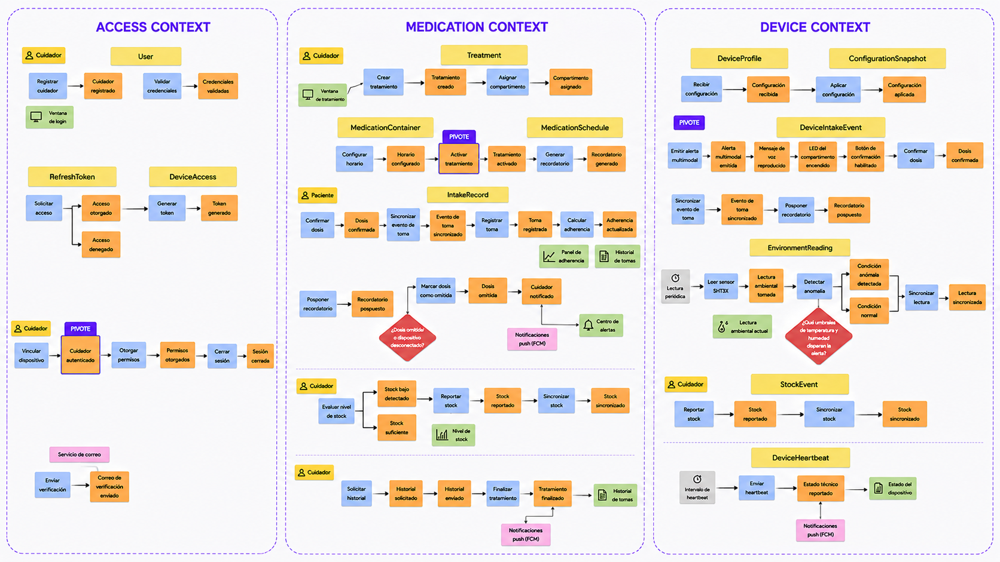

#### 4.1.1.2. Domain Message Flows Modeling

En esta sección se visualiza la interacción entre los **Bounded Contexts** y los actores del sistema mediante la técnica de **Domain Storytelling**. A diferencia del modelado de eventos, aquí nos enfocamos en la narrativa de los mensajes y cómo los flujos de información atraviesan las fronteras de cada contexto para cumplir con los objetivos del usuario.
El diagrama presenta el escenario de "Notificación y Confirmación de Dosis", donde se evidencia la coordinación entre el hardware (Device), el motor de reglas (Medication) y el usuario final.

<div align="center">
  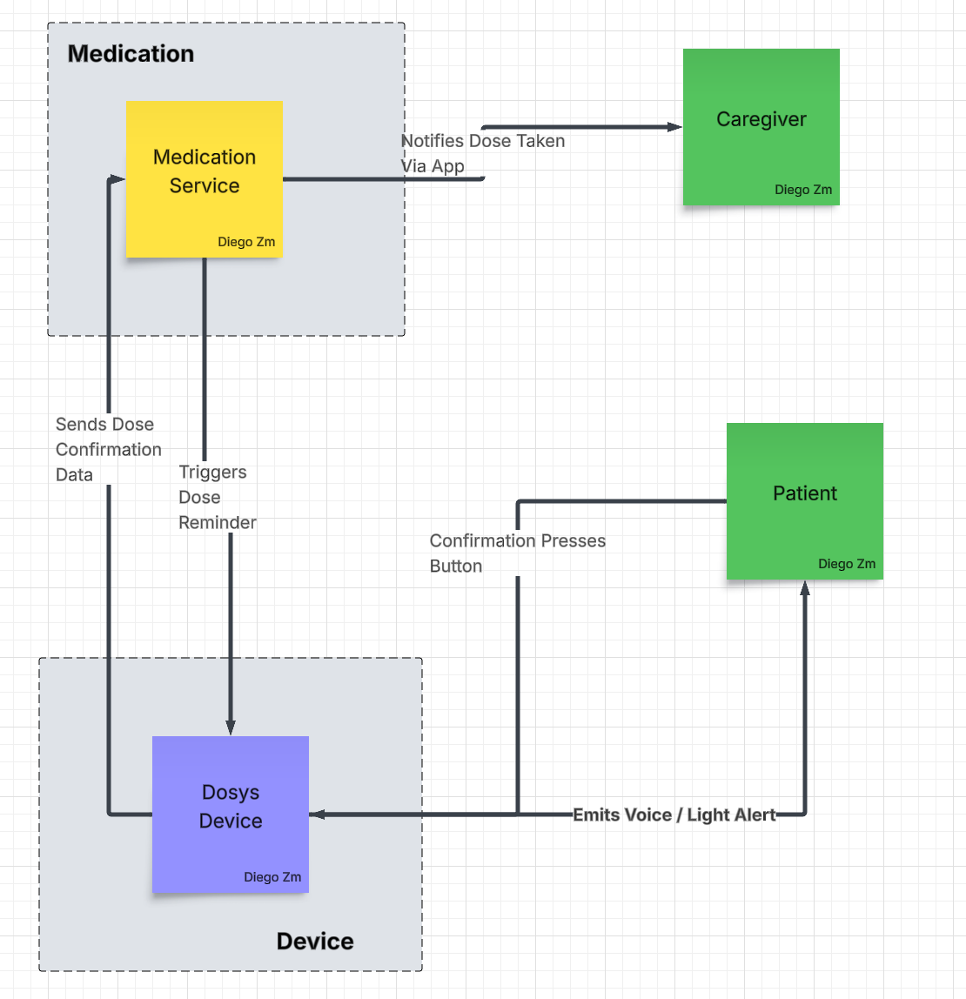
  <p><i>Enlace de LucidChart: https://lucid.app/lucidchart/20e81f45-c84d-4f8e-9b12-497449d56f40/edit?viewport_loc=1151%2C-3591%2C5338%2C6595%2C0_0&invitationId=inv_31eb482c-fdb4-41c2-9e05-561a08de57ad</i></p>
</div>

#### 4.1.1.3. Bounded Context Canvases

Los siguientes diagramas presentan los Bounded Context Canvases de Dosys. Cada canvas detalla con mayor profundidad la naturaleza de cada contexto, incluyendo su clasificación estratégica, los roles de dominio, su comunicación entrante y saliente, el lenguaje ubicuo específico y las principales reglas y decisiones de negocio que lo gobiernan.

**Access Context Canvas**

El contexto Access se encarga de la autenticación de los cuidadores, la gestión de sesiones seguras mediante tokens y la vinculación de cada dispositivo Dosys a una cuenta con sus respectivos permisos de monitoreo. Estratégicamente se clasifica como un *Generic Subdomain*, ya que la gestión de identidad es una capacidad transversal y estandarizada; su rol es el de un contexto de acceso (gateway) que protege al resto del sistema.

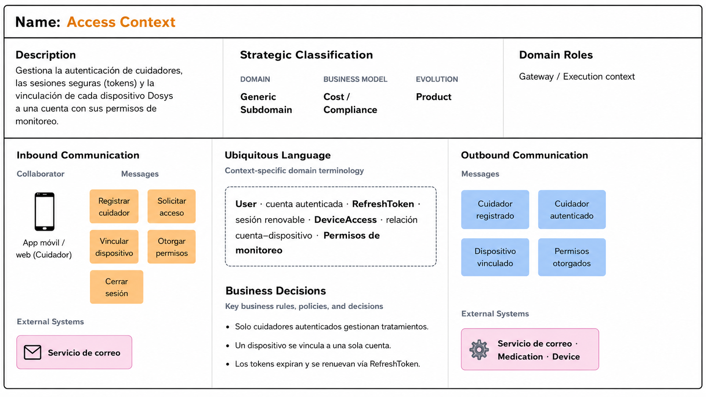

**Medication Context Canvas**

El contexto Medication constituye el *Core Domain* de Dosys. Orquesta la creación y activación de tratamientos, la configuración de horarios, el ciclo de vida completo de la dosis (recordatorio, confirmación, posposición y omisión), el cálculo de la adherencia y el control de stock con sus respectivas alertas de recarga. Es el contexto que concentra el mayor valor de negocio y, por tanto, el que justifica la inversión de mayor esfuerzo de diseño.

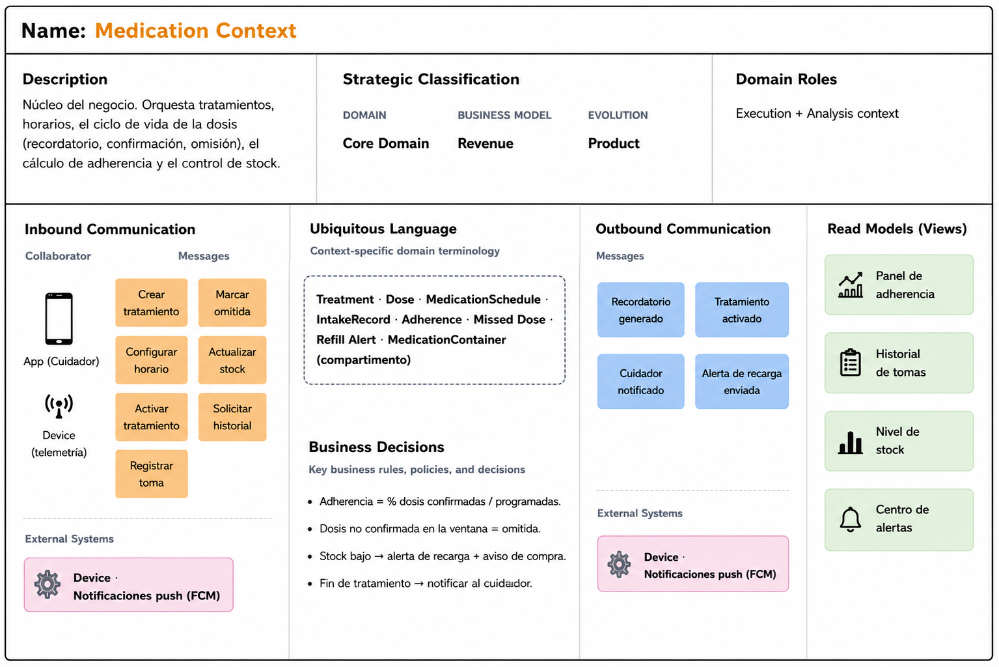

**Device Context Canvas**

El contexto Device gestiona el hardware IoT del pastillero: la recepción y aplicación de la configuración runtime, la emisión de las alertas multimodales (voz, LED y botón), la telemetría ambiental a través del sensor SHT3X, el registro de los eventos de toma generados por el botón físico y la sincronización de la información entre la Edge API y la REST API. Se clasifica como parte del *Core Domain*, dado que el dispositivo físico es el diferenciador central de la propuesta de valor.

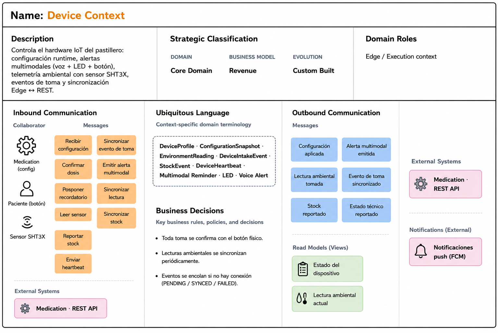


#### 4.1.2. Context Mapping
Durante el proceso de modelado del dominio para Dosys, identificamos tres Bounded Contexts principales: **Access**, **Medication** y **Device**. A partir de esta base, realizamos una serie de reflexiones y escenarios de reestructuración para evaluar cómo deberían relacionarse las capacidades del sistema y qué tipo de relación resultaba más coherente entre cada par de contextos. A continuación, explicamos el proceso seguido y las alternativas consideradas.

**Análisis de Contextos:**

- _Medication ↔ Device_: Existe una fuerte dependencia bidireccional. Por un lado, Medication decide los tratamientos y horarios, y Device debe ejecutar esas decisiones (recibir la configuración y emitir las alertas multimodales). Por otro lado, Device actúa como proveedor de la telemetría —confirmaciones de toma, niveles de stock y lecturas ambientales— que Medication consume para su lógica de adherencia y alertas. Aquí se establece una relación de tipo Customer/Supplier, donde Medication es el cliente que consume los datos del dispositivo, complementada con un patrón Conformist en el que Device acepta el modelo de configuración que Medication le impone.

- _Access ↔ Todos los contextos_: Access es un contexto transversal que provee autenticación, identidad y permisos a todo el sistema. Aquí es viable aplicar un patrón Shared Kernel con Medication, dado que ambos comparten el modelo de la cuenta del cuidador y la relación cuidador–dispositivo para autorizar la gestión de tratamientos, o un patrón Conformist con Device, que simplemente acepta las credenciales y reglas de acceso impuestas por Access para autenticar el hardware.

- _Device ↔ Paciente_: El paciente interactúa directamente con el sistema físico del pastillero a través de los botones de confirmación y posposición. Device es relativamente autónomo en su operación de hardware y puede funcionar de forma independiente, salvo por las acciones que le delega Medication, como la emisión de recordatorios.

**Escenarios alternativos:**

_¿Qué pasaría si moviéramos la lógica de detección de dosis omitida del contexto Medication al contexto Device?_
Esto permitiría que el dispositivo marque la omisión de forma local (en el edge), reduciendo la latencia y la dependencia de la conectividad. Sin embargo, acoplaría una regla de negocio sensible al hardware, dificultando su evolución y haciendo que el cálculo de adherencia dependa del firmware del dispositivo.

_¿Qué pasaría si separáramos un contexto independiente de Notifications?_
Centralizar el envío de todas las alertas (dosis omitida, condiciones ambientales, recarga y fin de tratamiento) en un único contexto favorecería la cohesión y facilitaría cambiar de proveedor de notificaciones. No obstante, introduciría un contexto adicional y una capa de indirección que podría aumentar la complejidad del sistema en su etapa actual.

_¿Qué pasaría si duplicáramos la funcionalidad de historial ambiental en Device y en Medication?_
Esto rompería la dependencia en tiempo real entre ambos contextos para la consulta del historial, aunque aumentaría la duplicación de datos y el riesgo de inconsistencias entre la información del dispositivo y la de la aplicación.

**Decisión final:**

Tras evaluar estas opciones, consideramos la siguiente como la estructura más coherente:

- Separación clara de responsabilidades entre la autenticación (Access), la lógica de tratamientos y dosis (Medication) y el control del hardware (Device), lo que permite un desarrollo y despliegue independiente de cada contexto.

- Access ↔ Medication: se establece un patrón Shared Kernel, donde el modelo de usuario, la cuenta del cuidador y los permisos se comparten entre ambos contextos para autorizar la gestión de tratamientos.

- Access ↔ Device: se aplica un patrón Conformist, en el que Device acepta sin modificaciones las credenciales y reglas de acceso definidas por Access para autenticar el dispositivo.

- Medication → Device: Medication decide cuándo y cómo debe operar el dispositivo (configuración, horarios y recordatorios) y Device ejecuta esas decisiones operando el hardware físico, mientras a su vez le provee la telemetría. Se modela como una relación Customer/Supplier reforzada con un patrón Conformist.

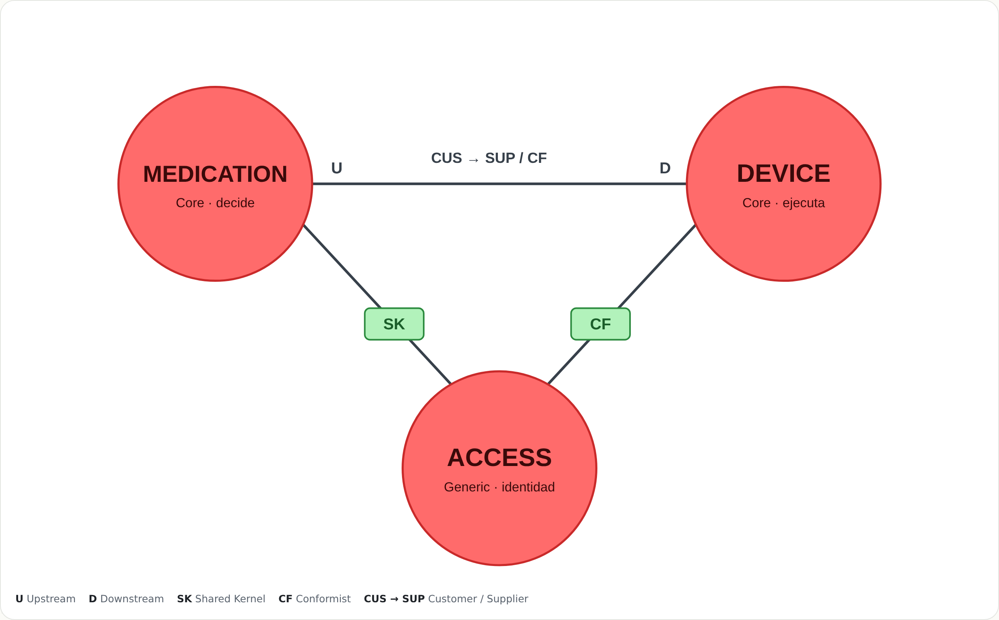


### 4.1.3. Software Architecture
#### 4.1.3.1. Software Architecture System Landscape Diagram
Este diagrama ofrece una visión panorámica  del ecosistema en el que se integra la solución. Su objetivo es representar cómo el sistema Dosys convive con otros sistemas de la organización y servicios externos, además de identificar a los distintos tipos de usuarios que interactúan con el entorno completo. Es una herramienta clave para que los interesados entiendan el alcance global y las dependencias externas sin entrar en detalles técnicos de implementación.

<div align="center">
  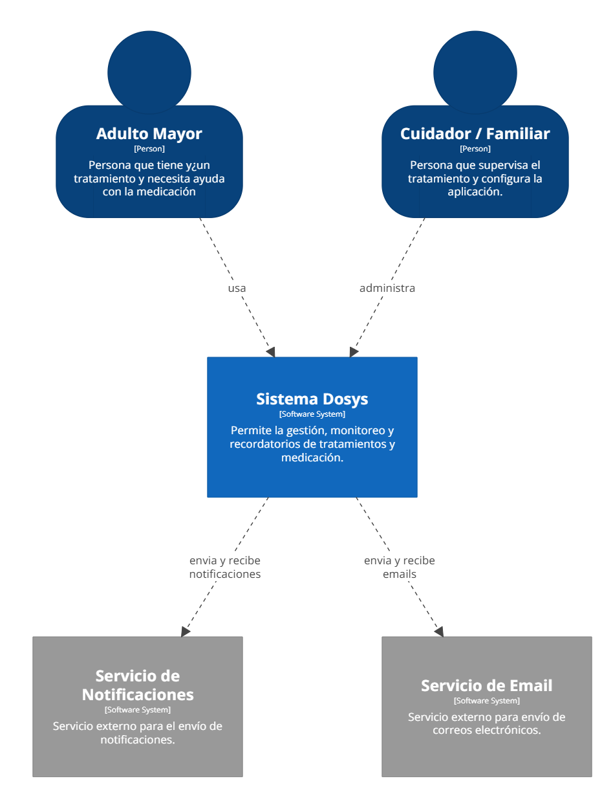
  <p><i>Figura: Diagrama de paisaje de la plataforma Dosys</i></p>
</div>

#### 4.1.3.2. Software Architecture Context Level Diagrams
Este diagrama representa el "Nivel 1" del modelo C4. En este apartado se definen los límites del software, mostrando las interacciones directas entre el sistema y sus usuarios (adultos mayores y cuidadores), así como su relación técnica con servicios de terceros. A diferencia del Landscape, este diagrama omite el entorno organizacional para detallar específicamente qué entra y qué sale de nuestra aplicación, estableciendo las responsabilidades principales del sistema.

<div align="center">
  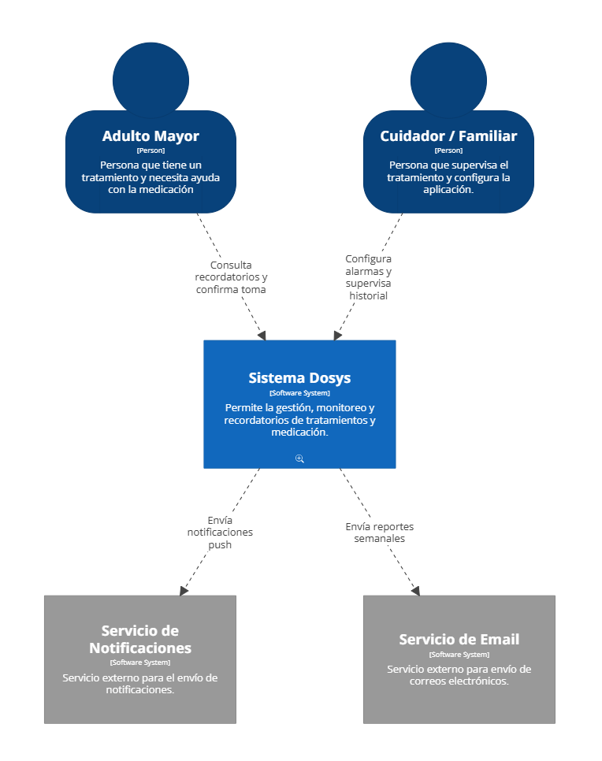
  <p><i>Figura: Diagrama de contexto de la plataforma Dosys</i></p>
</div>

#### 4.1.3.2. Software Architecture Container Level Diagrams
El diagrama de contenedores representa el "Nivel 2" del modelo C4 y descompone el sistema para mostrar sus unidades de ejecución independientes (aplicaciones web, móviles, bases de datos y servicios backend). En este nivel se detalla cómo se reparte la responsabilidad del sistema, las tecnologías elegidas y los protocolos de comunicación interna. Es fundamental para que los desarrolladores entiendan la arquitectura lógica y cómo fluye la información entre el frontend, el backend y el ecosistema IoT.

<div align="center">
  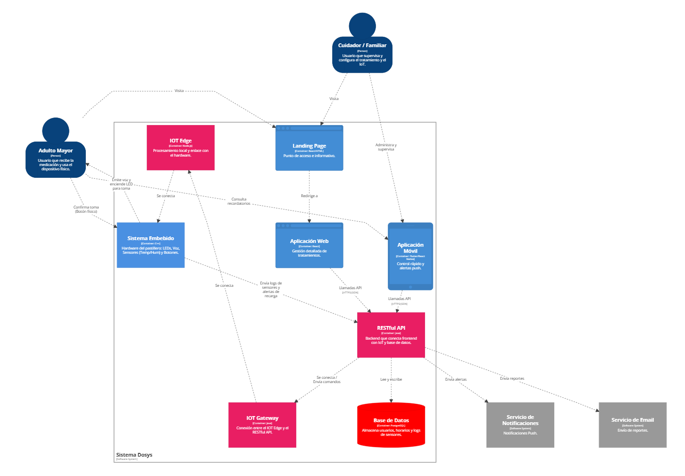
  <p><i>Figura: Diagrama de contenedores de la plataforma Dosys</i></p>
</div>

#### 4.1.3.3. Software Architecture Deployment Diagrams
El diagrama de despliegue representa la arquitectura física del sistema, ilustrando cómo los contenedores de software se distribuyen en nodos de infraestructura específicos y cómo se comunican a través de distintos protocolos de red. Este nivel es crítico para identificar la segregación entre los servicios en la nube, las aplicaciones de cara al usuario y el hardware que interactúa con el entorno físico. Permite visualizar la topología de red y los puntos de ejecución reales.

<div align="center">
  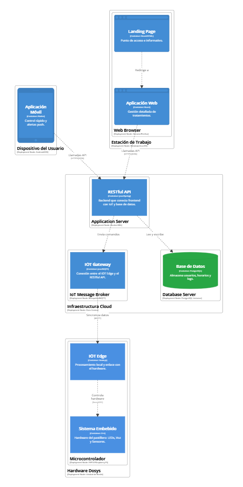
  <p><i>Figura: Diagrama de despliegue de la plataforma Dosys</i></p>
</div>

## 4.2. Tactical-Level Domain-Driven Design

La siguiente estructura se ajusta al capítulo **Tactical-Level Domain-Driven Design** del enunciado, considerando que la solución completa está conformada por **RESTful API**, **Edge API** y **Embedded Applications**, y que el diseño táctico debe reflejar los containers involucrados en cada bounded context. 

### 4.2.1. Bounded Context: Access

El bounded context **Access** representa el proceso de registro, autenticación y autorización básica dentro de la solución Dosys.
Su propósito es aislar la gestión de usuarios y accesos del resto del dominio, evitando mezclar reglas de seguridad con reglas de medicación o de operación del dispositivo.

#### 4.2.1.1. Domain Layer

El **Domain Layer** encapsula la lógica principal del acceso al sistema. Incluye la entidad raíz **User**, la gestión de tokens y la relación de acceso entre usuarios y dispositivos.

**Aggregates**

|    Nombre    |        Categoría        |                                                              Descripción                                                              |
| :----------: | :---------------------: | :-----------------------------------------------------------------------------------------------------------------------------------: |
|     User     | Entity (Aggregate Root) | Representa a un usuario autenticado del sistema Dosys. Contiene la identidad básica, el correo electrónico y la contraseña protegida. |
| RefreshToken |          Entity         |                 Representa un token de refresco asociado a un usuario autenticado. Permite mantener sesiones seguras.                 |
| DeviceAccess |          Entity         |                          Representa la relación entre un usuario y un dispositivo Dosys al que tiene acceso.                          |

**Value Objects**

|    Nombre    |   Categoría  |                      Descripción                      |
| :----------: | :----------: | :---------------------------------------------------: |
| EmailAddress | Value Object | Encapsula y valida el correo electrónico del usuario. |
| PasswordHash | Value Object |     Representa la contraseña cifrada del usuario.     |

**Enumerations**

|   Nombre   |      Valores     |                      Descripción                     |
| :--------: | :--------------: | :--------------------------------------------------: |
| AccessRole | OWNER, CAREGIVER | Define el rol del usuario respecto a un dispositivo. |

**Attributes**

**User**

| Nombre       | Tipo de dato | Visibilidad | Descripción                              |
| ------------ | ------------ | ----------- | ---------------------------------------- |
| id           | UUID         | Private     | Identificador único del usuario.         |
| fullName     | String       | Private     | Nombre completo del usuario.             |
| email        | EmailAddress | Private     | Correo electrónico validado del usuario. |
| passwordHash | PasswordHash | Private     | Contraseña cifrada del usuario.          |
| isActive     | Boolean      | Private     | Indica si la cuenta se encuentra activa. |
| createdAt    | DateTime     | Private     | Fecha de creación del usuario.           |

**RefreshToken**

| Nombre    | Tipo de dato | Visibilidad | Descripción                            |
| --------- | ------------ | ----------- | -------------------------------------- |
| id        | UUID         | Private     | Identificador único del token.         |
| userId    | UUID         | Private     | Usuario propietario del token.         |
| token     | String       | Private     | Valor del token de refresco.           |
| expiresAt | DateTime     | Private     | Fecha y hora de expiración.            |
| revokedAt | DateTime?    | Private     | Fecha y hora de revocación, si aplica. |

**DeviceAccess**

| Nombre    | Tipo de dato | Visibilidad | Descripción                                             |
| --------- | ------------ | ----------- | ------------------------------------------------------- |
| id        | UUID         | Private     | Identificador único del acceso.                         |
| userId    | UUID         | Private     | Usuario que posee el acceso.                            |
| deviceId  | UUID         | Private     | Dispositivo Dosys asociado.                             |
| role      | AccessRole   | Private     | Rol del usuario respecto al dispositivo.                |
| isActive  | Boolean      | Private     | Indica si el acceso al dispositivo se encuentra activo. |
| grantedAt | DateTime     | Private     | Fecha en que se concedió el acceso.                     |
| revokedAt | DateTime?    | Private     | Fecha en que se revocó el acceso, si aplica.            |

**Methods**

**User**

| Nombre                                | Tipo de retorno | Visibilidad | Descripción                                                    |
| ------------------------------------- | --------------- | ----------- | -------------------------------------------------------------- |
| User(...) (constructor)               | User            | Public      | Inicializa un usuario con nombre, correo y contraseña cifrada. |
| activate()                            | Void            | Public      | Activa la cuenta del usuario.                                  |
| deactivate()                          | Void            | Public      | Desactiva la cuenta del usuario.                               |
| changePassword(newHash: PasswordHash) | Void            | Public      | Reemplaza la contraseña cifrada por una nueva.                 |

**RefreshToken**

| Nombre                          | Tipo de retorno | Visibilidad | Descripción                            |
| ------------------------------- | --------------- | ----------- | -------------------------------------- |
| RefreshToken(...) (constructor) | RefreshToken    | Public      | Inicializa un nuevo token de refresco. |
| revoke(at: DateTime)            | Void            | Public      | Revoca el token.                       |
| isActive()                      | Boolean         | Public      | Indica si el token sigue activo.       |

**DeviceAccess**

| Nombre                          | Tipo de retorno | Visibilidad | Descripción                                                        |
| ------------------------------- | --------------- | ----------- | ------------------------------------------------------------------ |
| DeviceAccess(...) (constructor) | DeviceAccess    | Public      | Crea una relación de acceso entre usuario y dispositivo.           |
| grant(at: DateTime)             | Void            | Public      | Marca el acceso como activo y actualiza la fecha de concesión.     |
| revoke(at: DateTime)            | Void            | Public      | Revoca el acceso al dispositivo y registra la fecha de revocación. |

**Repositories and Domain Services**

|         Nombre         |         Categoría        |                        Descripción                        |
| :--------------------: | :----------------------: | :-------------------------------------------------------: |
|     UserRepository     |   Repository Interface   |         Abstracción para persistencia de usuarios.        |
| RefreshTokenRepository |   Repository Interface   |      Abstracción para persistencia de refresh tokens.     |
| DeviceAccessRepository |   Repository Interface   | Abstracción para persistencia de accesos por dispositivo. |
|      TokenService      | Domain Service Interface |    Abstracción para generación y validación de tokens.    |
|     PasswordHasher     | Domain Service Interface |     Abstracción para hash y validación de contraseñas.    |

#### 4.2.1.2. Interface Layer

La **Interface Layer** expone las operaciones de acceso mediante la **REST API**.
Se encarga de recibir solicitudes desde las aplicaciones web y móvil, validar el formato de entrada y delegar la lógica al **Application Layer**.

|        Nombre        |     Categoría     |                                            Descripción                                            |
| :------------------: | :---------------: | :-----------------------------------------------------------------------------------------------: |
|   AccessController   |     Controller    | Controlador que expone operaciones de registro, autenticación y consulta del usuario autenticado. |
| AuthExceptionHandler | Exception Handler |               Traductor de errores de autenticación a respuestas HTTP consistentes.               |

**Attributes**

| Nombre               | Tipo de dato          | Visibilidad | Descripción                                                               |
| -------------------- | --------------------- | ----------- | ------------------------------------------------------------------------- |
| accessCommandService | IAccessCommandService | Private     | Servicio de comandos para operaciones de registro e inicio de sesión.     |
| accessQueryService   | IAccessQueryService   | Private     | Servicio de consultas para recuperar información del usuario autenticado. |

**Endpoints**

| Ruta                    | Método | Descripción                                                                       |
| ----------------------- | ------ | --------------------------------------------------------------------------------- |
| /api/v1/access/register | POST   | Registra un nuevo usuario en el sistema.                                          |
| /api/v1/access/login    | POST   | Autentica un usuario y devuelve los tokens de sesión.                             |
| /api/v1/access/me       | GET    | Devuelve la información básica del usuario autenticado y su dispositivo asociado. |

**Request DTOs**

| Nombre             | Descripción                                                                               |
| ------------------ | ----------------------------------------------------------------------------------------- |
| RegisterRequestDto | Contiene los datos necesarios para registrar un usuario: `{ fullName, email, password }`. |
| LoginRequestDto    | Contiene las credenciales para autenticación: `{ email, password }`.                      |

**Response DTOs**

| Nombre                 | Descripción                                                                   |
| ---------------------- | ----------------------------------------------------------------------------- |
| AccessTokenResponseDto | Representa el resultado de login: `{ accessToken, refreshToken, expiresAt }`. |
| UserProfileResponseDto | Representa al usuario autenticado: `{ id, fullName, email, deviceId }`.       |

#### 4.2.1.3. Application Layer

Esta capa coordina los casos de uso del bounded context **Access**, orquestando el dominio y la infraestructura sin contener lógica técnica de bajo nivel.

|          Nombre          | Categoría |                 Implementa                 |                                   Descripción                                  |
| :----------------------: | :-------: | :----------------------------------------: | :----------------------------------------------------------------------------: |
| AccessApplicationService |  Service  | IAccessCommandService, IAccessQueryService | Orquesta el registro de usuarios, autenticación y consulta del usuario actual. |

#### **Dependencies**

| Nombre                 | Tipo de objeto         | Visibilidad | Descripción                                       |
| ---------------------- | ---------------------- | ----------- | ------------------------------------------------- |
| userRepository         | UserRepository         | Private     | Permite consultar y persistir usuarios.           |
| refreshTokenRepository | RefreshTokenRepository | Private     | Permite registrar y recuperar refresh tokens.     |
| deviceAccessRepository | DeviceAccessRepository | Private     | Permite vincular usuarios con dispositivos.       |
| tokenService           | TokenService           | Private     | Genera y valida access tokens y refresh tokens.   |
| passwordHasher         | PasswordHasher         | Private     | Realiza hash y validación de contraseñas.         |
| unitOfWork             | UnitOfWork             | Private     | Maneja confirmación transaccional de operaciones. |

#### **Methods**

| Nombre                                  | Tipo de retorno        | Visibilidad | Descripción                                                                |
| --------------------------------------- | ---------------------- | ----------- | -------------------------------------------------------------------------- |
| registerUser(fullName, email, password) | UserProfileResponseDto | Public      | Registra un nuevo usuario y crea la identidad base en el sistema.          |
| loginUser(email, password)              | AccessTokenResponseDto | Public      | Autentica al usuario y emite sus tokens de sesión.                         |
| getCurrentUser(userId)                  | UserProfileResponseDto | Public      | Obtiene la información del usuario autenticado y su acceso al dispositivo. |

#### 4.2.1.4. Infrastructure Layer

Incluye implementaciones concretas para persistencia, seguridad y generación de tokens.

**Repositories and Services**

|           Nombre          |        Categoría       |       Implementa       |                                Descripción                                |
| :-----------------------: | :--------------------: | :--------------------: | :-----------------------------------------------------------------------: |
|     UserRepositorySql     |       Repository       |     UserRepository     | Implementación para persistencia de usuarios en base de datos relacional. |
| RefreshTokenRepositorySql |       Repository       | RefreshTokenRepository |            Implementación para persistencia de refresh tokens.            |
| DeviceAccessRepositorySql |       Repository       | DeviceAccessRepository |        Implementación para persistencia de accesos por dispositivo.       |
|      JwtTokenService      | Infrastructure Service |      TokenService      |                  Genera y valida JWT para autenticación.                  |
|    BcryptPasswordHasher   | Infrastructure Service |     PasswordHasher     |        Implementación para hash y validación segura de contraseñas.       |

#### **Funcionalidades clave**

* Registrar nuevos usuarios.
* Autenticar credenciales y emitir tokens.
* Consultar el usuario autenticado.
* Persistir accesos entre usuarios y dispositivos.

#### 4.2.1.5. Bounded Context Software Architecture Component Level Diagrams

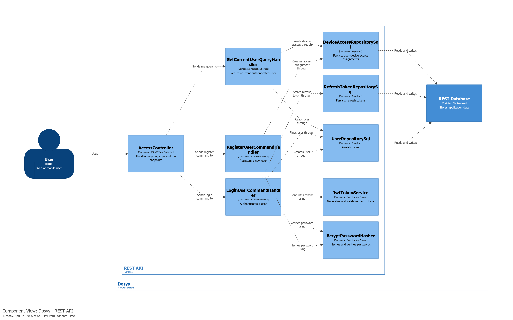

#### 4.2.1.6. Bounded Context Software Architecture Code Level Diagrams

##### 4.2.1.6.1. Bounded Context Domain Layer Class Diagrams

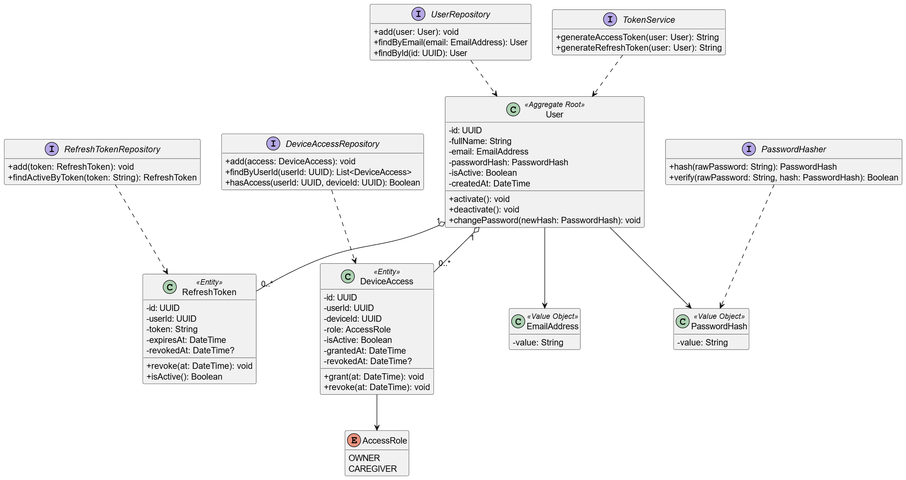

##### 4.2.1.6.2. Bounded Context Database Design Diagram

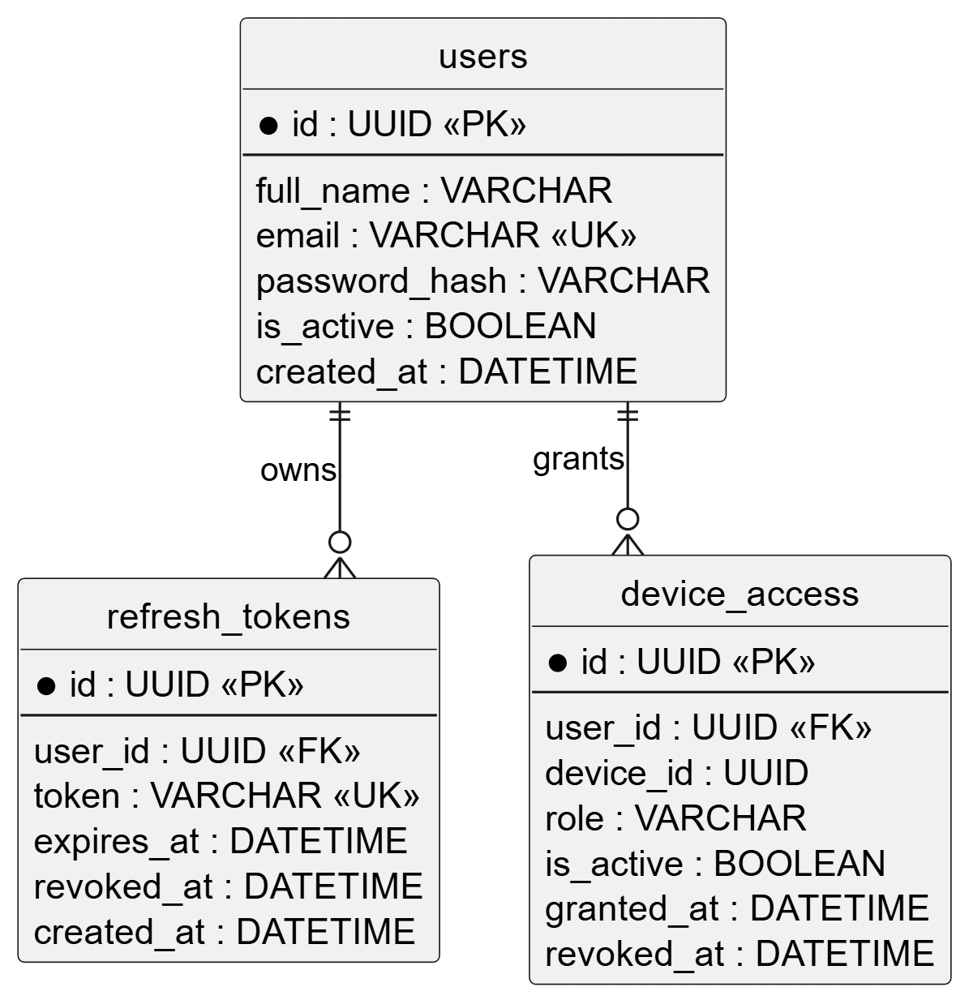

---

### 4.2.2. Bounded Context: Medication

El bounded context **Medication** representa la gestión principal del negocio de Dosys.
Su responsabilidad es administrar los contenedores del pastillero, los medicamentos asociados a cada contenedor, sus horarios, el historial de cumplimiento de tomas y la visualización del estado ambiental que consulta el usuario en las aplicaciones Web y Mobile.

La raíz agregada del contexto se mantiene en **MedicationContainer** porque la configuración del negocio se realiza contenedor por contenedor, y cada horario siempre se asocia a un único contenedor. Los cambios de `configVersion` del dispositivo no forman parte de una invariante del agregado, sino de un proceso de coordinación del **Application Layer** que notifica al bounded context **Device** que la configuración operativa debe resincronizarse.

#### 4.2.2.1. Domain Layer

El **Domain Layer** encapsula la lógica principal de medicación y adherencia.
Incluye el agregado raíz **MedicationContainer**, las reglas para horarios, el registro de cumplimiento y los modelos de lectura con los que Web y Mobile consultan el estado ambiental previamente sincronizado desde el bounded context **Device**.

**Aggregates**

|        Nombre       |        Categoría        |                                                              Descripción                                                             |
| :-----------------: | :---------------------: | :----------------------------------------------------------------------------------------------------------------------------------: |
| MedicationContainer | Entity (Aggregate Root) | Representa un contenedor físico del pastillero y su configuración lógica, incluyendo el medicamento asociado y la cantidad restante. |
|  MedicationSchedule |          Entity         |                                   Representa un horario configurado para un contenedor específico.                                   |
|     IntakeRecord    |          Entity         |                                Representa un registro de cumplimiento asociado a una toma programada.                                |

**Read Models**

|         Nombre         |      Categoría      |                                                Descripción                                               |
| :--------------------: | :-----------------: | :------------------------------------------------------------------------------------------------------: |
|   EnvironmentSnapshot  | Entity (Read Model) | Representa la última lectura ambiental sincronizada desde el bounded context Device para un dispositivo. |
| EnvironmentReadingView | Entity (Read Model) |         Representa una lectura ambiental histórica disponible para consulta en las aplicaciones.         |

**Value Objects**

|      Nombre     |   Categoría  |                                 Descripción                                |
| :-------------: | :----------: | :------------------------------------------------------------------------: |
| ContainerNumber | Value Object | Encapsula el número de contenedor válido dentro del rango del dispositivo. |
|    DailyTime    | Value Object |                Representa la hora exacta de un recordatorio.               |
|    DaysOfWeek   | Value Object |                 Representa los días activos de un horario.                 |
|   PillQuantity  | Value Object |                Encapsula la cantidad restante de pastillas.                |

**Enumerations**

|         Nombre        |    Valores    |                               Descripción                               |
| :-------------------: | :-----------: | :---------------------------------------------------------------------: |
|    AdherenceStatus    | TAKEN, MISSED |        Define el estado del cumplimiento de una toma programada.        |
| EnvironmentRiskStatus |  NORMAL, RISK | Define el estado de riesgo de una lectura ambiental visible al usuario. |

**Attributes**

**MedicationContainer**

| Nombre          | Tipo de dato    | Visibilidad | Descripción                                       |
| --------------- | --------------- | ----------- | ------------------------------------------------- |
| id              | UUID            | Private     | Identificador único del contenedor lógico.        |
| deviceId        | UUID            | Private     | Dispositivo Dosys al que pertenece el contenedor. |
| containerNumber | ContainerNumber | Private     | Número de contenedor dentro del dispositivo.      |
| medicationName  | String          | Private     | Nombre del medicamento asignado.                  |
| dosageLabel     | String          | Private     | Descripción breve de dosis o uso.                 |
| remainingPills  | PillQuantity    | Private     | Cantidad restante de pastillas.                   |
| isEnabled       | Boolean         | Private     | Indica si el contenedor está habilitado.          |
| updatedAt       | DateTime        | Private     | Última actualización del contenedor.              |

**MedicationSchedule**

| Nombre          | Tipo de dato    | Visibilidad | Descripción                               |
| --------------- | --------------- | ----------- | ----------------------------------------- |
| id              | UUID            | Private     | Identificador único del horario.          |
| deviceId        | UUID            | Private     | Dispositivo asociado.                     |
| containerNumber | ContainerNumber | Private     | Contenedor al que pertenece el horario.   |
| time            | DailyTime       | Private     | Hora de activación del recordatorio.      |
| daysOfWeek      | DaysOfWeek      | Private     | Días en los que se repite el horario.     |
| isActive        | Boolean         | Private     | Indica si el horario se encuentra activo. |
| createdAt       | DateTime        | Private     | Fecha de creación del horario.            |

**IntakeRecord**

| Nombre          | Tipo de dato    | Visibilidad | Descripción                                   |
| --------------- | --------------- | ----------- | --------------------------------------------- |
| id              | UUID            | Private     | Identificador único del registro de toma.     |
| deviceId        | UUID            | Private     | Dispositivo asociado.                         |
| scheduleId      | UUID            | Private     | Horario programado relacionado.               |
| containerNumber | ContainerNumber | Private     | Contenedor correspondiente.                   |
| scheduledAt     | DateTime        | Private     | Fecha y hora programada de la toma.           |
| confirmedAt     | DateTime?       | Private     | Fecha y hora real de confirmación, si existe. |
| status          | AdherenceStatus | Private     | Estado de cumplimiento de la toma.            |

**EnvironmentSnapshot**

| Nombre      | Tipo de dato          | Visibilidad | Descripción                                        |
| ----------- | --------------------- | ----------- | -------------------------------------------------- |
| deviceId    | UUID                  | Private     | Dispositivo al que corresponde la última lectura.  |
| temperature | Decimal               | Private     | Última temperatura sincronizada desde Device.      |
| humidity    | Decimal               | Private     | Última humedad sincronizada desde Device.          |
| recordedAt  | DateTime              | Private     | Fecha y hora de la lectura más reciente.           |
| riskStatus  | EnvironmentRiskStatus | Private     | Estado de riesgo calculado para la última lectura. |

**EnvironmentReadingView**

| Nombre      | Tipo de dato          | Visibilidad | Descripción                                  |
| ----------- | --------------------- | ----------- | -------------------------------------------- |
| id          | UUID                  | Private     | Identificador único de la lectura histórica. |
| deviceId    | UUID                  | Private     | Dispositivo asociado.                        |
| temperature | Decimal               | Private     | Temperatura sincronizada desde Device.       |
| humidity    | Decimal               | Private     | Humedad sincronizada desde Device.           |
| recordedAt  | DateTime              | Private     | Fecha y hora de la lectura histórica.        |
| riskStatus  | EnvironmentRiskStatus | Private     | Estado de riesgo asociado a la lectura.      |

**Methods**

**MedicationContainer**

| Nombre                                         | Tipo de retorno     | Visibilidad | Descripción                                           |
| ---------------------------------------------- | ------------------- | ----------- | ----------------------------------------------------- |
| MedicationContainer(...) (constructor)         | MedicationContainer | Public      | Inicializa un contenedor con la configuración básica. |
| updateMedication(name: String, dosage: String) | Void                | Public      | Actualiza el medicamento y su descripción.            |
| updateRemainingPills(quantity: PillQuantity)   | Void                | Public      | Actualiza la cantidad restante de pastillas.          |
| enable()                                       | Void                | Public      | Habilita el contenedor.                               |
| disable()                                      | Void                | Public      | Deshabilita el contenedor.                            |

**MedicationSchedule**

| Nombre                                        | Tipo de retorno    | Visibilidad | Descripción                                     |
| --------------------------------------------- | ------------------ | ----------- | ----------------------------------------------- |
| MedicationSchedule(...) (constructor)         | MedicationSchedule | Public      | Inicializa un horario asociado a un contenedor. |
| activate()                                    | Void               | Public      | Activa el horario.                              |
| deactivate()                                  | Void               | Public      | Desactiva el horario.                           |
| reschedule(time: DailyTime, days: DaysOfWeek) | Void               | Public      | Reconfigura la hora y días del horario.         |

**IntakeRecord**

| Nombre                          | Tipo de retorno | Visibilidad | Descripción                          |
| ------------------------------- | --------------- | ----------- | ------------------------------------ |
| IntakeRecord(...) (constructor) | IntakeRecord    | Public      | Crea un registro de toma programada. |
| markTaken(at: DateTime)         | Void            | Public      | Marca la toma como cumplida.         |
| markMissed()                    | Void            | Public      | Marca la toma como incumplida.       |

**EnvironmentSnapshot**

| Nombre                                                                                                          | Tipo de retorno | Visibilidad | Descripción                                                                                            |
| --------------------------------------------------------------------------------------------------------------- | --------------- | ----------- | ------------------------------------------------------------------------------------------------------ |
| replaceLatest(temperature: Decimal, humidity: Decimal, recordedAt: DateTime, riskStatus: EnvironmentRiskStatus) | Void            | Public      | Reemplaza la última lectura visible del dispositivo con el dato previamente sincronizado desde Device. |

**Repositories**

|              Nombre              |       Categoría      |                                               Descripción                                               |
| :------------------------------: | :------------------: | :-----------------------------------------------------------------------------------------------------: |
|   MedicationContainerRepository  | Repository Interface |                              Abstracción para persistencia de contenedores.                             |
|   MedicationScheduleRepository   | Repository Interface |                                Abstracción para persistencia de horarios.                               |
|      IntakeRecordRepository      | Repository Interface |                           Abstracción para persistencia de registros de toma.                           |
|   EnvironmentSnapshotRepository  | Repository Interface |                  Abstracción para persistencia de la última lectura ambiental visible.                  |
| EnvironmentReadingViewRepository | Repository Interface | Abstracción para persistencia y consulta de lecturas ambientales históricas sincronizadas desde Device. |

#### 4.2.2.2. Interface Layer

La **Interface Layer** expone las operaciones del bounded context **Medication** mediante la **REST API**.
Se encarga de recibir solicitudes externas, validar datos y delegar la lógica de negocio al **Application Layer**.

|        Nombre        |  Categoría |                                                              Descripción                                                              |
| :------------------: | :--------: | :-----------------------------------------------------------------------------------------------------------------------------------: |
| MedicationController | Controller | Controlador que expone operaciones de configuración de contenedores, horarios, consulta de cumplimiento y visualización del ambiente. |

**Attributes**

| Nombre                   | Tipo de dato              | Visibilidad | Descripción                                                                      |
| ------------------------ | ------------------------- | ----------- | -------------------------------------------------------------------------------- |
| medicationQueryService   | IMedicationQueryService   | Private     | Servicio de consulta para contenedores, horarios, adherencia y estado ambiental. |
| medicationCommandService | IMedicationCommandService | Private     | Servicio de comandos para creación y actualización de contenedores y horarios.   |

**Endpoints**

| Ruta                                                               | Método | Descripción                                                                                         |
| ------------------------------------------------------------------ | ------ | --------------------------------------------------------------------------------------------------- |
| /api/v1/medication/devices/{deviceId}/containers                   | GET    | Lista la configuración actual de los contenedores del dispositivo.                                  |
| /api/v1/medication/devices/{deviceId}/containers/{containerNumber} | PUT    | Crea o actualiza la configuración de un contenedor.                                                 |
| /api/v1/medication/devices/{deviceId}/schedules                    | GET    | Lista todos los horarios configurados para el dispositivo.                                          |
| /api/v1/medication/devices/{deviceId}/schedules                    | POST   | Crea un nuevo horario para un contenedor.                                                           |
| /api/v1/medication/devices/{deviceId}/schedules/{scheduleId}       | PUT    | Actualiza un horario existente.                                                                     |
| /api/v1/medication/devices/{deviceId}/schedules/{scheduleId}       | DELETE | Elimina un horario existente.                                                                       |
| /api/v1/medication/devices/{deviceId}/adherence/calendar           | GET    | Devuelve la vista mensual del cumplimiento de tomas.                                                |
| /api/v1/medication/devices/{deviceId}/environment/latest           | GET    | Devuelve la última lectura ambiental sincronizada desde Device y visible en las aplicaciones.       |
| /api/v1/medication/devices/{deviceId}/environment/history          | GET    | Devuelve el historial de lecturas ambientales sincronizadas desde Device dentro del rango indicado. |

**Request DTOs**

| Nombre                    | Descripción                                                                                                                |
| ------------------------- | -------------------------------------------------------------------------------------------------------------------------- |
| UpsertContainerRequestDto | Contiene los datos necesarios para configurar un contenedor: `{ medicationName, dosageLabel, remainingPills, isEnabled }`. |
| CreateScheduleRequestDto  | Contiene los datos necesarios para crear un horario: `{ containerNumber, time, daysOfWeek, isActive }`.                    |
| UpdateScheduleRequestDto  | Contiene los datos necesarios para actualizar un horario: `{ containerNumber, time, daysOfWeek, isActive }`.               |

**Response DTOs**

| Nombre                            | Descripción                                                                                                                        |
| --------------------------------- | ---------------------------------------------------------------------------------------------------------------------------------- |
| MedicationContainerResponseDto    | Representa un contenedor configurado: `{ id, deviceId, containerNumber, medicationName, dosageLabel, remainingPills, isEnabled }`. |
| MedicationScheduleResponseDto     | Representa un horario configurado: `{ id, containerNumber, time, daysOfWeek, isActive }`.                                          |
| AdherenceCalendarResponseDto      | Representa una vista mensual de cumplimiento con los registros agrupados por fecha y horario.                                      |
| EnvironmentLatestResponseDto      | Representa la última lectura ambiental visible: `{ deviceId, temperature, humidity, recordedAt, riskStatus }`.                     |
| EnvironmentHistoryItemResponseDto | Representa una lectura ambiental histórica: `{ id, temperature, humidity, recordedAt, riskStatus }`.                               |

#### 4.2.2.3. Application Layer

Esta capa coordina la lógica de negocio entre el dominio, la infraestructura y los casos de uso expuestos por el bounded context **Medication**.

|            Nombre            | Categoría |                     Implementa                     |                                                                     Descripción                                                                     |
| :--------------------------: | :-------: | :------------------------------------------------: | :-------------------------------------------------------------------------------------------------------------------------------------------------: |
| MedicationApplicationService |  Service  | IMedicationCommandService, IMedicationQueryService | Orquesta la configuración de contenedores, horarios, consulta del historial de cumplimiento y visualización del ambiente sincronizado desde Device. |

#### **Dependencies**

| Nombre                           | Tipo de objeto                   | Visibilidad | Descripción                                                                                         |
| -------------------------------- | -------------------------------- | ----------- | --------------------------------------------------------------------------------------------------- |
| medicationContainerRepository    | MedicationContainerRepository    | Private     | Accede a la persistencia de contenedores.                                                           |
| medicationScheduleRepository     | MedicationScheduleRepository     | Private     | Accede a la persistencia de horarios.                                                               |
| intakeRecordRepository           | IntakeRecordRepository           | Private     | Permite consultar y registrar cumplimiento de tomas.                                                |
| environmentSnapshotRepository    | EnvironmentSnapshotRepository    | Private     | Permite consultar la última lectura ambiental visible.                                              |
| environmentReadingViewRepository | EnvironmentReadingViewRepository | Private     | Permite consultar el historial de lecturas ambientales sincronizadas desde Device.                  |
| unitOfWork                       | UnitOfWork                       | Private     | Maneja confirmación transaccional de operaciones.                                                   |
| configVersionPublisher           | ConfigVersionPublisher           | Private     | Marca que la configuración del dispositivo fue modificada para sincronización posterior con Device. |

#### **Methods**

| Nombre                                                                                             | Tipo de retorno                         | Visibilidad | Descripción                                                                                                       |
| -------------------------------------------------------------------------------------------------- | --------------------------------------- | ----------- | ----------------------------------------------------------------------------------------------------------------- |
| getContainers(deviceId)                                                                            | List<MedicationContainerResponseDto>    | Public      | Obtiene la configuración actual de los contenedores del dispositivo.                                              |
| upsertContainer(deviceId, containerNumber, medicationName, dosageLabel, remainingPills, isEnabled) | MedicationContainerResponseDto          | Public      | Crea o actualiza la configuración de un contenedor.                                                               |
| getSchedules(deviceId)                                                                             | List<MedicationScheduleResponseDto>     | Public      | Lista los horarios configurados para un dispositivo.                                                              |
| createSchedule(deviceId, containerNumber, time, daysOfWeek, isActive)                              | MedicationScheduleResponseDto           | Public      | Crea un nuevo horario para un contenedor.                                                                         |
| updateSchedule(deviceId, scheduleId, containerNumber, time, daysOfWeek, isActive)                  | MedicationScheduleResponseDto           | Public      | Actualiza un horario existente.                                                                                   |
| deleteSchedule(deviceId, scheduleId)                                                               | Void                                    | Public      | Elimina un horario configurado.                                                                                   |
| getAdherenceCalendar(deviceId, month)                                                              | AdherenceCalendarResponseDto            | Public      | Devuelve la vista mensual del cumplimiento de tomas.                                                              |
| getLatestEnvironment(deviceId)                                                                     | EnvironmentLatestResponseDto            | Public      | Devuelve la última lectura ambiental previamente sincronizada desde Device.                                       |
| getEnvironmentHistory(deviceId, from, to)                                                          | List<EnvironmentHistoryItemResponseDto> | Public      | Devuelve el historial de lecturas ambientales previamente sincronizadas desde Device dentro del rango consultado. |

#### 4.2.2.4. Infrastructure Layer

Incluye implementaciones concretas para acceso a datos y soporte a sincronización de configuración.

**Repositories and Services**

|                Nombre               |        Categoría       |            Implementa            |                                                 Descripción                                                |
| :---------------------------------: | :--------------------: | :------------------------------: | :--------------------------------------------------------------------------------------------------------: |
|   MedicationContainerRepositorySql  |       Repository       |   MedicationContainerRepository  |                Implementación para persistencia de contenedores en base de datos relacional.               |
|   MedicationScheduleRepositorySql   |       Repository       |   MedicationScheduleRepository   |                                Implementación para persistencia de horarios.                               |
|      IntakeRecordRepositorySql      |       Repository       |      IntakeRecordRepository      |                       Implementación para persistencia de registros de cumplimiento.                       |
|   EnvironmentSnapshotRepositorySql  |       Repository       |   EnvironmentSnapshotRepository  |             Implementación para persistencia de la última lectura ambiental visible al usuario.            |
| EnvironmentReadingViewRepositorySql |       Repository       | EnvironmentReadingViewRepository | Implementación para persistencia y consulta de lecturas ambientales históricas sincronizadas desde Device. |
|        ConfigVersionPublisher       | Infrastructure Service |                 —                |        Servicio que incrementa o publica cambios de configuración para resincronización con Device.        |

#### **Funcionalidades clave**

* Crear y actualizar la configuración de los 5 contenedores.
* Crear, modificar y eliminar horarios de medicación.
* Consultar el historial de cumplimiento de tomas.
* Consultar la última lectura ambiental visible y el historial de lecturas previamente sincronizadas desde Device.
* Marcar cambios de configuración para sincronización con el bounded context Device.

#### 4.2.2.5. Bounded Context Software Architecture Component Level Diagrams

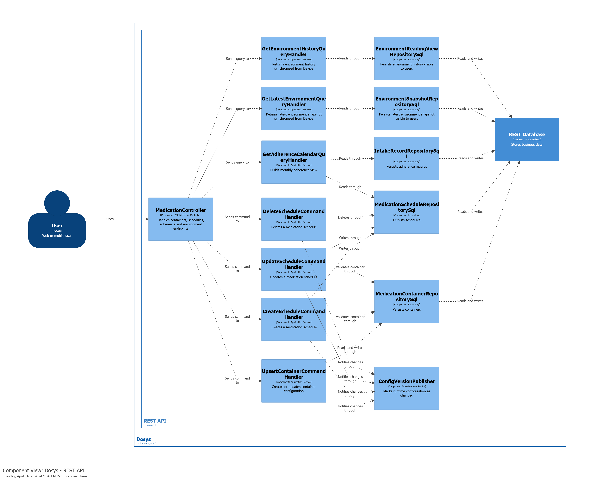

#### 4.2.2.6. Bounded Context Software Architecture Code Level Diagrams

##### 4.2.2.6.1. Bounded Context Domain Layer Class Diagrams

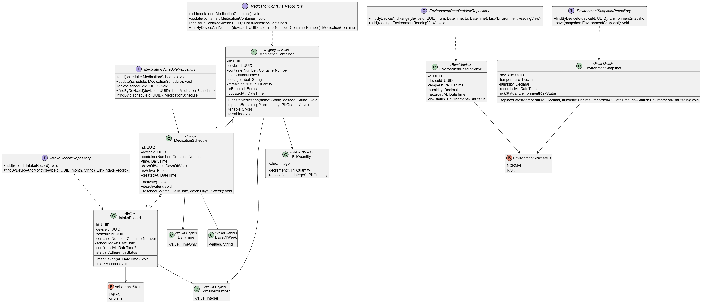

##### 4.2.2.6.2. Bounded Context Database Design Diagram

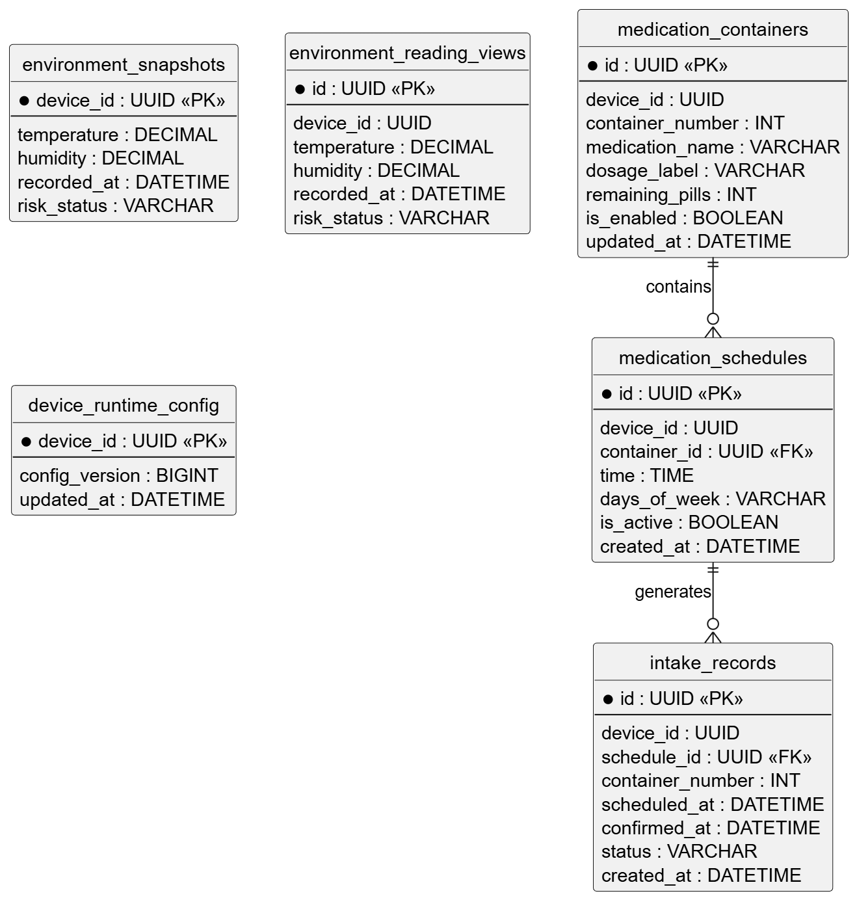

---

### 4.2.3. Bounded Context: Device

El bounded context **Device** representa la operación técnica del pastillero inteligente Dosys.
Este bounded context abarca tres containers de la solución:

* la **REST API** como fuente oficial de verdad y punto de consolidación definitivo,
* la **Edge API** como capa operativa que cachea, transforma y sincroniza,
* y la **Embedded Application** como runtime del dispositivo que consume configuración y reporta eventos.

Su propósito es administrar la configuración operativa del dispositivo, la telemetría ambiental, los eventos de confirmación de tomas, la autenticación del dispositivo y la sincronización entre la **Embedded Application**, la **Edge API** y la **REST API**.

#### 4.2.3.1. Domain Layer

El **Domain Layer** encapsula la lógica principal relacionada con el dispositivo, su configuración runtime, su identidad técnica y los eventos operativos generados por el hardware.

**Aggregates**

|            Nombre           |        Categoría        |                                                                Descripción                                                                |
| :-------------------------: | :---------------------: | :---------------------------------------------------------------------------------------------------------------------------------------: |
|        DeviceProfile        | Entity (Aggregate Root) | Representa al dispositivo Dosys como entidad operativa dentro del sistema. Incluye su identidad técnica y su credencial de autenticación. |
| DeviceConfigurationSnapshot |          Entity         |                             Representa la configuración operativa compilada que el dispositivo debe consumir.                             |
|      EnvironmentReading     |          Entity         |                                             Representa una lectura ambiental del sensor SHT3X.                                            |
|      DeviceIntakeEvent      |          Entity         |                                 Representa un evento de confirmación de toma generado por el botón físico.                                |
|          StockEvent         |          Entity         |                           Representa un evento de actualización de stock restante reportado por el dispositivo.                           |
|       DeviceHeartbeat       |          Entity         |                                          Representa el estado técnico periódico del dispositivo.                                          |

**Value Objects**

|        Nombre        |   Categoría  |                                             Descripción                                             |
| :------------------: | :----------: | :-------------------------------------------------------------------------------------------------: |
|   TemperatureValue   | Value Object |                       Encapsula el valor de temperatura medido por el sensor.                       |
|     HumidityValue    | Value Object |                         Encapsula el valor de humedad medido por el sensor.                         |
| ConfigurationVersion | Value Object |               Representa la versión vigente de configuración runtime del dispositivo.               |
|     DeviceKeyHash    | Value Object | Representa la credencial cifrada del dispositivo utilizada para autenticar solicitudes al Edge API. |

**Enumerations**

|       Nombre      |         Valores         |                              Descripción                             |
| :---------------: | :---------------------: | :------------------------------------------------------------------: |
|     SyncStatus    | PENDING, SYNCED, FAILED |  Define el estado de sincronización de un evento hacia la REST API.  |
| IntakeEventStatus |      TAKEN, MISSED      | Define el estado funcional de una toma reportada por el dispositivo. |

**Attributes**

**DeviceProfile**

| Nombre        | Tipo de dato         | Visibilidad | Descripción                                                                         |
| ------------- | -------------------- | ----------- | ----------------------------------------------------------------------------------- |
| id            | UUID                 | Private     | Identificador único del dispositivo.                                                |
| serialNumber  | String               | Private     | Identificador físico o serial del dispositivo.                                      |
| deviceKeyHash | DeviceKeyHash        | Private     | Credencial cifrada del dispositivo utilizada para autenticación frente al Edge API. |
| configVersion | ConfigurationVersion | Private     | Versión de configuración actualmente aplicada.                                      |
| isEnabled     | Boolean              | Private     | Indica si el dispositivo se encuentra habilitado para operar.                       |
| lastSeenAt    | DateTime?            | Private     | Última fecha en que el dispositivo reportó actividad.                               |
| status        | String               | Private     | Estado operativo actual del dispositivo.                                            |

**DeviceConfigurationSnapshot**

| Nombre               | Tipo de dato         | Visibilidad | Descripción                                    |
| -------------------- | -------------------- | ----------- | ---------------------------------------------- |
| id                   | UUID                 | Private     | Identificador del snapshot de configuración.   |
| deviceId             | UUID                 | Private     | Dispositivo al que pertenece la configuración. |
| configVersion        | ConfigurationVersion | Private     | Versión de configuración generada.             |
| timezone             | String               | Private     | Zona horaria utilizada por el dispositivo.     |
| humidityThreshold    | Decimal              | Private     | Umbral de humedad permitido.                   |
| temperatureThreshold | Decimal              | Private     | Umbral de temperatura permitido.               |

**EnvironmentReading**

| Nombre      | Tipo de dato     | Visibilidad | Descripción                                 |
| ----------- | ---------------- | ----------- | ------------------------------------------- |
| id          | UUID             | Private     | Identificador único de la lectura.          |
| deviceId    | UUID             | Private     | Dispositivo asociado.                       |
| temperature | TemperatureValue | Private     | Valor de temperatura registrado.            |
| humidity    | HumidityValue    | Private     | Valor de humedad registrado.                |
| recordedAt  | DateTime         | Private     | Fecha y hora de la lectura.                 |
| syncStatus  | SyncStatus       | Private     | Estado de sincronización hacia la REST API. |

**DeviceIntakeEvent**

| Nombre          | Tipo de dato      | Visibilidad | Descripción                                                    |
| --------------- | ----------------- | ----------- | -------------------------------------------------------------- |
| id              | UUID              | Private     | Identificador único del evento.                                |
| deviceId        | UUID              | Private     | Dispositivo asociado.                                          |
| scheduleId      | UUID              | Private     | Horario recurrente asociado al evento.                         |
| containerNumber | Integer           | Private     | Contenedor involucrado en la toma.                             |
| scheduledAt     | DateTime          | Private     | Fecha y hora programada de la ocurrencia concreta del horario. |
| confirmedAt     | DateTime          | Private     | Fecha y hora en que el usuario confirmó la toma.               |
| status          | IntakeEventStatus | Private     | Estado funcional de la toma reportada por el dispositivo.      |
| syncStatus      | SyncStatus        | Private     | Estado de sincronización hacia la REST API.                    |

**StockEvent**

| Nombre          | Tipo de dato | Visibilidad | Descripción                             |
| --------------- | ------------ | ----------- | --------------------------------------- |
| id              | UUID         | Private     | Identificador único del evento.         |
| deviceId        | UUID         | Private     | Dispositivo asociado.                   |
| containerNumber | Integer      | Private     | Contenedor al que corresponde el stock. |
| remainingPills  | Integer      | Private     | Cantidad restante reportada.            |
| recordedAt      | DateTime     | Private     | Fecha y hora del evento.                |
| syncStatus      | SyncStatus   | Private     | Estado de sincronización.               |

**DeviceHeartbeat**

| Nombre        | Tipo de dato | Visibilidad | Descripción                                    |
| ------------- | ------------ | ----------- | ---------------------------------------------- |
| id            | UUID         | Private     | Identificador único del heartbeat.             |
| deviceId      | UUID         | Private     | Dispositivo asociado.                          |
| rtcTime       | DateTime     | Private     | Hora leída desde el RTC DS3231.                |
| wifiConnected | Boolean      | Private     | Indica si el dispositivo tiene conectividad.   |
| deviceStatus  | String       | Private     | Estado operativo reportado por el dispositivo. |
| recordedAt    | DateTime     | Private     | Fecha y hora del heartbeat.                    |
| syncStatus    | SyncStatus   | Private     | Estado de sincronización.                      |

**Methods**

**DeviceProfile**

| Nombre                                             | Tipo de retorno | Visibilidad | Descripción                                                          |
| -------------------------------------------------- | --------------- | ----------- | -------------------------------------------------------------------- |
| DeviceProfile(...) (constructor)                   | DeviceProfile   | Public      | Inicializa el perfil operativo del dispositivo.                      |
| updateConfigVersion(version: ConfigurationVersion) | Void            | Public      | Actualiza la versión de configuración aplicada.                      |
| updateHeartbeat(at: DateTime, status: String)      | Void            | Public      | Actualiza el estado operativo y la última actividad del dispositivo. |
| rotateDeviceKey(newHash: DeviceKeyHash)            | Void            | Public      | Reemplaza la credencial cifrada del dispositivo.                     |
| enable()                                           | Void            | Public      | Habilita el dispositivo para operar.                                 |
| disable()                                          | Void            | Public      | Deshabilita el dispositivo.                                          |

**DeviceConfigurationSnapshot**

| Nombre                                               | Tipo de retorno             | Visibilidad | Descripción                               |
| ---------------------------------------------------- | --------------------------- | ----------- | ----------------------------------------- |
| DeviceConfigurationSnapshot(...) (constructor)       | DeviceConfigurationSnapshot | Public      | Inicializa un snapshot de configuración.  |
| replaceWithNewVersion(version: ConfigurationVersion) | Void                        | Public      | Reemplaza la versión actual del snapshot. |

**EnvironmentReading**

| Nombre                                | Tipo de retorno    | Visibilidad | Descripción                         |
| ------------------------------------- | ------------------ | ----------- | ----------------------------------- |
| EnvironmentReading(...) (constructor) | EnvironmentReading | Public      | Inicializa una lectura ambiental.   |
| markSynced()                          | Void               | Public      | Marca la lectura como sincronizada. |

**DeviceIntakeEvent**

| Nombre                               | Tipo de retorno   | Visibilidad | Descripción                                   |
| ------------------------------------ | ----------------- | ----------- | --------------------------------------------- |
| DeviceIntakeEvent(...) (constructor) | DeviceIntakeEvent | Public      | Inicializa un evento de confirmación de toma. |
| markSynced()                         | Void              | Public      | Marca el evento como sincronizado.            |

**StockEvent**

| Nombre                        | Tipo de retorno | Visibilidad | Descripción                             |
| ----------------------------- | --------------- | ----------- | --------------------------------------- |
| StockEvent(...) (constructor) | StockEvent      | Public      | Inicializa un evento de stock restante. |
| markSynced()                  | Void            | Public      | Marca el evento como sincronizado.      |

**DeviceHeartbeat**

| Nombre                             | Tipo de retorno | Visibilidad | Descripción                              |
| ---------------------------------- | --------------- | ----------- | ---------------------------------------- |
| DeviceHeartbeat(...) (constructor) | DeviceHeartbeat | Public      | Inicializa un heartbeat del dispositivo. |
| markSynced()                       | Void            | Public      | Marca el heartbeat como sincronizado.    |

**Repositories**

|                 Nombre                |       Categoría      |                                    Descripción                                    |
| :-----------------------------------: | :------------------: | :-------------------------------------------------------------------------------: |
|        DeviceProfileRepository        | Repository Interface |  Abstracción para persistencia de perfil del dispositivo y su identidad técnica.  |
| DeviceConfigurationSnapshotRepository | Repository Interface |       Abstracción para persistencia del snapshot de configuración operativa.      |
|      EnvironmentReadingRepository     | Repository Interface | Abstracción para persistencia de lecturas ambientales del bounded context Device. |
|      DeviceIntakeEventRepository      | Repository Interface |  Abstracción para persistencia de eventos de toma reportados por el dispositivo.  |
|          StockEventRepository         | Repository Interface |            Abstracción para persistencia de eventos de stock restante.            |
|       DeviceHeartbeatRepository       | Repository Interface |                    Abstracción para persistencia de heartbeats.                   |
|         PendingSyncRepository         | Repository Interface |   Abstracción para persistencia de eventos pendientes de sincronización en Edge.  |

#### 4.2.3.2. Interface Layer

La **Interface Layer** expone las operaciones del bounded context **Device** en los tres containers que forman parte de su implementación: la **REST API** interna, la **Edge API** y la **Embedded Application**.

##### **REST API (internal)**

La parte interna de la **REST API** expone el contrato de sincronización entre la **Edge API** y la fuente oficial de verdad del sistema.
Estos endpoints no son consumidos por el usuario final. Son consumidos únicamente por la **Edge API** para sincronizar configuración y eventos definitivos.

|        Nombre        |  Categoría |                                           Descripción                                          |
| :------------------: | :--------: | :--------------------------------------------------------------------------------------------: |
| DeviceSyncController | Controller | Controlador interno de la REST API que expone operaciones de sincronización entre Edge y REST. |

**Attributes**

| Nombre                   | Tipo de dato              | Visibilidad | Descripción                                                        |
| ------------------------ | ------------------------- | ----------- | ------------------------------------------------------------------ |
| deviceRestCommandService | IDeviceRestCommandService | Private     | Servicio de comandos para consolidar eventos provenientes de Edge. |
| deviceRestQueryService   | IDeviceRestQueryService   | Private     | Servicio de consultas para devolver configuración runtime oficial. |

**Endpoints**

| Ruta                                                    | Método | Descripción                                                              |
| ------------------------------------------------------- | ------ | ------------------------------------------------------------------------ |
| /api/v1/device/internal/{deviceId}/runtime-config       | GET    | Devuelve la configuración runtime oficial y consolidada del dispositivo. |
| /api/v1/device/internal/{deviceId}/intake-events        | POST   | Consolida de forma definitiva un evento de toma recibido desde Edge.     |
| /api/v1/device/internal/{deviceId}/environment-readings | POST   | Consolida de forma definitiva una lectura ambiental recibida desde Edge. |
| /api/v1/device/internal/{deviceId}/stock-events         | POST   | Consolida de forma definitiva un evento de stock recibido desde Edge.    |
| /api/v1/device/internal/{deviceId}/heartbeats           | POST   | Consolida de forma definitiva un heartbeat recibido desde Edge.          |

**Request DTOs**

| Nombre                               | Descripción                                                                                      |
| ------------------------------------ | ------------------------------------------------------------------------------------------------ |
| InternalDeviceIntakeEventRequestDto  | Contiene un evento de toma: `{ scheduleId, containerNumber, scheduledAt, confirmedAt, status }`. |
| InternalEnvironmentReadingRequestDto | Contiene una lectura ambiental: `{ temperature, humidity, recordedAt }`.                         |
| InternalStockEventRequestDto         | Contiene un evento de stock: `{ containerNumber, remainingPills, recordedAt }`.                  |
| InternalDeviceHeartbeatRequestDto    | Contiene un heartbeat: `{ rtcTime, wifiConnected, deviceStatus, recordedAt }`.                   |

**Response DTOs**

| Nombre                           | Descripción                                                                                                                                                 |
| -------------------------------- | ----------------------------------------------------------------------------------------------------------------------------------------------------------- |
| InternalRuntimeConfigResponseDto | Representa la configuración runtime oficial: `{ deviceId, configVersion, timezone, humidityThreshold, temperatureThreshold, containers, activeSchedules }`. |
| InternalAcceptedSyncResponseDto  | Representa la aceptación de un evento consolidado: `{ accepted, eventId, syncStatus }`.                                                                     |

##### **Edge API**

La parte de **Edge API** expone el contrato operativo que consume el dispositivo.
El dispositivo no envía `deviceId` por ruta. En todas las solicitudes a `/edge/v1/device/*` debe enviar una credencial técnica, por ejemplo `X-Device-Key`, y la Edge API resuelve el `deviceId` a partir de esa credencial antes de delegar la lógica al **Application Layer**.

|      Nombre      |    Categoría   |                                                         Descripción                                                         |
| :--------------: | :------------: | :-------------------------------------------------------------------------------------------------------------------------: |
| DeviceController |   Controller   |         Controlador de la Edge API que expone configuración runtime, telemetría, eventos de toma, stock y heartbeat.        |
| DeviceAuthFilter | Request Filter | Componente que valida `X-Device-Key`, resuelve `deviceId` y rechaza solicitudes de dispositivos inválidos o deshabilitados. |

**Attributes**

| Nombre               | Tipo de dato              | Visibilidad | Descripción                                                               |
| -------------------- | ------------------------- | ----------- | ------------------------------------------------------------------------- |
| deviceCommandService | IDeviceEdgeCommandService | Private     | Servicio de comandos para registrar telemetría y eventos del dispositivo. |
| deviceQueryService   | IDeviceEdgeQueryService   | Private     | Servicio de consultas para configuración runtime del dispositivo.         |

**Endpoints**

| Ruta                                 | Método | Descripción                                                                                 |
| ------------------------------------ | ------ | ------------------------------------------------------------------------------------------- |
| /edge/v1/device/config               | GET    | Devuelve la configuración operativa vigente que debe consumir el dispositivo autenticado.   |
| /edge/v1/device/environment-readings | POST   | Registra una lectura de temperatura y humedad reportada por el dispositivo autenticado.     |
| /edge/v1/device/intake-events        | POST   | Registra la confirmación de una toma desde el botón físico para el dispositivo autenticado. |
| /edge/v1/device/stock-events         | POST   | Registra el stock restante reportado por el dispositivo autenticado.                        |
| /edge/v1/device/heartbeats           | POST   | Registra el estado técnico periódico del dispositivo autenticado.                           |

**Request DTOs**

| Nombre                       | Descripción                                                                                      |
| ---------------------------- | ------------------------------------------------------------------------------------------------ |
| EnvironmentReadingRequestDto | Contiene una lectura ambiental: `{ temperature, humidity, recordedAt }`.                         |
| DeviceIntakeEventRequestDto  | Contiene un evento de toma: `{ scheduleId, containerNumber, scheduledAt, confirmedAt, status }`. |
| StockEventRequestDto         | Contiene un evento de stock: `{ containerNumber, remainingPills, recordedAt }`.                  |
| DeviceHeartbeatRequestDto    | Contiene un heartbeat del dispositivo: `{ rtcTime, wifiConnected, deviceStatus, recordedAt }`.   |

**Response DTOs**

| Nombre                         | Descripción                                                                                                                                                                                |
| ------------------------------ | ------------------------------------------------------------------------------------------------------------------------------------------------------------------------------------------ |
| DeviceRuntimeConfigResponseDto | Representa la configuración operativa entregada al dispositivo autenticado: `{ deviceId, configVersion, timezone, humidityThreshold, temperatureThreshold, containers, activeSchedules }`. |
| AcceptedEventResponseDto       | Representa la aceptación de un evento recibido: `{ accepted, localEventId, syncStatus }`.                                                                                                  |

##### **Embedded Application**

La parte de **Embedded Application** contiene los consumidores y adaptadores que permiten que el firmware del ESP32 interactúe con la Edge API y con los componentes físicos del dispositivo.

|     Nombre     | Categoría |                                  Descripción                                  |
| :------------: | :-------: | :---------------------------------------------------------------------------: |
|  EdgeApiClient |  Consumer | Cliente HTTP utilizado por la Embedded Application para consumir la Edge API. |
|  SensorReader  |  Consumer |   Consumidor que obtiene datos de los sensores para reportarlos al Edge API.  |
| ButtonListener |  Consumer |    Consumidor que detecta confirmaciones de toma y las reporta al Edge API.   |
|    RtcReader   |  Consumer |   Consumidor que obtiene la hora desde el RTC para ejecutar alertas locales.  |

#### 4.2.3.3. Application Layer

Esta capa coordina la lógica de negocio entre el dominio operativo del dispositivo, la persistencia local de Edge, la consolidación en la **REST API** y la ejecución del runtime embebido.

##### **REST API (internal)**

La parte interna de la **REST API** consolida los datos definitivos del dispositivo.
Aquí la REST API actúa como fuente oficial de verdad. La Edge API no decide el estado final del sistema; solo cachea, transforma y sincroniza.

|            Nombre            | Categoría |                     Implementa                     |                                                        Descripción                                                       |
| :--------------------------: | :-------: | :------------------------------------------------: | :----------------------------------------------------------------------------------------------------------------------: |
| DeviceRestApplicationService |  Service  | IDeviceRestCommandService, IDeviceRestQueryService | Orquesta la construcción de configuración runtime oficial y la consolidación definitiva de eventos provenientes de Edge. |

#### **Dependencies**

| Nombre                                | Tipo de objeto                        | Visibilidad | Descripción                                                                                               |
| ------------------------------------- | ------------------------------------- | ----------- | --------------------------------------------------------------------------------------------------------- |
| deviceProfileRepository               | DeviceProfileRepository               | Private     | Accede al perfil técnico del dispositivo.                                                                 |
| deviceConfigurationSnapshotRepository | DeviceConfigurationSnapshotRepository | Private     | Accede a snapshots oficiales de configuración runtime.                                                    |
| environmentReadingRepository          | EnvironmentReadingRepository          | Private     | Permite persistir lecturas ambientales definitivas.                                                       |
| deviceIntakeEventRepository           | DeviceIntakeEventRepository           | Private     | Permite persistir eventos de toma definitivos.                                                            |
| stockEventRepository                  | StockEventRepository                  | Private     | Permite persistir eventos de stock definitivos.                                                           |
| deviceHeartbeatRepository             | DeviceHeartbeatRepository             | Private     | Permite persistir heartbeats definitivos.                                                                 |
| runtimeConfigAssembler                | RuntimeConfigAssembler                | Private     | Construye la configuración runtime oficial a partir de la configuración de negocio vigente.               |
| environmentProjectionUpdater          | EnvironmentProjectionUpdater          | Private     | Actualiza las proyecciones visibles por el bounded context Medication.                                    |
| adherenceProjectionUpdater            | AdherenceProjectionUpdater            | Private     | Actualiza los registros de cumplimiento visibles por Medication a partir de eventos de toma consolidados. |
| stockProjectionUpdater                | StockProjectionUpdater                | Private     | Actualiza el stock visible desde el modelo de negocio.                                                    |
| unitOfWork                            | UnitOfWork                            | Private     | Maneja confirmación transaccional en la REST API.                                                         |

#### **Methods**

| Nombre                                                                                       | Tipo de retorno                  | Visibilidad | Descripción                                                                                                                       |
| -------------------------------------------------------------------------------------------- | -------------------------------- | ----------- | --------------------------------------------------------------------------------------------------------------------------------- |
| getRuntimeConfig(deviceId)                                                                   | InternalRuntimeConfigResponseDto | Public      | Devuelve la configuración runtime oficial del dispositivo.                                                                        |
| registerIntakeEvent(deviceId, scheduleId, containerNumber, scheduledAt, confirmedAt, status) | InternalAcceptedSyncResponseDto  | Public      | Consolida definitivamente un evento de toma proveniente de Edge y actualiza la proyección de adherencia consumida por Medication. |
| registerEnvironmentReading(deviceId, temperature, humidity, recordedAt)                      | InternalAcceptedSyncResponseDto  | Public      | Consolida definitivamente una lectura ambiental proveniente de Edge y actualiza las proyecciones visibles por Medication.         |
| registerStockEvent(deviceId, containerNumber, remainingPills, recordedAt)                    | InternalAcceptedSyncResponseDto  | Public      | Consolida definitivamente un evento de stock proveniente de Edge y actualiza el stock visible en el modelo de negocio.            |
| registerHeartbeat(deviceId, rtcTime, wifiConnected, deviceStatus, recordedAt)                | InternalAcceptedSyncResponseDto  | Public      | Consolida definitivamente el estado técnico del dispositivo.                                                                      |

##### **Edge API**

La parte de **Edge API** actúa como capa operativa del dispositivo.
Su responsabilidad es autenticar el dispositivo, resolver `deviceId`, cachear configuración, persistir temporalmente eventos en SQLite y sincronizarlos con la **REST API**.

|            Nombre            | Categoría |                     Implementa                     |                                                             Descripción                                                             |
| :--------------------------: | :-------: | :------------------------------------------------: | :---------------------------------------------------------------------------------------------------------------------------------: |
| DeviceEdgeApplicationService |  Service  | IDeviceEdgeCommandService, IDeviceEdgeQueryService | Orquesta la entrega de configuración runtime, registro de telemetría y sincronización de eventos del dispositivo hacia la REST API. |

#### **Dependencies**

| Nombre                                | Tipo de objeto                        | Visibilidad | Descripción                                                            |
| ------------------------------------- | ------------------------------------- | ----------- | ---------------------------------------------------------------------- |
| deviceProfileRepository               | DeviceProfileRepository               | Private     | Accede al perfil operativo y snapshots del dispositivo en Edge.        |
| deviceConfigurationSnapshotRepository | DeviceConfigurationSnapshotRepository | Private     | Accede a la configuración cacheada del dispositivo en Edge.            |
| pendingSyncRepository                 | PendingSyncRepository                 | Private     | Accede a eventos pendientes de sincronización.                         |
| deviceCredentialResolver              | DeviceCredentialResolver              | Private     | Resuelve `deviceId` a partir de la credencial técnica del dispositivo. |
| runtimeConfigRestClient               | RuntimeConfigRestClient               | Private     | Recupera la configuración oficial desde la REST API.                   |
| restSyncClient                        | RestSyncClient                        | Private     | Sincroniza eventos almacenados localmente con la REST API.             |
| unitOfWork                            | UnitOfWork                            | Private     | Maneja confirmación transaccional en SQLite.                           |

#### **Methods**

| Nombre                                                                                        | Tipo de retorno                | Visibilidad | Descripción                                                                                                                                |
| --------------------------------------------------------------------------------------------- | ------------------------------ | ----------- | ------------------------------------------------------------------------------------------------------------------------------------------ |
| getRuntimeConfig(deviceKey)                                                                   | DeviceRuntimeConfigResponseDto | Public      | Valida la credencial técnica, resuelve `deviceId`, refresca caché si es necesario y devuelve la configuración runtime vigente.             |
| registerEnvironmentReading(deviceKey, temperature, humidity, recordedAt)                      | AcceptedEventResponseDto       | Public      | Valida la credencial técnica, resuelve `deviceId`, registra una lectura ambiental y la deja pendiente o sincronizada según disponibilidad. |
| registerIntakeEvent(deviceKey, scheduleId, containerNumber, scheduledAt, confirmedAt, status) | AcceptedEventResponseDto       | Public      | Valida la credencial técnica, resuelve `deviceId`, registra un evento de toma y lo sincroniza con la REST API.                             |
| registerStockEvent(deviceKey, containerNumber, remainingPills, recordedAt)                    | AcceptedEventResponseDto       | Public      | Valida la credencial técnica, resuelve `deviceId`, registra un evento de stock restante y lo sincroniza con la REST API.                   |
| registerHeartbeat(deviceKey, rtcTime, wifiConnected, deviceStatus, recordedAt)                | AcceptedEventResponseDto       | Public      | Valida la credencial técnica, resuelve `deviceId` y registra el estado técnico del dispositivo.                                            |
| syncPendingEvents(deviceId)                                                                   | Void                           | Public      | Reintenta la sincronización de eventos pendientes hacia la REST API.                                                                       |

##### **Embedded Application**

La parte de **Embedded Application** ejecuta las alertas locales del pastillero y reporta datos al Edge.
El firmware no es la fuente oficial de verdad. Solo consume configuración runtime y envía eventos operativos.

|            Nombre           | Categoría |                                                    Descripción                                                   |
| :-------------------------: | :-------: | :--------------------------------------------------------------------------------------------------------------: |
| ConfigurationRefreshService |  Service  | Solicita periódicamente la configuración runtime al Edge API y actualiza la configuración local del dispositivo. |
|    AlertExecutionService    |  Service  |  Evalúa la hora actual del RTC contra los horarios activos y ejecuta las alertas locales mediante LEDs y audio.  |
|  TelemetryReportingService  |  Service  |                          Lee temperatura y humedad y reporta la telemetría al Edge API.                          |
|  ButtonConfirmationService  |  Service  |                Detecta la confirmación física del usuario y reporta el evento de toma al Edge API.               |

#### **Dependencies**

| Nombre           | Tipo de objeto   | Visibilidad | Descripción                                                           |
| ---------------- | ---------------- | ----------- | --------------------------------------------------------------------- |
| edgeApiClient    | EdgeApiClient    | Private     | Cliente HTTP utilizado para consumir la Edge API.                     |
| localConfigStore | LocalConfigStore | Private     | Almacena localmente la configuración runtime vigente del dispositivo. |
| sht3xDriver      | Sht3xDriver      | Private     | Adaptador para lectura del sensor de temperatura y humedad.           |
| ds3231Driver     | Ds3231Driver     | Private     | Adaptador para lectura del RTC.                                       |
| dfPlayerDriver   | DfPlayerDriver   | Private     | Adaptador para reproducción de audio por voz.                         |
| ledController    | LedController    | Private     | Adaptador para control de LEDs de contenedores.                       |
| buttonDriver     | ButtonDriver     | Private     | Adaptador para lectura del botón físico.                              |

#### **Methods**

| Nombre                                                                           | Tipo de retorno | Visibilidad | Descripción                                                                                  |
| -------------------------------------------------------------------------------- | --------------- | ----------- | -------------------------------------------------------------------------------------------- |
| refreshRuntimeConfig()                                                           | Void            | Public      | Solicita la configuración runtime vigente al Edge API y la guarda localmente.                |
| executeAlerts()                                                                  | Void            | Public      | Evalúa la hora actual y dispara la alerta del contenedor correspondiente cuando corresponde. |
| reportEnvironmentReading()                                                       | Void            | Public      | Lee temperatura y humedad y reporta la lectura al Edge API.                                  |
| reportIntakeEvent(scheduleId, containerNumber, scheduledAt, confirmedAt, status) | Void            | Public      | Reporta al Edge API la ocurrencia concreta de una toma programada.                           |
| reportHeartbeat()                                                                | Void            | Public      | Reporta el estado técnico del dispositivo al Edge API.                                       |

#### 4.2.3.4. Infrastructure Layer

Incluye implementaciones concretas para persistencia y sincronización en la **REST API**, persistencia local y cache en la **Edge API**, y adaptadores físicos en la **Embedded Application**.

##### **REST API (internal)**

**Repositories and Services**

|                  Nombre                  |        Categoría       |               Implementa              |                                         Descripción                                         |
| :--------------------------------------: | :--------------------: | :-----------------------------------: | :-----------------------------------------------------------------------------------------: |
|        DeviceProfileRepositorySql        |       Repository       |        DeviceProfileRepository        |     Implementación para persistencia del perfil técnico del dispositivo en la REST API.     |
| DeviceConfigurationSnapshotRepositorySql |       Repository       | DeviceConfigurationSnapshotRepository |                Implementación para persistencia del snapshot runtime oficial.               |
|      EnvironmentReadingRepositorySql     |       Repository       |      EnvironmentReadingRepository     |             Implementación para persistencia definitiva de lecturas ambientales.            |
|      DeviceIntakeEventRepositorySql      |       Repository       |      DeviceIntakeEventRepository      |               Implementación para persistencia definitiva de eventos de toma.               |
|          StockEventRepositorySql         |       Repository       |          StockEventRepository         |               Implementación para persistencia definitiva de eventos de stock.              |
|       DeviceHeartbeatRepositorySql       |       Repository       |       DeviceHeartbeatRepository       |                  Implementación para persistencia definitiva de heartbeats.                 |
|          RuntimeConfigAssembler          | Infrastructure Service |                   —                   | Construye la configuración runtime oficial a partir de la configuración vigente de negocio. |
|       EnvironmentProjectionUpdater       | Infrastructure Service |                   —                   |                Actualiza las proyecciones de ambiente visibles en Medication.               |
|        AdherenceProjectionUpdater        | Infrastructure Service |                   —                   |                Actualiza la proyección de cumplimiento visible en Medication.               |
|          StockProjectionUpdater          | Infrastructure Service |                   —                   |                    Actualiza el stock visible desde el modelo de negocio.                   |

##### **Edge API**

**Repositories and Services**

|                    Nombre                   |        Categoría       |               Implementa              |                                          Descripción                                          |
| :-----------------------------------------: | :--------------------: | :-----------------------------------: | :-------------------------------------------------------------------------------------------: |
|        DeviceProfileRepositorySqlite        |       Repository       |        DeviceProfileRepository        |             Implementación para persistencia de perfil del dispositivo en SQLite.             |
| DeviceConfigurationSnapshotRepositorySqlite |       Repository       | DeviceConfigurationSnapshotRepository |                Implementación para persistencia del snapshot runtime en SQLite.               |
|         PendingSyncRepositorySqlite         |       Repository       |         PendingSyncRepository         |           Implementación para persistencia de eventos pendientes de sincronización.           |
|           DeviceCredentialResolver          | Infrastructure Service |                   —                   | Valida `X-Device-Key`, resuelve `deviceId` y rechaza dispositivos inválidos o deshabilitados. |
|           RuntimeConfigRestClient           | Infrastructure Service |                   —                   |             Cliente HTTP para obtener la configuración oficial desde la REST API.             |
|                RestSyncClient               | Infrastructure Service |                   —                   |             Cliente HTTP para sincronizar eventos locales con la REST API interna.            |

##### **Embedded Application**

**Drivers and Consumers**

|      Nombre      |        Categoría        | Implementa |                                Descripción                                |
| :--------------: | :---------------------: | :--------: | :-----------------------------------------------------------------------: |
|   EdgeApiClient  | Infrastructure Consumer |      —     | Cliente HTTP usado por la Embedded Application para consumir la Edge API. |
| LocalConfigStore |   Infrastructure Store  |      —     |       Persistencia local mínima de la configuración runtime vigente.      |
|    Sht3xDriver   |          Driver         |      —     |        Adaptador para lectura del sensor de temperatura y humedad.        |
|   Ds3231Driver   |          Driver         |      —     |                      Adaptador para lectura del RTC.                      |
|  DfPlayerDriver  |          Driver         |      —     |               Adaptador para reproducción de audio por voz.               |
|   LedController  |          Driver         |      —     |              Adaptador para control de LEDs de contenedores.              |
|   ButtonDriver   |          Driver         |      —     |                  Adaptador para lectura del botón físico.                 |

#### **Funcionalidades clave**

* Exponer en la **REST API** la configuración runtime oficial y los endpoints internos de consolidación definitiva.
* Exponer en la **Edge API** una capa operativa autenticada por credencial técnica del dispositivo.
* Entregar configuración operativa simplificada al ESP32.
* Registrar telemetría ambiental enviada por el dispositivo.
* Registrar eventos de toma confirmada desde el botón físico incluyendo `scheduledAt` y `status`.
* Registrar stock restante reportado por el dispositivo.
* Registrar heartbeats del dispositivo.
* Mantener persistencia local en SQLite y sincronización con la REST API.
* Mantener explícita la diferencia entre **REST API** como fuente oficial de verdad, **Edge API** como capa operativa y **Embedded Application** como consumidor y reportador de eventos.

#### 4.2.3.5. Bounded Context Software Architecture Component Level Diagrams

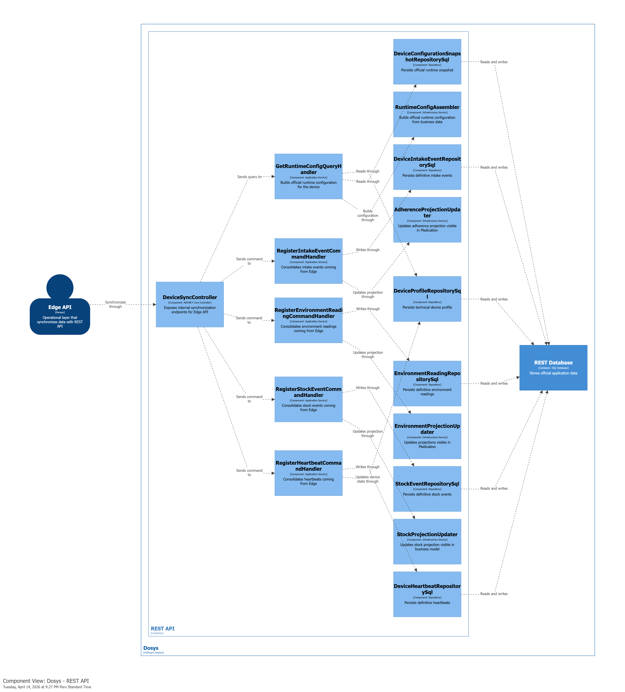

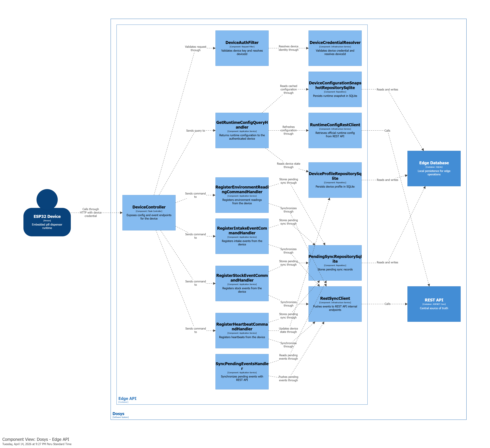

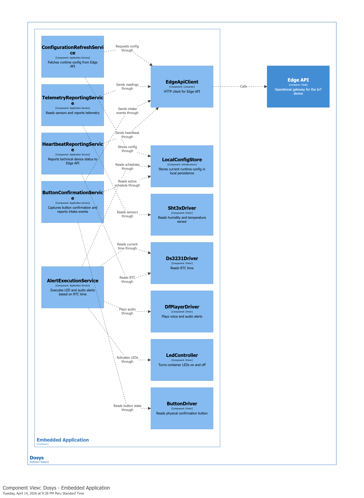

#### 4.2.3.6. Bounded Context Software Architecture Code Level Diagrams

##### 4.2.3.6.1. Bounded Context Domain Layer Class Diagrams

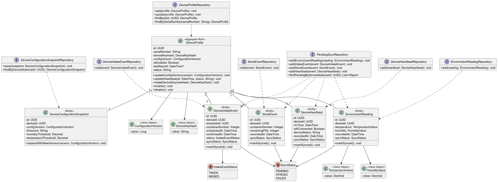

##### 4.2.3.6.2. Bounded Context Database Design Diagram

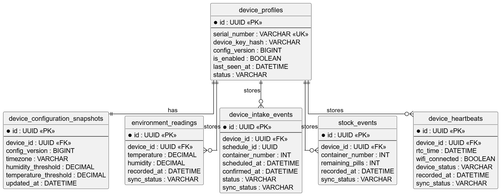

# Capítulo V: Solution UI/UX Design

En este capítulo se presenta el planteamiento de la propuesta de UX/UI Design para la experiencia de usuario a través de los productos digitales con los que interactúan los segmentos objetivo de Dosys (adulto mayor polimedicado, cuidador familiar y, en menor medida, el dispositivo IoT). El diseño parte del conjunto de User Stories y del Impact Map presentados en el Capítulo III, y traduce los Business Goals (ventas, adopción, adherencia y retención) en decisiones concretas de estilo, arquitectura de información, wireframes, mock-ups y prototipos. Todos los artefactos visuales de esta sección se encuentran centralizados en el archivo de Figma del equipo: [Figma — Dosys](https://www.figma.com/design/U7ZkWf3K7Tpnsx9BxFP7wY/Dosys?node-id=0-1&p=f).

## 5.1. Style Guidelines

En esta sección se establece el repositorio central de assets, tipografías, colores y reglas visuales compartidas por todo el equipo. El objetivo es mantener una presentación consistente entre el Landing Page, la Web Application y la interfaz física del dispositivo IoT, reduciendo divergencias estéticas entre productos y reforzando la identidad de marca de Dosys.

### 5.1.1. General Style Guidelines

**Branding.** Dosys se presenta como una marca cercana, confiable y asistencial. El nombre proviene de la contracción de *dose* + *system*, y comunica directamente la propuesta de valor: un sistema que organiza las dosis del adulto mayor. El logotipo se construye a partir de un wordmark en minúsculas y un isotipo de cápsula estilizada que evoca el formato del pastillero. La marca busca transmitir orden, claridad y serenidad, evitando elementos visuales agresivos o clínicos que puedan asociar el producto con un dispositivo médico de prescripción.

**Tono de comunicación.** El equipo adoptó las siguientes dimensiones de comunicación para todos los productos digitales:

| Dimensión | Posición de Dosys | Justificación |
| :--- | :--- | :--- |
| Divertido ←→ Serio | **Sereno / Cálido** (más cerca de serio) | Acompaña tareas de salud, requiere confianza. |
| Formal ←→ Casual | **Cercano** (más cerca de casual) | El usuario final (60+) y el cuidador prefieren un lenguaje natural, no clínico. |
| Respetuoso ←→ Irreverente | **Respetuoso** | Se evita el humor sobre olvidos o envejecimiento. |
| Entusiasta ←→ Sereno | **Sereno** | El producto reduce ansiedad; el tono debe reforzar tranquilidad, no urgencia. |

**Colors.** Se seleccionó una paleta basada en tonos calmados con un acento de acción claro, siguiendo principios de contraste WCAG 2.2 AA. Los colores oficiales del Design System Dosys son:

| Token | HEX | Uso |
| :--- | :--- | :--- |
| `primary-500` | `#2F6FED` | Color principal de marca, CTA primarios, foco activo, header. |
| `primary-700` | `#1F4FB8` | Hover y estados pressed sobre el primario. |
| `secondary-500` | `#10B981` | Confirmación de toma, dosis tomada, estados positivos. |
| `warning-500` | `#F59E0B` | Alertas de recarga, umbrales ambientales preventivos. |
| `danger-500` | `#DC2626` | Dosis omitida, fuera de rango crítico, errores de validación. |
| `neutral-900` | `#0F172A` | Texto principal sobre fondo claro. |
| `neutral-600` | `#475569` | Texto secundario, descripciones de apoyo. |
| `neutral-200` | `#E2E8F0` | Bordes suaves, separadores, fondos de tarjeta. |
| `neutral-50` | `#F8FAFC` | Fondo general de la aplicación. |
| `white` | `#FFFFFF` | Tarjetas, modales, superficies elevadas. |

El contraste entre `neutral-900` sobre `neutral-50` y `white` sobre `primary-500` supera 4.5:1, suficiente para texto normal según WCAG 2.2 AA, lo que es relevante para el segmento adulto mayor con posibles limitaciones visuales (W3C Web Accessibility Initiative, 2025).

**Typography.** El equipo seleccionó **Inter** como tipografía principal por su excelente legibilidad en pantallas y soporte completo de caracteres en español. La jerarquía tipográfica adoptada es:

| Rol | Tamaño base (web) | Peso | Uso |
| :--- | :--- | :--- | :--- |
| H1 | 40 px / 2.5 rem | 700 | Hero del landing, títulos de página. |
| H2 | 32 px / 2 rem | 600 | Secciones del landing, encabezados principales. |
| H3 | 24 px / 1.5 rem | 600 | Subsecciones, títulos de tarjeta. |
| Body L | 18 px / 1.125 rem | 400 | Texto principal de la web app (tamaño mínimo para legibilidad del adulto mayor). |
| Body M | 16 px / 1 rem | 400 | Texto secundario, descripciones. |
| Caption | 14 px / 0.875 rem | 500 | Etiquetas, metadata, timestamps. |

Se evitó deliberadamente usar tamaños inferiores a 14 px para texto significativo, en línea con las recomendaciones de accesibilidad para usuarios mayores.

**Spacing.** Se aplica una escala de espaciado en múltiplos de 4 px (4, 8, 12, 16, 24, 32, 48, 64) consistente con los frameworks utilizados (Tailwind / shadcn-ui). El radio de borde estándar de los elementos interactivos es 12 px para botones y 16 px para tarjetas, buscando una percepción amable y poco clínica.

**Iconografía.** Se utiliza la librería **lucide-react** por su trazo uniforme de 1.5 px, su estilo neutro y su buena cobertura semántica (medicación, hora, persona, dispositivo).

### 5.1.2. Web, Mobile and IoT Style Guidelines

**Web Style Guidelines.** La Web Application Dosys se construye con un enfoque **mobile-first** con breakpoints en 640 px (sm), 768 px (md) y 1024 px (lg). Los CTA primarios mantienen un tamaño mínimo de 44 × 44 px, alineado con las pautas de tamaño táctil de las HIG. La navegación principal en escritorio se ubica en un header superior fijo con avatar e ítems del menú; en mobile se colapsa en un sheet lateral activado por el icono de menú.

**Mobile Style Guidelines.** Aunque la aplicación móvil nativa no forma parte del alcance entregable de la TB1, la Web App está optimizada para ser usada desde el navegador móvil del cuidador. Se respetan zonas seguras del thumb-zone para acciones primarias (parte inferior de la pantalla en mobile), y se prioriza la verticalidad de los formularios para evitar zoom no deseado en campos con `font-size` ≥ 16 px.

**IoT Style Guidelines.** La interfaz física del pastillero combina cinco elementos visuales por compartimento: un anillo LED RGB con cuatro estados (apagado, ámbar pulsante para alerta activa, verde para confirmación de toma y rojo para alerta crítica), un botón mecánico de 12 mm con tapa redonda táctil, una etiqueta numérica grabada del 1 al 5, y un altavoz mono de 8 Ω para el recordatorio por voz. La interacción multimodal sigue siempre el orden: 1) voz → 2) LED → 3) confirmación por botón, lo que garantiza redundancia frente a limitaciones visuales o auditivas del usuario.

## 5.2. Information Architecture

En esta sección se documentan las decisiones que dirigen la organización del contenido del Landing Page y de la Web Application Dosys, con el objetivo de que los visitantes y usuarios se adapten con facilidad y encuentren la información que necesitan sin esfuerzo cognitivo adicional.

### 5.2.1. Organization Systems

| Tipo de contenido | Sistema de organización aplicado | Justificación |
| :--- | :--- | :--- |
| Secciones del Landing Page | **Jerárquico (visual hierarchy)** descendente: hero → beneficios → cómo funciona → precios → FAQ → contacto. | El visitante recorre la página de arriba hacia abajo y se busca llevarlo del *qué es* al *cómo lo adquiero*. |
| Onboarding del cuidador (alta de cuenta + vinculación del dispositivo + primer tratamiento) | **Secuencial (step-by-step)** de 3 pasos. | Reduce la carga cognitiva inicial; el cuidador no puede saltar pasos. |
| Lista de medicamentos por compartimento | **Matricial (compartimento × estado)** con vista de 5 tarjetas. | Reproduce el modelo mental del pastillero físico. |
| Historial de adherencia | **Cronológico inverso** (más reciente primero). | El cuidador necesita saber qué pasó *hoy* y *ayer* antes que la semana pasada. |
| Catálogo de FAQ | **Por tópicos** (Producto, Instalación, App, Soporte). | Permite escanear preguntas por área de interés. |

### 5.2.2. Labeling Systems

Las etiquetas se redactaron buscando el mínimo número de palabras y un vocabulario natural, sin terminología clínica. Las principales convenciones de etiquetado adoptadas son:

| Concepto del dominio | Etiqueta en UI |
| :--- | :--- |
| Medication Container | "Compartimento" / "Compartimento 1–5" |
| Medication Schedule | "Tratamiento" o "Horario" según contexto |
| Intake Record / Confirmación de toma | "Toma" |
| Environment Reading | "Ambiente" |
| Caregiver | "Cuidador" (rol del usuario logueado) |
| Patient | "Paciente" o nombre del adulto mayor |
| Device | "Pastillero" en UI de cara al usuario; "Device" sólo en panel técnico |

Las CTAs siguen verbo + objeto corto: *"Agregar medicamento"*, *"Vincular pastillero"*, *"Ver historial"*. Se evita el uso de etiquetas ambiguas como *"Enviar"* o *"OK"* sin contexto.

### 5.2.3. SEO Tags and Meta Tags

A continuación se especifican los SEO tags y meta tags asignados a las principales páginas. Estos valores se implementan en el `<head>` del Landing Page y en los `metadata` de Next.js de la Web App.

**Landing Page — Home (`/`)**

```html
<title>Dosys — Pastillero inteligente para adultos mayores</title>
<meta name="description" content="Dosys es un pastillero IoT con recordatorios por voz, LEDs y monitoreo de temperatura y humedad. Mejora la adherencia al tratamiento del adulto mayor en el hogar." />
<meta name="keywords" content="pastillero inteligente, IoT, adulto mayor, adherencia medicación, recordatorio medicamentos, Perú, cuidador" />
<meta name="author" content="Equipo Dosys — UPC" />
<meta property="og:title" content="Dosys — Pastillero inteligente para adultos mayores" />
<meta property="og:description" content="Recordatorios multimodales y monitoreo ambiental para tratamientos farmacológicos en casa." />
<meta property="og:type" content="website" />
<meta property="og:locale" content="es_PE" />
<meta name="robots" content="index, follow" />
```

**Landing Page — Precios (`/precios`)**

```html
<title>Precios | Dosys — Pastillero inteligente</title>
<meta name="description" content="Conoce los planes de adquisición de Dosys. Pago único, sin suscripción obligatoria." />
<meta name="keywords" content="precio pastillero inteligente, comprar Dosys, plan Dosys" />
```

**Web Application — Dashboard (`/`)**

```html
<title>Dosys — Panel del cuidador</title>
<meta name="description" content="Configura tratamientos, monitorea adherencia y revisa alertas ambientales de tu pastillero Dosys." />
<meta name="robots" content="noindex, nofollow" />
```

Las rutas autenticadas se marcan con `noindex, nofollow` para evitar indexación. Para una eventual publicación de la App móvil en stores se prevén los siguientes ASO elements: **App Title:** "Dosys — Pastillero del adulto mayor"; **App subtitle:** "Recordatorios y monitoreo"; **App keywords:** pastillero, adulto mayor, medicación, IoT, cuidador, adherencia; **App description:** versión extendida del meta description del landing.

### 5.2.4. Searching Systems

En esta primera versión, el volumen de información manejado por el cuidador es reducido (entre 1 y 5 medicamentos activos por paciente), por lo que no se requiere un buscador global en la Web App. Se ofrecen, en cambio, dos mecanismos de búsqueda contextual:

1. **Filtros en el historial de adherencia:** rango de fechas (últimas 24 h, últimos 7 días, últimos 30 días) y estado (confirmadas / omitidas / pospuestas).
2. **Búsqueda por nombre en el catálogo personal de medicamentos:** input de búsqueda con coincidencia parcial sin acentos.

Los resultados se muestran como una lista vertical con tarjetas que repiten la estructura visual del listado completo, para evitar disonancia entre el resultado filtrado y la vista por defecto. En el Landing Page no existe búsqueda; el visitante navega exclusivamente por scroll y por anclas del menú.

### 5.2.5. Navigation Systems

| Producto | Sistema de navegación | Componentes |
| :--- | :--- | :--- |
| Landing Page (desktop) | **Header fijo + anclas internas** | Logo + items: *Producto, Cómo funciona, Precios, FAQ, Contacto* + CTA "Iniciar sesión". |
| Landing Page (mobile) | **Header colapsable + menú hamburguesa** | Mismos items en un sheet lateral. |
| Web App | **Sidebar permanente (desktop) / Bottom-nav (mobile)** | *Inicio, Medicamentos, Ambiente, Historial, Perfil*. |
| Microflujos | **Breadcrumbs + back button explícito** | Por ejemplo, `Medicamentos › Compartimento 2 › Editar`. |

La navegación de la Web App refleja las rutas reales desplegadas en Vercel: `/`, `/medications`, `/medications/new`, `/medications/[containerNumber]`, `/medications/[containerNumber]/edit`, `/profile`. Esta correspondencia 1-a-1 entre Information Architecture y URLs facilita el mantenimiento y los enlaces compartidos.

## 5.3. Landing Page UI Design

La propuesta de UI para el Landing Page traduce las decisiones de Style Guidelines y la arquitectura de información en una página única con secciones ancladas. La intención es comunicar de forma progresiva: primero **qué es Dosys** (hero + propuesta de valor), luego **por qué importa** (beneficios), después **cómo se usa** (cómo funciona) y finalmente **cómo adquirirlo** (precios + contacto). El diseño aplica jerarquía visual con tipografía dominante en el hero y bloques de aire generoso entre secciones para no abrumar al visitante.

### 5.3.1. Landing Page Wireframe

Los wireframes del Landing Page se elaboraron en Figma utilizando una grilla de 12 columnas para desktop y 4 columnas para mobile. Se trabajaron en escala de grises para forzar al equipo a tomar decisiones de jerarquía y proximidad antes de aplicar color y estilo. Los wireframes están disponibles en el archivo de Figma del equipo: [Figma — Dosys › Landing › Wireframes](https://www.figma.com/design/U7ZkWf3K7Tpnsx9BxFP7wY/Dosys?node-id=0-1&p=f).

**Desktop Web Browser (1440 px).** Estructura: header sticky → hero a dos columnas (texto + ilustración del pastillero) → 3 cards de beneficios → bloque "Cómo funciona" en 3 pasos numerados → tabla de precios con 1 plan destacado → sección de FAQ acordeón → formulario de contacto a dos columnas → footer.

**Mobile Web Browser (375 px).** La misma secuencia se reorganiza en una columna vertical, con el menú colapsado en un sheet, y la ilustración del pastillero pasa por debajo del titular en lugar de a su costado.

La aplicación de los principios de diseño y arquitectura de información se observa en: el contraste fuerte del hero (jerarquía visual), la agrupación de 3 beneficios homogéneos (proximidad y similitud), la numeración explícita de "Cómo funciona" (organización secuencial) y el uso de un único CTA primario por sección (reducción de carga cognitiva).

### 5.3.2. Landing Page Mock-up

Sobre los wireframes aprobados se construyeron los mock-ups aplicando el Design System (colores, tipografía Inter, iconografía lucide y radios de borde 12/16 px). El mock-up del hero usa `primary-500` como fondo del CTA *"Conocer Dosys"* y un `neutral-50` general para el resto de la página, con tarjetas blancas elevadas para los bloques de beneficios. La sección "Cómo funciona" alterna fondo blanco y `neutral-50` para crear ritmo visual.

Los mock-ups finales pueden visualizarse en: [Figma — Dosys › Landing › Mock-ups](https://www.figma.com/design/U7ZkWf3K7Tpnsx9BxFP7wY/Dosys?node-id=0-1&p=f). La primera versión pública del Landing Page se encuentra desplegada mediante GitHub Pages y está disponible en: [https://dosys-iot.github.io/landing/](https://dosys-iot.github.io/landing/). Esta versión implementa la propuesta visual definida en los mock-ups y funciona como punto de entrada informativo para los visitantes del producto.

## 5.4. Applications UX/UI Design

En esta sección se documenta la propuesta visual y de interacción para la Web Application Dosys, que en TB1 cubre los flujos de gestión de medicamentos y monitoreo ambiental por parte del cuidador. La aplicación está desplegada en `https://frontend-web-jet-seven.vercel.app` y se conecta vía REST a la API `dosys-backend` desplegada en Google Cloud Run.

### 5.4.1. Applications Wireframes

Los wireframes principales de la Web App, agrupados por user goal del cuidador (Carlos Mendoza Ríos), son:

1. **Login / Registro de cuenta** — Formulario centrado, dos campos + CTA primario y un enlace secundario "¿Olvidaste tu contraseña?".
2. **Onboarding — Vinculación del pastillero** — 3 pasos: ingresar ID del dispositivo → confirmar conexión → asignar alias al paciente.
3. **Dashboard / Inicio** — Vista resumen con próxima dosis, estado del dispositivo (online/offline) y últimas dos lecturas ambientales.
4. **Listado de Medicamentos** — Cinco tarjetas verticales (una por compartimento) con nombre del medicamento, horario y estado.
5. **Detalle de Compartimento** — Resumen del medicamento, horario y botón *"Editar"* / *"Eliminar"*.
6. **Nuevo Medicamento** — Formulario en 1 pantalla: nombre + frecuencia + hora + compartimento + duración del tratamiento.
7. **Ambiente** — Gráfico de temperatura y humedad de las últimas 24 h.
8. **Historial de Adherencia** — Lista cronológica con filtros por rango y por estado.
9. **Perfil** — Datos de la cuenta, paciente vinculado y configuración del dispositivo (volumen, etc.).

Todos los wireframes están en Figma › Apps › Wireframes y respetan la grilla 4-col mobile / 12-col desktop, el thumb-zone para acciones primarias y la jerarquía tipográfica del Style Guide.

### 5.4.2. Applications Wireflow Diagrams

A continuación se especifica un wireflow por User Goal del cuidador. Cada wireflow representa los pasos como wireframes y reflejaa los cambios de estado de pantalla. Los diagramas completos están disponibles en Figma › Apps › Wireflows.

| User Goal | Resumen del wireflow |
| :--- | :--- |
| *"Como cuidador quiero registrar un nuevo medicamento y asignarlo a un compartimento"* | Inicio → tap "+" en Medicamentos → formulario *Nuevo Medicamento* → seleccionar compartimento libre → seleccionar hora → confirmar → vista del compartimento con el medicamento ya asignado. |
| *"Como cuidador quiero ver el cumplimiento de la última semana"* | Inicio → tap "Historial" → filtro "Últimos 7 días" → lista de tomas con su estado (TAKEN / MISSED / SNOOZED). |
| *"Como cuidador quiero saber si la humedad del pastillero subió hoy"* | Inicio → tap "Ambiente" → gráfico 24 h → tap en pico fuera de rango → tarjeta de detalle con timestamp y valor. |
| *"Como cuidador quiero vincular un pastillero a mi cuenta"* | Login → Onboarding paso 1 (ID) → paso 2 (validación con backend) → paso 3 (alias) → Dashboard. |

Cada wireflow se complementa en Figma con una nota textual del User Goal y una explicación del flujo.

### 5.4.2. Applications Mock-ups

Los mock-ups aplican el Design System sobre los wireframes anteriores. Se reutilizan los componentes definidos en la librería compartida (Button, Input, Card, EmptyState, ScheduleCard, EnvironmentChart, StatusPill). Los estados visuales clave son:

- **Empty state** — Cuando un compartimento está vacío: ilustración minimalista, texto "Compartimento libre" y CTA secundario *"Agregar medicamento"*.
- **Loading state** — Skeleton de tarjeta con shimmer de 800 ms.
- **Error state** — Toast `danger-500` con mensaje breve y enlace de reintento.
- **Success state** — Toast `secondary-500` tras una acción confirmada.

Los mock-ups finales están disponibles en Figma › Apps › Mock-ups.

### 5.4.3. Applications User Flow Diagrams

Los User Flows son la versión consolidada de los Wireflows: incluyen los mock-ups (no sólo wireframes) y agregan rutas alternativas (unhappy paths). Por cada User Goal del segmento cuidador se elaboró un user flow en Figma con la siguiente estructura:

- **Happy path** — secuencia esperada del usuario.
- **Unhappy paths** — campos vacíos, error de red al consultar `dosys-backend`, compartimento ya ocupado, ID de dispositivo inválido al vincular, sesión expirada.
- **Decisiones** — rombos que representan condiciones (existencia de medicamento, validez del horario, etc.).

Por ejemplo, el User Flow *"Registrar nuevo medicamento"* incluye como unhappy paths: (a) intento de asignar un compartimento ya ocupado → modal de confirmación de reemplazo; (b) hora inválida (formato incorrecto) → mensaje inline en el input; (c) error 500 del backend → toast con reintento manual. Todos los User Flows están consolidados en Figma › Apps › User Flows.

## 5.5. Applications Prototyping

El prototipado interactivo se realizó sobre los mock-ups en Figma utilizando el modo Prototype, con transiciones *Smart Animate* para los cambios de estado dentro de una misma vista y *Instant* para los cambios de pantalla, buscando una percepción de respuesta inmediata coherente con la baja latencia esperada del backend en Cloud Run.

Las decisiones clave de interacción son:

- **Navegación principal** — En desktop, click directo en el sidebar; en mobile, tap en bottom-nav con feedback visual de 150 ms (corresponde al sistema de navegación definido en 5.2.5).
- **Confirmaciones críticas** — Acciones irreversibles (eliminar medicamento, desvincular pastillero) usan modal con doble confirmación, no toast.
- **Feedback de toma confirmada** — Animación de check verde (`secondary-500`) de 600 ms tras presionar el botón físico, sincronizada con el cambio de estado vía MQTT (tópico `dosys/devices/{id}/intake`).

El prototipo cubre los principales flujos de User Flow Diagrams. El screenshot representativo y el enlace al video de demostración del prototipo se incluirán en la sección 6.2.1.6 (Execution Evidence) y se publicarán en Microsoft Stream/Clipchamp.

> **Pendiente del equipo:** subir a Microsoft Stream/Clipchamp el video de navegación del prototipo y completar aquí el screenshot + URL antes del envío final.

## 5.6. IoT Device Design

El dispositivo IoT Dosys integra elementos físicos cuya disposición refleja las decisiones de arquitectura de información (compartimento como unidad básica de organización matricial) y la guía de estilos para IoT Device Physical Interfaces (5.1.2).

**Principales criterios de diseño físico:**

1. **Visibilidad y separación clara de los 5 compartimentos**, con un anillo LED de color por compartimento y una etiqueta grabada con el número.
2. **Botones físicos grandes (12 mm)**, fácilmente alcanzables por una persona con motricidad fina reducida (W3C Web Accessibility Initiative, 2025).
3. **Altavoz frontal** orientado hacia el usuario, para que el recordatorio de voz no se vea obstruido.
4. **Indicador global de estado** (LED de conexión) en el frente del dispositivo, separado de los 5 LEDs de compartimento, para evitar confusión semántica entre "alerta de dosis" y "estado de red".
5. **Sensores de temperatura y humedad (DHT22)** alojados internamente con ventilación lateral, no expuestos al usuario.

**Diagrama de circuito (alto nivel).** El microcontrolador ESP32 actúa como cerebro y se comunica con: el sensor DHT22 (temperatura y humedad), un módulo RTC DS3231 (reloj de tiempo real para mantener la hora aunque caiga la red), un amplificador de audio + DAC para la salida por altavoz, cinco LEDs RGB en serie WS2812B (uno por compartimento) y cinco pulsadores momentáneos conectados a entradas digitales con resistencia pull-up interna del ESP32. La conexión a internet se realiza por WiFi para publicar y suscribirse a tópicos MQTT en HiveMQ Cloud (ver 6.1.4).

Los diagramas físicos (vista frontal, vista superior y vista lateral) y el esquemático del circuito están elaborados en Figma › IoT › Device Design. El diagrama de comunicación MQTT entre el dispositivo y el Edge Service se documenta en la sección 6.1.4 (Software Deployment Configuration) junto con la evidencia de despliegue.

# Capítulo VI: Product Implementation, Validation & Deployment

En este capítulo se documenta el proceso de implementación, pruebas, despliegue y validación de la solución Dosys. La solución se compone de cuatro productos digitales que se comunican entre sí: el **Landing Page** (sitio estático informativo), el **Frontend Web Application** (panel del cuidador, Next.js), el **Backend REST API** (Spring Boot, expone los servicios del negocio sobre PostgreSQL) y el **Edge Service** (Flask + paho-mqtt, puente entre los dispositivos ESP32 vía MQTT y el Backend REST). Cada producto tiene su propio repositorio en la organización `Dosys-IoT` de GitHub. En esta primera entrega (TB1) el proceso se organizó en el **Sprint 1**, cuyo alcance abarcó las funcionalidades de presencia digital, autenticación, gestión de medicamentos y monitoreo ambiental para el cuidador.

## 6.1. Software Configuration Management

En esta sección se documentan las decisiones y convenciones que el equipo Dosys aplica para mantener consistencia durante el ciclo de vida de los productos digitales: configuración del entorno de desarrollo, gestión del código fuente con GitHub + GitFlow, guía de estilo de código y configuración del despliegue.

### 6.1.1. Software Development Environment Configuration

A continuación se especifican los productos de software adoptados por el equipo para cada tipo de actividad del ciclo de vida, respetando los constraints del curso.

| Actividad | Producto | Propósito en el proyecto | Ruta de referencia / descarga |
| :--- | :--- | :--- | :--- |
| **Project Management** | Trello | Sprint Backlog y tablero Kanban (To-Do / In-Process / To-Review / Done). | https://trello.com |
| **Project Management** | Discord | Comunicación diaria del equipo, dailies asíncronos y ceremonias Scrum. | https://discord.com |
| **Requirements Management** | UXPressia | Elaboración de User Personas, Empathy Maps, Customer Journey Maps e Impact Maps. | https://uxpressia.com |
| **Requirements Management** | Miro | Big Picture EventStorming y Design-Level EventStorming. | https://miro.com |
| **Requirements Management** | LucidChart | Diagrama de EventStorming consolidado y diagramas auxiliares. | https://www.lucidchart.com |
| **Product UX/UI Design** | Figma | Style Guidelines, wireframes, mock-ups, wireflows, user flows y prototipos interactivos. | https://www.figma.com |
| **Software Architecture** | Structurizr | Diagramas C4 (System Landscape, Context, Container, Deployment) del sistema. | https://structurizr.com |
| **Software Development (Backend)** | IntelliJ IDEA Ultimate | IDE principal para el desarrollo Java/Spring Boot del Backend REST API. | https://www.jetbrains.com/idea |
| **Software Development (Frontend)** | Visual Studio Code | IDE para Next.js/TypeScript del Frontend Web y del Landing. | https://code.visualstudio.com |
| **Software Development (Edge)** | Visual Studio Code + Python extension | IDE para el Edge Service en Python/Flask. | https://code.visualstudio.com |
| **Software Development (IoT)** | PlatformIO sobre VS Code | IDE para el firmware del pastillero (ESP32 / C++). | https://platformio.org |
| **Lenguajes y runtimes** | Java 21, Node.js 20 LTS, Python 3.12 | Runtimes oficiales para Backend, Frontend y Edge. | https://adoptium.net · https://nodejs.org · https://www.python.org |
| **Build tools** | Maven 3.9, npm 10, pip 24 | Build y gestión de dependencias. | Incluidos en cada runtime. |
| **API Testing** | Postman | Pruebas manuales de los endpoints REST y de los flujos del Edge. | https://www.postman.com |
| **API Documentation** | SpringDoc OpenAPI (Swagger UI) | Documentación interactiva del Backend, expuesta en `/swagger-ui/index.html`. | Dependencia Maven `springdoc-openapi-starter-webmvc-ui`. |
| **Database (cloud)** | Supabase (PostgreSQL 15) | Base de datos relacional gestionada del Backend. | https://supabase.com |
| **MQTT Broker (cloud)** | HiveMQ Cloud (Free plan) | Broker MQTT que conecta el pastillero con el Edge Service. | https://www.hivemq.com/products/mqtt-cloud-broker |
| **Compute (cloud)** | Google Cloud Run | Hosting serverless del Backend REST API y del Edge Service. | https://cloud.google.com/run |
| **Compute (cloud)** | Vercel | Hosting del Frontend Web Application (Next.js). | https://vercel.com |
| **Static Hosting** | GitHub Pages | Hosting del Landing Page.  Despliegue público del Landing Page estático. | https://dosys-iot.github.io/landing/ |
| **Source Code Management** | GitHub (org `Dosys-IoT`) | Repositorios, code review por Pull Requests y GitHub Actions para CI. | https://github.com/Dosys-IoT |
| **Software Testing** | JUnit 5 + Spring Boot Test + MockMvc | Tests de integración del Backend. | Incluido en `spring-boot-starter-test`. |
| **Software Documentation** | Markdown + GitHub | README por repositorio e informe principal de la solución. | https://www.markdownguide.org |

### 6.1.2. Source Code Management

El equipo utiliza **GitHub** como sistema de control de versiones. La organización del código está distribuida en cuatro repositorios públicos bajo la organización `Dosys-IoT`, uno por producto digital, lo que facilita los despliegues independientes y la trazabilidad de los cambios:

| Producto | Repositorio GitHub | Despliegue actual |
| :--- | :--- | :--- |
| Landing Page | https://github.com/Dosys-IoT/landing | https://dosys-iot.github.io/landing/ |
| Frontend Web Application | https://github.com/Dosys-IoT/frontend-web | https://frontend-web-jet-seven.vercel.app |
| Backend REST API (Web Services) | https://github.com/Dosys-IoT/backend | https://dosys-backend-149855215912.us-central1.run.app |
| Edge Service | https://github.com/Dosys-IoT/edge | https://dosys-edge-149855215912.us-central1.run.app |

El repositorio del Backend incluye, dentro del mismo proyecto Maven, los archivos de pruebas unitarias y de integración bajo `src/test/java/com/dosys/platform/**`, en línea con la práctica recomendada por Spring Boot.

**GitFlow.** El equipo adopta GitFlow (Driessen, 2010) como Workflow de control de versiones. La estructura de ramas que se aplicará durante el ciclo de vida de los repositorios es:

- `main` — Rama de producción. Contiene únicamente las versiones desplegadas. Está protegida (no se permite push directo).
- `develop` — Rama de integración. Recibe los merges de las feature branches al cerrar cada User Story.
- `feature/<scope>-<short-description>` — Una rama por feature. Convención: `feature/medication-create-schedule`, `feature/landing-pricing-section`. Se crea desde `develop` y se mergea de vuelta vía Pull Request.
- `release/<version>` — Rama de estabilización antes de un release. Se crea desde `develop`, sólo se aceptan fixes, y al finalizar se mergea a `main` y de vuelta a `develop`.
- `hotfix/<short-description>` — Rama de corrección urgente sobre producción. Se crea desde `main`, se mergea a `main` y a `develop`.

**Semantic Versioning.** Los releases siguen `MAJOR.MINOR.PATCH` (Preston-Werner, s.f.). La versión inicial publicada al cierre del Sprint 1 será `v0.1.0` para Backend, Edge, Frontend y Landing, marcada como Git tag en cada repositorio.

**Conventional Commits.** Los mensajes de commit siguen el estándar `<type>(<scope>): <subject>` (Conventional Commits, s.f.). Los `type` permitidos son `feat`, `fix`, `chore`, `docs`, `test`, `refactor`, `style`, `perf`, `ci`, `build`. Ejemplos del repositorio Backend:

```
feat(medication): add schedule create and update endpoints
fix(access): return 401 when token is missing
chore: main backend logic
test(device): cover heartbeat ingestion happy path
```

### 6.1.3. Source Code Style Guide & Coding Conventions

Para todos los lenguajes de la solución se aplica nomenclatura en inglés. Las convenciones por lenguaje son:

| Lenguaje / archivo | Referencia adoptada | Reglas clave |
| :--- | :--- | :--- |
| **Java 21** (Backend) | Google Java Style Guide | 4-space indent, `UpperCamelCase` para clases, `lowerCamelCase` para métodos y campos, paquetes en minúscula (`com.dosys.platform.medication`). Bounded contexts como paquetes raíz. |
| **HTML / CSS** (Landing) | Google HTML/CSS Style Guide | Etiquetas en minúscula, atributos entre comillas dobles, clases en `kebab-case`. |
| **TypeScript / React** (Frontend) | Google TypeScript Style Guide + reglas de `eslint-config-next` | `PascalCase` para componentes, `camelCase` para hooks/funciones, archivos de componentes `MyComponent.tsx`. |
| **Tailwind CSS** | Convención utility-first, orden alfabético controlado por `prettier-plugin-tailwindcss`. | — |
| **Python 3.12** (Edge) | PEP 8 + Black formatter | `snake_case` para funciones y variables, `PascalCase` para clases, máximo 88 caracteres por línea (default de Black). |
| **C++ / Arduino** (Firmware ESP32) | Google C++ Style Guide (adaptado) | `snake_case` para variables, `PascalCase` para clases. |
| **Gherkin** (`.feature` files) | Gherkin Conventions for Readable Specifications | Una capacidad por archivo, escenarios en inglés, Given-When-Then en pretérito imperfecto. |
| **Spring Boot** | Spring Boot Features (referencia oficial) | Configuración por `application.yml` con perfiles `local`, `test` y `prod`. Inyección por constructor, no por campo. |

El Backend aplica adicionalmente una organización **Hexagonal / DDD** consistente con el Capítulo IV: cada bounded context (`access`, `medication`, `device`) expone subpaquetes `domain`, `application`, `infrastructure` e `interfaces/rest`, con un paquete transversal `shared` para configuración, excepciones y seguridad.

### 6.1.4. Software Deployment Configuration

A continuación se documenta la configuración real del despliegue para cada producto digital de la solución Dosys, incluyendo los pasos necesarios para llevar un commit en `main` hasta un despliegue público funcional.

**Topología general (Deployment Diagram — C4 nivel 4 resumido).**

```
[ESP32 Pastillero]  --MQTT/TLS (HiveMQ Cloud)-->  [dosys-edge (Cloud Run, Flask + paho-mqtt)]
                                                            |
                                                            |  HTTPS internal (EDGE_SERVICE_KEY)
                                                            v
[Navegador del Cuidador]  --HTTPS-->  [dosys-frontend-web (Vercel, Next.js)]
                                                            |
                                                            |  HTTPS (JWT Bearer)
                                                            v
                                              [dosys-backend (Cloud Run, Spring Boot)]
                                                            |
                                                            |  PostgreSQL/TLS (5432)
                                                            v
                                              [Supabase PostgreSQL 15 — schema `public`]
[Visitante del Landing] --HTTPS--> [dosys-landing (GitHub Pages, HTML5 + CSS3 + JavaScript)]
```

El Deployment Diagram en versión C4 oficial se encuentra en `imgs/software-architecture/deployment-diagrams.png` (referenciado en 4.1.3.3).

**1) Backend REST API (`dosys-backend`).**

- Repositorio: `Dosys-IoT/backend`. Stack: Spring Boot 3.3.5, Java 21, Maven.
- Build local: `./mvnw clean package`.
- Deploy: Google Cloud Run, región `us-central1`, autoscaling 0–3 instancias, 1 vCPU, 512 MiB, timeout 300 s, concurrency 80. Imagen construida con Cloud Build a partir del código fuente: `gcloud run deploy dosys-backend --source . --region us-central1 --allow-unauthenticated`.
- Imagen actual: `us-central1-docker.pkg.dev/dosys-rest-api/cloud-run-source-deploy/dosys-backend@sha256:0e379ab3c04c811dca…` (revisión `dosys-backend-00001-ksq`).
- URL pública: https://dosys-backend-149855215912.us-central1.run.app
- Base de datos: Supabase PostgreSQL, proyecto `Dosys`, schema `public`, migraciones aplicadas con Flyway (`V1__create_users_table.sql`, `V2__create_medication_tables.sql`, `V3__device_internal_support.sql`, `V4__allow_multiple_devices_per_user.sql`).

**2) Edge Service (`dosys-edge`).**

- Repositorio: `Dosys-IoT/edge`. Stack: Python 3.12, Flask 3, paho-mqtt 2, peewee, SQLite local (`edge.db`) para buffering offline.
- Funciona como puente entre HiveMQ Cloud y el Backend: se suscribe a `dosys/devices/+/environment`, `…/intake`, `…/stock`, `…/heartbeat` y `…/config/request`, normaliza el payload y reenvía vía REST autenticado (`EDGE_SERVICE_KEY`) hacia `/api/v1/device/internal/...` del Backend.
- Deploy: Cloud Run, región `us-central1`, dos revisiones (`dosys-edge-00001-g4b`, `dosys-edge-00002-5qt`), autoscaling 1–3, billing instance-based para mantener la suscripción MQTT activa.
- URL pública: https://dosys-edge-149855215912.us-central1.run.app · Health check: `GET /edge/v1/health` → `{"status":"UP"}`.
- Broker MQTT: HiveMQ Cloud (organización `Sigilo`, cluster `Free #1`), puerto 8883 TLS.

**3) Frontend Web Application (`dosys-frontend-web`).**

- Repositorio: `Dosys-IoT/frontend-web`. Stack: Next.js 15, React 19, TypeScript 5, Tailwind 4, shadcn-ui (Radix + lucide-react), TanStack Query, Zod.
- Build local: `npm install && npm run build`.
- Deploy: Vercel, framework preset Next.js, root directory `./`, variable de entorno `NEXT_PUBLIC_API_BASE_URL=https://dosys-backend-149855215912.us-central1.run.app`. Despliegue automático en cada push a `main`.
- URL pública: https://frontend-web-jet-seven.vercel.app (dominios alternativos `frontend-web-git-main-miguels-projects-…vercel.app` y preview generados por commit).
- Build observado: 71 líneas de log, build completado en 58 s, output prerenderizado para rutas estáticas (`/dashboard`, `/profile`) y dinámicas SSR para `/medications/[containerNumber]`.

**4) Landing Page (`dosys-landing`).**

- Repositorio: `Dosys-IoT/landing`. Stack previsto: HTML/CSS/JS estático (alternativamente Next.js Static Export).
- Deploy: GitHub Pages. El Landing referencia los videos About-the-Product y About-the-Team alojados en YouTube y consume el formulario de contacto del Frontend.

**Pasos resumidos del proceso de despliegue (de commit a producción).**

1. El desarrollador crea una feature branch desde `develop` y abre PR contra `develop`.
2. El PR ejecuta los checks de CI (build + tests + lint).
3. Tras la aprobación, se mergea a `develop` y se valida en preview deploys (Vercel) o entorno de staging.
4. Para promover a producción, `develop` se mergea a `main` vía `release/x.y.z`.
5. El push a `main` dispara: GitHub Pages para el Landing Page, Vercel re-deploy para el Frontend Web Application y despliegue manual con `gcloud run deploy --source .` para Backend y Edge.
6. Se verifica el health check del Backend (`/actuator/health`), del Edge (`/edge/v1/health`), del Frontend (`/`) y del Landing (`/`).

## 6.2. Landing Page, Services & Applications Implementation

### 6.2.1. Sprint 1

En esta sección se registra el avance del Sprint 1 del proyecto Dosys, en términos de producto desplegado, responsabilidades por aspecto y trabajo colaborativo. El alcance del Sprint cubrió la primera versión del **Landing Page**, la primera versión del **Frontend Web Application** con registro, login, dashboard y gestión de medicamentos, el **Backend REST API** con los tres bounded contexts principales (**Access**, **Medication** y **Device**) y el **Edge Service** como capa operativa de integración entre el dispositivo IoT, MQTT y la REST API.

El Sprint 1 permitió demostrar el flujo base de la solución: presencia digital del producto, acceso del cuidador, configuración inicial de medicamentos, visualización desde la aplicación web, documentación de servicios backend y validación inicial de la comunicación entre Edge Service y Backend REST API.

#### 6.2.1.1. Sprint Planning 1

La reunión de Sprint Planning del Sprint 1 se llevó a cabo de forma virtual al inicio del ciclo de implementación. A continuación se presenta el cuadro resumen.

| Sprint # | Sprint 1 |
| :--- | :--- |
| **Sprint Planning Background** | |
| Date | 2026-04-21 |
| Time | 07:30 PM |
| Location | Reunión virtual por Discord (canal `#dosys-scrum`). |
| Prepared By | Zúñiga Murillo, Diego Sebastián |
| Attendees (to planning meeting) | Martel Zevallos, Gabriel Aristóteles / Oblitas Davila, Mariano Moises / Qqueso Rodriguez, Britney Delhy / Ybañez Esquerre, Miguel Angel / Zúñiga Murillo, Diego Sebastián |
| **Sprint n – 1 Review Summary** | No aplica. Sprint 1 es el primer Sprint de implementación; en las semanas previas (AV1) el equipo se enfocó en Requirements Elicitation & Analysis, Requirements Specification y Solution Software Design, sin entregables de producto desplegado. |
| **Sprint n – 1 Retrospective Summary** | No aplica. Como retrospectiva inicial, el equipo acordó: (a) mantener dailies asíncronos por Discord, (b) usar Conventional Commits desde el primer commit, (c) sincronizar el Trello al cierre de cada sesión de trabajo para evitar Work Items huérfanos y (d) asignar líderes por aspecto para evitar duplicidad de responsabilidades. |
| **Sprint Goal & User Stories** | |
| **Sprint 1 Goal** | *Our focus is on entregar la primera versión desplegada de los cuatro productos digitales de Dosys: Landing Page, Frontend Web Application, Backend REST API y Edge Service. El Sprint cubre la presencia digital del producto, los flujos básicos del cuidador, la configuración inicial de medicamentos, la exposición de endpoints documentados y la validación inicial del flujo IoT mediante Edge Service. We believe it delivers un MVP demostrable y verificable de extremo a extremo, desde la presentación pública del producto hasta la integración técnica entre dispositivo, Edge, Backend y Web App. This will be confirmed when el Landing Page esté publicado en GitHub Pages, el Frontend Web esté desplegado en Vercel, el Backend REST API exponga sus endpoints documentados y el Edge Service pueda comunicarse con el Backend para registrar eventos o consultar configuración operativa.* |
| **Sprint 1 Velocity** | 38 Story Points (capacidad acordada por el equipo para 3 semanas de Sprint con 5 integrantes). 131 horas |
| **Sum of Story Points** | 38 Story Points (ver Sprint Backlog en 6.2.1.3). |


#### 6.2.1.2. Aspect Leaders and Collaborators

Los aspectos principales tomados en cuenta en el Sprint 1 corresponden a los productos digitales y responsabilidades técnicas de la solución: **Landing Page**, **UX/UI Design**, **Frontend Web**, **Bounded Context Access** (Backend), **Bounded Context Medication** (Backend), **Bounded Context Device** (Backend) y **Edge Service**. La matriz LACX a continuación designa para cada aspecto un líder (L), responsable de la coordinación técnica o funcional, y uno o varios colaboradores (C), encargados de apoyar tareas específicas dentro de ese aspecto.

| Team Member (Last Name, First Name) | GitHub Username | Landing Page | UX/UI Design | Frontend Web | BC Access | BC Medication | BC Device | Edge Service |
| :--- | :--- | :---: | :---: | :---: | :---: | :---: | :---: | :---: |
| Ybañez Esquerre, Miguel Angel | Miguel080902 | C | C | **L** | C | C | C | C |
| Martel Zevallos, Gabriel Aristóteles | GaboMartel | C | **L** | C | C | C | C | C |
| Oblitas Davila, Mariano Moises | Sigilo-dev | C | C | C | **L** | **L** | **L** | **L** |
| Qqueso Rodriguez, Britney Delhy | brit2801 | **L** | C | C | C | C | C | C |
| Zúñiga Murillo, Diego Sebastián | DekayDeCanela | C | C | C | C | C | C | C |

La distribución permite separar claramente las responsabilidades del Sprint 1. Britney Qqueso lidera el Landing Page y su despliegue público en GitHub Pages. Gabriel Martel lidera el diseño UX/UI y la coherencia visual de la experiencia. Miguel Ybañez lidera el Frontend Web Application. Mariano Oblitas lidera Backend REST API, los bounded contexts Access, Medication y Device, además del Edge Service. Diego Zúñiga coordina la revisión de calidad, documentación, evidencias y validación general del Sprint.


#### 6.2.1.3. Sprint Backlog 1

El objetivo principal del Sprint 1 es habilitar el flujo end-to-end del cuidador, desde la presencia digital del producto hasta la validación inicial del monitoreo ambiental mediante Backend REST API, Edge Service y Frontend Web Application. Esto requiere entregar simultáneamente el **Landing Page**, el **Frontend Web Application**, el **Backend REST API**, el **Edge Service** y los artefactos UX/UI necesarios para sustentar la experiencia de usuario documentada en el Capítulo V.

El board público del Sprint en Trello se encuentra en:

[Tablero Trello - Dosys Sprint 1](https://trello.com/invite/b/6a036e846a4d8ea6aff7ef88/ATTId4b95b76c4608ccf51f26149c388f3f8D9C85654/dosys-sprint-1)

<div align="center">
  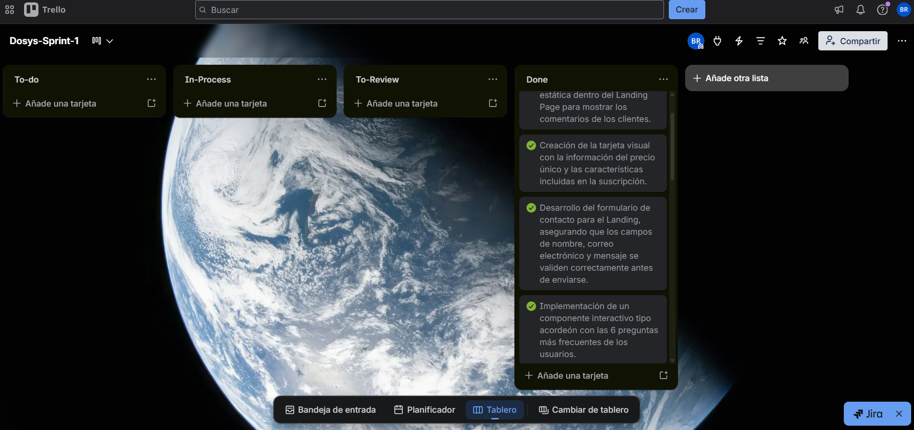
  <p><i>Figura: Vista general del tablero Trello y distribución de Work Items para el Sprint 1.</i></p>
</div>

| Sprint # | Sprint 1 |
| :--- | :--- |

| User Story Id | User Story Title | Work-Item Id | Work-Item Title | Description | Estimation (Hours) | Assigned To | Status |
| :--- | :--- | :--- | :--- | :--- | :--- | :--- | :--- |
| US01 | Información del Producto | WI01 | Hero + características del Landing | Implementar hero, beneficios y sección "Cómo funciona" del Landing Page. | 6 | Britney | Done |
| US16 | Sección de Beneficios | WI02 | Beneficios y casos de uso | Implementar sección estática de beneficios, casos de uso y propuesta de valor para cuidadores. | 4 | Britney | Done |
| US20 | Visualización de Precio | WI03 | Sección de precios | Implementar card de precio único o adquisición del dispositivo Dosys en el Landing Page. | 3 | Britney | Done |
| US02 | Formulario de Contacto | WI04 | Formulario de contacto + validación | Implementar formulario básico con nombre, correo y mensaje, incluyendo validación del lado del cliente. | 4 | Britney | Done |
| US23 | Soporte Técnico (FAQ) | WI05 | FAQ acordeón | Implementar sección de preguntas frecuentes para resolver dudas básicas de instalación, uso y contacto. | 3 | Britney | Done |
| — | UX/UI Design | WI06 | Wireframes de aplicaciones | Elaborar wireframes principales para los flujos de autenticación, dashboard, medicamentos, ambiente y perfil del cuidador. | 5 | Gabriel | Done |
| — | UX/UI Design | WI07 | Mock-ups de aplicaciones | Elaborar mock-ups visuales de las pantallas principales del Frontend Web y Mobile Application según la identidad visual de Dosys. | 6 | Gabriel | Done |
| — | UX/UI Design | WI08 | User flows y wireflows | Documentar los flujos principales del cuidador: registro, login, vinculación, gestión de medicamento, consulta ambiental y revisión de adherencia. | 5 | Gabriel | Done |
| US03 | Registro de Cuidador | WI09 | Endpoint `/api/v1/access/register` | Implementar registro de usuario con nombre, email y password en el Backend REST API. | 5 | Mariano | Done |
| TS01 | API de Autenticación | WI10 | Endpoint `/api/v1/access/login` + JWT | Implementar autenticación mediante credenciales y emisión de JWT para sesiones del cuidador. | 6 | Mariano | Done |
| US03 | Registro de Cuidador | WI11 | Pantallas Register / Login en Frontend Web | Implementar formularios de registro e inicio de sesión e integrarlos con los endpoints del bounded context Access. | 6 | Miguel | Done |
| US21 | Recuperación de Contraseña | WI12 | UI básica "olvidé mi contraseña" | Implementar la interfaz inicial de recuperación de contraseña. El endpoint queda diferido para Sprint 2. | 2 | Miguel | To-Review |
| US04 | Vinculación IoT | WI13 | Endpoint de vinculación de dispositivo | Implementar endpoint para crear o asociar un dispositivo Dosys al usuario autenticado. | 4 | Mariano | Done |
| US04 | Vinculación IoT | WI14 | UI de vinculación en Frontend Web | Implementar pantalla de onboarding para registrar o vincular el código del pastillero. | 4 | Miguel | Done |
| US05 | Registro de Medicina | WI15 | Endpoint `/devices/{id}/containers/{n}` (PUT) | Implementar actualización de compartimentos con medicamento, dosis, cantidad restante y estado habilitado. | 5 | Mariano | Done |
| US06 | Programación de Dosis | WI16 | Endpoints `/devices/{id}/schedules` | Implementar creación, edición, listado y eliminación de horarios de medicación. | 6 | Mariano | Done |
| US07 | Asignación de Compartimento | WI17 | UI de cinco tarjetas de compartimentos | Implementar vista matricial de compartimentos con estado, medicamento asignado y acciones principales. | 5 | Miguel | Done |
| US08 | Consulta de Adherencia | WI18 | Endpoint `/devices/{id}/adherence/calendar` | Implementar reporte de tomas confirmadas y omitidas para consulta del cuidador. | 5 | Mariano | Done |
| TS02 | API de Sincronización de Calendario | WI19 | Endpoint `/device/internal/{id}/runtime-config` | Implementar endpoint interno para entregar configuración runtime del dispositivo al Edge Service. | 4 | Mariano | Done |
| US11 | Monitoreo de Humedad | WI20 | Endpoint `/device/internal/{id}/environment-readings` | Implementar recepción de lecturas ambientales y cálculo de estado de riesgo. | 4 | Mariano | Done |
| US12 | Alerta de Temperatura | WI21 | Endpoints `/environment/latest` y `/environment/history` | Implementar consulta de última lectura ambiental e historial para visualización en la Web App. | 3 | Mariano | Done |
| US22 | Reporte de Temperatura (App) | WI22 | UI gráfico ambiente | Implementar componente visual para mostrar temperatura y humedad de las últimas 24 horas. | 5 | Miguel | Done |
| TS03 | Ingesta de Datos de Sensores | WI23 | Subscriber MQTT en Edge Service | Implementar suscripción a tópicos MQTT de ambiente y reenvío de lecturas al Backend REST API. | 6 | Mariano | Done |
| TS04 | Health Check del Dispositivo | WI24 | Heartbeat Backend + Edge Service | Implementar endpoint interno de heartbeat y handler en Edge Service para registrar estado periódico del dispositivo. | 4 | Mariano | Done |
| — | Deployment | WI25 | Deploy Backend + Edge Service en Cloud Run | Desplegar Backend REST API y Edge Service en Google Cloud Run, configurando variables de entorno y health checks. | 5 | Mariano | Done |
| — | Deployment | WI26 | Deploy Frontend Web en Vercel | Configurar despliegue del Frontend Web Application en Vercel con variable `NEXT_PUBLIC_API_BASE_URL`. | 3 | Miguel | Done |
| — | Deployment | WI27 | Deploy Landing Page en GitHub Pages | Configurar despliegue público del Landing Page mediante GitHub Pages. | 3 | Britney | Done |
| — | Database | WI28 | Migraciones Flyway V1–V4 | Implementar migraciones iniciales para usuarios, dispositivos, medicación, lecturas ambientales y soporte interno de Device. | 3 | Mariano | Done |
| — | QA / Documentation | WI29 | Evidencias de Sprint Review | Consolidar capturas de ejecución, despliegue, Swagger, Trello, Frontend, Landing, Backend, Edge y base de datos. | 4 | Diego | Done |
| — | QA / Documentation | WI30 | Revisión de coherencia documental | Revisar que Student Outcome, Collaboration Insights, Aspect Leaders, Sprint Backlog y evidencias mantengan la misma distribución de responsabilidades. | 3 | Diego | Done |

#### 6.2.1.4. Development Evidence for Sprint Review

Durante el Sprint 1 se implementaron los cuatro productos digitales desde cero. La Landing Page se desarrolló utilizando tecnologías web estándar (HTML5, CSS3 y JavaScript Vanilla), estructurando el flujo comercial del producto a través de una arquitectura limpia y responsiva. El Backend cuenta con los bounded contexts `access`, `medication` y `device` organizados en capas DDD (domain / application / infrastructure / interfaces) y un paquete `shared` para configuración y seguridad. El Frontend implementa los grupos de rutas `(auth)` y `(app)` de Next.js App Router. El Edge expone subdominios `mqtt/`, `rest/`, `services/`, `persistence/` y `schemas/`. A continuación se listan los commits relacionados con la implementación de Sprint 1 por repositorio.

* **Backend Application:** [Repositorio Backend REST API](https://github.com/Dosys-IoT/backend) | [Despliegue en Cloud Run](https://dosys-backend-149855215912.us-central1.run.app)
* **Frontend Application:** [Repositorio Frontend Web](https://github.com/Dosys-IoT/frontend-web) | [Despliegue en Vercel](https://frontend-web-jet-seven.vercel.app)
* **Landing Page Application:** [Repositorio Landing Page](https://github.com/Dosys-IoT/landing) | [Despliegue en GitHub Pages](https://dosys-iot.github.io/landing/)
* **Edge Service Application:** [Repositorio Edge Service](https://github.com/Dosys-IoT/edge) | [Despliegue en Cloud Run](https://dosys-edge-149855215912.us-central1.run.app)

| Repository | Branch | Commit Id | Commit Message | Commit Message Body | Committed on (Date) |
| :--- | :--- | :--- | :--- | :--- | :--- |
| Dosys-IoT/backend | main | bedaf00 | chore: main backend logic | Estructura inicial de bounded contexts Access, Medication, Device con capas DDD; migraciones Flyway V1–V4; configuración de JWT y SpringDoc OpenAPI; controllers REST `AccessController`, `MedicationController`, `DeviceInternalController`. | 2026-05-04 |
| Dosys-IoT/backend | main | fad2a27 | chore: api edge conection | Endpoint `/api/v1/medication/devices/{id}/edge-credentials` para entregar `EDGE_SERVICE_KEY` y `MQTT_TOPIC_PREFIX` al dispositivo registrado; ajustes en `DeviceInternalController` para aceptar `X-Edge-Service-Key`. | 2026-05-06 |
| Dosys-IoT/edge | main | 186b6b9 | chore(feat): main app logic | Bootstrap de la aplicación Flask, configuración de paho-mqtt con TLS hacia HiveMQ Cloud, subscribers para `environment`, `intake`, `stock`, `heartbeat` y `config/request`, persistencia local con peewee/SQLite y reenvío de eventos al Backend REST. | 2026-05-06 |
| Dosys-IoT/frontend-web | main | 7061a75 | feat: initial clinical UI scaffold | Scaffold de Next.js 15 con App Router, layouts `(auth)` y `(app)`, dashboard, medications, profile, device, alerts, insights; integración de Tailwind 4, shadcn-ui (Radix + lucide-react) y TanStack Query. | 2026-05-11 |
| Dosys-IoT/frontend-web | main | 7b01859 | Create .env.local.example | Variable `NEXT_PUBLIC_API_BASE_URL` para apuntar al backend en Cloud Run. | 2026-05-11 |
| Dosys-IoT/frontend-web | main | b106ff8 | feat: registration page | Pantalla de registro de cuidador conectada al endpoint `/api/v1/access/register`. | 2026-05-11 |
| Dosys-IoT/landing | main | c4a12b3 | feat: initial landing page layout and sections | Maquetación base con HTML5 semántico y CSS3 estructural; diseño responsivo de las secciones Hero, Problema, Solución, Funciones, Beneficios, Nosotros y FAQ. | 2026-05-12 |
| Dosys-IoT/landing | main | f8e3d21 | feat: contact form validation and github pages config | Implementación de scripts en JavaScript Vanilla para la validación interactiva del formulario de contacto (campos de nombre, correo y mensaje) en el lado del cliente; configuración del entorno para despliegue continuo en github pages. | 2026-05-12 |


#### 6.2.1.5. Testing Suite Evidence for Sprint Review

El Backend incluye un proyecto de pruebas en `src/test/java/com/dosys/platform/**` con tres clases de tests de integración (un total de **33 tests JUnit 5**) que ejercen los flujos completos a través de `MockMvc` contra una base de datos H2 en memoria con migraciones Flyway aplicadas. No se utiliza mocking de la capa de persistencia: cada test consulta la BD real para verificar el comportamiento end-to-end del bounded context.

| Test class | Bounded context | User Stories cubiertas | Tests (nombre del método) |
| :--- | :--- | :--- | :--- |
| `AccessIntegrationTest` | Access | US03, TS01 | `registerSuccess`, `registerDuplicateEmail`, `loginSuccess`, `loginInvalidPassword`, `meWithValidToken`, `meWithoutToken` |
| `MedicationIntegrationTest` | Medication | US04, US05, US06, US07, US08, US11, US12 | `createInitialDevice`, `allowMultipleDevicesForSameUser`, `listDevicesForUser`, `createFiveContainersAutomatically`, `updateContainer`, `preventNegativeRemainingPills`, `createValidSchedule`, `preventScheduleForDisabledContainer`, `listSchedules`, `deleteSchedule`, `getEmptyAdherenceCalendar`, `getLatestEnvironmentWithoutData`, `getEdgeCredentialsWithValidJwt`, `preventEdgeCredentialsFromAnotherUser` |
| `DeviceInternalIntegrationTest` | Device | US10, US11, US13, US18, TS02, TS03, TS04 | `runtimeConfigWithValidDeviceKey`, `runtimeConfigWithValidEdgeServiceKey`, `runtimeConfigWithoutDeviceKey`, `runtimeConfigWithIncorrectDeviceKey`, `runtimeConfigWithIncorrectEdgeServiceKey`, `ingestValidIntakeEvent`, `preventIntakeDuplicateByUpsertBehavior`, `preventIntakeWithInconsistentContainer`, `rejectIntakeWithInvalidScheduleId`, `ingestEnvironmentReadingAndCalculateRisk`, `updateStock`, `preventNegativeStock`, `registerHeartbeat` |

Los tests cubren tanto el **happy path** como las validaciones de seguridad y consistencia (rechazo de keys incorrectas, prevención de stock negativo, deduplicación de intake events, prevención de schedules sobre contenedores deshabilitados, etc.). Para BDD/Gherkin con archivos `.feature`, el equipo planifica su incorporación en el Sprint 2; durante el Sprint 1 se priorizaron los tests de integración por su mayor cobertura por unidad de esfuerzo en una API recién implementada.

| Repository | Branch | Commit Id | Commit Message | Commit Message Body | Committed on (Date) |
| :--- | :--- | :--- | :--- | :--- | :--- |
| Dosys-IoT/backend | main | bedaf00 | chore: main backend logic | Incluye las clases `AccessIntegrationTest`, `MedicationIntegrationTest` y `DeviceInternalIntegrationTest` con 33 tests JUnit 5 sobre MockMvc + H2 + Flyway. | 2026-05-04 |
| Dosys-IoT/backend | main | fad2a27 | chore: api edge conection | Agrega los tests `getEdgeCredentialsWithValidJwt` y `preventEdgeCredentialsFromAnotherUser` al `MedicationIntegrationTest`. | 2026-05-06 |


#### 6.2.1.6. Execution Evidence for Sprint Review

En el Sprint 1 se logró desplegar las cuatro aplicaciones y comprobar el flujo end-to-end: un cuidador puede registrarse, iniciar sesión, vincular un pastillero (creando el device), configurar un compartimento con medicamento y un horario, y ver la lectura ambiental más reciente reportada por el Edge. Las principales vistas implementadas y los puntos de verificación del despliegue son:

- **Frontend Web — Registro / Login** (`/register`, `/login`) — comunicación con `/api/v1/access/register` y `/login`.
- **Frontend Web — Dashboard** (`/dashboard`) — resumen con próxima dosis y estado del dispositivo.
- **Frontend Web — Medicamentos** (`/medications`, `/medications/new`, `/medications/[containerNumber]`) — vista matricial de los 5 compartimentos.
- **Frontend Web — Perfil** (`/profile`) — datos del cuidador y dispositivo vinculado.
- **Backend — Swagger UI** (`/swagger-ui/index.html`) — documentación interactiva de los 17+ endpoints expuestos (ver 6.2.1.7).
- **Edge — Health** (`/edge/v1/health`) — verificación de servicio activo y suscripción MQTT.

**Video de Execution Evidence - Frontend**

<div align="center">
  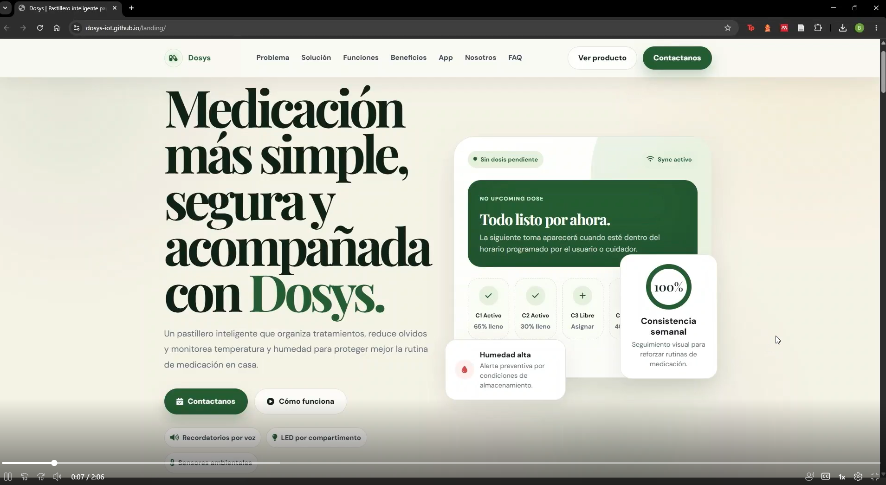
  <p><i>Figura: Enlace/Acceso a la demostración en video del flujo end-to-end de la aplicación web.</i></p>
</div>

##### Vista de Autenticación
Se han desarrollado 2 vistas para la autenticación de usuarios: una para el registro y otra para el inicio de sesión. Ambas vistas están disponibles de forma pública para cualquier persona que acceda a la aplicación. 

La vista de registro (`/register`) permite capturar datos del cuidador como nombre, apellido, correo electrónico clínico y una contraseña segura de acceso. Por otro lado, la vista de inicio de sesión (`/login`) facilita el acceso seguro al Dashboard mediante el ID clínico o correo electrónico institucional, e incorpora accesos directos específicos para continuar con el rol de cuidador o gestionar el hardware directamente mediante "Manage my Device".

<div align="center">
  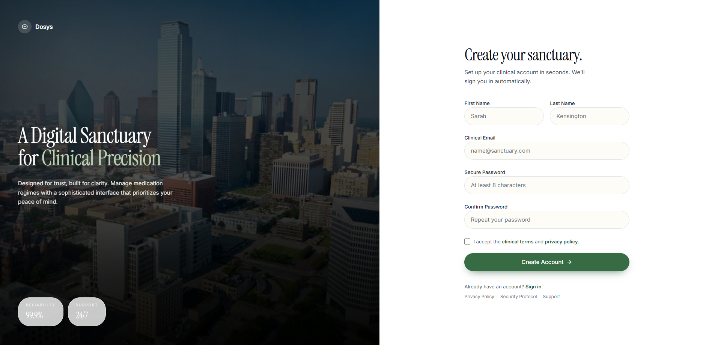
  <p><i>Figura: Interfaz de creación de cuenta clínica (/register) para la gestión del santuario digital.</i></p>
</div>

<div align="center">
  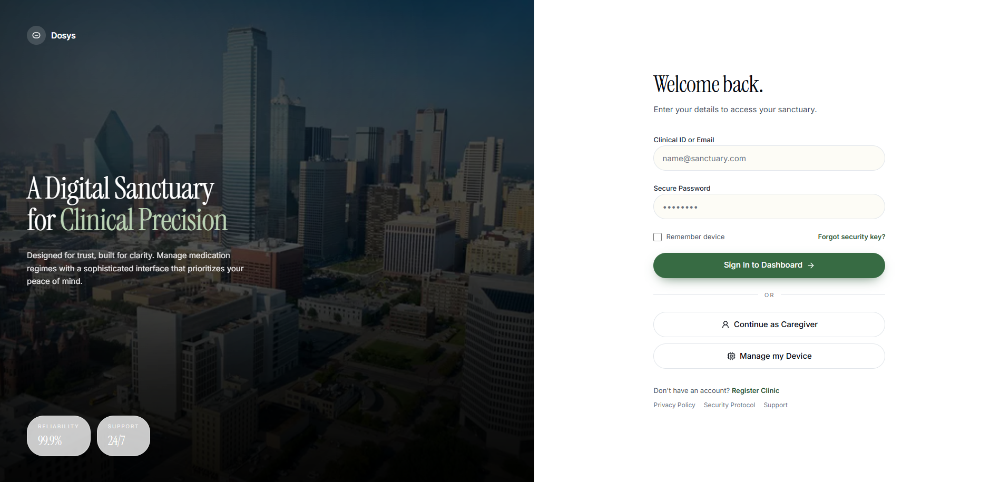
  <p><i>Figura: Interfaz de inicio de sesión seguro (/login) con segregación de accesos para cuidadores y dispositivos.</i></p>
</div>

##### Vista de Dashboard
Se ha desarrollado la vista principal del panel de control (`/dashboard`), la cual ofrece un resumen en tiempo real del estado de tranquilidad y estabilidad del paciente ("Sanctuary"). Esta vista incluye un indicador circular de consistencia semanal con el puntaje de adherencia actual (Weekly Score al 100%), el estado de carga y configuración de los 5 compartimentos del dispositivo (Device Compartments), un módulo centralizado de alertas urgentes y el historial reciente de las últimas tomas e ingestas registradas. Esta vista es accesible únicamente para usuarios autenticados.

<div align="center">
  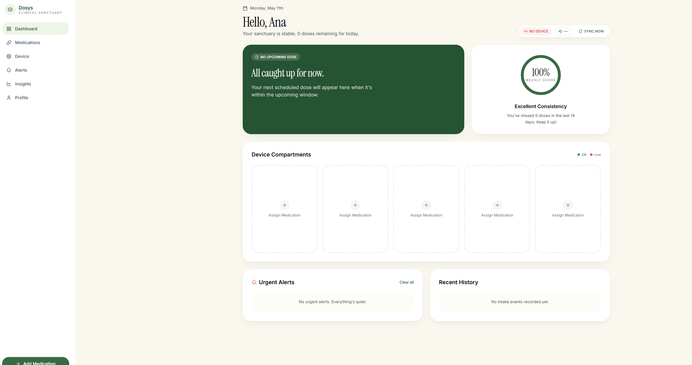
  <p><i>Figura: Panel de control central del cuidador con métricas de adherencia y estado del pastillero inteligente.</i></p>
</div>

##### Vista de Medicamentos
Se han desarrollado vistas específicas para la gestión de medicamentos (`/medications`, `/medications/new`). En la vista principal se administra la sincronización de los compartimentos físicos y las prescripciones clínicas cargadas. Cuenta con un diseño modular que destaca funciones avanzadas del ecosistema: Recordatorios Inteligentes (Smart Reminders basados en ciclos de comida y marcadores biológicos), Sincronización de Inventario (Inventory Sync en tiempo real mediante el peso del compartimento) y Conexión con Farmacias (Pharmacy Connect para solicitudes automáticas de reabastecimiento cuando el suministro es crítico). Asimismo, incluye diálogos y formularios interactivos para agregar nuevos medicamentos.

<div align="center">
  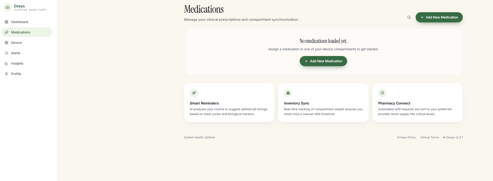
  <p><i>Figura: Módulo de control de prescripciones clínicas y estado de sincronización con la farmacia proveedora.</i></p>
</div>

##### Vista de Dispositivo (Device)
Se ha desarrollado una vista detallada para el monitoreo del hardware y del entorno físico del dispositivo (`/device`). Esta sección permite visualizar en vivo el estado analógico de los 5 compartimentos (indicando su porcentaje de llenado volumétrico y estados operativos como "Active", "Empty" o "Check Tray"). 

También recopila lecturas críticas de sensores locales, tales como el nivel de humedad ambiental (actualmente al 34% para preservar pastillas secas), la configuración de recordatorios de audio, métricas del dispositivo (batería al 92%, fuerza de señal WiFi en dBm, versión de firmware estable), un registro histórico de sensores (Sensor Log) para auditoría de calibración y detección de manipulaciones (Lid Tamper), y un asistente predictivo para la sustitución de desecantes.

<div align="center">
  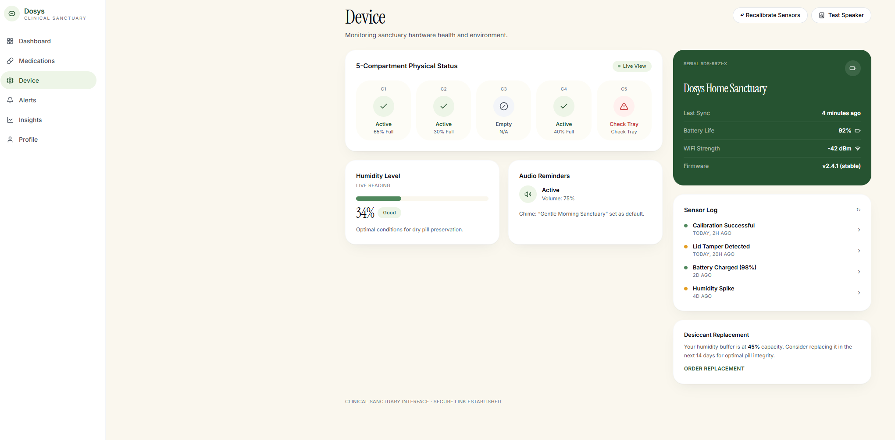
  <p><i>Figura: Panel de telemetría de hardware, estado de los compartimentos y telemetría de variables ambientales.</i></p>
</div>

##### Vista de Alertas (Alerts Center)
Se ha desarrollado un centro de control de alertas (`/alerts`) enfocado en la monitorización de métricas críticas y la adherencia dentro del santuario clínico. Permite filtrar los eventos históricos y activos por nivel de severidad (Crítica, Advertencia, Información), tipo de anomalía y asignación de personal. El sistema reporta de forma detallada incidentes como brechas ambientales por alta humedad (ej. Unidad 4B a 68%), alertas de bajo stock de medicamentos específicos (ej. Warfarina), omisiones de dosis por parte del paciente (Patient Adherence) y derivaciones de calibración en básculas (Drift Detected). Adicionalmente, incorpora un mapa de estado del dispositivo (Device Status Map) y métricas de velocidad de respuesta del equipo de soporte clínico.

<div align="center">
  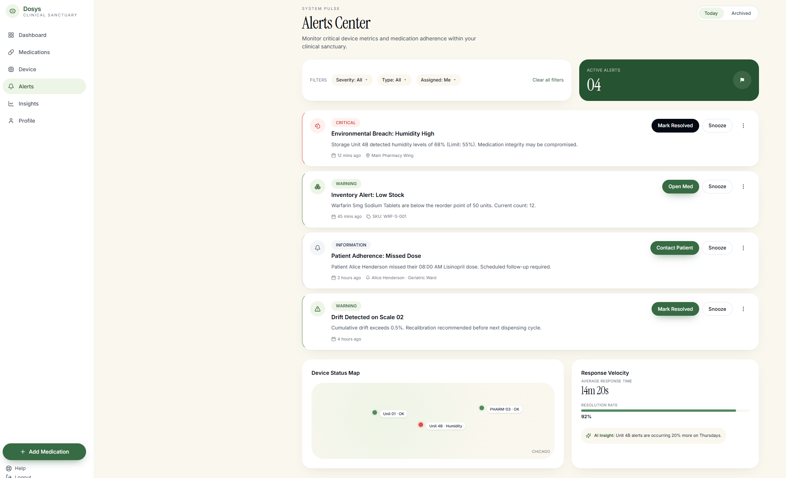
  <p><i>Figura: Centro de control de alertas críticas con mapas de estado de unidades y analíticas de tiempo de respuesta.</i></p>
</div>

##### Vista de Insights (Analíticas)
Se ha desarrollado una sección de analíticas avanzadas de rendimiento (`/insights`). En esta vista se despliega la tasa de adherencia general del periodo (ej. 94.8% con un incremento del +4.2%), la cantidad de prescripciones activas, las recargas pendientes que requieren acción y el estado de salud general del dispositivo. Incluye gráficos interactivos de la actividad de medicación diaria, un desglose de adherencia por rutinas horarias (mañana al 100% y noche al 84%), un pronóstico de recarga automatizado (Refill Forecast) con los días restantes para medicamentos críticos (Lisinopril, Metformin y Atorvastatin), una gráfica de comportamiento histórico de la humedad y un banner de asesoramiento personalizado con recomendaciones de IA sobre factores ambientales que impactan la estabilidad química del medicamento.

<div align="center">
  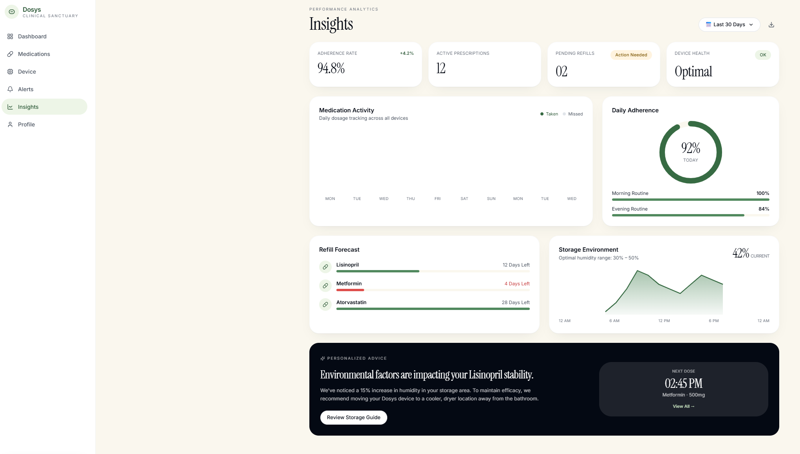
  <p><i>Figura: Panel de analítica avanzada sobre la adherencia del paciente, forecast de inventario e informes de entorno.</i></p>
</div>

##### Vista de Perfil (Settings / Profile)
Se ha desarrollado la vista de gestión de perfil y configuración general del usuario (`/profile`). Permite visualizar y editar la información del cuidador o paciente principal (ID único, estatus de cuenta "Pro Member" y verificación de datos de salud). 

Asimismo, incluye paneles para personalizar las preferencias de recordatorios (asistencia de voz integrada por IA, volumen de la alarma física, calibración de frecuencia adaptable según actividad), opciones de accesibilidad avanzada (modo de alto contraste optimizado para claridad visual y activación de lector de pantalla), gestión segmentada de canales de notificación (Email, SMS, alertas Push) y opciones avanzadas de administración de datos como la exportación del historial médico o la desactivación de la cuenta.

<div align="center">
  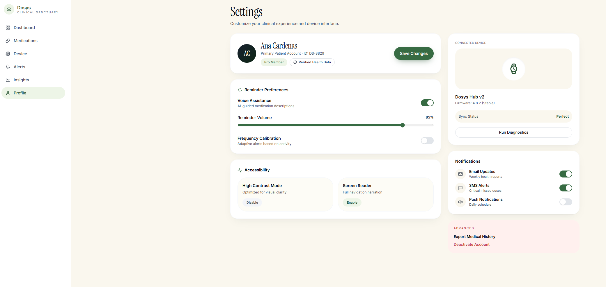
  <p><i>Figura: Panel de configuración de usuario, preferencias de accesibilidad y parametrización de notificaciones del Dosys Hub.</i></p>
</div>

---

Asimismo, para la landing page ya desplegada y accesible en [https://dosys-iot.github.io/landing/](https://dosys-iot.github.io/landing/), se estructuraron e implementaron las siguientes secciones clave:

##### Sección de Inicio
Presenta la introducción formal al ecosistema **Dosys**, posicionándolo como un santuario digital para la precisión clínica ("A Digital Sanctuary for Clinical Precision"). Destaca los pilares de confianza y claridad que sustentan la marca, ofreciendo un diseño de interfaz sofisticado pensado para la paz mental del usuario, respaldado por indicadores de confiabilidad de la infraestructura del 99.9% y soporte técnico continuo 24/7.

<div align="center">
  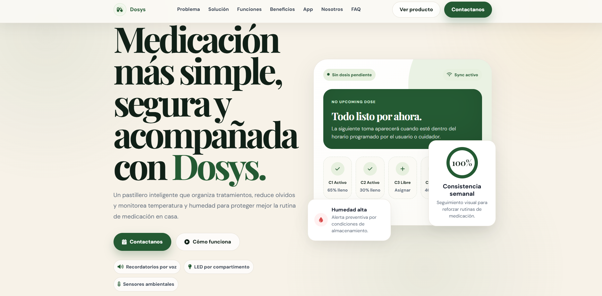
  <p><i>Figura: Sección de inicio de la Landing Page.</i></p>
</div>

##### Sección de Problemática
Aborda en profundidad los desafíos críticos actuales en la gestión de la salud y el seguimiento estricto de regímenes médicos complejos en el hogar. Justifica la necesidad del desarrollo de una solución integrada de hardware IoT y software en la nube para mitigar la omisión involuntaria de dosis y controlar los factores ambientales adversos que comprometen la efectividad de los fármacos.

<div align="center">
  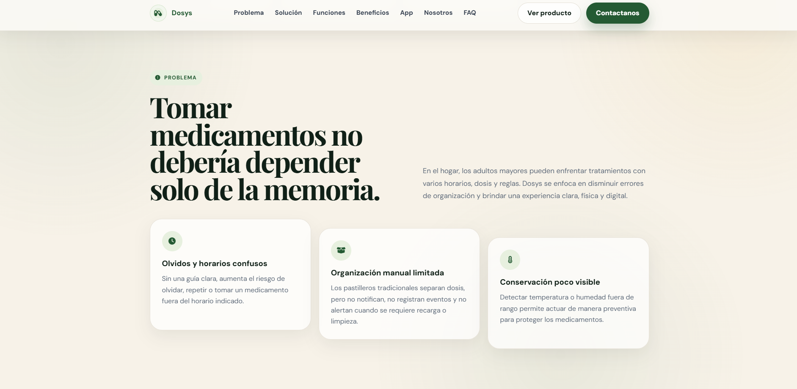
  <p><i>Figura: Sección de problemática de la Landing Page.</i></p>
</div>

<div align="center">
  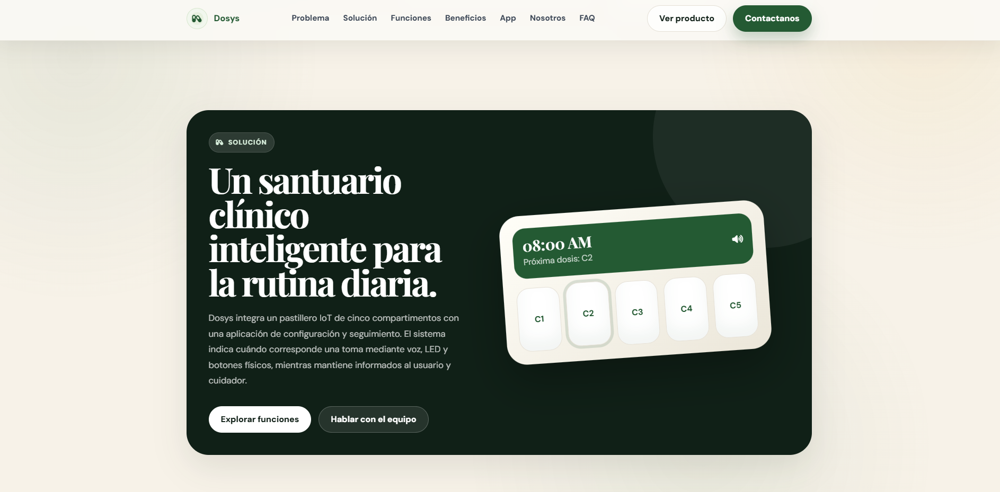
  <p><i>Figura: Sección de solución de la Landing Page.</i></p>
</div>

##### Sección de Funciones
Muestra detalladamente las ventajas tecnológicas del ecosistema Dosys, tales como el dispensador inteligente automatizado con básculas de precisión, el monitoreo ambiental integrado (sensores de humedad y temperatura), el sistema inteligente de notificaciones adaptables y la suite de analítica avanzada de adherencia orientada a cuidadores y personal médico.

<div align="center">
  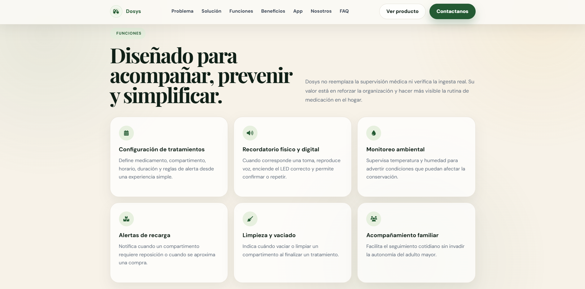
  <p><i>Figura: Sección de funciones de la Landing Page.</i></p>
</div>

<div align="center">
  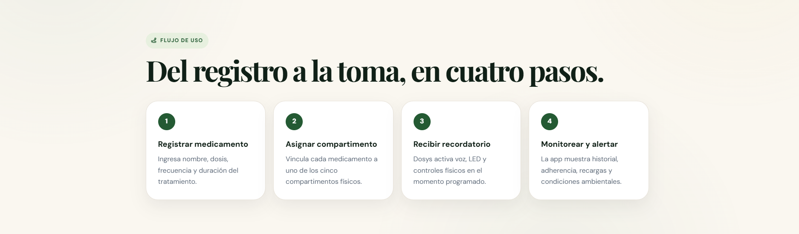
  <p><i>Figura: Sección de flujo de trabajo de la Landing Page.</i></p>
</div>

<div align="center">
  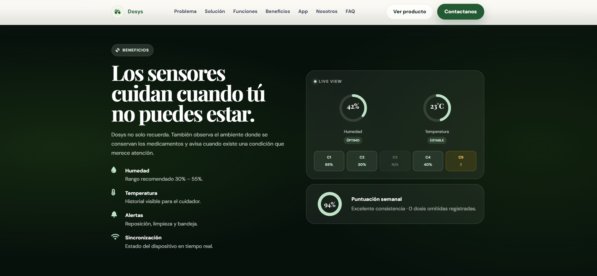
  <p><i>Figura: Sección de beneficios de la Landing Page.</i></p>
</div>

##### Sección de Sobre Nosotros
Describe la visión, misión y valores del equipo multidisciplinario detrás de Dosys, enfocado en fusionar la ingeniería IoT, el diseño centrado en el usuario y el cuidado de la salud para ofrecer una experiencia médica conectada, segura y de alta precisión que impacte positivamente en la calidad de vida de los pacientes de la tercera edad o con enfermedades crónicas.

<div align="center">
  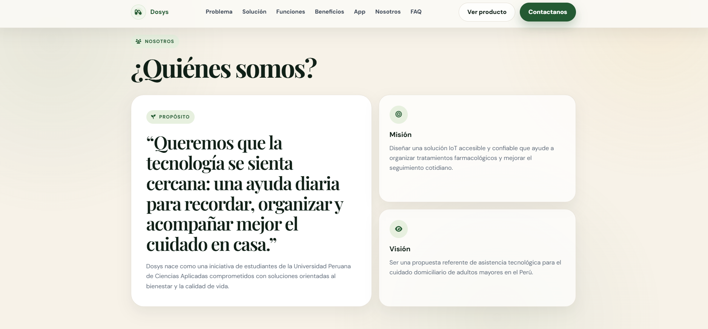
  <p><i>Figura: Sección de sobre nosotros de la Landing Page.</i></p>
</div>

<div align="center">
  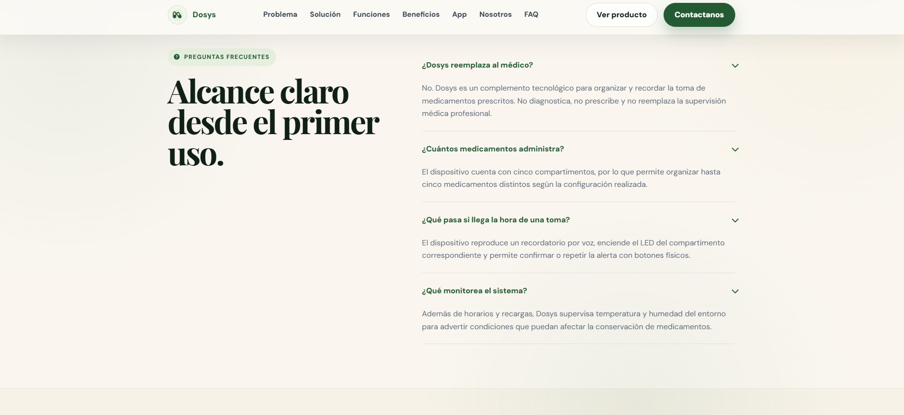
  <p><i>Figura: Sección de preguntas frecuentes (FAQ) de la Landing Page.</i></p>
</div>

##### Sección de Contacto
Ofrece un formulario de contacto directo y expone los canales de comunicación y soporte para clínicas, cuidadores o distribuidores farmacéuticos interesados en la plataforma, facilitando la interacción directa con el equipo técnico y de atención al cliente.

<div align="center">
  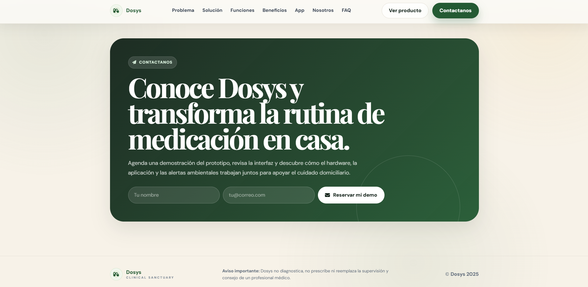
  <p><i>Figura: Sección de contacto de la Landing Page.</i></p>
</div>

**Video de Execution Evidence - Landing Page**

<div align="center">
  <a href="https://upcedupe-my.sharepoint.com/:v:/g/personal/u20211g671_upc_edu_pe/IQD83wPTERxqTIO7C9mV3ne-AQ5RIsv_67D8f8lolrZp25E?nav=eyJyZWZlcnJhbEluZm8iOnsicmVmZXJyYWxBcHAiOiJPbmVEcml2ZUZvckJ1c2luZXNzIiwicmVmZXJyYWxBcHBQbGF0Zm9ybSI6IldlYiIsInJlZmVycmFsTW9kZSI6InZpZXciLCJyZWZlcnJhbFZpZXciOiJNeUZpbGVzTGlua0NvcHkifX0&e=Txt6eK" target="_blank">
    
  </a>
  <p><i>Figura: Video demostrativo de la Landing Page (Haz clic para reproducir).</i></p>
</div>

#### 6.2.1.7. Services Documentation Evidence for Sprint Review

El Backend expone su documentación OpenAPI 3.0 mediante SpringDoc en `https://dosys-backend-149855215912.us-central1.run.app/swagger-ui/index.html` (especificación cruda en `/v3/api-docs`). La siguiente tabla enumera los endpoints REST documentados implementados durante el Sprint 1, agrupados por bounded context.

**Bounded Context: Access** (`/api/v1/access`)

| Método | Ruta | Acción | Request | Response (200) |
| :--- | :--- | :--- | :--- | :--- |
| POST | `/register` | Registrar nuevo cuidador. | `RegisterRequest { email, password, fullName }` | `UserResponse { id, email, fullName }` |
| POST | `/login` | Iniciar sesión y obtener JWT. | `LoginRequest { email, password }` | `LoginResponse { token, expiresIn, user }` |
| GET | `/me` | Obtener el usuario autenticado (Bearer JWT). | — | `UserResponse` |

**Bounded Context: Medication** (`/api/v1/medication`)

| Método | Ruta | Acción |
| :--- | :--- | :--- |
| POST | `/devices` | Crear un nuevo pastillero para el cuidador autenticado. |
| GET | `/devices` | Listar pastilleros del cuidador. |
| GET | `/devices/{deviceId}/containers` | Listar los 5 compartimentos del pastillero. |
| PUT | `/devices/{deviceId}/containers/{containerNumber}` | Crear o actualizar el medicamento de un compartimento. |
| GET | `/devices/{deviceId}/schedules` | Listar los horarios del pastillero. |
| POST | `/devices/{deviceId}/schedules` | Crear un horario para un contenedor. |
| PUT | `/devices/{deviceId}/schedules/{scheduleId}` | Actualizar un horario. |
| DELETE | `/devices/{deviceId}/schedules/{scheduleId}` | Eliminar un horario. |
| GET | `/devices/{deviceId}/adherence/calendar` | Reporte de adherencia (rango por defecto: últimos 7 días). |
| GET | `/devices/{deviceId}/environment/latest` | Última lectura ambiental. |
| GET | `/devices/{deviceId}/environment/history` | Historial de lecturas ambientales (rango por defecto: 24 h). |
| GET | `/devices/{deviceId}/edge-credentials` | Entregar al ESP32 las credenciales para conectarse al Edge Service. |

**Bounded Context: Device (internal)** (`/api/v1/device/internal`) — Autenticado vía `X-Device-Key` o `X-Edge-Service-Key`.

| Método | Ruta | Acción |
| :--- | :--- | :--- |
| GET | `/{deviceId}/runtime-config` | Calendario de tomas de las próximas 24 h. |
| POST | `/{deviceId}/intake-events` | Registrar confirmación de toma (`TAKEN`, `MISSED`, `SNOOZED`). |
| POST | `/{deviceId}/environment-readings` | Ingresar lectura de temperatura/humedad. El Backend calcula `risk_status` (`NORMAL`/`WARNING`/`CRITICAL`). |
| POST | `/{deviceId}/stock-events` | Actualizar `remainingPills` de un compartimento. |
| POST | `/{deviceId}/heartbeats` | Latido del dispositivo (`rtcTime`, `wifiConnected`, `deviceStatus`). |

**Ejemplo de request / response** (`POST /api/v1/device/internal/{deviceId}/environment-readings`):

```http
POST /api/v1/device/internal/1/environment-readings
Content-Type: application/json
X-Edge-Service-Key: <key>

{
  "temperature": 24.8,
  "humidity": 61.5,
  "recordedAt": "2026-05-06T20:00:00"
}
```

```json
HTTP/1.1 200 OK
{
  "id": 3,
  "deviceId": 1,
  "temperature": 24.8,
  "humidity": 61.5,
  "recordedAt": "2026-05-06T20:00:00Z",
  "riskStatus": "NORMAL"
}
```

A continuación se muestra la captura de la interacción real con el Swagger UI desplegado, listando los endpoints del bounded context Medication:

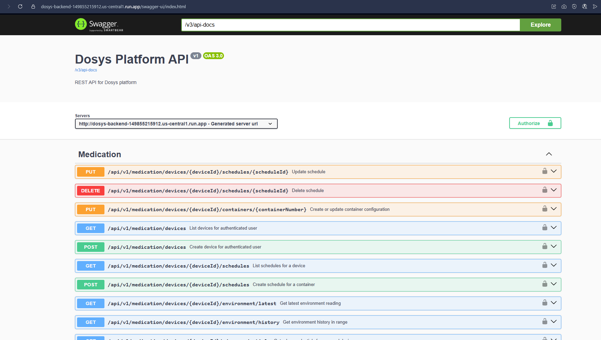

| Repository | Branch | Commit Id | Commit Message | Commit Message Body | Committed on (Date) |
| :--- | :--- | :--- | :--- | :--- | :--- |
| Dosys-IoT/backend | main | bedaf00 | chore: main backend logic | Configuración de SpringDoc OpenAPI (`springdoc-openapi-starter-webmvc-ui`), anotaciones `@Operation` y `@Tag` en los tres controllers REST. | 2026-05-04 |
| Dosys-IoT/backend | main | fad2a27 | chore: api edge conection | Documentación del endpoint `/edge-credentials` y del header `X-Edge-Service-Key` para `DeviceInternalController`. | 2026-05-06 |

#### 6.2.1.8. Software Deployment Evidence for Sprint Review

Durante el Sprint 1 se realizaron las siguientes actividades de despliegue:

**a) Creación del proyecto en Google Cloud Platform** (`dosys-rest-api`) y configuración de Artifact Registry, Cloud Build y Cloud Run en la región `us-central1`. Habilitación de las APIs necesarias.

**b) Despliegue del Backend (`dosys-backend`).** Se ejecutó `gcloud run deploy dosys-backend --source . --region us-central1 --allow-unauthenticated`. Cloud Build construyó la imagen y la publicó en Artifact Registry; Cloud Run creó la revisión `dosys-backend-00001-ksq` con autoscaling 0–3 instancias, 1 vCPU y 512 MiB.

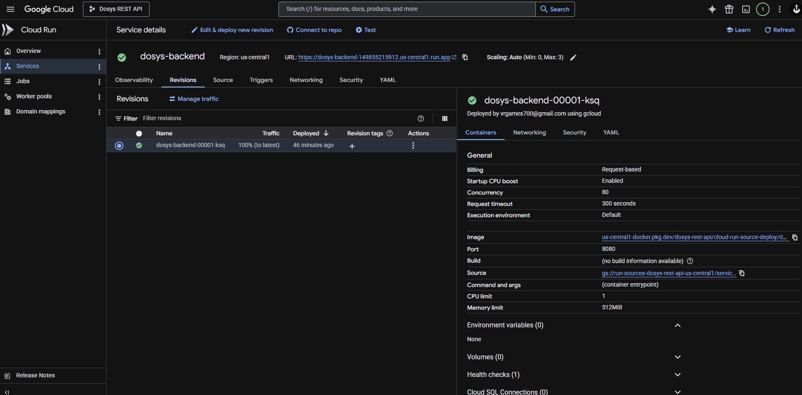

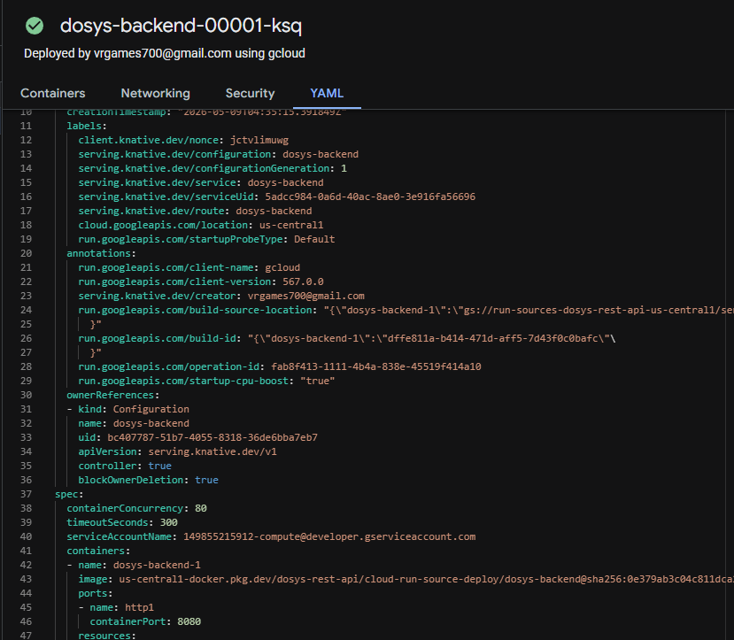

**c) Provisionamiento de la base de datos en Supabase.** Se creó el proyecto `Dosys` con cluster `DosysBackend` en la rama `main` (tag `PRODUCTION`). Las migraciones Flyway `V1__create_users_table.sql`, `V2__create_medication_tables.sql`, `V3__device_internal_support.sql` y `V4__allow_multiple_devices_per_user.sql` se aplicaron automáticamente al primer arranque del Backend, creando las tablas `users`, `devices`, `medication_containers`, `medication_schedules`, `intake_records` y `environment_readings`.

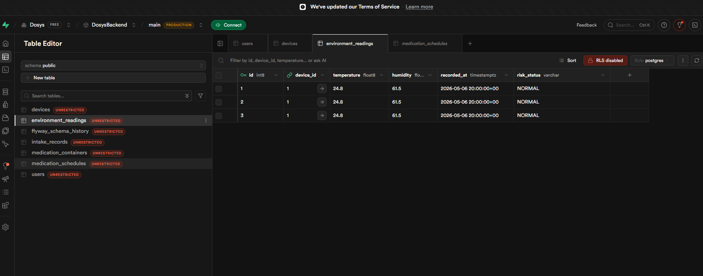

**d) Despliegue del Edge Service (`dosys-edge`).** Se desplegó la aplicación Flask como segundo servicio de Cloud Run, con dos revisiones (`dosys-edge-00001-g4b` y `dosys-edge-00002-5qt`), billing instance-based y autoscaling 1–3. La verificación se realizó vía `GET /edge/v1/health → {"status":"UP"}`.

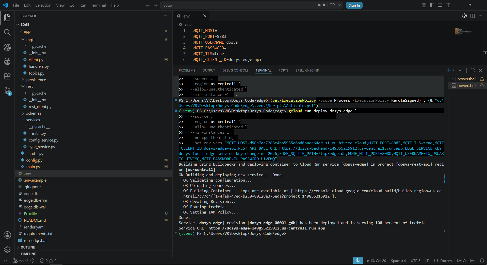

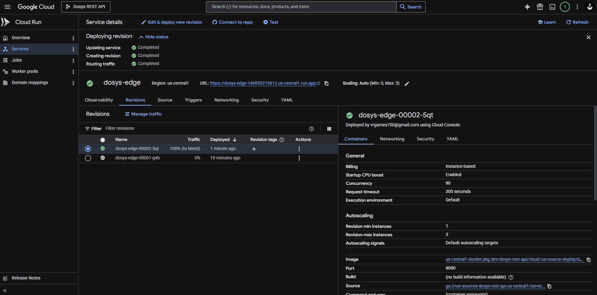

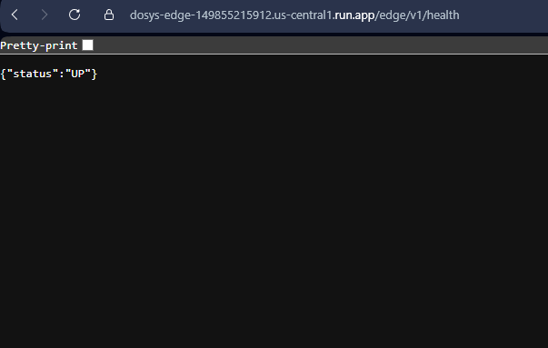

**e) Configuración del broker MQTT (HiveMQ Cloud).** Se creó la organización `Sigilo` y el cluster `Free #1` (TLS, puerto 8883). Se publicaron eventos de prueba en los tópicos `dosys/devices/1/environment`, `dosys/devices/1/intake`, `dosys/devices/1/stock`, `dosys/devices/1/heartbeat` y `dosys/devices/1/config/request`, verificando la recepción por el Edge.

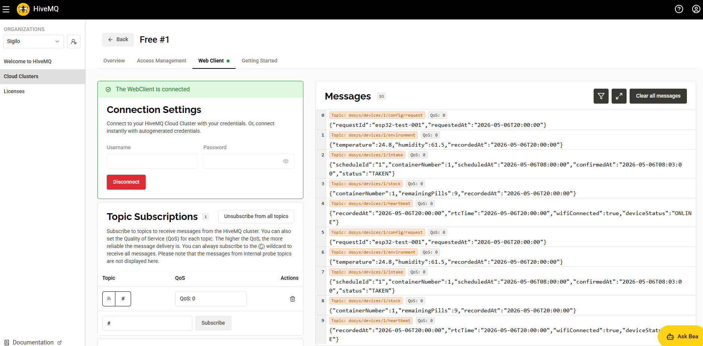

**f) Despliegue del Frontend en Vercel.** Se conectó el repositorio `Dosys-IoT/frontend-web`, framework preset Next.js, root `./`, variable `NEXT_PUBLIC_API_BASE_URL` apuntando al backend en Cloud Run. La build pasó exitosamente (58 s) y se generaron los dominios productivos y de preview.

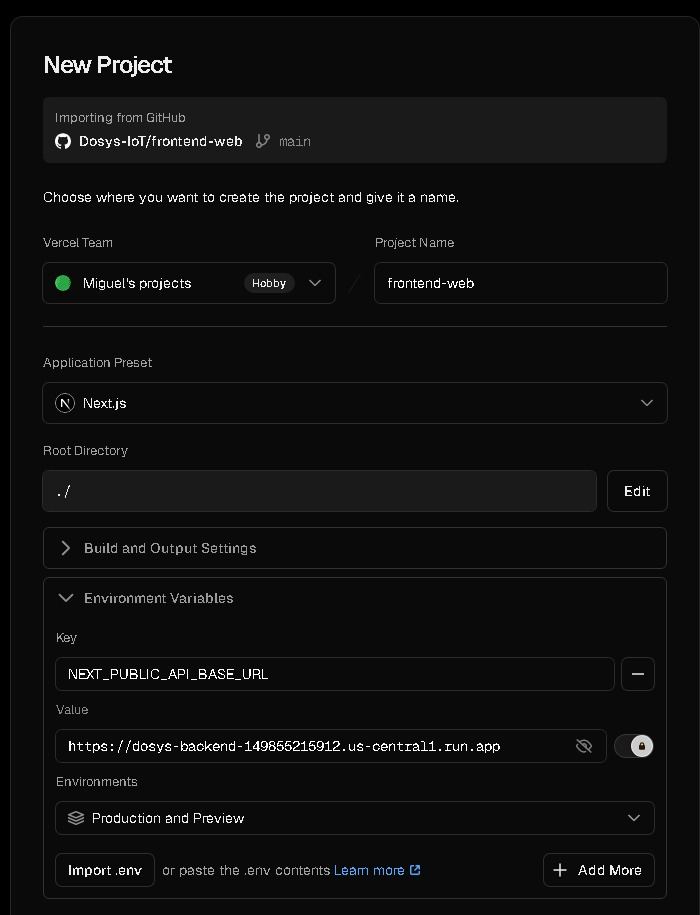

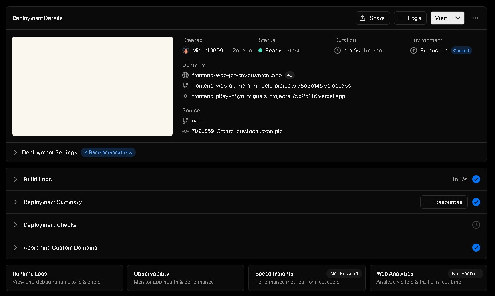

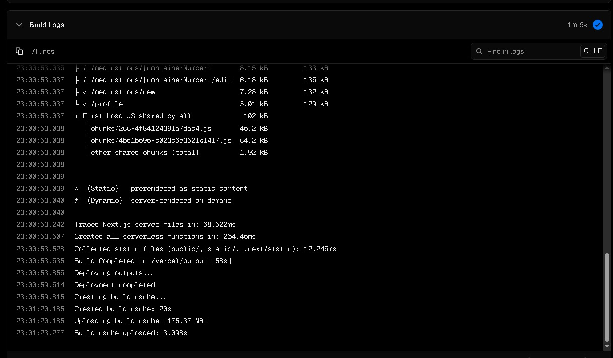

**g) Despliegue del Landing Page en GitHub Pages.**  
El repositorio `Dosys-IoT/landing` fue configurado para desplegar la primera versión pública del Landing Page mediante GitHub Pages. Esta versión utiliza HTML5, CSS3 y JavaScript Vanilla, e incluye las secciones informativas principales del producto: Inicio, Problemática, Solución, Funciones, Beneficios, Sobre Nosotros, Preguntas Frecuentes y Contacto.

El despliegue público se encuentra disponible en: [https://dosys-iot.github.io/landing/](https://dosys-iot.github.io/landing/).

La configuración de GitHub Pages permite publicar el sitio estático directamente desde el repositorio, manteniendo trazabilidad entre los commits del Landing Page y la versión visible para visitantes. Durante el Sprint 1 se verificó que la página sea accesible públicamente y que el formulario de contacto cuente con validación del lado del cliente.

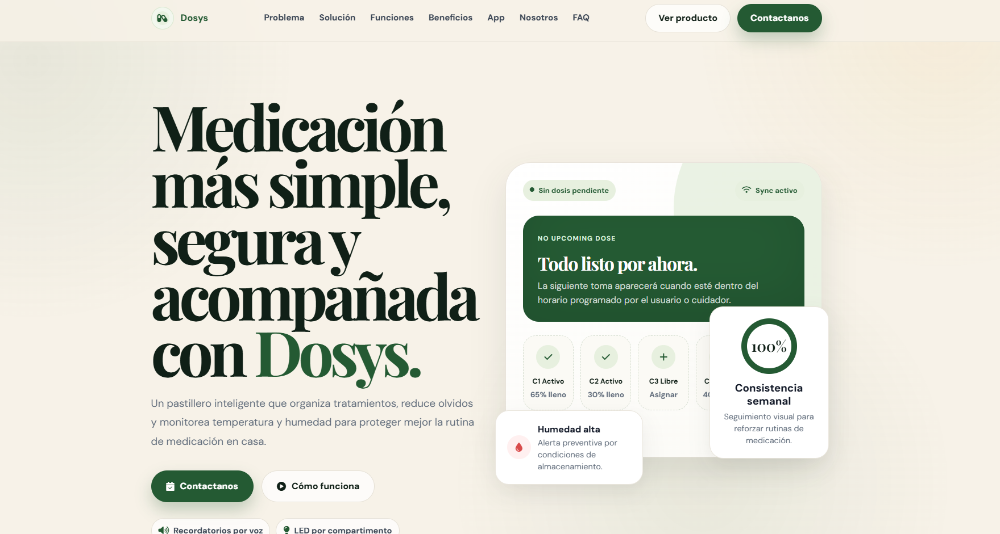

Figura: Configuración de GitHub Pages para el despliegue público del Landing Page.

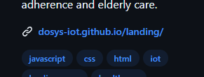

Figura: Landing Page de Dosys desplegada y accesible públicamente mediante GitHub Pages.

#### 6.2.1.9. Team Collaboration Insights during Sprint

Las actividades de implementación del Sprint 1 se desarrollaron de forma distribuida entre los cinco integrantes, con coordinación mediante Discord, seguimiento del avance en Trello y revisión cruzada de entregables antes de la consolidación en el informe. La distribución de trabajo se organizó por aspectos para evitar solapamientos y mantener responsables claros por cada vertical del producto.

- **Qqueso Rodriguez, Britney Delhy (`brit2801`)** — Lideró el **Landing Page**, trabajando en la construcción de la primera versión pública del sitio, la presentación de la propuesta de valor de Dosys y el despliegue mediante GitHub Pages. Su trabajo permitió cubrir la presencia digital inicial del producto y conectar la solución con los segmentos objetivo desde una vista comercial e informativa.

- **Martel Zevallos, Gabriel Aristóteles (`GaboMartel`)** — Lideró el aspecto de **UX/UI Design**, colaborando en la definición de la experiencia de usuario, la coherencia visual entre pantallas, los flujos principales del cuidador y la organización de interfaces relacionadas con el dispositivo IoT. Su aporte permitió mantener consistencia entre los artefactos de diseño del Capítulo V y la experiencia esperada en los productos digitales.

- **Oblitas Davila, Mariano Moises (`Sigilo-dev`)** — Lideró el **Backend REST API** y el **Edge Service**. Su trabajo cubrió los bounded contexts **Access**, **Medication** y **Device**, además de la integración entre Edge Service, MQTT, Backend REST API y persistencia. También proporcionó endpoints, contratos de API y documentación técnica para facilitar la integración con el Frontend Web.

- **Ybañez Esquerre, Miguel Angel (`Miguel080902`)** — Lideró el **Frontend Web Application**, implementando la estructura base de la aplicación web, las vistas principales del cuidador, el consumo de endpoints del Backend y el despliegue en Vercel. Su trabajo permitió validar el flujo principal del usuario desde la interfaz web.

- **Zúñiga Murillo, Diego Sebastián (`DekayDeCanela`)** — Colaboró en **QA, documentación y validación del Sprint**, revisando la coherencia entre el informe, los productos desplegados y las evidencias de implementación. También apoyó la organización del Sprint Review, la consolidación de capturas, la revisión del documento y el seguimiento de tareas en Trello.

**Interpretación.** La colaboración del Sprint 1 se basó en liderazgo distribuido por aspecto. Esta estrategia permitió que cada integrante asumiera responsabilidad directa sobre una parte verificable del producto: Landing Page, UX/UI, Frontend Web, Backend REST API, Edge Service y documentación de calidad. La separación de responsabilidades redujo bloqueos, facilitó la integración entre componentes y permitió presentar un MVP inicial con productos desplegados y evidencias trazables.

**Oportunidades de mejora para el siguiente Sprint.** Para el Sprint 2, el equipo reforzará la actualización más frecuente del tablero Trello y evidencias separadas por repositorio. Esto permitirá que los analíticos de GitHub reflejen mejor la participación individual y que la documentación mantenga consistencia con el avance técnico real.

### 6.2.2. Sprint 2

En esta sección se registra el avance del Sprint 2 del proyecto Dosys. A diferencia del Sprint 1 —que entregó la primera versión desplegada de los productos digitales principales—, el Sprint 2 se enfocó en dos frentes complementarios: la consolidación del **Frontend Web Application** y la primera validación física del **prototipo IoT Dosys**.

En el frente de software, el Sprint 2 permitió alinear el Frontend Web con el catálogo oficial de User Stories, retirar funcionalidad fuera de alcance, reemplazar datos simulados por datos reales consumidos desde el Backend REST API e incorporar mejoras transversales de calidad y experiencia de usuario. En el frente físico, el equipo avanzó en el diseño 3D, impresión, ensamblaje y prueba inicial de los componentes electrónicos del pastillero inteligente.

No se modificaron el **Backend REST API**, el **Edge Service** ni el **Landing Page** durante este Sprint. Sus despliegues del Sprint 1 permanecen vigentes y operativos. El aporte principal del Sprint 2 fue consumir mejor los servicios ya existentes desde el Frontend y demostrar que el dispositivo IoT puede operar físicamente con sus componentes principales conectados.

El Sprint 2 permitió pasar de un MVP principalmente digital a una solución más cercana al producto IoT final, integrando evidencia de aplicación web conectada al Backend real y evidencia física del dispositivo operando con sensores, módulo RTC, señalización LED y reproducción de audio.

#### 6.2.2.1. Sprint Planning 2

La reunión de Sprint Planning del Sprint 2 se llevó a cabo de forma virtual al inicio de la segunda iteración de implementación. A continuación se presenta el cuadro resumen.

| Sprint # | Sprint 2 |
| :--- | :--- |
| **Sprint Planning Background** | |
| Date | 2026-05-19 *(confirmar fecha exacta del equipo)* |
| Time | 07:30 PM |
| Location | Reunión virtual por Discord, canal `#dosys-scrum`. |
| Prepared By | Zúñiga Murillo, Diego Sebastián |
| Attendees (to planning meeting) | Martel Zevallos, Gabriel Aristóteles / Oblitas Davila, Mariano Moises / Qqueso Rodriguez, Britney Delhy / Ybañez Esquerre, Miguel Angel / Zúñiga Murillo, Diego Sebastián |
| **Sprint n – 1 Review Summary** | En el Sprint 1 se desplegó la primera versión de los productos digitales principales: Landing Page, Frontend Web Application, Backend REST API y Edge Service. También se validó el flujo end-to-end del cuidador desde la aplicación web hacia los servicios backend. Se identificó que el Frontend aún incluía vistas y elementos fuera de alcance, como `/insights`, `/device/calibration`, recuadros de IA/Insights y datos simulados en las vistas de Alertas y Dispositivo. |
| **Sprint n – 1 Retrospective Summary** | El equipo acordó: (a) alinear estrictamente el Frontend con el catálogo oficial de User Stories; (b) sustituir datos simulados por consumo real del Backend REST API; (c) formalizar nuevas User Stories para mejoras transversales de calidad/UX; (d) mantener la disciplina de commits y tablero de trabajo; y (e) avanzar en la validación física del prototipo IoT para demostrar factibilidad de integración de hardware. |
| **Sprint Goal & User Stories** | |
| **Sprint 2 Goal** | *Our focus is on consolidar el Frontend Web Application de Dosys y validar físicamente el primer prototipo IoT del pastillero inteligente. El Sprint cubre la limpieza de funcionalidad fuera de alcance, el consumo de datos reales desde el Backend REST API, la mejora de estados visuales de la aplicación, el diseño 3D del dispositivo, la impresión del prototipo, el ensamblaje de componentes y la comprobación inicial de operación conjunta de sensores, RTC, LEDs y audio. We believe it delivers una solución más verificable, coherente con el backlog y más cercana al producto IoT final. This will be confirmed when la Web App muestre únicamente funcionalidad respaldada por User Stories, consuma datos reales del Backend y el prototipo físico demuestre operación estable de sus componentes principales conectados al ESP32.* |
| **Sprint 2 Velocity** | 31 Story Points. 62 horas. |
| **Sum of Story Points** | 31 Story Points. |


#### 6.2.2.2. Aspect Leaders and Collaborators

Dado que el Sprint 2 incluyó trabajo de software y trabajo físico, los aspectos considerados corresponden a las verticales principales del producto: **Frontend — Alcance**, **Frontend — Datos Reales**, **Frontend — Calidad/UX**, **UX/UI Design**, **IoT Hardware Prototype** y **QA / Documentation**.

La matriz LACX a continuación designa para cada aspecto un líder (L) y uno o varios colaboradores (C).

| Team Member (Last Name, First Name) | GitHub Username | Frontend — Alcance | Frontend — Datos Reales | Frontend — Calidad/UX | UX/UI Design | IoT Hardware Prototype | QA / Documentation |
| :--- | :--- | :---: | :---: | :---: | :---: | :---: | :---: |
| Ybañez Esquerre, Miguel Angel | Miguel080902 | **L** | **L** | **L** | C | C | C |
| Martel Zevallos, Gabriel Aristóteles | GaboMartel | C | C | C | **L** | C | C |
| Oblitas Davila, Mariano Moises | Sigilo-dev | C | C | C | C | **L** | C |
| Qqueso Rodriguez, Britney Delhy | brit2801 | C | C | C | C | C | C |
| Zúñiga Murillo, Diego Sebastián | DekayDeCanela | C | C | C | C | C | **L** |

Miguel Ybañez lideró las tres verticales del Frontend Web: alineación del producto con el catálogo oficial, sustitución de datos simulados por consumo real del Backend REST API y trabajo transversal de calidad/UX.

Gabriel Martel lideró la coherencia visual y la identidad tipográfica de la experiencia. Mariano Oblitas lideró la vertical de prototipo físico IoT, abarcando diseño 3D, impresión, ensamblaje de componentes y pruebas físicas iniciales. Diego Zúñiga lideró QA, documentación de evidencias y verificación de coherencia documental. Britney Qqueso colaboró en la revisión funcional y en la coherencia con la propuesta de valor del producto.

#### 6.2.2.3. Sprint Backlog 2

El objetivo principal del Sprint 2 fue consolidar el Frontend Web Application y validar físicamente el primer prototipo IoT Dosys. En software, el trabajo se realizó contra el Backend REST API ya desplegado en el Sprint 1, sin modificarlo. En hardware, el trabajo se enfocó en comprobar que los componentes definidos para el pastillero pudieran integrarse físicamente y operar conectados al ESP32.

Durante el Sprint 2 se formalizaron las siguientes nuevas User Stories, no presentes en el catálogo original US01–US23:

| ID | Título | User Story | Épica |
| :--- | :--- | :--- | :--- |
| **US24** | Notificaciones en App | Como cuidador, quiero recibir una confirmación visual al guardar o cuando algo falla, para saber si mi acción tuvo efecto. | EP03 |
| **US25** | Estados de Carga y Error | Como cuidador, quiero ver indicadores de carga y poder reintentar ante un fallo, para no quedarme frente a pantallas vacías. | EP03 |
| **US26** | Identidad Visual Consistente | Como cuidador, quiero una tipografía clara y consistente, para leer dosis y horarios sin esfuerzo. | EP01 |
| **US27** | Gestión de Medicina en Compartimento | Como cuidador, quiero editar o retirar la medicina de un compartimento, para reorganizar el pastillero. | EP02 |
| **US28** | Prototipo Físico IoT | Como equipo de desarrollo, queremos validar el ensamblaje físico del pastillero inteligente, para comprobar que los componentes principales pueden operar juntos en un prototipo funcional. | EP04 |

El board público del Sprint en Trello se encuentra en: [Tablero Trello - Dosys Sprint 2](https://trello.com) *(reemplazar por el enlace real del board de Sprint 2)*


**Figura:** Vista general del tablero Trello y distribución de Work Items para el Sprint 2.

| User Story Id | User Story Title | Work-Item Id | Work-Item Title | Description | Estimation (Hours) | Assigned To | Status |
| :--- | :--- | :--- | :--- | :--- | :---: | :--- | :--- |
| — | Alineación de Alcance | WI31 | Retiro de funcionalidad IA/Insights | Eliminar la vista `/insights`, la vista `/device/calibration`, los recuadros "AI Insight" y "Smart Reminders" y los mocks asociados, alineando el Frontend con el catálogo oficial US01–US23. | 3 | Miguel | Done |
| US11, US12, US13 | Alertas con Datos Reales | WI32 | Derivación de alertas (`deriveAlerts`) | Reescribir `/alerts` para derivar alertas de humedad, temperatura, recarga, dosis perdidas y estado offline a partir de datos reales del Backend. | 6 | Miguel | Done |
| US22 | Reporte de Temperatura (App) | WI33 | Pestaña de Ambiente con datos reales | Reconvertir la vista `/device` en una pestaña de Ambiente que consume `GET /devices/{id}/environment/history` y grafica temperatura y humedad. | 5 | Miguel | Done |
| US18 | Notificación Offline | WI34 | Detección de estado offline | Mostrar el estado online/offline del dispositivo a partir de `DeviceResponse.lastSeenAt`, con badge "Offline" cuando no hay señal reciente. | 3 | Miguel | Done |
| US04 | Vinculación IoT | WI35 | Onboarding de dispositivo | Implementar la tarjeta de creación/vinculación de dispositivo mostrada en Dashboard y Medicinas cuando la cuenta no tiene dispositivo. | 3 | Miguel | Done |
| US24 | Notificaciones en App | WI36 | Sistema de toasts éxito/error | Implementar un sistema de notificaciones tipo toast integrado en el provider global, mostrando confirmación al guardar y mensajes ante errores. | 4 | Miguel | Done |
| US25 | Estados de Carga y Error | WI37 | Skeletons + banner de error con retry | Implementar indicadores de carga y un componente de estado de error con acción "Retry" en las vistas principales. | 4 | Miguel | Done |
| US26 | Identidad Visual Consistente | WI38 | Tipografía Manrope + Inter | Configurar la tipografía del producto en la aplicación web para mantener consistencia visual. | 3 | Miguel | Done |
| US27 | Gestión de Medicina en Compartimento | WI39 | Edición de medicina por compartimento | Implementar la ruta de edición de medicina y los ajustes en las vistas de medicinas para gestionar el contenido del compartimento. | 4 | Miguel | Done |
| — | QA / Documentation | WI40 | Evidencias de Sprint Review | Consolidar capturas de ejecución de las vistas alineadas, evidencia de despliegue en Vercel y video de la demostración del Sprint 2. | 4 | Diego | Done |
| — | QA / Documentation | WI41 | Revisión de coherencia documental | Verificar que el backlog, las User Stories, las evidencias y el Collaboration Insights mantengan coherencia con el avance técnico real. | 3 | Diego | Done |
| US28 | Prototipo Físico IoT | WI42 | Diseño 3D del dispositivo | Diseñar el modelo 3D del pastillero inteligente, considerando carcasa, compartimentos, ubicación de componentes y espacio interno para cableado. | 5 | Mariano | Done |
| US28 | Prototipo Físico IoT | WI43 | Impresión 3D del prototipo | Imprimir el diseño físico del producto para validar dimensiones, distribución de compartimentos y viabilidad de ensamblaje. | 4 | Mariano | Done |
| US28 | Prototipo Físico IoT | WI44 | Ensamblaje de componentes electrónicos | Integrar ESP32, módulo RTC, sensor ambiental, LEDs, módulo de audio y parlante dentro del prototipo físico. | 6 | Mariano | Done |
| US28 | Prototipo Físico IoT | WI45 | Pruebas físicas de integración | Ejecutar pruebas de sensores, LEDs, audio y operación simultánea para verificar estabilidad general del prototipo físico. | 5 | Mariano | Done |

#### 6.2.2.4. Development Evidence for Sprint Review

Durante el Sprint 2, el desarrollo se dividió en dos bloques: desarrollo del **Frontend Web Application** y desarrollo/validación del **prototipo físico IoT**.

### Frontend Web Application Evidence

El desarrollo de software se concentró en el repositorio **Frontend Web Application**.

No se realizaron cambios en el Backend REST API, el Edge Service ni el Landing Page.

- **Frontend Application:** [Repositorio Frontend Web](https://github.com/Dosys-IoT/frontend-web)
- **Despliegue en Vercel:** [https://frontend-web-jet-seven.vercel.app](https://frontend-web-jet-seven.vercel.app)

| Repository | Branch | Commit Id | Commit Message | Commit Message Body | Committed on (Date) |
| :--- | :--- | :--- | :--- | :--- | :--- |
| Dosys-IoT/frontend-web | main | 47f9dcf | feature: sprint 2 implementation | Alineación del Frontend con el catálogo oficial US01–US23: eliminación de las vistas `/insights` y `/device/calibration`, recuadros de IA y mocks. Se incorporó consumo real del Backend REST API para Alertas, Ambiente, estado del dispositivo y gestión de medicinas. | 2026-06-17 |

La siguiente tabla resume los principales artefactos de código creados, modificados y eliminados en el commit de Sprint 2, evidenciando tanto la incorporación de funcionalidad real como la limpieza de funcionalidad fuera de alcance:

| Acción | Archivo | User Story / Propósito |
| :--- | :--- | :--- |
| Añadido | `components/ui/toast.tsx` | US24 — Sistema de notificaciones toast. |
| Añadido | `components/ui/error-state.tsx` | US25 — Estado de error con acción de reintento. |
| Modificado | `app/device/page.tsx` | US22 — Vista de Ambiente con datos reales. |
| Modificado | `app/alerts/page.tsx` | US11/US12/US13/US18 — Alertas derivadas desde datos reales. |
| Modificado | `app/medications/page.tsx` | US27 — Gestión de medicinas por compartimento. |
| Añadido | `app/medications/[containerNumber]/edit/page.tsx` | US27 — Edición de medicina por compartimento. |
| Añadido | `components/device/create-device-card.tsx` | US04 — Vinculación/onboarding de dispositivo. |
| Añadido | `lib/domain/alerts.ts` | Derivación de alertas desde datos reales. |
| Añadido | `lib/domain/device-status.ts` | Cálculo de estado online/offline del dispositivo. |
| Eliminado | `app/insights/page.tsx` | Retiro de funcionalidad IA/Insights fuera de alcance. |
| Eliminado | `app/device/calibration/page.tsx` | Retiro de funcionalidad fuera de alcance. |

### Hardware Prototype Evidence — IoT Device Physical Assembly

Además del trabajo realizado sobre el Frontend Web Application, durante el Sprint 2 se avanzó en la materialización física del dispositivo IoT Dosys. Este avance permitió pasar del diseño conceptual del pastillero inteligente a un prototipo físico funcional, validando la distribución interna de componentes, la integración eléctrica básica y la operación simultánea de los módulos principales.

El trabajo físico incluyó el diseño 3D de la carcasa del producto, la impresión del modelo, el ensamblaje de los componentes electrónicos y la verificación de funcionamiento conjunto del sistema. El objetivo fue comprobar que los módulos definidos para el dispositivo podían operar conectados entre sí sin conflictos evidentes de alimentación ni fallos en los pines utilizados por el ESP32.

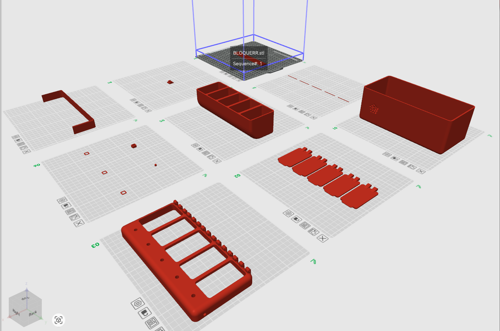

**Figura:** Diseño 3D del dispositivo Dosys, considerando compartimentos, carcasa y distribución interna de componentes.

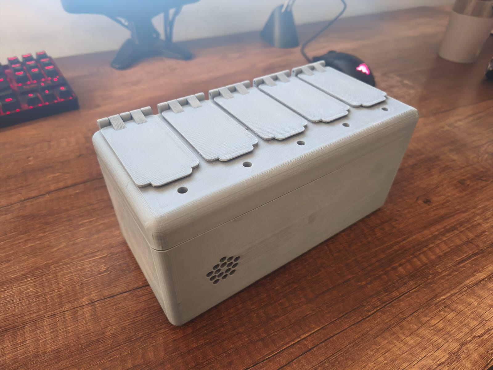

**Figura:** Prototipo físico impreso del pastillero inteligente Dosys.

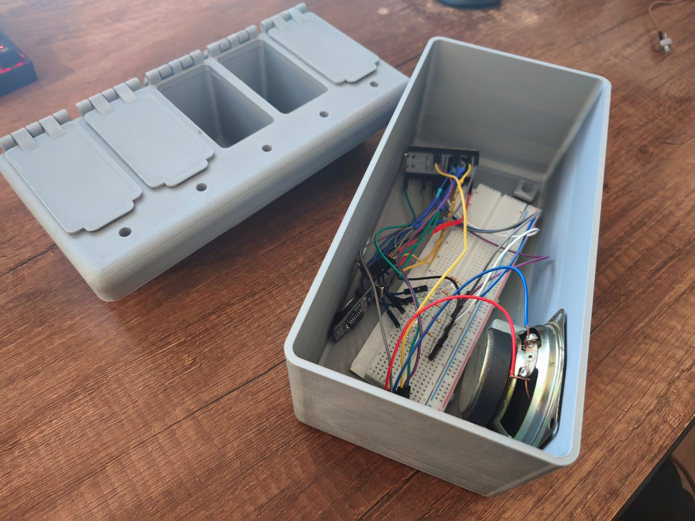

**Figura:** Vista interna del prototipo físico, con espacio destinado a componentes electrónicos y cableado.

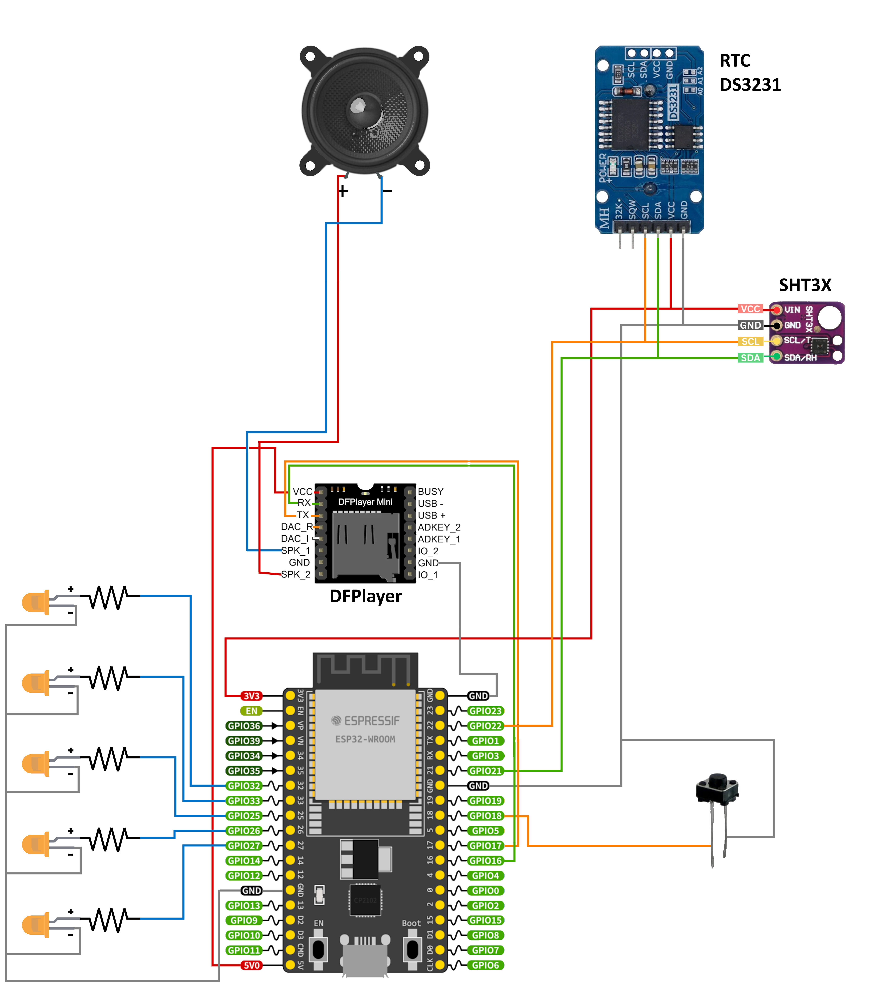

**Figura:** Diagrama de conexiones físicas del prototipo IoT, incluyendo ESP32, módulo RTC, sensor ambiental, módulo de audio, LEDs y alimentación.

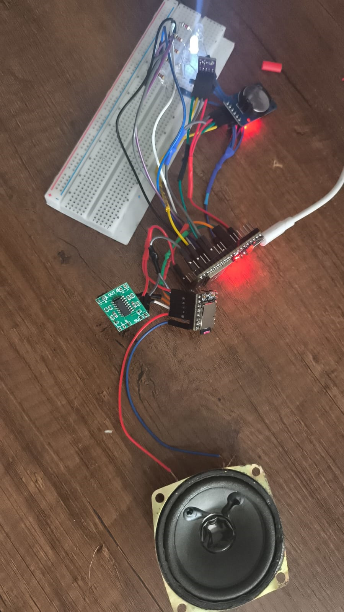

**Figura:** Circuitería física del prototipo durante las pruebas de integración de sensores, LEDs y audio.

Las pruebas físicas realizadas cubrieron los siguientes elementos:

| Elemento validado | Resultado |
| :--- | :--- |
| Diseño 3D del producto | Se elaboró el modelo físico del pastillero Dosys considerando ubicación de compartimentos, espacio para electrónica interna y salida de audio. |
| Impresión del prototipo | Se imprimió la carcasa para validar dimensiones, distribución física y viabilidad de ensamblaje. |
| Integración de componentes | Se conectaron ESP32, módulo RTC, sensor ambiental, módulo de audio, parlante y LEDs de compartimento. |
| Validación de pines | Se verificó que los GPIO asignados respondieran correctamente durante la ejecución de las pruebas. |
| Validación de alimentación | Se comprobó estabilidad operativa del sistema con los componentes conectados simultáneamente, sin reinicios visibles del ESP32 durante la prueba. |
| Prueba de LEDs | Se ejecutó una secuencia de activación de LEDs por compartimento para validar la señalización física de alertas. |
| Prueba de audio | Se validó la reproducción de audio mediante el módulo de sonido y el parlante integrado. |
| Prueba de sensores | Se comprobó la lectura del sensor ambiental y del módulo RTC desde el ESP32. |

Esta evidencia permite demostrar que Dosys no se limita a una simulación de software, sino que cuenta con una primera validación física del dispositivo IoT. El prototipo aún no representa una versión industrial final, pero sí confirma la factibilidad técnica inicial de integrar los componentes principales en una estructura física funcional.


#### 6.2.2.5. Testing Suite Evidence for Sprint Review

El Sprint 2 incluyó pruebas funcionales manuales sobre el Frontend Web y pruebas físicas de integración sobre el prototipo IoT.

### Frontend Web Testing

| Test Case | User Story | Objetivo | Resultado |
| :--- | :--- | :--- | :--- |
| FE-TC01 — Dashboard con datos reales | US04, US18 | Verificar que el Dashboard muestre estado del dispositivo, compartimentos y adherencia usando datos del Backend. | Passed |
| FE-TC02 — Vista de Ambiente | US22 | Verificar que `/device` consuma lecturas reales de temperatura y humedad desde el Backend. | Passed |
| FE-TC03 — Centro de Alertas | US11, US12, US13, US18 | Verificar que las alertas se deriven de humedad, temperatura, stock, dosis perdidas y estado offline. | Passed |
| FE-TC04 — Gestión de Medicinas | US27 | Verificar que el cuidador pueda registrar, editar o retirar medicina de un compartimento. | Passed |
| FE-TC05 — Toasts de éxito/error | US24 | Verificar confirmaciones visuales al guardar y mensajes ante errores. | Passed |
| FE-TC06 — Estados de carga/error | US25 | Verificar skeletons, banners de error y acción de reintento. | Passed |
| FE-TC07 — Identidad visual | US26 | Verificar consistencia tipográfica y visual en las vistas principales. | Passed |

### Hardware Integration Testing

| Test Case | Objetivo | Resultado |
| :--- | :--- | :--- |
| HW-TC01 — Sensor and RTC Reading | Verificar que el ESP32 pueda leer correctamente el sensor ambiental y el módulo RTC mediante el bus correspondiente. | Passed |
| HW-TC02 — LED Sequence | Verificar que los LEDs asignados a los compartimentos respondan en los GPIO configurados. | Passed |
| HW-TC03 — Audio Playback | Verificar que el módulo de audio y el parlante reproduzcan correctamente el recordatorio sonoro. | Passed |
| HW-TC04 — Simultaneous Operation | Ejecutar sensores, LEDs y audio en una misma prueba para verificar estabilidad general del prototipo. | Passed |
| HW-TC05 — Pin Availability | Confirmar que los pines usados por los módulos no generen conflictos durante la ejecución conjunta. | Passed |
| HW-TC06 — Physical Assembly Fit | Verificar que la carcasa impresa permita ubicar los componentes y mantener una distribución interna viable. | Passed |

Estas pruebas no sustituyen una validación eléctrica formal con medición de consumo, temperatura, tolerancia de carga prolongada o certificación de seguridad. Sin embargo, permiten evidenciar que el prototipo físico puede ejecutar las funciones principales esperadas para una primera versión funcional del dispositivo.

#### 6.2.2.6. Execution Evidence for Sprint Review

En el Sprint 2 se ejecutó y verificó la aplicación web alineada con el catálogo oficial, consumiendo datos reales del Backend REST API desplegado. Además, se ejecutaron pruebas físicas sobre el prototipo IoT armado.

Los principales puntos de verificación fueron:

- **Frontend Web — Dashboard** (`/dashboard`) — onboarding del dispositivo cuando la cuenta no tiene uno, score de adherencia y estado online/offline del dispositivo.
- **Frontend Web — Dispositivo / Ambiente** (`/device`) — gráfico de temperatura y humedad de las últimas 24 h con datos reales, en reemplazo de la telemetría simulada anterior.
- **Frontend Web — Alertas** (`/alerts`) — alertas derivadas en el Frontend sobre datos reales, con auto-resolución.
- **Frontend Web — Medicinas** (`/medications`, `/medications/new`, `/medications/[containerNumber]/edit`) — gestión y edición de medicina por compartimento.
- **Frontend Web — Calidad/UX transversal** — notificaciones toast al guardar o ante error, estados de carga, banner de error con "Retry" y tipografía consistente.
- **Hardware — Prototipo físico** — diseño 3D, impresión, conexión de componentes, prueba de sensores, secuencia de LEDs, reproducción de audio y operación simultánea.

> **Nota:** se eliminaron del producto las vistas `/insights` y `/device/calibration`, por lo que ya no forman parte de la evidencia de ejecución.

### Vista de Dashboard (Sprint 2)

La vista principal (`/dashboard`) muestra el saludo personalizado al cuidador, el estado del dispositivo vinculado, la próxima dosis programada y el score de adherencia semanal. En la sección "Device Compartments" se listan los 5 compartimentos con su medicamento y unidades restantes reales, alimentados por datos del Backend.

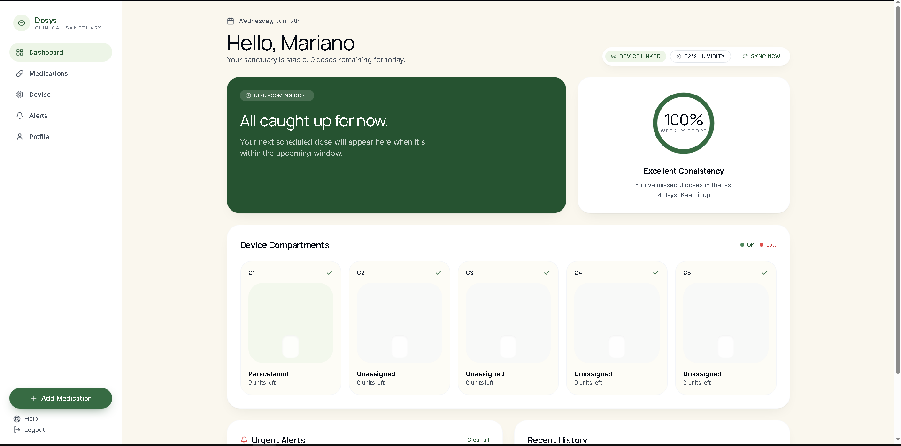

**Figura:** Dashboard del cuidador con estado del dispositivo, score de adherencia y compartimentos con datos reales.

### Vista de Dispositivo — Ambiente (Sprint 2)

La vista `/device` muestra el estado de conexión del dispositivo y las lecturas ambientales reales consumidas del Backend: temperatura y humedad. El panel "Last 24 hours" grafica la tendencia ambiental mediante el componente de gráfico de ambiente cuando hay suficientes lecturas.

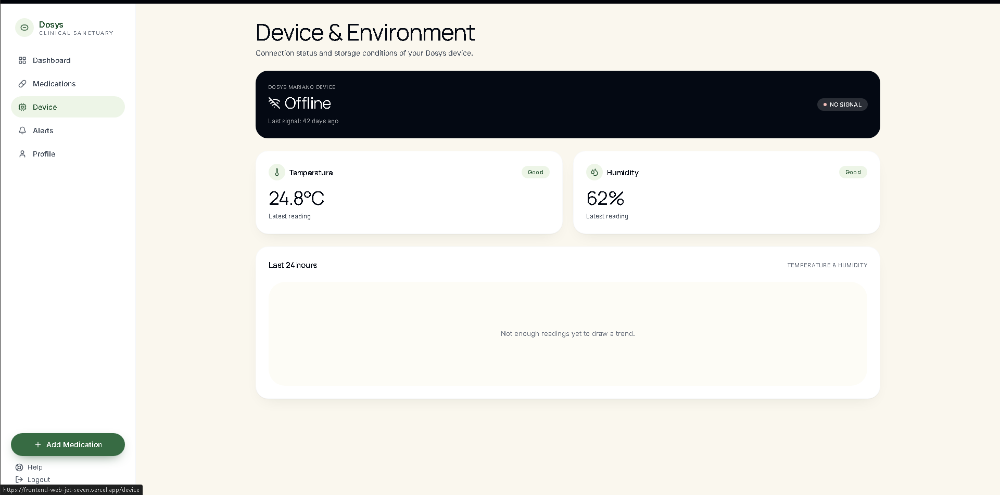

**Figura:** Vista de Dispositivo y Ambiente con estado de conexión y lecturas reales de temperatura/humedad del Backend.

### Vista de Alertas (Sprint 2)

La vista `/alerts` fue reescrita para derivar alertas de humedad, temperatura, recarga, dosis perdidas y estado offline a partir de datos reales mediante la lógica de dominio del Frontend. Las alertas se auto-resuelven cuando el dato de origen cambia.

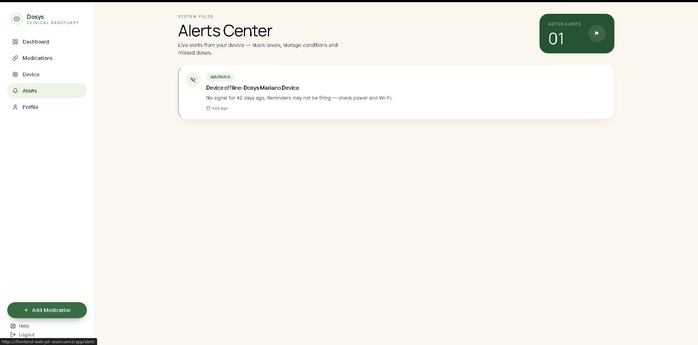

**Figura:** Centro de alertas derivadas de datos reales del Backend.

### Vista de Medicinas (Sprint 2)

Las vistas de Medicinas (`/medications`, `/medications/new`, `/medications/[containerNumber]/edit`) permiten registrar y editar la medicina asignada a cada compartimento. La gestión se apoya en notificaciones de éxito/error y estados de carga consistentes.

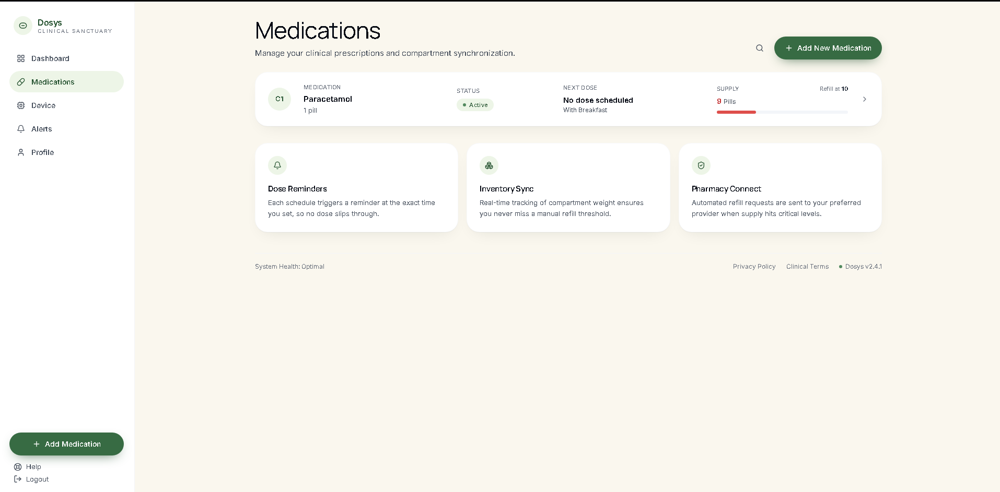

**Figura:** Gestión y edición de medicina por compartimento con datos reales y retroalimentación visual.

### Ejecución física del prototipo IoT

El prototipo físico fue ejecutado con sus componentes principales conectados al ESP32. La prueba permitió validar la operación conjunta del sensor ambiental, módulo RTC, señalización LED y módulo de audio.


Video de funcionamiento de los componentes Testing Hardware: https://youtu.be/prMB6npDBd8 [**Anexo E**]

**Figura:** Prueba física del prototipo Dosys con componentes conectados y funcionando de forma conjunta.

#### 6.2.2.7. Services Documentation Evidence for Sprint Review

El Sprint 2 no introdujo nuevos servicios ni endpoints en el Backend REST API. La documentación OpenAPI 3.0 expuesta mediante SpringDoc permanece vigente y sin cambios respecto del Sprint 1.

El aporte del Sprint 2 a nivel de servicios consistió en completar el consumo, desde el Frontend, de endpoints que el Backend ya exponía pero que no estaban siendo aprovechados completamente. En particular:

| Endpoint existente | Bounded Context | Uso incorporado en Sprint 2 |
| :--- | :--- | :--- |
| `GET /devices/{id}/environment/history` | Medication / Device | US22 — Gráfico de Ambiente con temperatura/humedad de 24 h en la vista `/device`. |
| `GET /devices/{id}/environment/latest` | Medication / Device | US11/US12 — Alertas ambientales derivadas en `/alerts`. |
| `GET /devices/{id}/containers` | Medication | US13 — Alerta de stock bajo o agotado derivada en `/alerts`. |
| `GET /devices/{id}/adherence/calendar` | Medication | US08 — Dosis perdidas como insumo de alertas y score de adherencia. |
| `DeviceResponse.lastSeenAt` | Device | US18 — Detección de estado offline del dispositivo. |

Para el prototipo físico, el Sprint 2 no incorporó aún un nuevo endpoint de firmware ni una nueva integración cloud. La validación física se ejecutó como prueba local de hardware, enfocada en comprobar la operación de componentes antes de cerrar el flujo completo MQTT → Edge Service → Backend → Frontend en una siguiente iteración.

#### 6.2.2.8. Software Deployment Evidence for Sprint Review

El despliegue del Sprint 2 se limitó al **Frontend Web Application en Vercel**. Los despliegues del Backend REST API y del Edge Service en Google Cloud Run, así como el Landing Page en GitHub Pages, permanecen sin cambios respecto del Sprint 1.

### a) Redespliegue del Frontend en Vercel

El push del commit `47f9dcf` a la rama `main` del repositorio `Dosys-IoT/frontend-web` disparó automáticamente una nueva build de producción en Vercel, manteniendo la variable de entorno `NEXT_PUBLIC_API_BASE_URL` apuntando al Backend en Cloud Run. La nueva revisión quedó publicada en el dominio productivo:

[https://frontend-web-jet-seven.vercel.app](https://frontend-web-jet-seven.vercel.app)

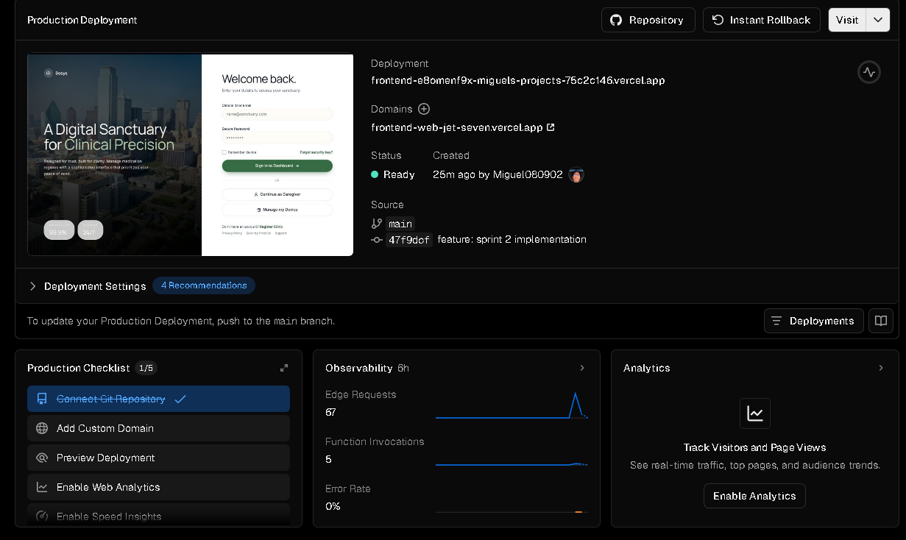

**Figura:** Deployment del Sprint 2 en Vercel, generado a partir del commit de implementación.

### b) Servicios sin cambios

Se verificó que los servicios del Sprint 1 siguieran operativos durante el Sprint Review:

- Backend REST API: `GET /swagger-ui/index.html`
- Edge Service: `GET /edge/v1/health`
- Landing Page: [https://dosys-iot.github.io/landing/](https://dosys-iot.github.io/landing/)

Esto confirma que la nueva versión del Frontend consume la infraestructura ya desplegada en el Sprint 1.

### c) Prototipo físico no desplegado en cloud

El prototipo físico del Sprint 2 se validó localmente. Por tanto, no cuenta aún con un despliegue cloud independiente. Su evidencia se registra como **Hardware Integration Evidence**, no como Software Deployment Evidence. La integración completa del firmware con MQTT, Edge Service, Backend REST API y Frontend queda como siguiente incremento técnico.
#### 6.2.2.9. Team Collaboration Insights during Sprint

Las actividades del Sprint 2 se organizaron en dos líneas principales: consolidación del Frontend Web Application y validación física del prototipo IoT. Esto permitió mantener el avance digital del producto y, al mismo tiempo, demostrar que la solución puede materializarse como dispositivo físico funcional.

- **Ybañez Esquerre, Miguel Angel (`Miguel080902`)** — Lideró el **Frontend Web Application** durante el Sprint 2: alineación con el catálogo oficial US01–US23, retiro de vistas IA/Insights y mocks, consumo real del Backend REST API para alertas, ambiente, estado offline y gestión de medicinas, además de mejoras transversales de calidad/UX.

- **Martel Zevallos, Gabriel Aristóteles (`GaboMartel`)** — Colaboró en **UX/UI Design**, apoyando la coherencia visual de las vistas reescritas y la definición de identidad tipográfica incorporada en la aplicación web.

- **Oblitas Davila, Mariano Moises (`Sigilo-dev`)** — Lideró la vertical de **IoT Hardware Prototype**, desarrollando el diseño 3D del dispositivo, la impresión del prototipo, el ensamblaje de componentes y las pruebas físicas iniciales de sensores, RTC, LEDs, audio, pines y alimentación operativa.

- **Qqueso Rodriguez, Britney Delhy (`brit2801`)** — Colaboró en la **revisión funcional** de las vistas del Frontend y en la verificación de coherencia con la propuesta de valor del producto presentada en el Landing Page.

- **Zúñiga Murillo, Diego Sebastián (`DekayDeCanela`)** — Lideró **QA y documentación** del Sprint 2, consolidando evidencias de ejecución, despliegue, pruebas físicas y coherencia entre backlog, User Stories y avance técnico real.

**Interpretación.** El Sprint 2 mostró un patrón de colaboración mixto: por un lado, mantuvo un liderazgo técnico claro en el Frontend Web Application; por otro, incorporó una vertical física liderada por el responsable de IoT Hardware Prototype. Esta combinación permitió que el producto avance más allá de la interfaz digital y empiece a demostrar factibilidad como solución IoT completa.

La principal mejora del Sprint fue cerrar la brecha entre el informe, el software desplegado y el dispositivo físico. La aplicación web dejó de depender de datos simulados, mientras que el prototipo físico permitió validar que los componentes principales pueden conectarse y operar de forma conjunta.

**Oportunidades de mejora para el siguiente Sprint.** El equipo buscará integrar el firmware del dispositivo físico con MQTT y Edge Service, transportar eventos reales del prototipo hacia el Backend REST API, incorporar pruebas automatizadas para Frontend y Backend, y preparar una validación con usuarios reales del segmento cuidador/adulto mayor.

### 6.2.3. Sprint 3

El Sprint 3 corresponde al cierre del ciclo de vida del producto Dosys y es el foco de la entrega TB2 (Release Review). Mientras el Sprint 2 consolidó el Frontend Web y validó físicamente el prototipo IoT de forma aislada, el Sprint 3 **cierra el flujo de extremo a extremo con hardware real** y **amplía el alcance de las aplicaciones del producto**.

El Sprint 3 se organizó en cuatro frentes complementarios:

1. **Integración IoT real (Firmware ESP32 ↔ MQTT ↔ Edge Service ↔ Backend REST API).** El dispositivo físico dejó de ser una prueba local aislada: ahora publica telemetría real (ambiente, latido/salud de hardware, tomas confirmadas por botón físico y stock) por MQTT hacia el Edge Service, que la reenvía al Backend, y recibe de vuelta su configuración de ejecución (`runtime-config`) y comandos.
2. **Aplicación Móvil Dosys (nueva).** Se incorporó al alcance una **App Móvil en Flutter** orientada al paciente/adulto mayor, con paridad funcional respecto de la Web App y consumo de datos reales del Backend en Cloud Run.
3. **Control y diagnóstico del dispositivo desde la Web App.** El cuidador puede vincular/desvincular el dispositivo físico, configurar la alarma (volumen y horas de silencio), personalizar los horarios de medicación y acceder a una pantalla de diagnóstico IoT de las tres capas (ESP32/Edge/Backend).
4. **Aseguramiento y despliegue final.** Se ampliaron las suites de pruebas (contract tests del Edge, tests de integración y de aceptación BDD del Backend), se documentaron los servicios internos del dispositivo y se desplegó la versión final de las aplicaciones.

El **Landing Page** no se modificó en este Sprint; su despliegue en GitHub Pages permanece vigente. El aporte central del Sprint 3 fue cerrar la brecha entre el software y el hardware, demostrando que Dosys opera como una solución IoT completa de extremo a extremo.

#### 6.2.3.1. Sprint Planning 3

La reunión de Sprint Planning del Sprint 3 se realizó de forma virtual al inicio de la tercera iteración. A continuación se presenta el cuadro resumen.

| Sprint # | Sprint 3 |
| :--- | :--- |
| **Sprint Planning Background** | |
| Date | 2026-06-23 *(confirmar fecha exacta del equipo)* |
| Time | 07:30 PM |
| Location | Reunión virtual por Discord, canal `#dosys-scrum`. |
| Prepared By | Zúñiga Murillo, Diego Sebastián |
| Attendees (to planning meeting) | Martel Zevallos, Gabriel Aristóteles / Oblitas Davila, Mariano Moises / Qqueso Rodriguez, Britney Delhy / Ybañez Esquerre, Miguel Angel / Zúñiga Murillo, Diego Sebastián |
| **Sprint n – 1 Review Summary** | En el Sprint 2 se consolidó el Frontend Web Application (alineación con el catálogo US01–US23 y consumo de datos reales) y se validó físicamente el prototipo IoT de forma aislada (diseño 3D, impresión, ensamblaje y pruebas de componentes). Quedó pendiente cerrar el flujo de extremo a extremo con el hardware real conectado por MQTT y ampliar el alcance a una aplicación móvil. |
| **Sprint n – 1 Retrospective Summary** | El equipo acordó: (a) integrar el firmware del ESP32 con MQTT y el Edge Service para transportar telemetría real hacia el Backend; (b) habilitar la vinculación de un dispositivo físico a la cuenta del cuidador; (c) incorporar la App Móvil como nueva aplicación del alcance; (d) dar al cuidador control y diagnóstico del dispositivo; y (e) ampliar la cobertura de pruebas automatizadas y desplegar la versión final. |
| **Sprint Goal & User Stories** | |
| **Sprint 3 Goal** | *Our focus is on cerrar el ciclo de vida del producto Dosys integrando el dispositivo físico real de extremo a extremo (Firmware ESP32 → MQTT → Edge Service → Backend REST API → aplicaciones), publicando la App Móvil y entregando al cuidador control y diagnóstico del dispositivo. We believe it delivers una solución IoT completa y verificable, con telemetría real de ambiente, salud de hardware, tomas confirmadas por botón físico y stock. This will be confirmed when el dispositivo físico reporte eventos reales visibles en las aplicaciones, el cuidador pueda vincular y controlar el dispositivo, y la App Móvil consuma los mismos datos reales del Backend desplegado.* |
| **Sprint 3 Velocity** | 42 Story Points. 84 horas. |
| **Sum of Story Points** | 42 Story Points. |

#### 6.2.3.2. Aspect Leaders and Collaborators

El Sprint 3 abarcó integración de hardware, servicios, dos aplicaciones cliente y aseguramiento de calidad. Los aspectos considerados fueron: **IoT Firmware & Hardware Integration**, **Edge Service (MQTT)**, **Backend — Device Events & API**, **Frontend Web — Control & Diagnóstico**, **Mobile App** y **QA / Documentation**.

| Team Member (Last Name, First Name) | GitHub Username | IoT Firmware & Hardware | Edge Service (MQTT) | Backend — Device Events & API | Frontend Web — Control & Diagnóstico | Mobile App | QA / Documentation |
| :--- | :--- | :---: | :---: | :---: | :---: | :---: | :---: |
| Oblitas Davila, Mariano Moises | Sigilo-dev | **L** | **L** | **L** | C | C | C |
| Ybañez Esquerre, Miguel Angel | Miguel080902 | C | C | C | **L** | **L** | C |
| Martel Zevallos, Gabriel Aristóteles | GaboMartel | C | C | C | C | C | C |
| Qqueso Rodriguez, Britney Delhy | brit2801 | C | C | C | C | C | C |
| Zúñiga Murillo, Diego Sebastián | DekayDeCanela | C | C | C | C | C | **L** |

Mariano Oblitas lideró la vertical IoT del Sprint: el firmware del ESP32, la mensajería MQTT, el Edge Service y los endpoints internos del dispositivo en el Backend. Miguel Ybañez lideró las dos aplicaciones cliente: el control y diagnóstico del dispositivo en la Web App y la nueva App Móvil en Flutter. Gabriel Martel colaboró en la coherencia visual de las nuevas pantallas de control/diagnóstico y de la App Móvil. Diego Zúñiga lideró QA, la documentación de servicios y la verificación de coherencia documental. Britney Qqueso colaboró en la revisión funcional y en la coherencia con la propuesta de valor.

#### 6.2.3.3. Sprint Backlog 3

Durante el Sprint 3 se formalizaron las siguientes nuevas User Stories, continuación del catálogo (US01–US28):

| ID | Título | User Story | Épica |
| :--- | :--- | :--- | :--- |
| **US29** | Vinculación de Dispositivo Físico | Como cuidador, quiero vincular y desvincular el pastillero físico a mi cuenta, para asociar el dispositivo real a mi tratamiento sin perder el historial. | EP04 |
| **US30** | Confirmación Física de Toma | Como paciente, quiero confirmar mi toma presionando el botón del dispositivo, para que la adherencia se registre automáticamente sin usar el teléfono. | EP04 |
| **US31** | Diagnóstico IoT del Dispositivo | Como cuidador, quiero una pantalla de diagnóstico del dispositivo, para verificar la conectividad y la salud del hardware (ESP32, Edge, MQTT, sensores). | EP04 |
| **US32** | Configuración de Alarma | Como cuidador, quiero ajustar el volumen de la alarma y definir horas de silencio, para adaptar el recordatorio al descanso del paciente. | EP03 |
| **US33** | Horarios de Medicación Personalizados | Como cuidador, quiero definir días y múltiples horarios por medicamento, para reflejar tratamientos con más de una toma al día. | EP02 |
| **US34** | Aplicación Móvil Dosys | Como paciente, quiero una app móvil para gestionar y monitorear mi tratamiento desde el teléfono, con las mismas funciones que la web. | EP01 |
| **US35** | Telemetría del Firmware ESP32 | Como equipo de desarrollo, queremos que el dispositivo publique por MQTT su telemetría real (ambiente, salud, tomas y stock) hacia el Backend, para cerrar el flujo IoT de extremo a extremo. | EP04 |

El board público del Sprint en Trello se encuentra en: [Tablero Trello - Dosys Sprint 3](https://trello.com/invite/b/6a4d4c95d141197cdddf8f9c/ATTI0a880f4968df6ccf84280ee3b6e2dea321842A95/dosys-sprint-3)

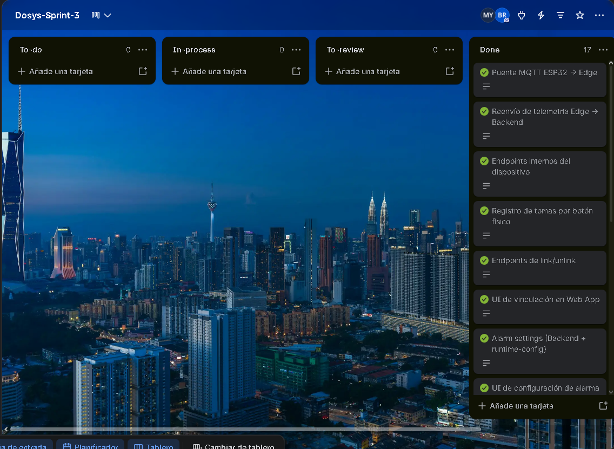

**Figura:** Vista general del tablero Trello y distribución de Work Items para el Sprint 3.

| User Story Id | User Story Title | Work-Item Id | Work-Item Title | Description | Estimation (Hours) | Assigned To | Status |
| :--- | :--- | :--- | :--- | :--- | :---: | :--- | :--- |
| US35 | Telemetría del Firmware ESP32 | WI46 | Puente MQTT ESP32 → Edge | Suscribir el Edge Service a los topics `dosys/devices/+/{environment,heartbeat,intake,stock,config/request}` y parsear los payloads del ESP32. | 6 | Mariano | Done |
| US35 | Telemetría del Firmware ESP32 | WI47 | Reenvío de telemetría Edge → Backend | Enrutar cada evento MQTT al endpoint interno correspondiente del Backend con clave `X-Edge-Service-Key`, normalizando marcas de tiempo a hora de Lima e idempotencia por `eventId`. | 6 | Mariano | Done |
| US35 | Telemetría del Firmware ESP32 | WI48 | Endpoints internos del dispositivo | Rehacer los endpoints `/api/v1/device/internal/{id}/{environment-readings,heartbeats,intake-events,stock-events}` con DTOs tipados, persistencia y migraciones (heartbeats, stock-events). | 7 | Mariano | Done |
| US30 | Confirmación Física de Toma | WI49 | Registro de tomas por botón físico | Persistir `IntakeEvent` con `source = PHYSICAL_BUTTON` y `buttonPin`, actualizando adherencia y stock del compartimento. | 4 | Mariano | Done |
| US29 | Vinculación de Dispositivo Físico | WI50 | Endpoints de link/unlink | Implementar `POST /medication/devices/link` y `POST /medication/devices/{id}/unlink` con `hardwareDeviceId`, reconciliación de propietario y 5 compartimentos por defecto. | 5 | Mariano | Done |
| US29 | Vinculación de Dispositivo Físico | WI51 | UI de vinculación en Web App | Tarjeta de vinculación de dispositivo físico (Device ID / nombre / key) en la vista `/device` cuando la cuenta no tiene dispositivo. | 3 | Miguel | Done |
| US32 | Configuración de Alarma | WI52 | Alarm settings (Backend + runtime-config) | Persistir volumen y horas de silencio (`/alarm-settings`) e incluirlos en el `RuntimeConfigResponse` que consume el ESP32. | 4 | Mariano | Done |
| US32 | Configuración de Alarma | WI53 | UI de configuración de alarma | Sección de configuración de alarma (slider de volumen, quiet hours) en `/profile`, con sincronización al dispositivo. | 3 | Miguel | Done |
| US33 | Horarios de Medicación Personalizados | WI54 | Editor de horarios personalizados | Editor de días de la semana y múltiples horarios por medicamento, con persistencia (`schedules`) y sincronización al dispositivo. | 5 | Miguel | Done |
| US33 | Horarios de Medicación Personalizados | WI55 | Exposición de horarios reales (Backend) | Endpoint `GET .../containers/{n}/schedules` que devuelve solo los horarios activos ordenados por hora. | 3 | Mariano | Done |
| US31 | Diagnóstico IoT del Dispositivo | WI56 | Comandos Edge → ESP32 | Endpoints de comando del Edge (audio-test, led-test, status-request, config-sync) que publican por MQTT al dispositivo. | 4 | Mariano | Done |
| US31 | Diagnóstico IoT del Dispositivo | WI57 | Pantalla de diagnóstico IoT | Vista `/device-diagnostics` con estado de Backend/Edge/MQTT, salud del hardware, ambiente, config en caché y comandos. | 5 | Miguel | Done |
| US34 | Aplicación Móvil Dosys | WI58 | App Móvil Flutter con datos reales | Construir la App Móvil (auth JWT, dashboard, medicinas, dispositivo, insights, alertas, perfil) con paridad respecto de la web y consumo del Backend en Cloud Run. | 12 | Miguel | Done |
| — | Despliegue | WI59 | Despliegue final de servicios | Desplegar Backend en Cloud Run (Supabase Postgres), Edge en Render/Cloud Run y Frontend Web en Vercel, con CORS y variables de entorno. | 4 | Mariano | Done |
| — | QA / Documentation | WI60 | Contract tests del Edge | Suite `test_edge.py` de contrato: parsing de topics, reenvío por tipo de evento, comandos y tolerancia a telemetría inválida. | 4 | Diego | Done |
| — | QA / Documentation | WI61 | Tests de integración y BDD del Backend | Ampliar los tests de integración (link/unlink, alarm settings, horarios) y las features Cucumber de aceptación. | 4 | Diego | Done |
| — | QA / Documentation | WI62 | Evidencias y documentación de Sprint Review | Consolidar capturas, evidencia de despliegue, documentación de servicios internos y video About-the-Product. | 3 | Diego | Done |

#### 6.2.3.4. Development Evidence for Sprint Review

El desarrollo del Sprint 3 abarcó cuatro repositorios: **Edge Service**, **Backend REST API**, **Frontend Web Application** y la nueva **Mobile Application**. El **Landing Page** no se modificó.

- **Backend REST API:** [Repositorio backend](https://github.com/Dosys-IoT/backend)
- **Edge Service:** [Repositorio edge](https://github.com/Dosys-IoT/edge)
- **Frontend Web:** [Repositorio frontend-web](https://github.com/Dosys-IoT/frontend-web) — [Despliegue Vercel](https://frontend-web-jet-seven.vercel.app)
- **Mobile App:** [Repositorio frontend-mobile](https://github.com/Dosys-IoT/frontend-mobile)

| Repository | Branch | Commit Id | Commit Message | Committed on (Date) |
| :--- | :--- | :--- | :--- | :--- |
| Dosys-IoT/frontend-mobile | main | 2cd9c1a | feat: complete mobile app with real data and full feature parity | 2026-06-17 |
| Dosys-IoT/backend | main | 43beeb0 | feat(device): support esp32 hardware events | 2026-06-27 |
| Dosys-IoT/backend | main | 85cc293 | fix(device): return default runtime config when device is missing | 2026-06-27 |
| Dosys-IoT/backend | main | 8096c9f | feat(device): link physical device to user | 2026-06-27 |
| Dosys-IoT/backend | main | c20d374 | feat(backend): persist device alarm settings | 2026-06-28 |
| Dosys-IoT/backend | main | 23067f5 | feat(backend): support device unlinking | 2026-06-28 |
| Dosys-IoT/backend | main | cd7f238 | fix(backend): expose real medication schedules | 2026-06-28 |
| Dosys-IoT/edge | main | 1781246 | feat(edge): bridge esp32 mqtt events | 2026-06-27 |
| Dosys-IoT/edge | main | 5f59cb5 | fix(edge): forward mqtt telemetry to backend | 2026-06-28 |
| Dosys-IoT/edge | main | ac271a3 | fix(edge): enable cors for vercel frontend | 2026-06-28 |
| Dosys-IoT/frontend-web | main | 4d2cbac | feat(frontend): add iot diagnostics screen | 2026-06-27 |
| Dosys-IoT/frontend-web | main | e548714 | feat(frontend): link physical device | 2026-06-27 |
| Dosys-IoT/frontend-web | main | 9acc230 | feat(frontend): support custom medication schedules | 2026-06-28 |
| Dosys-IoT/frontend-web | main | 6fa2af9 | fix(frontend): integrate device controls and status | 2026-06-28 |
| Dosys-IoT/frontend-web | main | a1c1ab0 | fix(frontend): load medication schedules from backend | 2026-06-28 |

**Principales artefactos por repositorio.**

*Edge Service (Flask + MQTT, Python):*

| Acción | Archivo | Propósito |
| :--- | :--- | :--- |
| Añadido | `app/services/command_service.py` | US31 — Publicación de comandos (audio/LED/estado/sync) al ESP32 por MQTT. |
| Modificado | `app/services/sync_service.py` | US35 — Enrutado de eventos MQTT a los endpoints internos del Backend y normalización a hora de Lima. |
| Modificado | `app/mqtt/handlers.py`, `app/mqtt/topics.py`, `app/mqtt/client.py` | US35 — Suscripción a topics del ESP32, `publish_json` y respuesta de `config-request` con caché de `runtime-config`. |
| Añadido | `tests/test_edge.py` | QA — Contract tests del Edge. |
| Añadido | `render.yaml`, `Procfile` | Despliegue del Edge en Render / Cloud Run. |

*Backend REST API (Spring Boot / Java, DDD):*

| Acción | Archivo | Propósito |
| :--- | :--- | :--- |
| Modificado | `device/interfaces/rest/internal/DeviceInternalController.java` | US35 — Endpoints internos con DTOs tipados (environment, heartbeat, intake, stock) y `runtime-config`. |
| Modificado | `medication/application/MedicationService.java` | US29/US32/US33 — Vinculación/desvinculación, alarm settings y horarios por compartimento. |
| Añadido | `db/migration/V5__device_internal_iot_events.sql` | US35 — Tablas `device_heartbeats`, `device_stock_events` e idempotencia por `event_id`. |
| Añadido | `db/migration/V6__add_hardware_device_id.sql` | US29 — `hardware_device_id` para el dispositivo físico. |
| Añadido | `db/migration/V7__device_alarm_settings.sql` | US32 — Volumen y horas de silencio de la alarma. |

*Frontend Web (Next.js 15 / React 19):*

| Acción | Archivo / Ruta | Propósito |
| :--- | :--- | :--- |
| Añadido | `app/(app)/device-diagnostics/page.tsx` | US31 — Pantalla de diagnóstico IoT de tres capas. |
| Modificado | `app/(app)/device/page.tsx` | US29/US31 — Estado del dispositivo, controles (audio/LED/estado/sync) y vinculación. |
| Añadido | `components/medications/custom-schedule-editor.tsx` | US33 — Editor de días y horarios personalizados. |
| Modificado | `app/(app)/profile/page.tsx` | US29/US32 — Configuración de alarma y desvinculación del dispositivo. |
| Añadido | `app/(app)/medications/[containerNumber]/report/page.tsx` | Reporte de adherencia por compartimento. |

*Mobile App (Flutter / Dart):*

| Acción | Archivo / Módulo | Propósito |
| :--- | :--- | :--- |
| Añadido | `dosys_app/lib/main.dart`, `lib/router/app_router.dart` | US34 — App `MaterialApp.router` con `go_router` (splash, login, register, home, medications, device, insights, alerts, profile). |
| Añadido | `lib/core/network/api_client.dart` | US34 — Cliente HTTP con JWT contra el Backend en Cloud Run. |
| Añadido | `lib/core/domain/{device_status,next_dose,alerts,adherence}.dart` | US34 — Lógica de dominio portada desde la Web App (paridad funcional). |

#### 6.2.3.5. Testing Suite Evidence for Sprint Review

El Sprint 3 amplió la cobertura de pruebas automatizadas en los servicios y sumó pruebas de integración física del dispositivo real.

**Edge Service — Contract tests (`tests/test_edge.py`, `unittest`).**

| Test | Objetivo | Resultado |
| :--- | :--- | :--- |
| Parsing de topics | Verificar la extracción de `deviceId` y tipo de evento del topic MQTT. | Passed |
| Rechazo de `deviceId` inconsistente | Rechazar payloads cuyo `deviceId` no coincide con el del topic. | Passed |
| Reenvío por tipo de evento | Environment/heartbeat/intake se reenvían al endpoint interno correcto (con `buttonPin=15`, `source=PHYSICAL_BUTTON`). | Passed |
| Config-request → config-response | Responder la solicitud de configuración del ESP32 por MQTT. | Passed |
| Comandos audio/LED | Publicar comandos de prueba al dispositivo. | Passed |
| Telemetría inválida tolerada | No caerse ante timestamps corruptos; reenviar con hora coercionada a Lima. | Passed |
| CORS | Permitir el origen del Frontend en Vercel y previews. | Passed |

**Backend REST API — Integración y aceptación (JUnit + Cucumber).**

| Test | Objetivo | Resultado |
| :--- | :--- | :--- |
| `DeviceInternalIntegrationTest` | Ingesta de eventos del dispositivo y `runtime-config` por defecto cuando el dispositivo no existe. | Passed |
| `MedicationIntegrationTest` (link/unlink) | Vinculación y desvinculación del dispositivo físico. | Passed |
| `MedicationIntegrationTest` (alarm/horarios) | Persistencia de alarm settings y listado de horarios activos por compartimento. | Passed |
| `AccessIntegrationTest` (`PUT /me`) | Actualización del perfil del usuario autenticado. | Passed |
| Cucumber `device.feature` / `medication.feature` / `access.feature` | Contratos de aceptación BDD de los flujos de dispositivo, medicación y acceso. | Passed |

**Frontend Web y Mobile — Pruebas funcionales manuales.**

| Test Case | User Story | Objetivo | Resultado |
| :--- | :--- | :--- | :--- |
| FE-TC08 — Vinculación de dispositivo | US29 | Vincular/desvincular el dispositivo físico desde la Web App. | Passed |
| FE-TC09 — Diagnóstico IoT | US31 | Verificar estado de Backend/Edge/MQTT, salud del hardware y comandos. | Passed |
| FE-TC10 — Configuración de alarma | US32 | Ajustar volumen y horas de silencio con sincronización al dispositivo. | Passed |
| FE-TC11 — Horarios personalizados | US33 | Definir días y múltiples horarios por medicamento y persistirlos. | Passed |
| MO-TC01 — App Móvil end-to-end | US34 | Login, dashboard, medicinas, dispositivo, insights y perfil con datos reales. | Passed |

**Hardware — Integración de extremo a extremo.**

| Test Case | Objetivo | Resultado |
| :--- | :--- | :--- |
| HW-TC07 — Telemetría MQTT real | El ESP32 publica ambiente/heartbeat/intake/stock y el Edge los reenvía al Backend. | Passed |
| HW-TC08 — Confirmación por botón físico | La toma confirmada con el botón se registra como `IntakeEvent` (`PHYSICAL_BUTTON`). | Passed |
| HW-TC09 — Runtime config del ESP32 | El dispositivo solicita y recibe su `runtime-config` (horarios, umbrales, alarma). | Passed |
| HW-TC10 — Comandos remotos | El dispositivo responde a los comandos audio-test / led-test / status-request / config-sync. | Passed |

#### 6.2.3.6. Execution Evidence for Sprint Review

En el Sprint 3 se ejecutó y verificó el producto completo: las aplicaciones cliente (Web y Móvil) consumiendo datos reales, y el dispositivo físico operando de extremo a extremo por MQTT.

Principales puntos de verificación:

- **Frontend Web — Dispositivo y controles** (`/device`) — estado en vivo (online/offline), ambiente real y controles remotos (Probar audio, Probar LEDs, Solicitar estado, Sincronizar config).
- **Frontend Web — Diagnóstico IoT** (`/device-diagnostics`) — estado de Backend, Edge y MQTT, salud del hardware (RTC, SHT3X, DFPlayer, SD, switch), RSSI, firmware y configuración en caché.
- **Frontend Web — Perfil** (`/profile`) — configuración de alarma (volumen y horas de silencio) y desvinculación del dispositivo.
- **Frontend Web — Medicinas** — editor de horarios personalizados (días + múltiples horas) con persistencia y sincronización al dispositivo.
- **Mobile App** — flujo completo del paciente (login, dashboard con próxima dosis, medicinas por compartimento, dispositivo/ambiente, insights de adherencia, alertas y perfil).
- **Hardware — Extremo a extremo** — telemetría real del ESP32 visible en las aplicaciones y toma confirmada por botón físico registrada como adherencia.

### Vista de Diagnóstico IoT (Sprint 3)

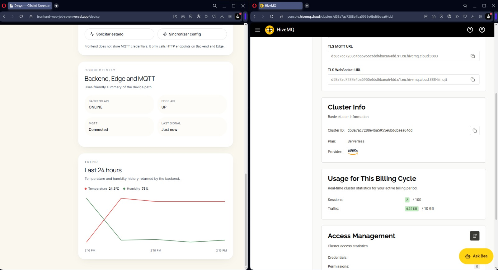

**Figura:** Diagnóstico de conectividad de las tres capas en la Web App (`/device`): Backend API ONLINE, Edge API UP y MQTT Connected con última señal en tiempo real, junto a la consola del clúster HiveMQ Cloud (URLs TLS MQTT/WebSocket, plan Serverless en AWS y sesiones activas del ciclo de facturación).

### Vista de Control del Dispositivo (Sprint 3)

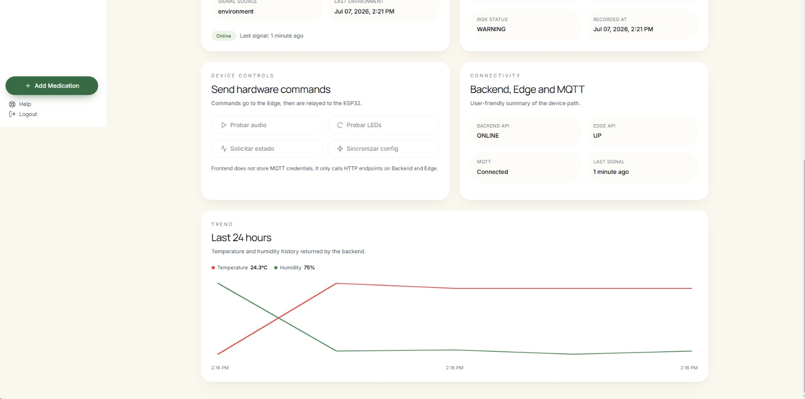

**Figura:** Estado en vivo del dispositivo y comandos remotos hacia el ESP32 vía Edge (Probar audio, Probar LEDs, Solicitar estado, Sincronizar config), con el resumen de conectividad, el estado de riesgo ambiental (WARNING) y la tendencia de temperatura y humedad de las últimas 24 horas.

### Aplicación Móvil Dosys (Sprint 3)

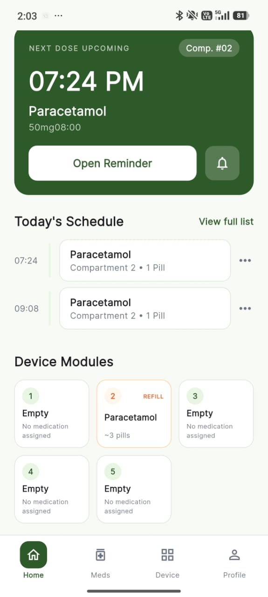

**Figura:** App Móvil en Flutter con datos reales del Backend: dashboard del paciente con la próxima dosis programada, el horario del día y el estado de los compartimentos del dispositivo (incluida la alerta de refill por stock bajo).

### Ejecución de extremo a extremo del dispositivo físico (Sprint 3)

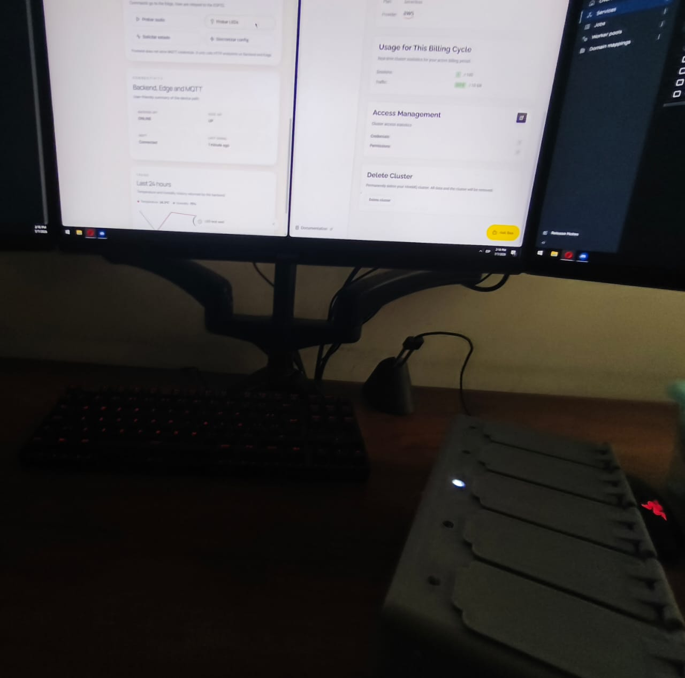

**Figura:** Dispositivo físico Dosys operando junto a la vista de diagnóstico de la Web App (conectividad Backend/Edge/MQTT y telemetría de las últimas 24 horas) y la consola del clúster MQTT en HiveMQ Cloud, evidenciando el flujo real ESP32 → MQTT → Edge → Backend → aplicaciones.

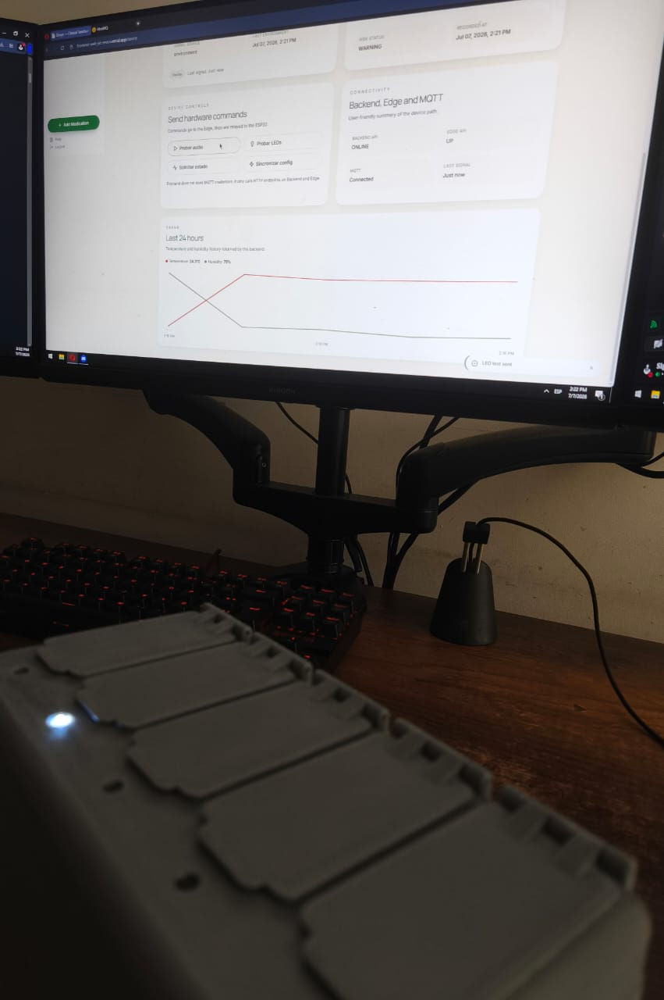

**Figura:** Ejecución del comando remoto "Probar LEDs" desde la Web App: la confirmación "LED test sent" en pantalla y el LED del pastillero físico encendido, verificando el camino inverso Frontend → Backend/Edge → MQTT → ESP32.

#### 6.2.3.7. Services Documentation Evidence for Sprint Review

El Sprint 3 introdujo nuevos servicios y endpoints, principalmente en la API interna del dispositivo (consumida por el Edge Service) y en la API de medicación (consumida por las aplicaciones cliente), además de la mensajería MQTT y los comandos del Edge.

**API interna del dispositivo — Backend (`/api/v1/device/internal`, autenticada con `X-Edge-Service-Key`).**

| Método | Endpoint | Propósito |
| :--- | :--- | :--- |
| GET | `/{deviceId}/runtime-config` | Configuración de ejecución que el ESP32 solicita al arrancar (contenedores, horarios, umbrales ambientales, alarma). |
| POST | `/{deviceId}/environment-readings` | Ingesta de lecturas de temperatura y humedad. |
| POST | `/{deviceId}/heartbeats` | Latido con salud del hardware (RTC, SHT3X, DFPlayer, SD, switch, RSSI, firmware). |
| POST | `/{deviceId}/intake-events` | Toma confirmada por botón físico (`source = PHYSICAL_BUTTON`). |
| POST | `/{deviceId}/stock-events` | Pastillas restantes por compartimento. |

**API de medicación / dispositivo — Backend (`/api/v1/medication`, autenticada por usuario).**

| Método | Endpoint | Propósito |
| :--- | :--- | :--- |
| POST | `/devices/link` | Vincular un dispositivo físico a la cuenta (`hardwareDeviceId`). |
| POST | `/devices/{id}/unlink` | Desvincular el dispositivo conservando el historial. |
| PUT | `/devices/{id}/alarm-settings` | Volumen de alarma y horas de silencio. |
| GET | `/devices/{id}/containers/{n}/schedules` | Horarios activos de un compartimento, ordenados por hora. |
| PUT | `/access/me` | Actualización del perfil del usuario autenticado. |

**Edge Service — Comandos y mensajería.**

| Canal | Detalle |
| :--- | :--- |
| Comandos HTTP → MQTT | `POST /edge/v1/devices/{id}/commands/{audio-test\|led-test\|status-request\|config-sync}` publican al topic `dosys/devices/{id}/commands`. |
| Topics de entrada (ESP32 → Edge) | `dosys/devices/+/{environment, heartbeat, intake, stock, config/request}`. |
| Topics de salida (Edge → ESP32) | `dosys/devices/{id}/config/response`, `dosys/devices/{id}/commands`. |
| Diagnóstico | `GET /edge/v1/health`, `/edge/v1/mqtt/status`, `/edge/v1/devices/{id}/cached-config`, `/edge/v1/diagnostics/events/recent`. |

El broker MQTT es **HiveMQ Cloud** (TLS, puerto 8883). La documentación OpenAPI 3.0 del Backend (SpringDoc) se mantiene vigente e incorpora los nuevos endpoints.

#### 6.2.3.8. Software Deployment Evidence for Sprint Review

El Sprint 3 desplegó la versión final de las aplicaciones del alcance:

| Producto | Plataforma | Estado en Sprint 3 |
| :--- | :--- | :--- |
| **Frontend Web** | Vercel | Nueva versión con control/diagnóstico del dispositivo y horarios personalizados. `NEXT_PUBLIC_API_BASE_URL`/`EDGE_API_BASE_URL` a los servicios en la nube. |
| **Backend REST API** | Google Cloud Run + **Supabase PostgreSQL** | Datasource externalizado por variables de entorno; contraseña vía Secret Manager; Flyway gestiona el esquema (`ddl-auto: validate`). |
| **Edge Service** | **Render** (`render.yaml`) y Cloud Run (`Procfile`) | Puente MQTT ↔ Backend con `X-Edge-Service-Key`; CORS habilitado para Vercel. |
| **Mobile App** | Flutter (build Android/iOS/Web) | Primera versión funcional apuntando al Backend en Cloud Run; distribución manual (APK / `flutter run`). |
| **Landing Page** | GitHub Pages | Sin cambios respecto del Sprint 1. |

- **Frontend Web:** [https://frontend-web-jet-seven.vercel.app](https://frontend-web-jet-seven.vercel.app)
- **Backend REST API:** `https://dosys-backend-149855215912.us-central1.run.app` (Swagger en `/swagger-ui/index.html`).
- **Edge Service:** `https://dosys-edge-149855215912.us-central1.run.app` (health en `/edge/v1/health`).

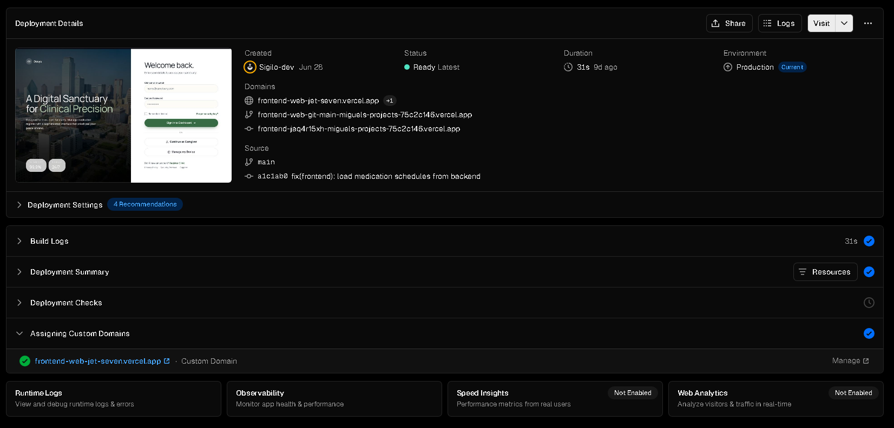

**Figura:** Deployment del Sprint 3 en Vercel a partir del último commit de la iteración (`a1c1ab0 — fix(frontend): load medication schedules from backend`), con estado Ready en producción y el dominio productivo `frontend-web-jet-seven.vercel.app`.

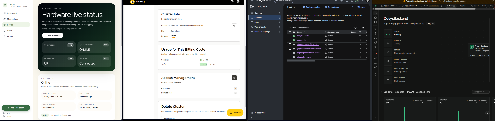

**Figura:** Vista consolidada de las capas del sistema en producción: Web App con el estado en vivo del dispositivo (Backend ONLINE, Edge UP, MQTT Connected), clúster MQTT en HiveMQ Cloud, servicios `dosys-backend` y `dosys-edge` en Google Cloud Run, y base de datos Postgres en Supabase con estado Healthy.

> **Nota:** la evidencia de build de la App Móvil debe incorporarse en `imgs/sprint-3/` antes de la entrega final.

#### 6.2.3.9. Team Collaboration Insights during Sprint

El Sprint 3 se organizó en cuatro líneas de trabajo (IoT/servicios, Web App, App Móvil y QA/despliegue), integrando por primera vez el hardware real con el software en un flujo de extremo a extremo.

- **Oblitas Davila, Mariano Moises (`Sigilo-dev`)** — Lideró la vertical **IoT y servicios**: firmware del ESP32, mensajería MQTT, Edge Service (reenvío de telemetría y comandos) y los endpoints internos del dispositivo, vinculación/desvinculación, alarm settings y horarios reales en el Backend, además del despliegue de Backend y Edge.

- **Ybañez Esquerre, Miguel Angel (`Miguel080902`)** — Lideró las **aplicaciones cliente**: control y diagnóstico del dispositivo, editor de horarios personalizados y configuración de alarma en la Web App, y el desarrollo completo de la **App Móvil en Flutter** con paridad funcional y datos reales.

- **Martel Zevallos, Gabriel Aristóteles (`GaboMartel`)** — Colaboró en **UX/UI**, apoyando la coherencia visual de las nuevas pantallas de control/diagnóstico y de la App Móvil.

- **Qqueso Rodriguez, Britney Delhy (`brit2801`)** — Colaboró en la **revisión funcional** del producto integrado y en la coherencia con la propuesta de valor presentada en el Landing Page.

- **Zúñiga Murillo, Diego Sebastián (`DekayDeCanela`)** — Lideró **QA, documentación y despliegue final**: contract tests del Edge, tests de integración y aceptación del Backend, documentación de servicios internos y consolidación de evidencias del Sprint Review.

**Interpretación.** El Sprint 3 mostró el patrón de colaboración más integrador del proyecto: dos líderes técnicos complementarios (IoT/servicios y aplicaciones cliente) cerrando juntos el flujo de extremo a extremo, con soporte transversal de UX, revisión funcional y QA. La principal mejora fue eliminar la última brecha entre el informe, el software desplegado y el dispositivo físico: el hardware real ahora reporta telemetría verificable y la adherencia se registra por botón físico.

**Cierre del ciclo.** Con el Sprint 3, Dosys alcanza una solución IoT completa: Landing, Web App, App Móvil, Backend, Edge y dispositivo físico operando de extremo a extremo. Las oportunidades de continuidad (notificaciones push al cuidador, endurecimiento de seguridad del canal MQTT, y pruebas de adherencia longitudinales con usuarios reales) quedan documentadas como trabajo futuro más allá del alcance del curso.

## 6.3. Validation Interviews

Con el producto ya desplegado —pastillero inteligente IoT, Web App del cuidador y App Móvil— el equipo Dosys realizó entrevistas de validación con usuarios reales de los dos segmentos objetivo. A diferencia de las entrevistas de descubrimiento y *needfinding* registradas en la sección 2.2 (orientadas a entender el problema), estas entrevistas de validación buscan confirmar que la solución construida resuelve el problema y resulta usable, deseable y viable para el paciente adulto mayor y para el familiar/cuidador.

### 6.3.1. Diseño de Entrevistas

**Objetivo.** Validar con usuarios reales la comprensión, usabilidad y utilidad percibida de los tres componentes del producto: (a) el dispositivo físico (pastillero de 5 compartimentos con recordatorio multimodal de voz, LED y botón), (b) la Web App del cuidador y (c) la App Móvil, verificando las hipótesis de valor definidas en el Lean UX (adherencia del paciente y reducción de la carga de supervisión del cuidador).

**Segmentos entrevistados.** Se definieron dos segmentos, coherentes con los Problem Statements de 1.2.2.1:

| Segmento | Perfil | Qué se valida |
| :--- | :--- | :--- |
| **Segmento 1 — Adulto mayor / paciente** | Persona adulta mayor con uno o más tratamientos crónicos, usuaria directa del dispositivo físico. | Facilidad de entendimiento del dispositivo, claridad de los compartimentos, ergonomía, visibilidad del recordatorio multimodal (alarma/LED) y utilidad percibida para recordar sus tomas. |
| **Segmento 2 — Familiar / cuidador** | Familiar o cuidador responsable del seguimiento de la medicación del adulto mayor, usuario principal de la app de monitoreo. | Sencillez de la app, claridad de la información de adherencia, utilidad del monitoreo remoto (tomas, próxima dosis, alertas) y comprensión del dispositivo físico. |

**Método.** Entrevista **semiestructurada** e individual, realizada de forma presencial con demostración del prototipo físico y de la aplicación desplegada. Cada sesión fue **grabada en video** con consentimiento del participante y publicada como evidencia (enlaces en 6.3.2). El entrevistador siguió un guion base por segmento, permitiendo repreguntas para profundizar en las respuestas.

**Guion de preguntas — Segmento 1 (Adulto mayor / paciente).**

| Dimensión | Preguntas |
| :--- | :--- |
| **Dispositivo físico** | ¿El dispositivo le parece fácil de entender? · ¿El diseño le parece amigable? · ¿Los 5 compartimentos son suficientes para sus pastillas? · ¿Los compartimentos se ven claros y fáciles de identificar? · ¿La forma curva del compartimento le ayuda a sacar la pastilla con facilidad? · ¿Dónde colocaría el dispositivo en su casa? · ¿Cambiaría algo del diseño físico? |
| **Aplicación** | ¿La app le parece sencilla de usar? · ¿Cree que usted o un familiar podría usarla fácilmente? · ¿Qué información le gustaría ver en la app? · ¿Qué funcionalidad extra le gustaría tener? |
| **Recordatorio multimodal y valor general** | ¿La alarma se escucha con claridad? · ¿Las luces LED se ven bien durante el día? · ¿Cree que el dispositivo le ayudaría a recordar sus pastillas? · ¿Usaría este dispositivo todos los días? |

**Guion de preguntas — Segmento 2 (Familiar / cuidador).**

| Dimensión | Preguntas |
| :--- | :--- |
| **Datos del participante** | ¿Cómo te llamas? · ¿Cuántos años tienes? · ¿Cuál es tu relación con el adulto mayor? |
| **Aplicación de monitoreo** | ¿La app te parece sencilla de usar? · ¿La información de la app se entiende fácilmente? · ¿Te serviría ver si el adulto mayor tomó o no tomó su medicamento? · ¿Te serviría ver la hora de la próxima dosis? · ¿Te gustaría recibir alertas si una dosis no fue tomada? · ¿Qué dato consideras más importante ver en la app? · ¿Agregarías alguna funcionalidad extra? |
| **Dispositivo físico** | ¿El dispositivo físico te parece fácil de entender? · ¿Crees que los 5 compartimentos son suficientes? · ¿Dónde crees que debería colocarse el dispositivo en casa? |

### 6.3.2. Registro de Entrevistas

Las siguientes entrevistas fueron realizadas y grabadas. Los videos completos constituyen la evidencia de validación del producto.

| # | Segmento | Participante | Perfil | Video |
| :--- | :--- | :--- | :--- | :--- |
| **E1** | Adulto mayor / paciente | Participante 1 | Adulto mayor con tratamiento crónico | [Segmento 1 — Entrevista 1](https://youtu.be/WT8atub9vWo) |
| **E2** | Adulto mayor / paciente | Participante 2 | Adulto mayor con tratamiento crónico | [Segmento 1 — Entrevista 2](https://youtu.be/Xt1SSdcho6E) |
| **E3** | Adulto mayor / paciente | Mery Murillo | Adulta mayor con tratamiento crónico | [Segmento 1 — Entrevista 3](https://youtu.be/gK98ZRZfnWs) |
| **E4** | Familiar / cuidador | Eduardo Rodríguez Alarcón | Nieto (28 años), cuidador de adulto mayor | [Segmento 2 — Entrevista cuidador](https://youtu.be/Q8i7aOgb4hU) |

**Videos de las entrevistas de validación** *(haz clic en cada miniatura para reproducir el video completo en YouTube).*

<table>
  <tr>
    <td align="center">
      <a href="https://youtu.be/WT8atub9vWo" target="_blank">
        
      </a>
      <br/><b>E1 — Adulto mayor / paciente</b>
    </td>
    <td align="center">
      <a href="https://youtu.be/Xt1SSdcho6E" target="_blank">
        
      </a>
      <br/><b>E2 — Adulto mayor / paciente</b>
    </td>
    <td align="center">
      <a href="https://youtu.be/gK98ZRZfnWs" target="_blank">
        
      </a>
      <br/><b>E3 — Adulto mayor / paciente</b>
    </td>
    <td align="center">
      <a href="https://youtu.be/Q8i7aOgb4hU" target="_blank">
        
      </a>
      <br/><b>E4 — Familiar / cuidador</b>
    </td>
  </tr>
</table>

> **Nota de estado:** al cierre de esta iteración se completaron **4 entrevistas de validación**: **3 del Segmento 1 (adulto mayor)** y **1 del Segmento 2 (familiar/cuidador)**. Las cuatro fueron grabadas con demostración del prototipo físico y de la aplicación; los enlaces y miniaturas están arriba y las respuestas se detallan a continuación.

#### Respuestas por entrevista

**E1 — Adulto mayor / paciente (Segmento 1).**

| Pregunta | Respuesta |
| :--- | :--- |
| ¿El dispositivo le parece fácil de entender? | Sí. |
| ¿El diseño le parece amigable? | Sí, aunque lo preferiría **ligeramente más pequeño**. |
| ¿Los 5 compartimentos son suficientes? | Suficientes. |
| ¿Los compartimentos se ven claros y fáciles de identificar? | Sí. |
| ¿La forma curva le ayuda a sacar la pastilla con facilidad? | Sí, con facilidad. |
| ¿Dónde colocaría el dispositivo en su casa? | En su mesita de noche. |
| ¿Cambiaría algo del diseño físico? | El tamaño: que sea **más práctico y compacto ("más chato"), no tan alto**, como un pastillero tradicional. |
| ¿La app le parece sencilla de usar? | Sí. |
| ¿Cree que usted o un familiar podría usarla fácilmente? | Sí, explicándole cómo entrar a la web. |
| ¿Qué información le gustaría ver en la app? | Además del número de pastillas y cuántas ha tomado, le gustaría ver **la receta**. |
| ¿Qué funcionalidad extra le gustaría? | Un formato físico más compacto/bajo. |
| ¿La alarma se escucha con claridad? | Sí. |
| ¿Las luces LED se ven bien durante el día? | Sí. |
| ¿Le ayudaría a recordar sus pastillas? | Sí. |
| ¿Usaría este dispositivo todos los días? | Cuando sea necesario, sí. |

**E2 — Adulto mayor / paciente (Segmento 1).**

| Pregunta | Respuesta |
| :--- | :--- |
| ¿El dispositivo le parece fácil de entender? | Sí, está muy claro. |
| ¿El diseño le parece amigable? | "Re contra amigable". |
| ¿Los 5 compartimentos son suficientes? | Sí, son suficientes. |
| ¿Los compartimentos se ven claros y fáciles de identificar (por las luces)? | Sí. |
| ¿La forma curva le ayuda a sacar la pastilla con facilidad? | "Muchísima facilidad… excelente". |
| ¿Dónde colocaría el dispositivo en su casa? | En su mesita de noche. |
| ¿Cambiaría algo del diseño físico? | Solo **el color** (sugiere un rojo más visible). |
| ¿La app le parece sencilla de usar? | Sí. |
| ¿Cree que usted o un familiar podría usarla fácilmente? | Duda de sí misma, pero sí un familiar (p. ej. Fernanda). |
| ¿Qué información le gustaría ver en la app? | Mostrar **la receta agrupada** (varias pastillas de una misma receta). |
| ¿Qué funcionalidad extra le gustaría? | Enfocada en la aplicación; el resto le parece bien y práctico. |
| ¿La alarma se escucha con claridad? | Con mucha claridad. |
| ¿Las luces LED se ven bien durante el día? | Sí. |
| ¿Le ayudaría a recordar sus pastillas? | Por supuesto que sí. |
| ¿Usaría este dispositivo todos los días? | Sí, mientras deba tomar la pastilla; le sería muy favorable. |

**E3 — Mery Murillo, adulta mayor / paciente (Segmento 1).**

| Pregunta | Respuesta |
| :--- | :--- |
| ¿El dispositivo le parece fácil de entender? | Sí, bastante fácil y claro. |
| ¿El diseño le parece amigable? | Sí; entiende que es un prototipo y que más adelante se le dará color. |
| ¿Los 5 compartimentos son suficientes? | Observa que **muchos pacientes toman pastillas los 7 días de la semana, no solo 5** (sugiere considerar capacidad semanal). |
| ¿Los compartimentos se ven claros y fáciles de identificar? | Sí. |
| ¿La forma curva le ayuda a sacar la pastilla con facilidad? | Sí. |
| ¿Dónde colocaría el dispositivo en su casa? | Al pie de su cama, en la mesa de noche. |
| ¿Cambiaría algo del diseño físico? | Lo haría **más pequeño y transportable** (para llevarlo en el bolso). |
| ¿Cree que un familiar o usted podría usarlo fácilmente? | Por supuesto que sí. |
| ¿Qué funcionalidad extra le gustaría? | Le parece completo; valora la alarma que avisa la hora de la dosis. |
| ¿La alarma debería escucharse con claridad? | Sí, por ser algo importante (la medicación). |
| ¿Las luces LED se ven bien durante el día? | Se ven perfectamente según el diseño mostrado. |
| ¿Le ayudaría a recordar sus pastillas? | Por supuesto; reitera que sea más pequeño para poder transportarlo. |
| ¿Usaría este dispositivo todos los días? | Por supuesto que sí. |

**E4 — Eduardo Rodríguez Alarcón, cuidador / nieto (28 años, Segmento 2).**

| Pregunta | Respuesta |
| :--- | :--- |
| ¿Cómo se llama? | Eduardo Rodríguez Alarcón. |
| ¿Cuántos años tiene? | 28 años. |
| ¿Cuál es su relación con el adulto mayor? | Nieto; apoya en su cuidado y está pendiente de que tome sus medicamentos. |
| ¿La app le parece sencilla de usar? | Sí; la información está organizada de forma clara y no se ve complicada. |
| ¿La información de la app se entiende fácilmente? | Sí; lo más importante es que muestre medicamento, horarios y estado de la dosis de manera directa. |
| ¿Le serviría ver si el adulto mayor tomó o no su medicamento? | Sí, bastante; a veces no está cerca y verlo en la app le da tranquilidad. |
| ¿Le serviría ver la hora de la próxima dosis? | Sí; así puede anticiparse y recordarle a su abuela. |
| ¿Le gustaría recibir alertas si una dosis no fue tomada? | Sí; lo considera muy importante para **actuar rápido**. |
| ¿Qué dato considera más importante? | Saber **si tomó o no** sus pastillas y la **hora de la próxima toma**. |
| ¿Agregaría alguna funcionalidad extra? | Un **historial** por días/semanas/meses y **permitir que más familiares reciban las alertas**. |
| ¿El dispositivo físico le parece fácil de entender? | Sí; luces claras, botones grandes y recordatorios por voz ayudan mucho al adulto mayor. |
| ¿Cree que los 5 compartimentos son suficientes? | Sí, para la mayoría de tratamientos diarios (quien tome muchos medicamentos podría necesitar más espacio). |
| ¿Dónde debería colocarse el dispositivo en casa? | En un lugar visible, seco y de fácil acceso (mesa de noche, repisa en la sala o cerca de donde desayuna). |

**Síntesis de hallazgos — Segmento 1 (Adulto mayor).**

| Dimensión validada | Hallazgos observados en las entrevistas |
| :--- | :--- |
| **Comprensión del dispositivo** | Los tres participantes entendieron el propósito del pastillero y la lógica de un compartimento por toma sin explicación extensa ("está muy claro", "bastante fácil y claro"). |
| **Compartimentos (cantidad y claridad)** | Los 5 compartimentos se percibieron suficientes para el tratamiento diario (E1 y E2); la identificación por compartimento resultó clara. **E3 (Mery Murillo) señaló que muchos pacientes toman pastillas los 7 días de la semana**, no solo 5 → considerar capacidad semanal. |
| **Ergonomía (forma curva)** | La forma curva facilitó la extracción de la pastilla en los tres casos; E2 la calificó de "excelente, muchísima facilidad". |
| **Ubicación en el hogar** | Los tres ubicarían el dispositivo en la **mesita/mesa de noche**. |
| **Diseño físico (tamaño y color)** | E1 y E3 pidieron un formato **más pequeño/compacto y transportable** (E3: llevarlo en el bolso); E2 solo cambiaría el **color** (rojo más visible). |
| **Recordatorio multimodal (alarma + LED)** | La alarma se escuchó con claridad ("con mucha claridad") y las luces LED se ven bien durante el día en los tres casos. |
| **Utilidad percibida y uso diario** | Los tres consideraron que el dispositivo les ayudaría a recordar sus pastillas y manifestaron disposición a usarlo diariamente. |
| **Aplicación** | App percibida como sencilla; E1 y E2 sugirieron mostrar **la receta** (agrupando las pastillas de una misma prescripción) además del conteo de pastillas. |

**Síntesis de hallazgos — Segmento 2 (Familiar / cuidador).**

| Dimensión validada | Hallazgos observados en la entrevista |
| :--- | :--- |
| **Sencillez de la app** | Percibida como sencilla y clara, con la información organizada y no complicada de manejar. |
| **Información de adherencia** | Lo más valorado: ver **si tomó o no** la dosis y la **hora de la próxima toma** de forma directa. |
| **Monitoreo remoto** | Útil para el cuidador que no siempre está cerca; ver el estado en la app "da más tranquilidad". |
| **Alertas** | Considera **muy importante** recibir alertas cuando una dosis no fue tomada, para actuar rápido. |
| **Funcionalidades deseadas** | **Historial** de cumplimiento (días/semanas/meses) y **alertas para más de un familiar**. |
| **Dispositivo físico** | Fácil de entender (luces claras, botones grandes, voz); 5 compartimentos suficientes para la mayoría de tratamientos; ubicación visible, seca y de fácil acceso. |

### 6.3.3. Evaluaciones según heurísticas

Además de las entrevistas, se realizó una **evaluación heurística** de la usabilidad del producto siguiendo las **10 heurísticas de Nielsen**, aplicadas principalmente a la Web App del cuidador y a la App Móvil (con referencia al recordatorio multimodal del dispositivo físico). Cada heurística se valoró con una **severidad de 0 a 4** (0 = sin problema, 4 = problema crítico).

| # | Heurística de Nielsen | Evaluación en Dosys | Severidad | Recomendación |
| :--- | :--- | :--- | :---: | :--- |
| 1 | Visibilidad del estado del sistema | La app muestra estado online/offline del dispositivo, score de adherencia, próxima dosis y estados de carga (skeletons); el dispositivo señaliza la toma con LED + voz. | 1 | Reforzar realimentación en tiempo real de la confirmación de toma en la app. |
| 2 | Correspondencia entre el sistema y el mundo real | Lenguaje cotidiano en español; metáfora directa "1 compartimento = 1 toma"; términos como "pastillas", "dosis", "alertas". | 0 | Mantener; evitar tecnicismos (p. ej. "telemetría"). |
| 3 | Control y libertad del usuario | El cuidador puede crear, editar y retirar medicina por compartimento, vincular y desvincular el dispositivo. | 1 | Añadir confirmación/deshacer en acciones destructivas (desvincular, eliminar medicina). |
| 4 | Consistencia y estándares | Tipografía e identidad visual consistentes (Manrope/Inter); patrones de navegación equivalentes entre Web App y App Móvil (paridad de funciones). | 1 | Homologar íconos y etiquetas entre web y móvil. |
| 5 | Prevención de errores | Estados de carga y validaciones en formularios de medicación y horarios evitan envíos incompletos. | 1 | Validar rangos de horario y stock antes de guardar. |
| 6 | Reconocer antes que recordar | Vistas de Dashboard, Alertas, Ambiente y Medicinas exponen la información sin exigir memorización; compartimentos visibles con su contenido. | 1 | Mostrar recordatorio visible de la próxima toma en pantalla principal. |
| 7 | Flexibilidad y eficiencia de uso | Onboarding de dispositivo cuando no hay uno vinculado; edición rápida por compartimento; horarios de medicación personalizables. | 2 | Ofrecer accesos directos y edición por lotes de horarios para cuidadores frecuentes. |
| 8 | Diseño estético y minimalista | Interfaz limpia tras retirar vistas fuera de alcance (IA/Insights) en el Sprint 2. | 0 | Mantener jerarquía visual centrada en dosis, adherencia y alertas. |
| 9 | Ayudar a reconocer y recuperarse de errores | Banner de error con acción "Retry" y notificaciones tipo *toast* de éxito/error. | 1 | Mensajes de error más específicos por tipo de fallo (red, permisos, dispositivo offline). |
| 10 | Ayuda y documentación | El Landing Page y los videos About-the-Product explican el uso; la app prioriza el autoservicio. | 2 | Incorporar ayuda contextual mínima (tooltips) y una guía rápida de primer uso. |

**Interpretación.** La evaluación heurística no reveló problemas críticos (severidad 4). Las oportunidades de mayor severidad (nivel 2) se concentran en **flexibilidad/eficiencia** (accesos directos y edición por lotes para cuidadores) y **ayuda/documentación** (guía de primer uso), coherentes con lo recogido en las entrevistas del Segmento 1. Estas mejoras se priorizarán en el cierre del producto. La combinación de entrevistas de validación (deseabilidad y utilidad) con la evaluación heurística (usabilidad) confirma que Dosys es comprensible y usable para sus dos segmentos, con ajustes menores pendientes antes de la versión final.

## 6.4. Video About-the-Product

En el Video About-the-Product el equipo Dosys presenta el producto terminado: el pastillero inteligente IoT y sus aplicaciones (Landing Page, Web App del cuidador y App Móvil), mostrando el flujo de valor de extremo a extremo —configuración de medicamentos, recordatorio multimodal (voz + LED + botón), confirmación de toma y monitoreo remoto del cuidador—.

**Video About-the-Product:** [https://youtu.be/8jEXd3OHYDs](https://youtu.be/8jEXd3OHYDs)

# Conclusiones

## Conclusiones y recomendaciones

**Sobre los Problem Statements.** Los dos Problem Statements definidos en 1.2.2.1 se han abordado parcialmente en esta primera iteración. Para el Problem Statement 1 (adultos mayores con tratamientos crónicos), el equipo entregó la infraestructura de configuración multimodal: el cuidador ya puede registrar medicamentos, asignar compartimentos y programar horarios desde la Web App, y el ESP32 cuenta con el endpoint `runtime-config` para sincronizar las próximas 24 h de tomas. La validación final del recordatorio multimodal (voz + LED + botón) y de la mejora en adherencia con usuarios reales queda como hipótesis a probar en el Sprint 2 a través de pruebas con pacientes del segmento. Para el Problem Statement 2 (familiares y cuidadores), el monitoreo remoto ya está operativo: el cuidador puede ver lecturas de temperatura y humedad reales transportadas vía MQTT → Edge → Backend → Web App, lo cual habilita la próxima etapa de validar la reducción de carga de supervisión percibida.

**Sobre los Assumptions.** De los 11 Business Assumptions y 6 dimensiones de User Assumptions de 1.2.2.2, los más cercanos a la validación al cierre de TB1 son: (a) la viabilidad técnica de un dispositivo multimodal conectado a una app por API REST con monitoreo ambiental incluido, hoy demostrada por el end-to-end MQTT → Edge → Backend → Frontend; (b) la receptividad de los cuidadores hacia una experiencia simple de configuración por compartimento, parcialmente validada por la propuesta de UI matricial 1-a-1 con el pastillero físico. Las assumptions sobre canales de adquisición, modelo de precios y resistencia tecnológica del adulto mayor permanecen como riesgos vivos para validar en TB2.

**Sobre los Hypotheses Statements.** El Hypothesis 1 (≥ 80 % de dosis confirmadas a tiempo) y el Hypothesis 2 (reducción del 70 % en preocupación percibida del cuidador) requieren la prueba en producción con el dispositivo físico y un panel de usuarios; al cierre de TB1 ambos están desbloqueados técnicamente. El Hypothesis 3 (alertas ambientales antes del umbral crítico) está validado a nivel funcional: el Backend calcula `risk_status` en la ingesta de `environment-readings` y la Web App muestra el historial de 24 h. El Hypothesis 4 (avisos anticipados de recarga / compra) cuenta con el endpoint `stock-events` ingresando datos en la tabla `medication_containers.remainingPills`, pero la lógica de alerta proactiva (push al cuidador) se traslada al Sprint 2.

**Sobre los Lean UX success criteria.** El criterio de éxito de la entrega TB1 era contar con la primera versión desplegada de Landing, Frontend, Backend y Edge, conectados de extremo a extremo. Este criterio se cumple: las URLs públicas están operativas y el flujo del cuidador es funcional. El siguiente criterio (adherencia medible en uso real) se validará en TB2.

**Recomendaciones / Roadmap.**

1. **Sprint 2 — Cierre del flujo del paciente.** Implementar firmware ESP32 con WS2812B, DHT22, RTC DS3231, audio, botones y conexión MQTT TLS hacia HiveMQ. Implementar el front-end del estado de tomas en tiempo real con suscripción WebSocket o long-polling al `adherence/calendar`.
2. **Sprint 2 — Notificaciones push.** Integrar Firebase Cloud Messaging para entregar los eventos de `MISSED`, `WARNING`/`CRITICAL` ambientales y `low stock` al cuidador.
3. **Sprint 2 — Acceptance Tests BDD.** Incorporar Cucumber JVM al Backend y `.feature` files por User Story para complementar los 33 tests de integración existentes.
4. **Sprint 3 — Validación con usuarios reales.** Coordinar 3–5 entrevistas de validación por segmento (cuidador y paciente) siguiendo el formato heurístico del Anexo D del curso.
5. **Producto.** Evaluar la conveniencia de un modelo freemium para la Web App (versión básica gratuita + reportes avanzados de adherencia con suscripción) tal como se discutió en el Lean UX Canvas (1.2.2.4).
6. **Operación.** Habilitar branch protection sobre `main` en los cuatro repos y activar GitHub Actions para CI (build + tests del Backend, build de Next.js, lint + type-check del Frontend).

## Video About-the-Team

En el Video About-the-Team el equipo Dosys presenta el proceso de trabajo de las primeras siete semanas del proyecto, desde la conformación de la startup, el Lean UX Process y el descubrimiento con entrevistas, hasta la entrega del MVP desplegado al cierre del Sprint 1. La pauta de secuencias propuesta es:

| Tiempo (hh:mm:ss) | Sección |
| :--- | :--- |
| 00:00:00 | Intro y presentación de la marca Dosys. |
| 00:00:30 | Presentación de los 5 integrantes (rol, ciclo, expectativas). |
| 00:02:00 | Problema, segmentos objetivo y Lean UX. |
| 00:04:00 | Solución: Landing, Web App, Backend, Edge y pastillero IoT. |
| 00:06:00 | Demostración del despliegue end-to-end (con voice over). |
| 00:08:00 | Testimonio en cámara de cada participante: actividades realizadas, outcomes alcanzados y competencias desarrolladas. |
| 00:12:00 | Cierre, agradecimientos y roadmap. |

> **Pendientes a completar antes de la entrega final:**
> - URL del video publicado en Microsoft Stream/Clipchamp.
> - URL del video publicado en YouTube (para embed en el Landing).
> - Cuadro de video representativo (screenshot) insertado aquí.

# Bibliografía

Checchi, K. D., Huybrechts, K. F., Avorn, J., & Kesselheim, A. S. (2014). Electronic medication packaging devices and medication adherence: A systematic review. *JAMA, 312*(12), 1237–1247. https://doi.org/10.1001/jama.2014.10059

Conventional Commits. (s.f.). *Conventional Commits 1.0.0.* Recuperado de https://www.conventionalcommits.org/en/v1.0.0/

Cutler, R. L., Fernandez-Llimos, F., Frommer, M., Benrimoj, C., & Garcia-Cardenas, V. (2025). Economic and clinical impact of medication nonadherence: An updated narrative review. *Patient Preference and Adherence, 19*, 121–141.

Driessen, V. (2010). *A successful Git branching model.* Recuperado de https://nvie.com/posts/a-successful-git-branching-model/

Gherkin Conventions for Readable Specifications. (s.f.). *Cucumber Documentation — Gherkin Reference.* Recuperado de https://cucumber.io/docs/gherkin/reference/

Gothelf, J., & Seiden, J. (2021). *Lean UX: Designing great products with agile teams* (3rd ed.). O'Reilly Media.

Google. (s.f.). *Google HTML/CSS Style Guide.* Recuperado de https://google.github.io/styleguide/htmlcssguide.html

Google. (s.f.). *Google Java Style Guide.* Recuperado de https://google.github.io/styleguide/javaguide.html

Google. (s.f.). *Google TypeScript Style Guide.* Recuperado de https://google.github.io/styleguide/tsguide.html

Instituto Nacional de Estadística e Informática. (2023). *Perú: Encuesta Demográfica y de Salud Familiar — ENDES 2022.* INEI.

Instituto Nacional de Estadística e Informática. (2024). *Situación de la población adulta mayor — Informe Técnico Trimestral.* INEI.

Pazan, F., & Wehling, M. (2021). Polypharmacy in older adults: A narrative review of definitions, epidemiology and consequences. *European Geriatric Medicine, 12*(3), 443–452. https://doi.org/10.1007/s41999-021-00479-3

Preston-Werner, T. (s.f.). *Semantic Versioning 2.0.0.* Recuperado de https://semver.org/

Scrum.org. (s.f.). *The Scrum Guide.* Recuperado de https://scrumguides.org/

Spring. (s.f.). *Spring Boot Features.* Recuperado de https://docs.spring.io/spring-boot/docs/current/reference/htmlsingle/

U.S. National Library of Medicine. (s.f.). *MedlinePlus — Storing your medicines.* Recuperado de https://medlineplus.gov/ency/patientinstructions/000534.htm

Vervloet, M., Linn, A. J., van Weert, J. C. M., de Bakker, D. H., Bouvy, M. L., & van Dijk, L. (2012). The effectiveness of interventions using electronic reminders to improve adherence to chronic medication: A systematic review of the literature. *Journal of the American Medical Informatics Association, 19*(5), 696–704.

Walsh, C. A., Cahir, C., Tecklenborg, S., Byrne, C., Domegan, L., & Bennett, K. (2019). The association between medication non-adherence and adverse health outcomes in ageing populations: A systematic review and meta-analysis. *British Journal of Clinical Pharmacology, 85*(11), 2464–2478. https://doi.org/10.1111/bcp.14075

World Health Organization. (2003). *Adherence to long-term therapies: Evidence for action.* WHO Press.

W3C Web Accessibility Initiative. (2025). *Web accessibility for older users.* Recuperado de https://www.w3.org/WAI/older-users/

# Anexos

## Anexo A. Repositorios del proyecto

| Producto | Repositorio | Despliegue |
| :--- | :--- | :--- |
| Organización GitHub | https://github.com/orgs/Dosys-IoT/repositories | — |
| Landing Page | https://github.com/Dosys-IoT/landing | https://dosys-iot.github.io/landing/ |
| Frontend Web Application | https://github.com/Dosys-IoT/frontend-web | https://frontend-web-jet-seven.vercel.app |
| Backend REST API | https://github.com/Dosys-IoT/backend | https://dosys-backend-149855215912.us-central1.run.app |
| Edge Service | https://github.com/Dosys-IoT/edge | https://dosys-edge-149855215912.us-central1.run.app |

## Anexo B. Diseño en Figma

Archivo de diseño completo (Style Guidelines, Information Architecture, Wireframes, Mock-ups, Wireflows, User Flows, Prototipo del Landing y de la Web App, IoT Device Design): [Figma — Dosys](https://www.figma.com/design/U7ZkWf3K7Tpnsx9BxFP7wY/Dosys?node-id=0-1&p=f).

## Anexo C. Documentación del API

- Swagger UI desplegado: https://dosys-backend-149855215912.us-central1.run.app/swagger-ui/index.html
- Especificación OpenAPI cruda: https://dosys-backend-149855215912.us-central1.run.app/v3/api-docs
- Edge health check: https://dosys-edge-149855215912.us-central1.run.app/edge/v1/health

## Anexo D. Videos de Exposiciones

| Entrega | Título del video | URL Microsoft Stream/Clipchamp |
| :--- | :--- | :--- |
| AV1 | Exposición AV1 — Capítulos I a IV | *https://upcedupe-my.sharepoint.com/:v:/g/personal/u202310222_upc_edu_pe/IQA9g4vp0kjfToT0WWrbxWQtAQHWAiKIGYvqAzQoCZiYnjI?nav=eyJyZWZlcnJhbEluZm8iOnsicmVmZXJyYWxBcHAiOiJPbmVEcml2ZUZvckJ1c2luZXNzIiwicmVmZXJyYWxBcHBQbGF0Zm9ybSI6IldlYiIsInJlZmVycmFsTW9kZSI6InZpZXciLCJyZWZlcnJhbFZpZXciOiJNeUZpbGVzTGlua0NvcHkifX0&e=H6Bs6a* |
| TB1 | Exposición TB1 — Capítulos V y VI, Sprint 1 | *https://upcedupe-my.sharepoint.com/:v:/g/personal/u202310222_upc_edu_pe/IQCkkEh8wIgDSIBoQb1theeAAfYdVKOJxJsDr6GsjTpch-g?nav=eyJyZWZlcnJhbEluZm8iOnsicmVmZXJyYWxBcHAiOiJPbmVEcml2ZUZvckJ1c2luZXNzIiwicmVmZXJyYWxBcHBQbGF0Zm9ybSI6IldlYiIsInJlZmVycmFsTW9kZSI6InZpZXciLCJyZWZlcnJhbFZpZXciOiJNeUZpbGVzTGlua0NvcHkifX0&e=jmHmhZ* |

## Anexo E. Video de Porducto Fisico
- Video de funcionamiento de los componentes Testing Hardware: https://youtu.be/prMB6npDBd8 

- Video About The Team: https://youtu.be/GJyMBBZziW0
